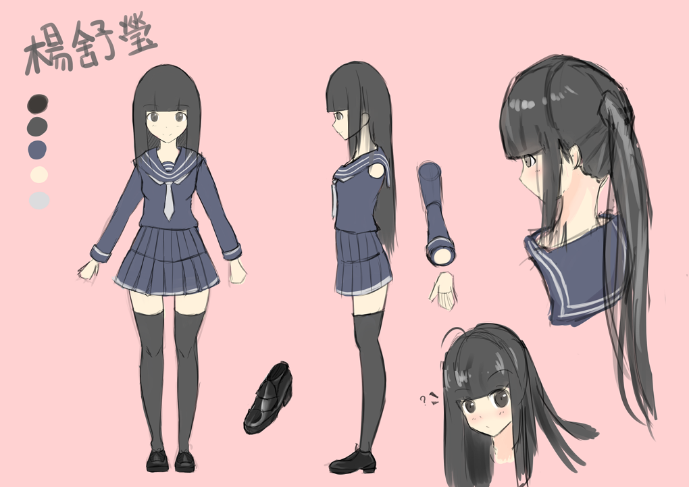
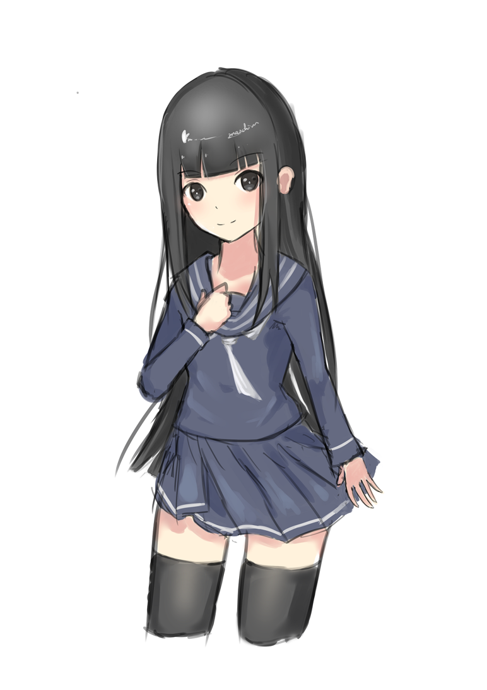
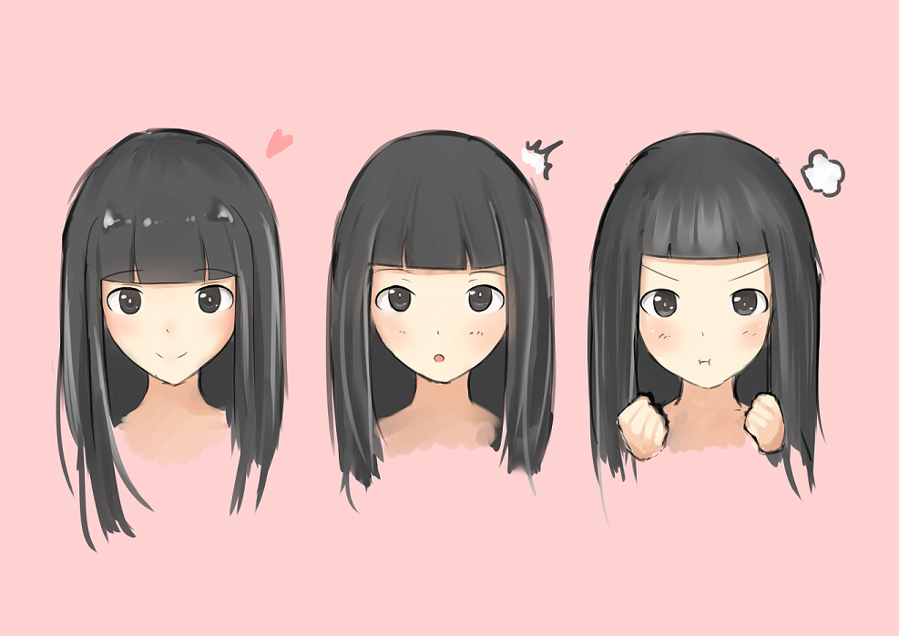

# [合作]楊舒瑩設定公開

> 2017-03-02 · 合作 · GP 14 · 來源 https://home.gamer.com.tw/artwork.php?sn=3498637

這次畫了「[橫越世界的門](https://home.gamer.com.tw/creationDetail.php?sn=3364693)」中的楊舒瑩

其實說設定也沒那麼了不起

  

總之先來看看我們輸贏(X)吧!

  

  

  

再附一張繪形速塗

  

  

  

是個擅長賣萌的女國中生呢!

  

其實設定的東西並不多，但卻拖很久(´・ω・\`)

(感謝原作的體諒

  

舒瑩性格設定是害羞

再加上原作以及本人對黑長直的愛所誕生的(X

(還有膝上襪

感謝原作給我的彈性空間很大

(包括拖稿的空間

  

  

廢話後記:

  

第一次幫別人畫三視圖(不對，是二視圖

也是第一次畫年紀較小的角色

初期抓不太到比例

(就是想畫個胸部(X

「害羞」其實也不太常畫

(就是想加個愛心眼(X

  

總之，還希望各位會喜歡

  

想要認識小說中的舒瑩還請至「[橫越世界的門](https://home.gamer.com.tw/creationDetail.php?sn=3364693)」

[https://home.gamer.com.tw/creationDetail.php?sn=3364693](https://home.gamer.com.tw/creationDetail.php?sn=3364693)

  

原作者:[大帝](https://home.gamer.com.tw/homeindex.php?owner=impmatthew)

[https://home.gamer.com.tw/homeindex.php?owner=impmatthew](https://home.gamer.com.tw/homeindex.php?owner=impmatthew)

  

想看更多我的動態還請至:[專頁](https://www.facebook.com/Bushyeyebrowscat/)

[https://www.facebook.com/Bushyeyebrowscat/](https://www.facebook.com/Bushyeyebrowscat/)

  

附一張剪瀏海過程

  

$('article.c-text img').load(function () { // 表格內圖片大於表格寬時，設為 100% if ($(this).parents('table').length != 0) { if ($(this).width() >= $(this).parents('td').width()) { $(this).width('100%'); } else { $(this).width($(this).width() + 'px'); } } });
