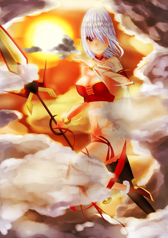

# [原創]北歐女武神

> 2017-03-03 · 繪圖 · GP 4 · 來源 https://home.gamer.com.tw/artwork.php?sn=3499115

補圖

  

女武神資料上好像是穿紅袍

我只是布料少了點(義正嚴詞

  

上圖:

  

  

  

有點時間的作品，身體結構還抓得不好

練習了許多濾鏡效果(後來幾乎沒再用過....

理念其實忘了差不多..

  

  

喜歡還請來[專頁](https://www.facebook.com/Bushyeyebrowscat/)坐坐

  

更多清晰大圖和無節操(X還請至:[P站](http://www.pixiv.net/member.php?id=6856401)

[http://www.pixiv.net/member.php?id=6856401](http://www.pixiv.net/member.php?id=6856401)

$('article.c-text img').load(function () { // 表格內圖片大於表格寬時，設為 100% if ($(this).parents('table').length != 0) { if ($(this).width() >= $(this).parents('td').width()) { $(this).width('100%'); } else { $(this).width($(this).width() + 'px'); } } });
