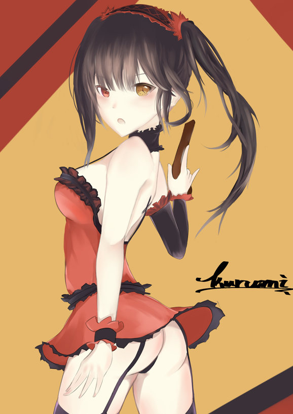

# [同人]狂三塗鴉

> 2017-03-04 · 繪圖 · GP 11 · 來源 https://home.gamer.com.tw/artwork.php?sn=3500184

補圖

  

嘗試利用淡色去畫一張圖

刻意求去學Lpip大的畫風

很多效果都是誤打誤撞，不知道還畫不畫得出來

  

  

  

  

其實這張就是典型的虎頭蛇尾

那顆頭拖了太多的時間╮(╯\_╰)╭

就當作塗鴉處理(喂

  

如果有時間的話，我還是會畫更多狂三的!

  

  

喜歡還請追蹤專頁:[帽捲](https://www.facebook.com/Bushyeyebrowscat/)

或是訂閱小屋

當然你想打個賞我也不是不歡迎啦XD

$('article.c-text img').load(function () { // 表格內圖片大於表格寬時，設為 100% if ($(this).parents('table').length != 0) { if ($(this).width() >= $(this).parents('td').width()) { $(this).width('100%'); } else { $(this).width($(this).width() + 'px'); } } });
