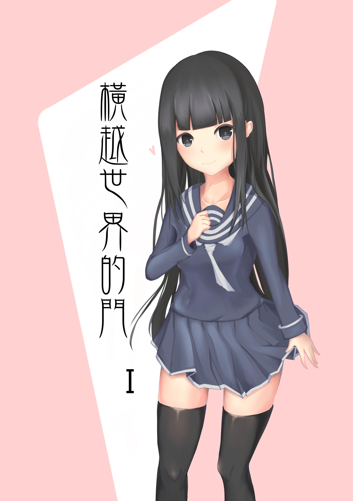

# [合作]<橫越世界的門>第一章封面

> 2017-03-15 · 合作 · GP 12 · 來源 https://home.gamer.com.tw/artwork.php?sn=3512901

「草稿暗爽十二年，描線回到解放前」

這句話這次深刻的體認到了...

  

來看圖吧!(其實遠看跟草稿有87%像

  

  

簡單的構圖，毫無背景，熟悉的角度

原本以為可以一兩天搞定

就動用了很久沒用的描線能力

.

.

.

沒錯，大概就三秒，我就後悔了

.

.

.

大概又三秒，我心一橫開始描

.

.

.

這次是三天，我躺在地上...

  

  

\-----------------------廢話結束-----------------------

  

總之，這算是正式完成別人委託的一張圖

雖然有點累，不過也蠻感動der TAT

只是自己畫風不太穩定的問題還沒解決

看來要多修練zzz

  

  

  

畫的過程中，發現蠻多設定需要記錄下來

沒意外的話，會做一個相關補完

接下來就期待新的角色吧!(倒地

  

去背大圖還請至[P站](http://www.pixiv.net/member_illust.php?mode=medium&illust_id=61930940)

  

  

想追蹤相關角色的進度或是看我偶爾撇撇

歡迎來[專頁點個讚](https://www.facebook.com/Bushyeyebrowscat/)

  

原作小說:[〈橫越世界的門〉](https://home.gamer.com.tw/creationDetail.php?sn=3364693)

  

或是訂閱小屋!

不然就給個GP吧(跪

$('article.c-text img').load(function () { // 表格內圖片大於表格寬時，設為 100% if ($(this).parents('table').length != 0) { if ($(this).width() >= $(this).parents('td').width()) { $(this).width('100%'); } else { $(this).width($(this).width() + 'px'); } } });
