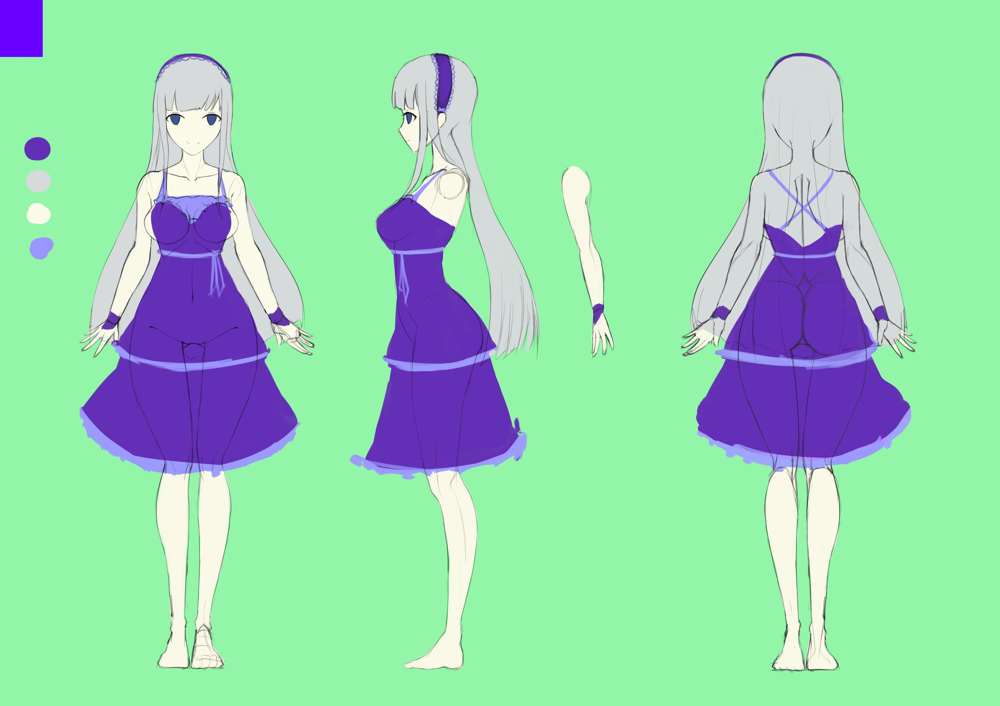
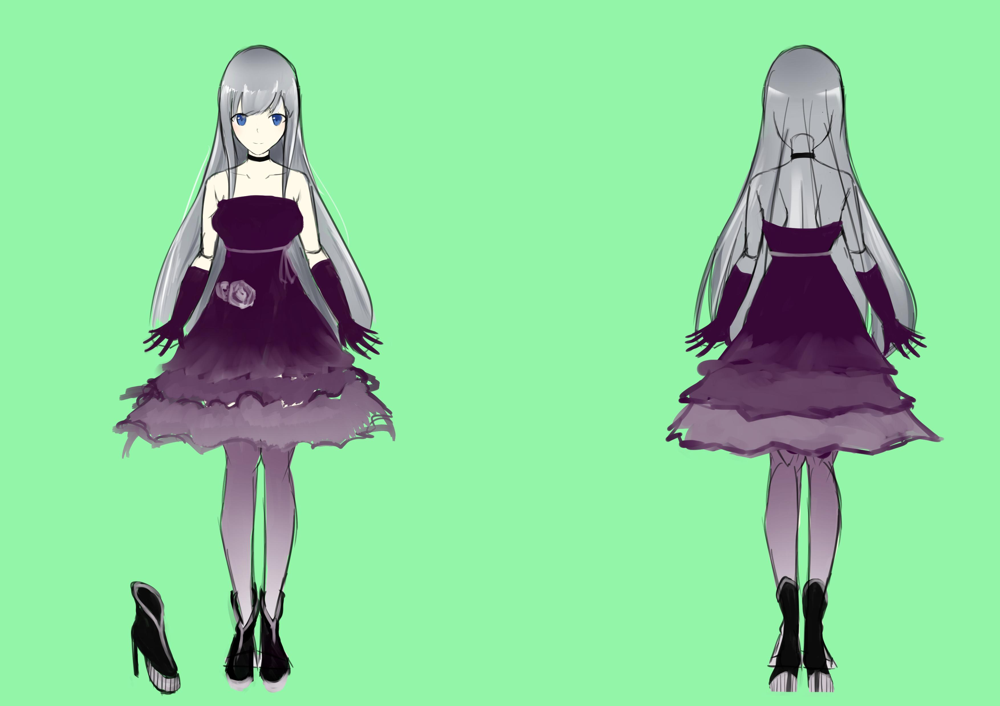
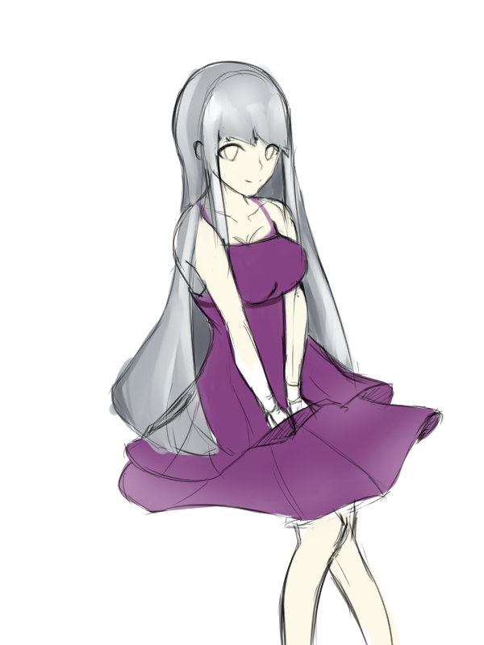
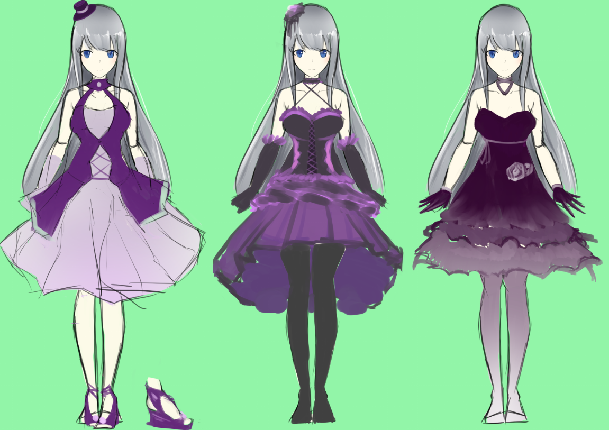

# [合作]費莉斯・哈洛森設定公開

> 2017-05-12 · 合作 · GP 5 · 來源 https://home.gamer.com.tw/artwork.php?sn=3574418

又消失一個月絕對不是在爬天梯(滑稽

總之，終於可以初步的公開這個角色了!

# **[<橫越世界的門>](https://home.gamer.com.tw/creationDetail.php?sn=3364693)**

費莉斯・哈洛森

  

  

  

具設定是170cm(好高!

因為很少畫這種比較高挑身材的人，比例怪怪的還請見諒

個性上應該是溫柔加上優雅

服裝設計上也盡量簡樸

  

跟舒瑩比起來，設計起來就困難許多

但也更花心思的角色，還希望大家會喜歡

  

如果有關注作品的人，一起期待費莉斯更多活耀的表現吧!

完整立繪大概還要一陣子，還敬請期待

  

鞋子部分，就再說了吧\_(┐「ε:)\_

裸足那麼讚(X

  

  

  

  

太久沒發文，感覺應該有很多可以講

但還是來工商一下吧(\*ﾟ∀ﾟ\*)

  

  

# **[<橫越世界的門>](https://home.gamer.com.tw/creationDetail.php?sn=3364693)**

[https://home.gamer.com.tw/creationDetail.php?sn=3364693](https://home.gamer.com.tw/creationDetail.php?sn=3364693)

  

原作者:[大帝](https://home.gamer.com.tw/homeindex.php?owner=impmatthew)

[https://home.gamer.com.tw/homeindex.php?owner=impmatthew](https://home.gamer.com.tw/homeindex.php?owner=impmatthew)

  

想看更多我的動態還請至:[專頁](https://www.facebook.com/Bushyeyebrowscat/)

[https://www.facebook.com/Bushyeyebrowscat/](https://www.facebook.com/Bushyeyebrowscat/)

  

附錄一些設計過程，和一些棄稿的草稿

$('article.c-text img').load(function () { // 表格內圖片大於表格寬時，設為 100% if ($(this).parents('table').length != 0) { if ($(this).width() >= $(this).parents('td').width()) { $(this).width('100%'); } else { $(this).width($(this).width() + 'px'); } } });
