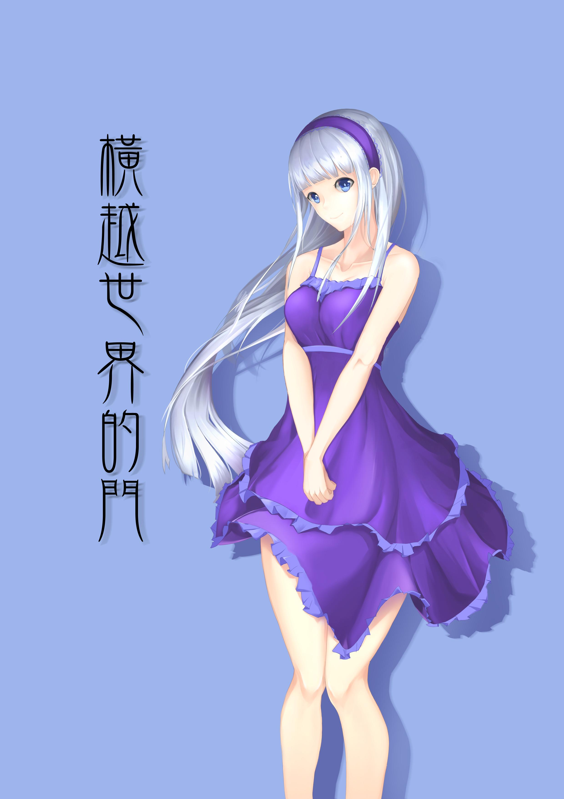

# [合作]〈橫越世界的門〉第二章封面

> 2017-06-26 · 合作 · GP 9 · 來源 https://home.gamer.com.tw/artwork.php?sn=3622538

這個更新速度，

訂閱我的人會不會跑走R(回來啊ΩДΩ

咳咳..

  

先上圖吧

  

  

  

畫完那一刻突然驚覺「費利斯也太高了吧」

怎麼前一個角色150，這一個突然170，

到底是誰設定的阿(／‵Д′)／~ ╧╧

  

咳咳，總之，也算是一個挑戰

做為畫的第二個女性角色，

過程真是幾番曲折(汗

  

最後，

還希望有感受出她的溫柔(和腿)，

她的優雅(和腿)還有腿(跟腿)

  

  

附一下相關資訊

  

大圖還是去背甚麼的請至:[P站](https://www.pixiv.net/member.php?id=6856401)

[https://www.pixiv.net/member\_illust.php?mode=medium&illust\_id=63578459](https://www.pixiv.net/member_illust.php?mode=medium&illust_id=63578459)

  

# **[<橫越世界的門>](https://home.gamer.com.tw/creationDetail.php?sn=3364693)**

[https://home.gamer.com.tw/creationDetail.php?sn=3364693](https://home.gamer.com.tw/creationDetail.php?sn=3364693)

  

原作者:[大帝](https://home.gamer.com.tw/homeindex.php?owner=impmatthew)

[https://home.gamer.com.tw/homeindex.php?owner=impmatthew](https://home.gamer.com.tw/homeindex.php?owner=impmatthew)

  

想看更多我的動態還請至:[專頁](https://www.facebook.com/Bushyeyebrowscat/)

[https://www.facebook.com/Bushyeyebrowscat/](https://www.facebook.com/Bushyeyebrowscat/)

  

  

  

  

\---------後記(慎入)----------------------------------------------

  

這張圖從開始到完成，差不多經歷了兩個月，

總時數至少50小時，遠超出自己的預期，

也因為拖得太久，導致畫的後期很痛苦

  

雖然整體而言，品質應該要比上一個合作要高

但是感覺卻是近期內最糟的

  

當然，這與角色和原作無關

純粹只是多少有點高估自己

中間來回修稿，也浪費許多時間，

包含一開始草稿就有問題

  

這陣子應該會暫時不會畫原創的東西了

我要畫滿滿der狂三RRRRRR

咳咳，我是說同人圖

.

.

好der，謝謝看我發一些牢騷，

對了，最近又接到一個合作的計畫(無償，我覺得我快餓死了QAQ

有作品產出就再說囉~

  

  

  

  
$('article.c-text img').load(function () { // 表格內圖片大於表格寬時，設為 100% if ($(this).parents('table').length != 0) { if ($(this).width() >= $(this).parents('td').width()) { $(this).width('100%'); } else { $(this).width($(this).width() + 'px'); } } });
