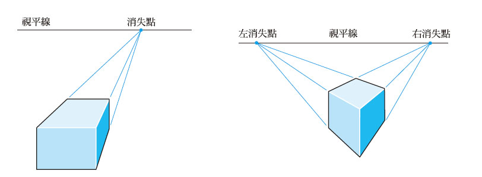
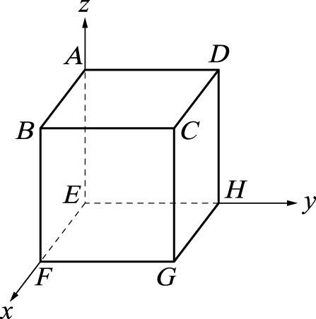
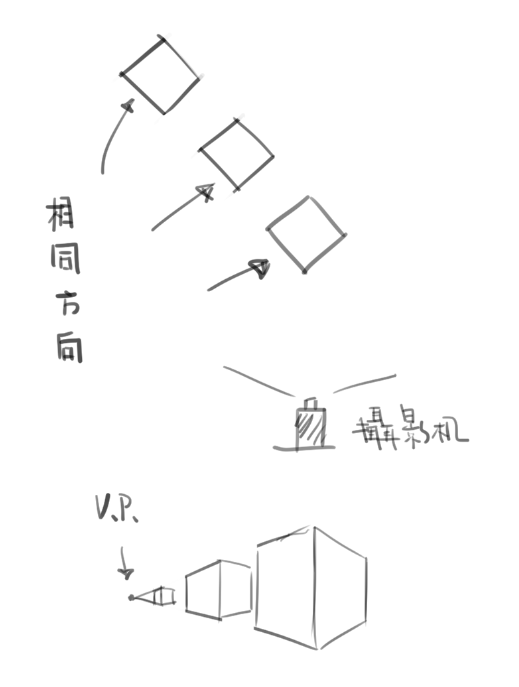
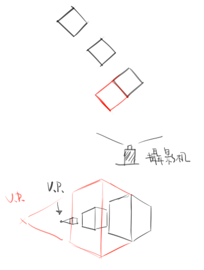

# [整理]透視理解&心得(前言)

> 2017-07-16 · 筆記 · GP 6 · 來源 https://home.gamer.com.tw/artwork.php?sn=3646468

發現這系列文章竟然零星有人在看，我重新搬運到[medium](https://medium.com/maochinn/筆記-k大透視課一期-00-72d50d13fbc)，

有一些調整，版面上應該也比較好看

  

\--

  

大概是整個學期在研究的東西，參考許多東西

在這邊做個整理，以下都是學習過程中遇到的親身經歷

有錯還請指正，也歡迎交流!

  

  

前言:

  

「透視很重要」，常常有人這樣說，然後就開始查資料

練習所謂「一點透視」、「兩點透視」、「三點透視」

(這裡就不附圖了，網路上有很多資料)

  

然後開始照著消失點畫，很快就有排列整齊的方塊

「透視也沒有很難」不禁這麼想

可是當要自己創作的時候，畫了消失點，卻畫不出想要的角度

那麼問題在哪呢?

  

透視通常來講都是三點透視，而所謂一點兩點只是三點透視的特例

  

何謂透視:

  

  

「透視」(perspective)是以**相對**的角度來觀看事物

(節錄自[這裡](http://onemanshowdesigninstitute.blogspot.tw/2011/03/34-1-what-is-perspective.html))(許多概念也是從這裡來)

  

  

  

「**相同的方向，會指向同一個消失點。」**

  

  

  

  

那麼**絕對**的角度來觀看事物呢

那就是沒有透視

  

  

  

就像是數學課本中的立方體，所有邊都沒有消失點

  

  

何謂消失點:

  

「消失點」(vanish point)

  

**如果把這些方向相同的物體邊緣延伸出去，**

**最後會相交於一個點，而這個點就叫做「消失點」。**

**先想像攝影機面對的立方體是45度**

  

  

  

那麼紅色的方塊的邊是相同方向嗎?

  

  

  

如果以直觀的畫

消失點不一樣，似乎是不同方向。

但答案是，相同方向

為甚麼呢?

  

給個提示

回到透視的定義

「透視」(perspective)是以**相對**的角度來觀看事物

  

  

  

  

答案應該是這樣，是不是覺得那個紅色的東西不像立方體?

而且長得跟後面的立方體不一樣?

  

  

下一篇在解釋(ﾟ∀ﾟ)

  

總之，相同方向的邊都會收斂到一個點

  

  

那麼為甚麼會有消失點呢?

個人的理解是越遠的東西要被壓縮才塞的進視界中

也就是所謂的**「近大遠小」**

無限遠處的任何東西，也就變成無限小，也就成為點了

  

  

大量參考和推薦:[這裡](http://onemanshowdesigninstitute.blogspot.tw/2011/03/34-1-what-is-perspective.html)

  

  

  

好ㄅ，先這樣，圖很醜請見諒

畢竟後面幾篇的圖一樣很醜(ﾟ∀。)

$('article.c-text img').load(function () { // 表格內圖片大於表格寬時，設為 100% if ($(this).parents('table').length != 0) { if ($(this).width() >= $(this).parents('td').width()) { $(this).width('100%'); } else { $(this).width($(this).width() + 'px'); } } });
