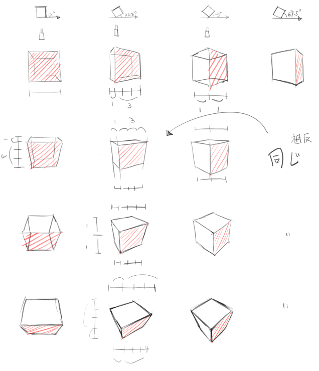
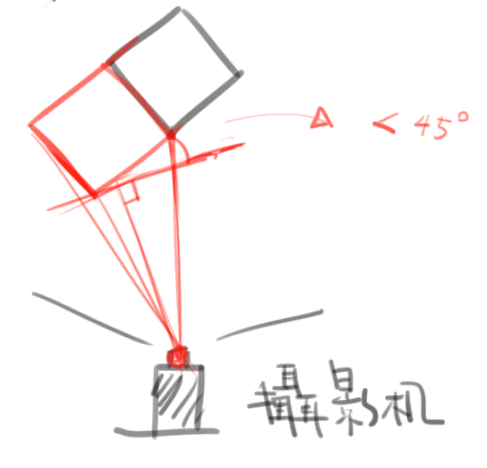
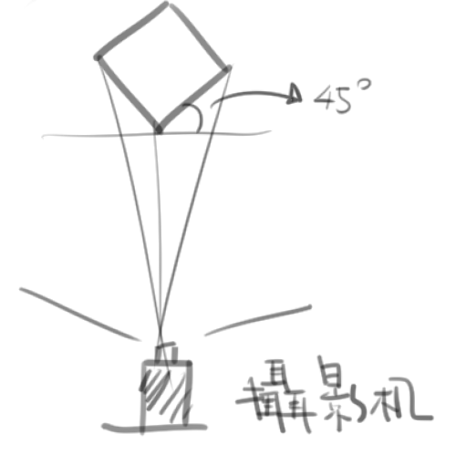
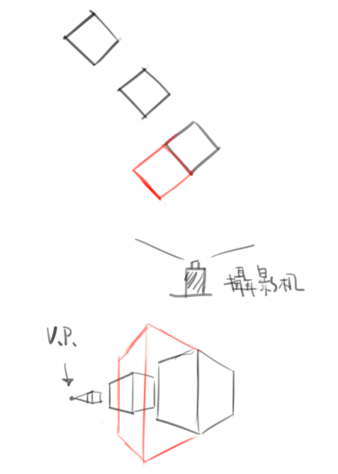
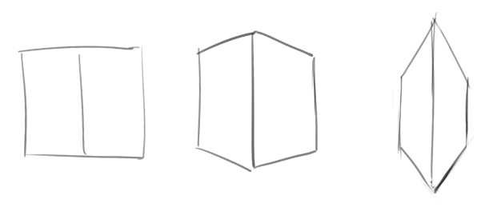
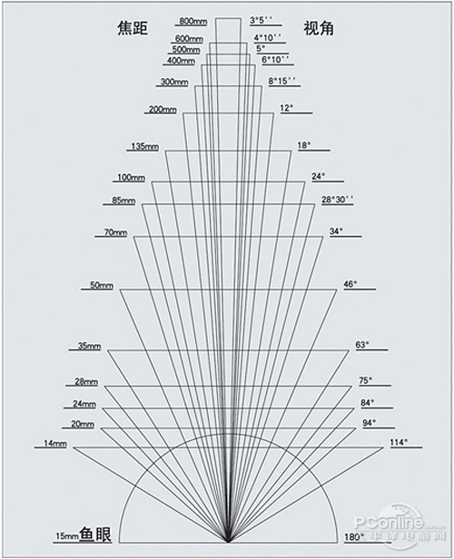
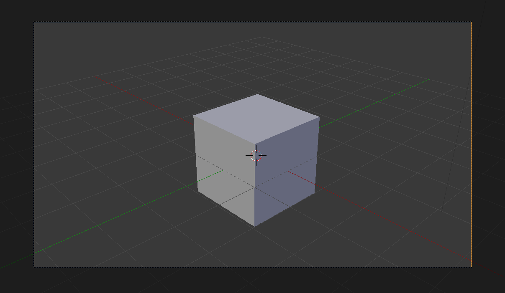
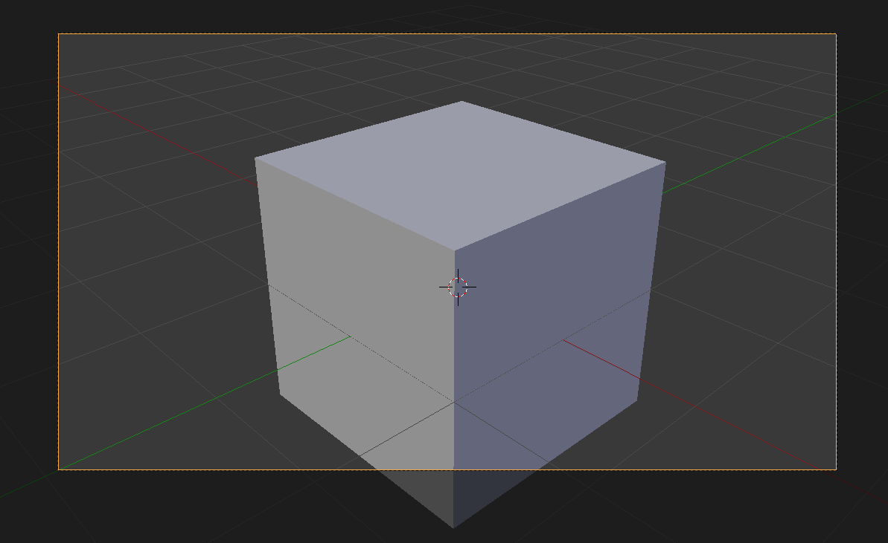
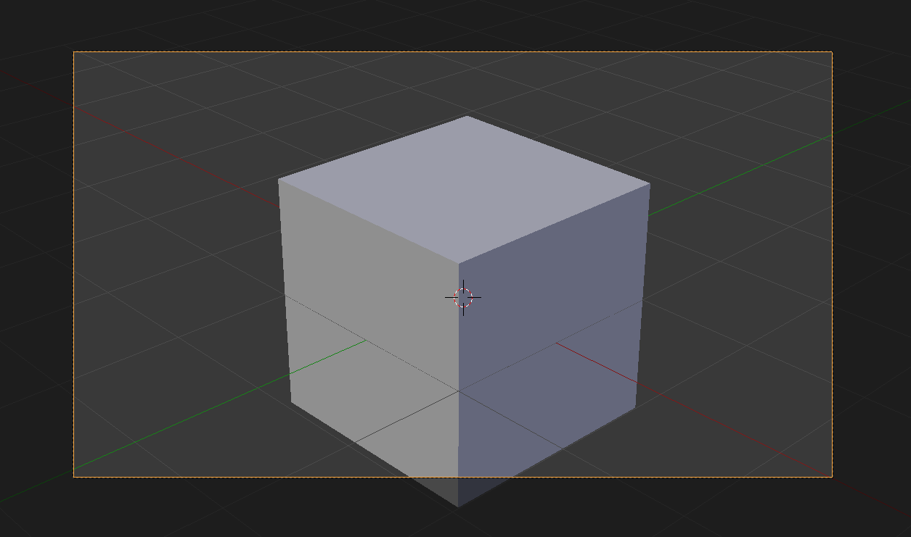

# [整理]透視理解&心得(一)

> 2017-07-16 · 筆記 · GP 11 · 來源 https://home.gamer.com.tw/artwork.php?sn=3646609

有看過K大的方塊都知道，他把立方體整理大概如下圖

當然不想看可以直接看方言大的[美圖](http://imgur.com/a/DVtP5)

  

  

  

畫得很爛我知道....

總之，這邊要表達的是

這些立方體不動，而是攝影機繞著立方體動

(或是立方體旋轉，攝影機不動，兩種情形在畫面上等價)

所造成的**相對的角度**改變

因此，透視發生改變(應該說，消失點改變)

  

回到上一篇的問題

  

  

  

為甚麼紅色方塊這樣畫是錯誤的?

  

因為這種畫法是相對角度為45度的畫法

但以俯視圖來看，紅色方塊跟攝影機的相對角度比較接近22.5度的方塊

  

  

  

  

  

因此答案才會長這樣

  

  

那麼，如果立方體跟攝影機同時(相同角度)變化呢?

  

那就完全不變，就像是手中拿一個東西看著他身體自體旋轉

  

那個東西不會有任何變化。

  

而立方體為甚麼會變形成如此，我是參考[這邊](https://forum.gamer.com.tw/C.php?bsn=60143&snA=33334)(用三角函數看透視)

  

三角函數? 教練，我只是想畫畫阿இдஇ

  

這裡只是用他的概念，畫出合理的圖

  

首先，

這三個立方體都表示45度角，儘管很不直覺

  

  

  

那為甚麼會有這種區別呢?

  

  

**「近大遠小」**

  

只要靠的攝影機越近，那麼變形也就愈大

那麼變形多大，仍可以用消失點的方式畫出來(就像我畫出的怪東西)

  

  

最後，也是我遇到的問題，畫圖的時候，要找甚麼樣的視角呢?

一般來講，我們盡量會用類似人眼的視角

但前面也有說到，要畫出合理的圖

因此，我給自己的答案是

只要整張圖的透視是相同的，是合理的，

再找到自己舒服的視角就好

  

  

一樣，有錯還請指正(\`・ω・´)

\----------------------------------------------------------

在找資料時，突然發現大家整理的都好漂亮

反觀.....

  

  

\----------------------------------------------------------

18/8/10 修正

  

原先認為方塊透視強度不同是(以下為原先理解)

  

因為攝影機看出去的視角不同

  

  

  

  

視角不同也會影響畫面中消失點的位置(當然，消失點常常不再畫面中)

  

這邊解釋一下，這牽涉到zoom in/zoom out的定義

一般來說zoom in/zoom out表示將相機內的物體放大縮小

其實有兩種方式可以將畫面中的物體放大

一、將相機靠近物體，物體在畫面中就會變大

二、將相機視角縮小，物體在畫面中就會變大

那這兩者差在哪呢?

這邊用blender來解釋

  

首先，是一個焦距為35mm的相機

(焦距跟視角負相關)

  

第一種情況，接下來將相機靠近物體，視角不變(35mm)

  

第二種情況，相機不動，更改焦距(60mm)

  

  

觀察一下會發現，原圖跟第二個狀況其實透視強度是一樣的，

也就是說，只是將物體放大，相對關係(角度)相同

那第一個狀況會發現，物體放大之餘，

物體的透視強度變大。

  

結論:

回到最一開始的問題，

那三個方塊(我畫醜醜的那個)，

影響的關鍵並不是(焦距)視角改變，

而是靠近物體的距離。

  

以上，以後有錯我再繼續更正(っ・Д・)っ

$('article.c-text img').load(function () { // 表格內圖片大於表格寬時，設為 100% if ($(this).parents('table').length != 0) { if ($(this).width() >= $(this).parents('td').width()) { $(this).width('100%'); } else { $(this).width($(this).width() + 'px'); } } });
