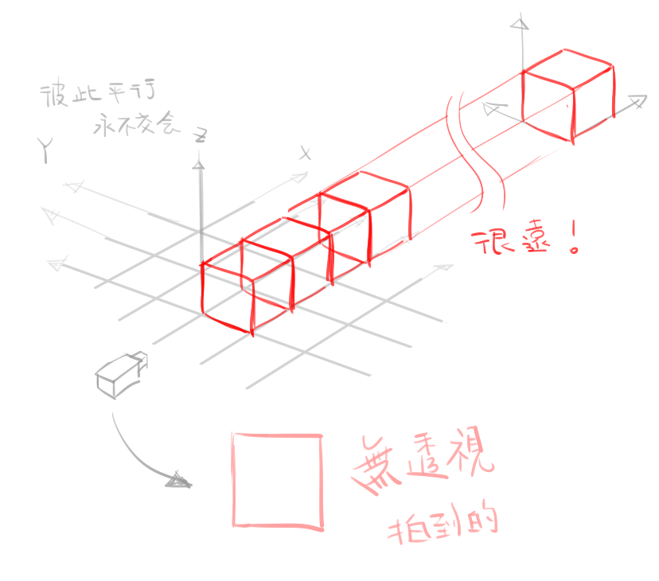
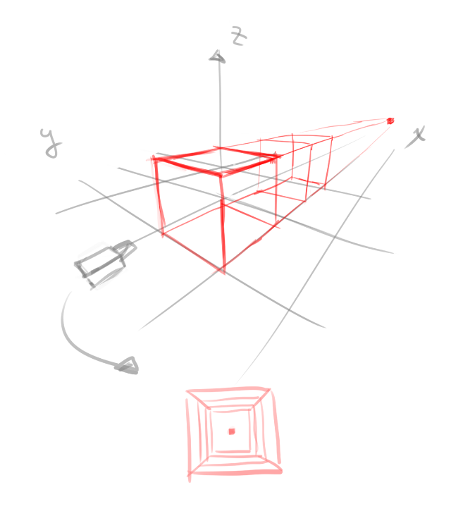
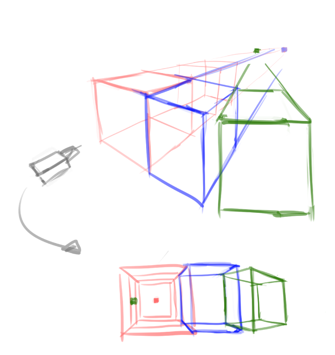
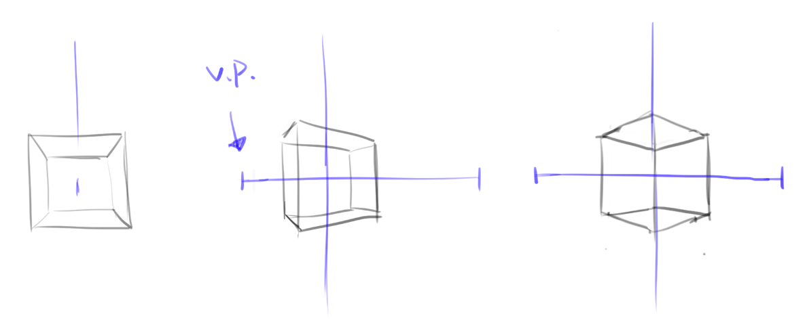
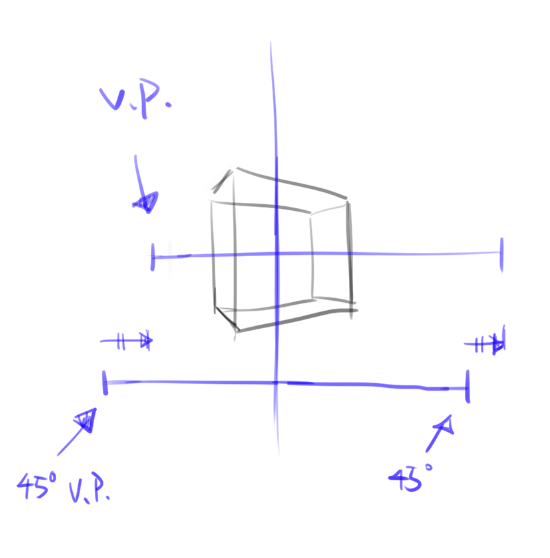

# [整理]透視理解&心得(二)視平線

> 2017-07-20 · 筆記 · GP 5 · 來源 https://home.gamer.com.tw/artwork.php?sn=3651320

  

首先，仍要再強調一次

  

「透視」(perspective)是以**相對**的角度來觀看事物

  

再講視平線之前，先說明一個沒有透視跟有透視的對應關係

  

這邊「有沒有透視的意思」還請參閱: [前言](https://home.gamer.com.tw/creationDetail.php?sn=3646468)

  

先放上是沒有透視

  

  

  

  

  

注意，這邊的立方體只有邊緣，沒有面

  

但攝影機拍到的仍只有第一個方塊，其餘都會被恰好擋住

  

因為所有方向的線都彼此平行

  

因此無線遠處，仍會對應到一個方塊。

  

  

接下來是有透視

  

  

  

這邊的方塊對應到無限遠處就是一個點

  

那麼如果是一排相同方向的立方體方塊呢?

  

仍然是對應到一個點

  

那如果是不同方向呢?

  

你猜得沒錯，還是一個點

  

下圖紅色跟藍色方塊為同一個方向

因此延伸對應到遠處是同一個點

  

而綠色方塊是稍微做了旋轉

延伸對應到了不同點

  

  

  

  

那麼這邊延伸對應的點，其實就是消失點

  

也就是說，沒有透視的圖並不是沒有消失點

而是他的消失點跟本來的東西是完全相同

  

而消失點的連線，其實就是所謂的視平線

也就是攝影機看出去，無限遠處的對應

  

也因此不管方塊怎麼轉(先不考慮往Z軸的旋轉)

所有線都會收斂至視平線上的點

  

太多文字，還是來看醜醜的圖

  

再來看一下上次的立方體

  

藉由上面寫的

消失點(V.P.)可以藉由方塊的邊線來找到

(反之只要設定好消失點就可以畫出方塊的邊線)

將消失點連起來，就可以得到所謂的視平線

  

  

會發現這三個方塊視平線是相同高度

因此反推，這三個方塊只是做XY軸的旋轉(如同前面的例子)

事實也是如此!

  

補充一下，縱軸的線是方塊中心往Z軸的線

  

那麼，接下來，我把45度的方塊跟22.5的方塊做比較

  

  

  

會發現，45度的消失點是跟縱軸對稱

而22.5度的消失點是45度消失點的平移一段等距(大概)

  

推廣來講，只要定義好45度(或其他角度)的方塊

就可以慢慢旋轉出所有角度，也就是平移消失點

  

  

大guy先這樣，z軸就等下一篇吧

其實關於z軸的變化

只要把頭轉90度就好了(ﾟ∀ﾟ)

  

  

後話:

  

如果有看過一些透視資料應該會發現

在最前面舉例的時候用到了一二三點透視

  

而後面例子的方塊是一點跟兩點

  

其實可以發現，一二點透視發生的情形就是視平線與地平線相同相對角度時

(也就是攝影機看出去的角度跟地面夾0度角)

  

也就是說，除此之外，就會遇到三點透視

  

詳細以後再說吧(́◉◞౪◟◉‵)

  

  

$('article.c-text img').load(function () { // 表格內圖片大於表格寬時，設為 100% if ($(this).parents('table').length != 0) { if ($(this).width() >= $(this).parents('td').width()) { $(this).width('100%'); } else { $(this).width($(this).width() + 'px'); } } });
