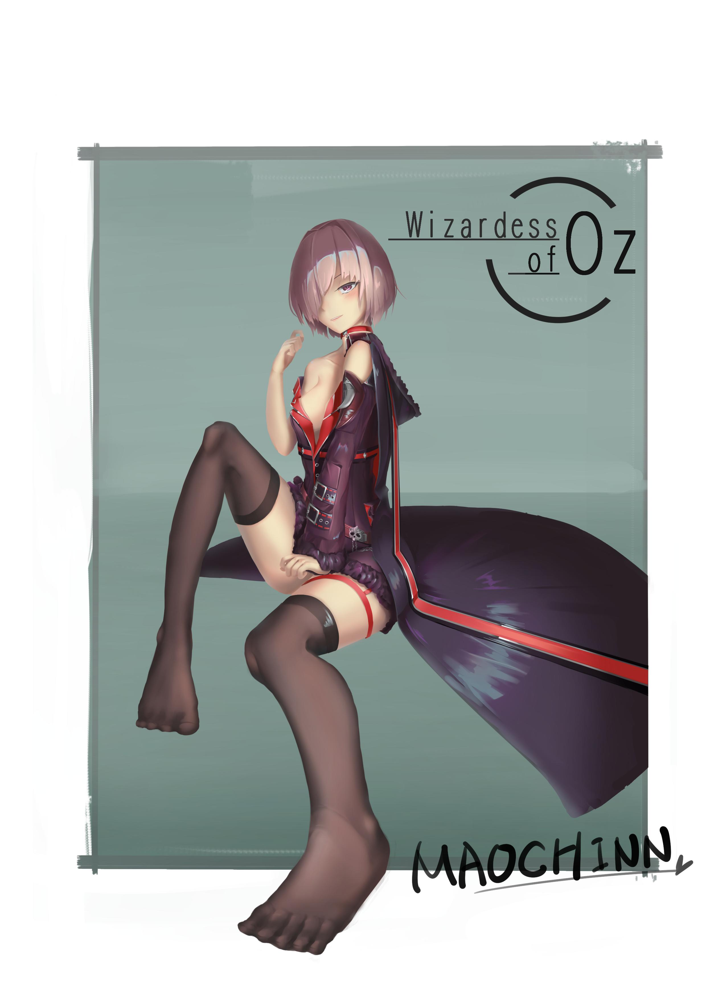
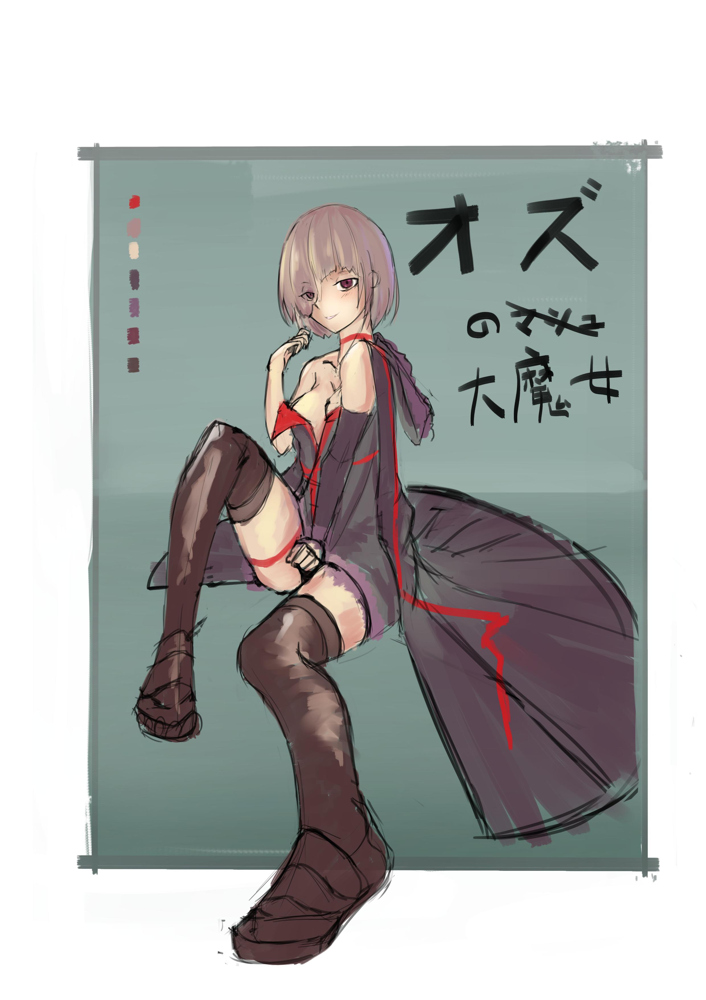

# [同人]奧茲國的大魔女

> 2017-08-12 · 繪圖 · GP 35 · 來源 https://home.gamer.com.tw/artwork.php?sn=3680415

「為你獻上虛構……快收下吧？」

  

畫了SV中的瑪修，不對，是魔女

雖然不是第一次畫SV中的角色(因為之前都被視為黑歷史沒有PO)

  

剛改版的時候，連效果都沒看就先合成三張再說(燦笑

  

不廢話...看圖吧

  

  

  

身為足控，卻不太會畫腳讓我深感慚愧

咳咳..

  

這張圖算上運用上之前所學的創作，

雖然不敢說透視抓得很好，但整體還算滿意

為了不要太像隔壁國的學妹，特別用了有點色氣的眼神

(誰說學妹就不色氣的，看那個ㄒ.......咳咳

  

然後因為還沒研究過上色，就稍微參考了一下大手的上色，

用了比以往更重的顏色

希望有增加一點經驗值

  

最後，還希望之後產圖速度能快一點，這個暑假都過一半啦(((ﾟДﾟ;)))

  

題外話，意外發現CV是M・A・O，

跟我的簡稱還蠻像的，我就先抱走了

  

喜歡的話還請訂閱小屋!或給個GP

  

想追蹤比較多日常還請走:[專頁](https://www.facebook.com/Bushyeyebrowscat/)

[帽捲maochinn-繪圖坊](https://www.facebook.com/Bushyeyebrowscat/)

  

[P站](https://www.pixiv.net/member.php?id=6856401)

[給星星](https://www.pixiv.net/member_illust.php?mode=medium&illust_id=64369994)(好像變成給讚甚麼的...

  

最後附上草稿

  

  

  

  

  

  

$('article.c-text img').load(function () { // 表格內圖片大於表格寬時，設為 100% if ($(this).parents('table').length != 0) { if ($(this).width() >= $(this).parents('td').width()) { $(this).width('100%'); } else { $(this).width($(this).width() + 'px'); } } });
