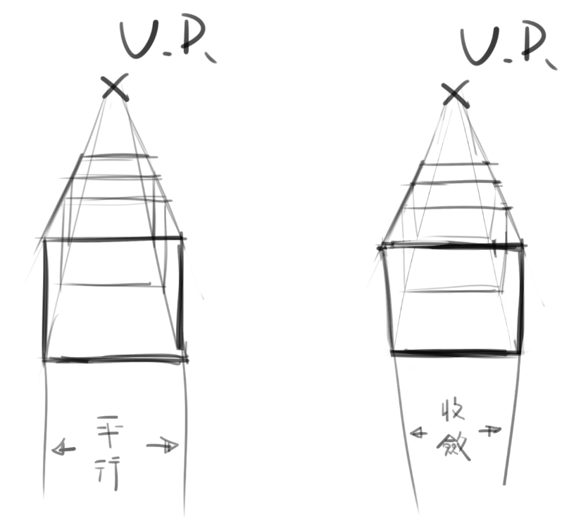
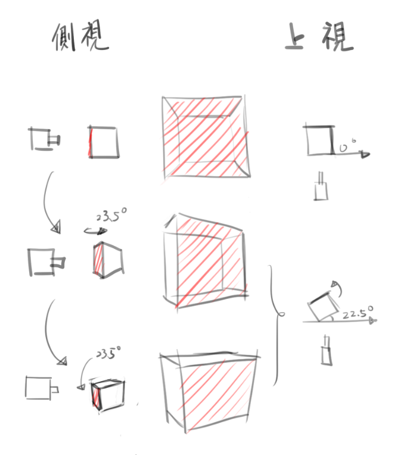

# [整理]透視理解&心得(二)三點透視

> 2017-08-19 · 筆記 · GP 5 · 來源 https://home.gamer.com.tw/artwork.php?sn=3689797

再進入正文以前，請先觀察下面兩張圖(一個方塊是一張)

思考一下這兩張圖為何會有如此差異

  

當然，這邊是故意將他們平行排列，但這有有助於思考相對角度

  

  

  

  

如果稍微看一下會應該會發現，右圖有了一些高度的變型

也就是有一些三點透視的感覺(這邊只有兩點就是)

  

PS.這邊釐清一下，左圖並沒有刻意忽略透視而畫成平行

  

  

這邊將上面兩張圖加上邊際

  

  

  

  

在開頭說是故意平行排列是因為他們的消失點高度其實是不同的

但看起來卻十分類似

  

按照以前的敘述

右圖也可以想成地面突然傾斜，而攝影機不動

當然，這比較難發生

  

之前研究時常常會不知道某個方向要收斂還是平行

也就是所謂的變形

但只要搞清楚相對角度的關係就可以知道會不會出現變形

  

借用上一篇的話

  

「一二點透視發生的情形就是視平線與地平線相同相對角度時」

(也就是攝影機看出去的角度跟地面夾0度角)

  

藉由左圖也證實如此

  

那麼右圖這個有高度變形的方塊呢

其實這要圖轉90度(或是你想頭轉90度

你會發現，這就是前篇看到的兩點透視

其實就是將X或Y軸跟Z軸交換而已

  

  

總之，我們大致釐清了什麼時候會出現高度變化

那麼三點透視其實就相當好理解

  

簡單來說，就是沒有任何一個方向會與攝影機看出去夾0度角

  

反過來想，只要有一個方向夾0度角，那就會變成兩點透視

再一個方向夾0度角，那就是一點透視

(不要問我有沒有0點透視，我沒看過

  

  

利用之前的方塊圖，可以觀察一下旋轉的情形

  

  

  

  

那麼三點透視的概念是不是更好理解了呢(燦笑

  

當然，更多的三點透視的資料GOOGLE更豐富

這邊只是提供一個我的思考過程跟反覆印證

  

  

下一篇還沒想好，想到再說吧(ﾟ∀ﾟ)

  

  

$('article.c-text img').load(function () { // 表格內圖片大於表格寬時，設為 100% if ($(this).parents('table').length != 0) { if ($(this).width() >= $(this).parents('td').width()) { $(this).width('100%'); } else { $(this).width($(this).width() + 'px'); } } });
