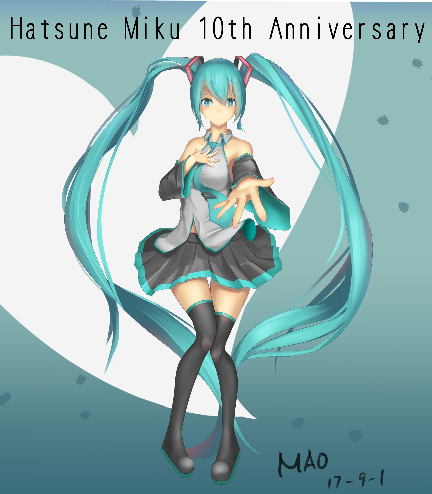
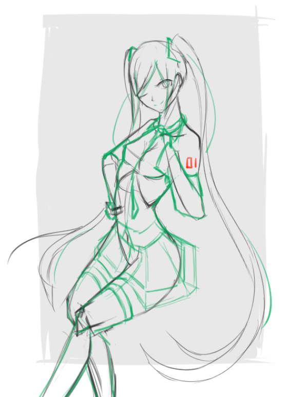
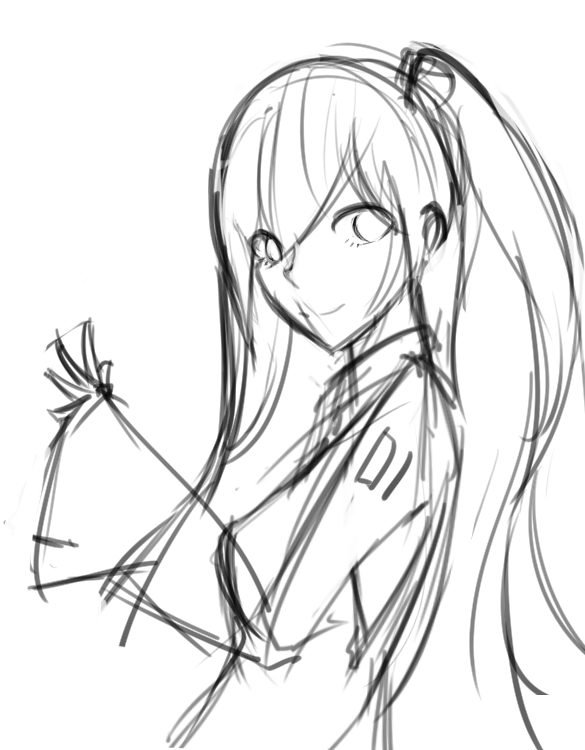

# [同人]初音10週年

> 2017-09-01 · 繪圖 · GP 4 · 來源 https://home.gamer.com.tw/artwork.php?sn=3707013

\\公主殿下/\\公主殿下/\\公主殿下/

晚了一天啦啦啦

  

總覺得每一張圖上色過程都差不多

出來結果卻差很多

是我的使用方式不對吧

  

本來是要另個構圖的，但還是覺得這種正面比較好(也比較好畫-v-

  

是說話初音不是第一次，但貌似沒畫過其他服裝就是ww

  

那麼就上圖吧!

  

  

這個背景就不要介意了

還有那個歐派也不要介意了-3-

  

畫面有點單調就是

沒有明顯的強光源還是什麼的，也沒其他環境光

只有手賤在頭髮亂噴(X

  

畫這種全身大圖有點失算，萌萌大臉變得好小阿

  

這張也比較注重在調子上，一邊畫一邊看灰階的情形

還好是沒有畫到整個髒髒的

剛好跟到K大直播 就順便也用用看有顆粒的筆刷

(預設的果然很雷

  

看來也要找時間去找找和玩玩筆刷了

(畫了兩年只用這5枝左右就是

  

這個暑假沒填坑還挖坑...

這技能點數不夠用啊(敲碗

  

最後附一個原本的構圖

  

  

還有一個突然發現的隨筆

  

  

其實我發現我又畫了幾個版本，就不PO了

  

想追蹤更多不明就裡的歐派:[專頁](https://www.facebook.com/Bushyeyebrowscat/)

[帽捲maochinn-繪圖坊](https://www.facebook.com/Bushyeyebrowscat/)

  

[P站](https://www.pixiv.net/member.php?id=6856401)(據說畫質比較好?

[給讚](https://www.pixiv.net/member_illust.php?mode=medium&illust_id=64737486)

  

  

8月終於有種產量略微提升的錯覺(?

可是就要開學啦!!

$('article.c-text img').load(function () { // 表格內圖片大於表格寬時，設為 100% if ($(this).parents('table').length != 0) { if ($(this).width() >= $(this).parents('td').width()) { $(this).width('100%'); } else { $(this).width($(this).width() + 'px'); } } });
