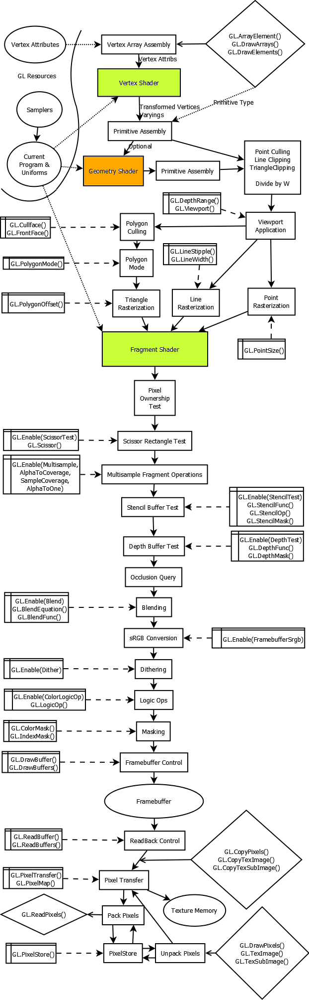

# [CG]00-介紹

> 2018-01-21 · 電腦圖學(CG) · GP 3 · 來源 https://home.gamer.com.tw/artwork.php?sn=3862090

這篇做一些CG的一些基本介紹

會用到一些電腦硬體上的專有名詞，還請善用google

如果修過計算機組織學應該是還好

  

首先，

上一篇有講到，電腦顯現出任何圖形都是經過一連串的流水線(Pipeline)，

如上圖，當然，這邊簡化許多，真實情況依據使用的函式庫不同而有一些不同(例如OpenGL)

但大致上，就是會經過一連串的計算

而這些計算通常是在顯示卡(GraphicsCard)中進行

而顯示卡中負責運算的的是GPU

  

[GPU](https://zh.wikipedia.org/wiki/圖形處理器)因為有大量運算單元(ALU)，且透過設計可以平行且大量的運算，

以此來加速([硬體加速](https://zh.wikipedia.org/wiki/硬件加速))整個運算

  

\--以下內容參考[逍遙文工作室](https://cg2010studio.com/2011/06/29/shader/)

  

這邊補充一點，流水線也有分成可編程的部分跟不可編程的部分

也就是說，整個流水線中有部分是擁有彈性讓使用者添加更改的(例如:可以自己寫Shader)

而其餘部分則是固定的，只能做固定形式的改動(例如:將某個效果打開/關閉)

  

看一個OpenGL 的實際例子

「OpenGL 是一個巨大的狀態機」

  

當然，不可能一下子就可以懂

因此我們先回到顯示卡的工作

  

通常在CG中，我們繪製圖片需要定義座標(例如，一個三角形要定義三個點的座標)

再將座標經過一系列變換(流水線中的一部份)投影至顯示裝置(例如:螢幕)

而這些變換就在顯示卡中運行

  

在這一系列的變換中，包含，

[彩現](https://zh.wikipedia.org/wiki/渲染)(渲染、Render)

\->Geometry

\->[柵格化](https://zh.wikipedia.org/wiki/栅格化)(光柵化、Rasterisation)

\->[著色器](https://zh.wikipedia.org/wiki/着色器)(Shader)

  

\--以下資料來自教授的講義

  

而顯示卡中

GPU

•Rendering

•Generalcomputation

•Geometricalcomputing

•Imageprocessing

memory,registers

•Keepingdata & images

•Displaying & buffering

internalbus& external but

•Datatransfer

  

基本上透過這些元件完成上述的工作

那我相信看了一堆專有名詞一定是一臉矇逼(ﾟ∀。)

  

說的簡單一些，假設今天要畫出一個點，那通常來說，

需要定義出該點的座標，但這個座標不一定是指螢幕上的座標，

(例如，若是三維空間，那麼會有(x, y, z)，而螢幕卻是二維空間(x, y))

因此想要讓螢幕顯示，必須知道該點在螢幕的座標該點才能顯示，

(CPU會把相關資料丟給顯示卡)

因此，就必須利用Rasterisation來轉換，

轉換完後，顯示該點也包含該點的顏色，性質等...

這時就交給Shader，去決定該點的顏色包含光影效果

  

最後將結果顯示在螢幕上

  

大致流程就是這樣，當然這中間還有許多運算，那些就等到以後再說吧

  

  

$('article.c-text img').load(function () { // 表格內圖片大於表格寬時，設為 100% if ($(this).parents('table').length != 0) { if ($(this).width() >= $(this).parents('td').width()) { $(this).width('100%'); } else { $(this).width($(this).width() + 'px'); } } });
