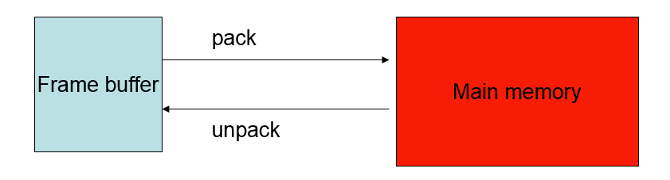
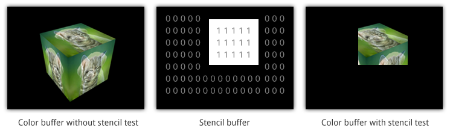

# [CG]01-Frame Buffer

> 2018-01-21 · 電腦圖學(CG) · GP 3 · 來源 https://home.gamer.com.tw/artwork.php?sn=3862576

文章已更新至:[Medium](https://medium.com/maochinn/電腦圖學-frame-buffer-c145d8c172bd)

  

上一篇後半段的例子有講到，

經過顯示卡運算後會顯示的螢幕上，

那麼是如何顯示在螢幕上呢?

透過Frame Buffer

那甚麼是[Frame Buffer](https://zh.wikipedia.org/wiki/帧缓冲器)呢?

Frame buffer儲存在於顯示卡中，但若要顯示在螢幕上，

必須經由OS(作業系統)和CPU

  

因此必須將Frame Buffer的資料寫出到主記憶體，CPU才能使用(細節請去修作業系統)

然後OS再將資訊交給Window System顯示在螢幕上

  

那麼，現在我們關心的事，Frame Buffer是甚麼

Frame Buffer包含所有要顯示在輸出裝置上的資訊，

而輸出裝置通常是透過[點陣圖](https://zh.wikipedia.org/wiki/位图)顯示，

意即大量的格子，而每一格如何顯示又主要由以下三種Buffer提供的資訊所組成

Color Buffer:

也就是儲存顏色的空間，通常又分成RGB(紅綠藍)三個通道，

他可以決定該點的顏色(RGB可以混合出絕大多數人類可見的顏色)

Color Buffer的值常使用Unsigned char或是Float紀錄

舉例來說，使用Unsigned char(8 bit)，那麼(255, 0, 0)就是鮮豔的紅色

值得一提的是常常也會使用4通道RGBA，也就是增加一個「透明」的通道

A表示alpha，表示透明程度

Depth Buffer:

紀錄該格的深度。所謂的深度是用來紀錄深淺，因為在一個三維空間中

經過轉換可能會有兩點重疊，而通常我們傾向於顯示距離相對近的點

如上圖，我們應該顯示黃色的格子，而非桃紅色的格子

那麼Depth Buffer中的值該如何紀錄呢?

這就留到以後再說吧，目前只要知道用處即可

  

這邊補充一點，這種演算法稱為hidden-surface-removal algorithm

使用z-buffer(也就是這邊的depth buffer)來判斷前後位置

在OpenGL中是可以決定是否使用的

例如在繪製透明的東西時，通常會將其關閉

並使用GL\_BLEND...

這些以後再說吧~

  

Stencil Buffer:

可以決定該格需不需要被繪製

如上圖，在Stencil Buffer中被設為1的才會被繪製，儘管其他格確實是有東西的

  

大Guy以上三種最為重要，他們決定了真正顯示到螢幕的樣子，

每一個都有屬於他們的Buffer，全部加起來就像是一面面的Buffer組成的二維陣列

而這些統稱為Frame Buffer，將其資訊Pack至主記憶體。

  

小總結:

目前我們知道一個點被設定(可以推廣至一個面)，然後經過GPU一系列的運算，

將結果紀錄至Frame Buffer，並將資訊Pack至記憶體，

那麼，現在我們要將畫面顯示在螢幕時，

我們通常都是在「視窗」(Window)中顯示的，

因此，我們需要讓Window system讀取主記憶體的相關資訊

  

那麼該怎麼做呢?

其實細部不需要自己寫，別人都寫好函式了，我們只需呼叫

但會依據使用的函式不同而產生不同的視窗

  

下一篇會實際使用glut來顯示!

$('article.c-text img').load(function () { // 表格內圖片大於表格寬時，設為 100% if ($(this).parents('table').length != 0) { if ($(this).width() >= $(this).parents('td').width()) { $(this).width('100%'); } else { $(this).width($(this).width() + 'px'); } } });
