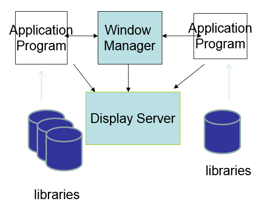
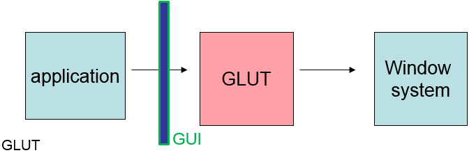
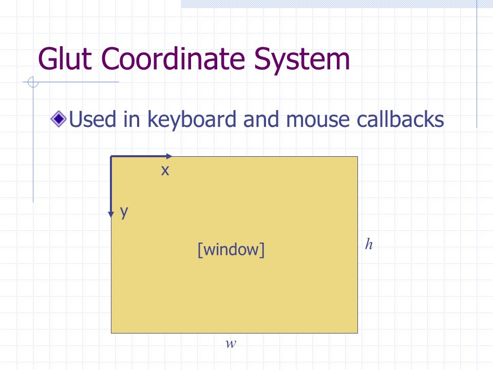

# [CG]02-視窗

> 2018-01-25 · 電腦圖學(CG) · GP 2 · 來源 https://home.gamer.com.tw/artwork.php?sn=3866299

首先，解釋一下與OpenGL相關的API

\--wiki  

「OpenGL規範描述了繪製2D和3D圖形的抽象[API](https://zh.wikipedia.org/wiki/API)。」

  

「OpenGL不僅語言無關，而且平台無關。」

  

所以，OpenGL專注於讓其運算能夠硬體加速，

其他的工作則交給其他API

  

也就是說，若只有OpenGL是無法直接接上一個平台的

需要其他函式庫的支援，例如這一篇會用的的[GLUT](https://zh.wikipedia.org/wiki/GLUT)

這邊實作的語言為C/C++，透過GLUT來作為與Windows作業系統互動的API

  

然後再補充一個也常用的API，GLU是以OpenGL為基礎，

將一些常用的功能實作出來，以補足OpenGL的不足，

但其實這些絕大部分都可以用OpemGL做出來，

不過，可以call函式，誰要自己寫(ﾟ∀ﾟ)

  

因此，我們會用到的API如下

OpenGL, GLU, GLUT

  

  

  

\--回到正題

  

上一篇有提到Frame Buffer pack到主記憶體中後

  

windows system將其資料取出，顯示在視窗內，

那麼，現在就以GLUT來呼叫視窗(windows)

  

我們要提一下window system

大概4長這個樣子

  

整體上應該4長這樣

  

上圖graphical interface對應到application program

(應用程式通常都具有GUI)

Kernel就是OS的[kernel](https://zh.wikipedia.org/wiki/内核)，有他才能操作CPU、主記憶體

  

Display server是讓OS和應用程式溝通的橋樑，

負責提供處理一些圖形上的I/O

由上圖可以發現，他是接在graphical interface下，且接在window manager左邊

將負責顯示方面的運作

再接到kernal(OS)上面，不然不能做一些特權指令(system call)

  

Window manager就是管理一些有關於視窗的部分

例如視窗顏色，字體大小，選單等等...

接收到資訊後，做相應的調整

  

這邊要注意的是，有許多設定是需要註冊的

舉例來說，當滑鼠按下後，我們可以決定要做出甚麼反應

而這個反應，就是使用註冊的callback function

  

值得一提的是，我們的應用程式多是以[事件驅動](https://zh.wikipedia.org/wiki/事件驅動程式設計)的

也就是說，有一個事件發生(例如:滑鼠按一下)，才會有動作

seheduler會執行一個無限迴圈等待事件，

然後handler可以註冊callback function，

當指定的事件發生，就會呼叫註冊的callback function執行

  

因此，透過使用GLUT(在應用程式中使用GLUT)來處理相關的東西

GLUT在呼叫windows system來操作視窗(如果有要操作視窗的話)

  

  

講了這麼多，來看code比較實在

  

  

int main(int argc, char\*\* argv)

{

/\* Initialize mode and open a window in upper left corner of screen \*/

glutInit(&argc, argv);             /\* Make a connection to window system \*/

glutInitDisplayMode(GLUT\_SINGLE | GLUT\_RGB); /\* Set display mode \*/

  

/\*----set window attribute ------\*/

glutInitWindowSize(SIZE, SIZE);      /\* window size \*/

glutInitWindowPosition(0, 0);      /\* initial position \*/

  

/\*----create the window ---\*/

glutCreateWindow("HW1");

  

/\*----Associate callback functions with events--\*/

glutDisplayFunc(display);         /\* display event \*/

glutReshapeFunc(my\_reshape);      /\* reshape event \*/

glutKeyboardFunc(my\_keyboard);    /\* keyboad event \*/

glutMouseFunc(my\_mouse);          /\* mouse event   \*/

glutMotionFunc(my\_motion);        /\* motion event  \*/

glutPassiveMotionFunc(my\_passive\_motion);

glutIdleFunc(idleFun);

  

/\*----Enter an infinite loop, and wait for events---\*/

glutMainLoop();

}

  

這邊相當鼓勵直接去搜尋函式來看怎麼用

通常使用GLUT(也就開頭是glut的函式)的程式，main都是短短der

因為這邊做的事情就是在註冊

舉個例子

glutMouseFunc便是處理滑鼠事件的，

裡面的my\_mouse就是自己定義的函式，

  

void my\_mouse(int button, int state, int x, int y)

{

//...

return;

}

也就是說，當滑鼠事件發生，便會將相關參數交給my\_mouse

例如第一個參數(int button)表示發生事件的是左鍵、中鍵或是右鍵，

而第二個參數(state)表示發生事件的狀態，例如按下、放開等等...

int x, y代表滑鼠當下的座標

這邊比較奇異的點是原點在視窗的左上角

因此(x, y) == (0, 0)就代表滑鼠發生事件時，游標位置在視窗的左上角處

  

這邊做一個簡單的應用

void my\_mouse(int button, int state, int x, int y)

{

if (button == GLUT\_LEFT\_BUTTON&&state == GLUT\_DOWN)

puts("left button pressed");

return;

}

這邊表示左鍵按下時會出現訊息

GLUT\_LEFT\_BUTTON是一個常數，包含GLUT在內，

許多API都會利用到大量常數，所以仍然建議要去看相關文件

  

其餘的事件也都是類似的操作，

因此，我的寫出來的程式基本上都是仰賴事件驅動

而GLUT正是幫我們處理了這些底層的事情

  

最後提一下，glutMainLoop()就是執行一個無限迴圈開始等待事件

所以不能不寫!

  

這篇單純只有用到GLUT，我們下一篇再見ㄅ

  

歡迎討論，前面理論的部分可能有一些問題，

因為都在底層運作，其實也不4Hen懂OUO

  

$('article.c-text img').load(function () { // 表格內圖片大於表格寬時，設為 100% if ($(this).parents('table').length != 0) { if ($(this).width() >= $(this).parents('td').width()) { $(this).width('100%'); } else { $(this).width($(this).width() + 'px'); } } });
