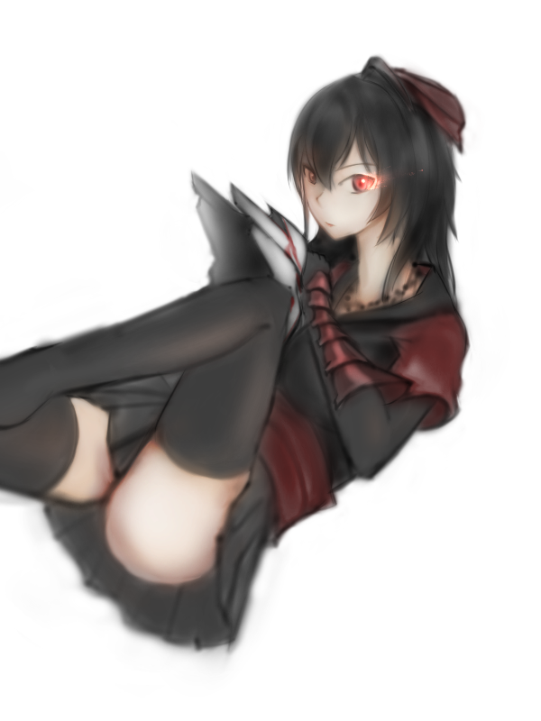
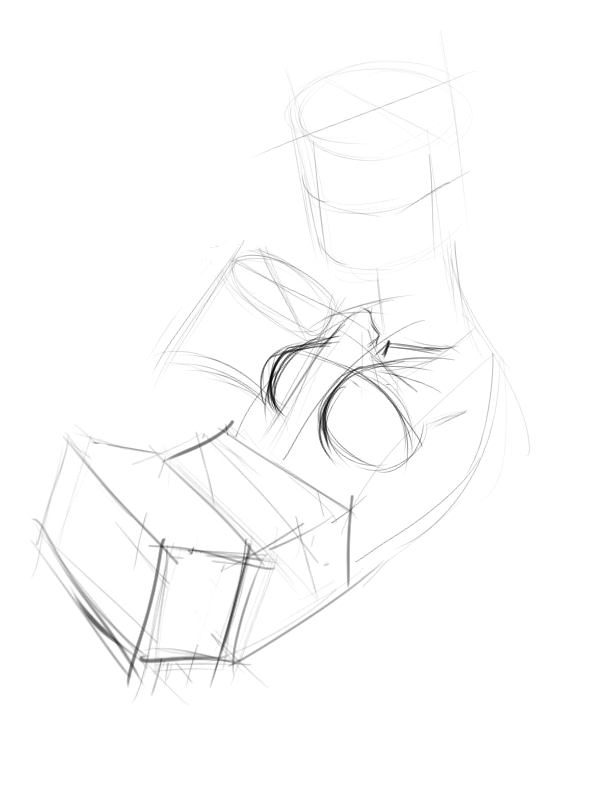

# [塗鴉]Raven Branwen

> 2018-01-26 · 繪圖 · GP 4 · 來源 https://home.gamer.com.tw/artwork.php?sn=3867425

開始放寒假啦!

這畫圖的手感都不一樣了

所以就試試看用主要用噴槍來畫圖

  

角色是RWBY的Raven

雖然是媽媽，但想畫的姊氣一些

就當作是年輕的Raven吧(\*ﾟ∀ﾟ\*)

  

原作那個不太像是大腿襪，

不過，

管他的(́◉◞౪◟◉‵)

  

本來想類似練習的放在同一篇

還是分開放好惹，

假裝更新很多

  

放個過程

  

先畫一些方塊

加一些細節

就完成啦!(ﾟ∀。)

(第一次畫這種，沒想到要記過程)

  

認真(咳咳

先用噴槍打出灰階稿，

再覆蓋上彩色

沒想到一天不到就可以結束，

速塗可以考慮

  

想追蹤比較多日常還請走:[專頁](https://www.facebook.com/Bushyeyebrowscat/)

[帽捲maochinn-繪圖坊](https://www.facebook.com/Bushyeyebrowscat/)

  

[P站](https://www.pixiv.net/member.php?id=6856401)

[給讚](https://www.pixiv.net/member_illust.php?mode=medium&illust_id=66924633)

  

$('article.c-text img').load(function () { // 表格內圖片大於表格寬時，設為 100% if ($(this).parents('table').length != 0) { if ($(this).width() >= $(this).parents('td').width()) { $(this).width('100%'); } else { $(this).width($(this).width() + 'px'); } } });
