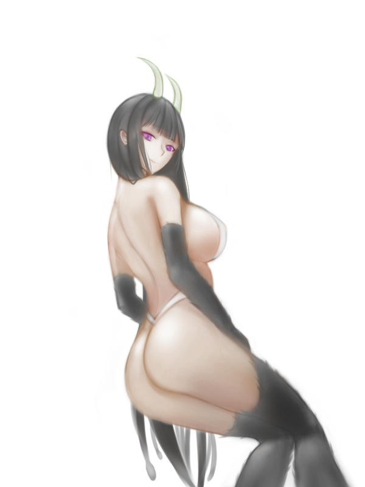
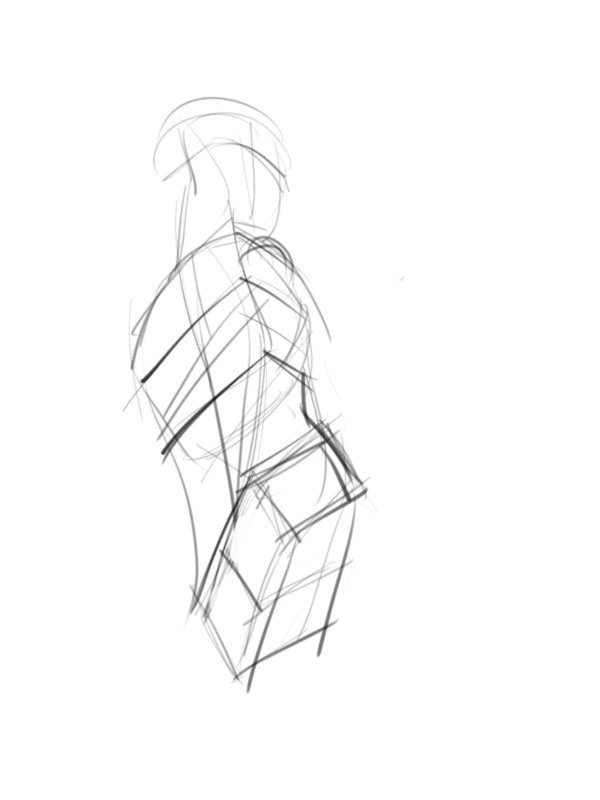

# [塗鴉]千夜姊姊

> 2018-01-26 · 繪圖 · GP 19 · 來源 https://home.gamer.com.tw/artwork.php?sn=3867464

千夜姊姊RR

(其實找資料的時候才知道他叫千夜

  

漫畫版還沒入手

倒是本子已經...

  

總之，試著畫了!

  

這種角度不太常畫，

那個眼神<3

(把我X乾吧

咳咳

  

調整蠻多次的

花的時間大概一天多一些

總之，這次過程比較完整

  

先畫方塊大概確定大致走向

然開始用噴槍，亂噴(X

用噴槍比較有彈性，

不像硬筆畫錯就會很明顯

噴槍可以先勾出外型，細畫再調整就好

調整完就一樣用覆蓋圖層上色

再做一些細節刻畫

以上!

  

想追蹤比較多日常還請走:[專頁](https://www.facebook.com/Bushyeyebrowscat/)

[帽捲maochinn-繪圖坊](https://www.facebook.com/Bushyeyebrowscat/)

  

[P站](https://www.pixiv.net/member.php?id=6856401)

[給讚](https://www.pixiv.net/member_illust.php?mode=medium&illust_id=66972907)

$('article.c-text img').load(function () { // 表格內圖片大於表格寬時，設為 100% if ($(this).parents('table').length != 0) { if ($(this).width() >= $(this).parents('td').width()) { $(this).width('100%'); } else { $(this).width($(this).width() + 'px'); } } });
