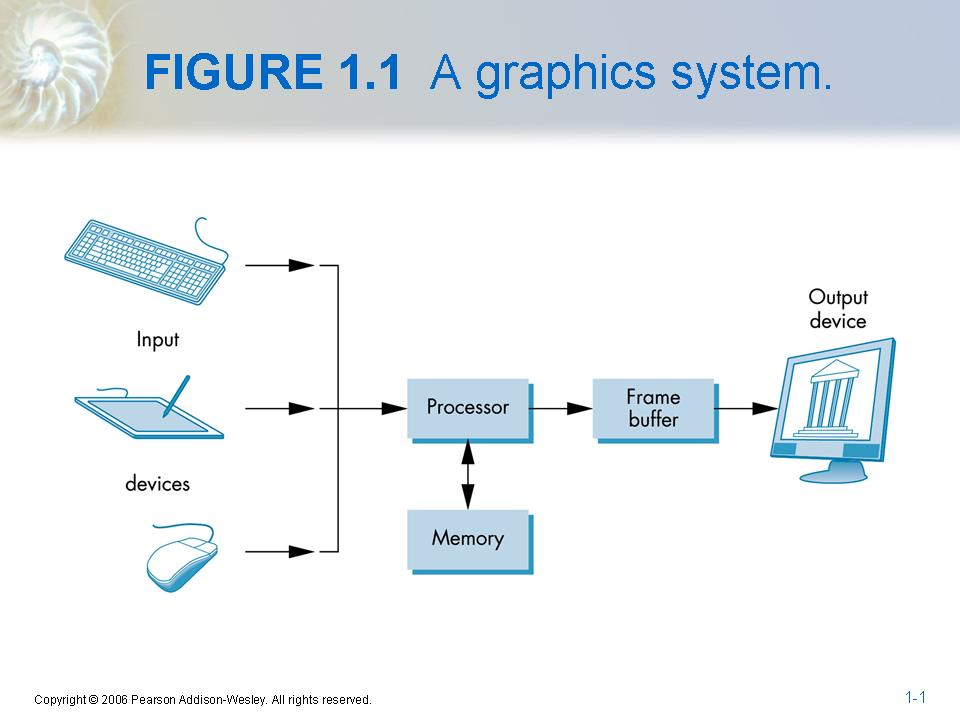
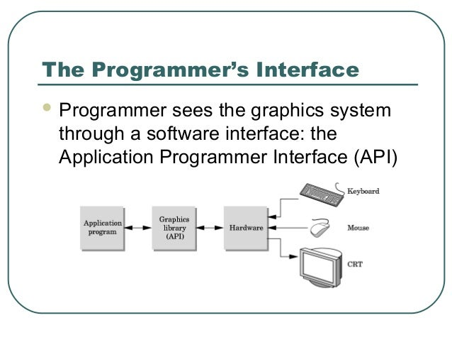
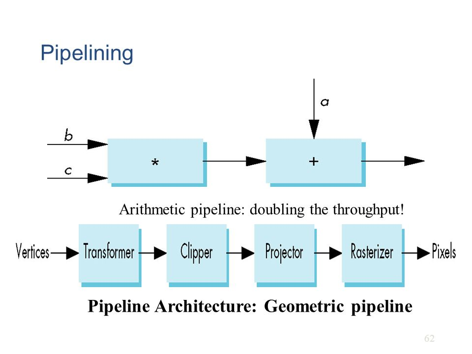

# [CG]Graphics System

> 2018-01-27 · 電腦圖學(CG) · GP 3 · 來源 https://home.gamer.com.tw/artwork.php?sn=3868528

這篇還沒有決定放在哪

總之先寫下來

  

Graphics System就是圖形的系統，

也就是電腦圖學所採用的系統

大致是有5個元素

1.Processor，也就是處理器，負責處理將資訊轉換成圖形

2.Memory，這邊不一定指的是主記憶體，就是個存資訊的地方

3.Frame buffer，存圖形的緩衝區，詳細[這裡](https://home.gamer.com.tw/creationDetail.php?sn=3862576)有講到

4.Ouput devices，輸出裝置(i.e. 螢幕)

5.Input devices，輸入裝置(i.e. 滑鼠、電繪板)

  

  

簡單來說，一張圖片有辦法被顯示出來

透過的是Graphics System

而常常使用到的pixel就表示一張圖片的一個元素

也就是說，圖片本身是pixel組成的二維陣列

這些pixel存在Frame buffer中

  

  

這邊的CG，專注描述的部分在於Processor-->Frame Buffer

先想像一下自己「看」到的世界，

通常是三維世界(不要跟我說二次元

因為光我們才看的到東西，又因為光的直進性，

我們看到的世界是透視投影(可以去看看我的[整理](https://home.gamer.com.tw/creationDetail.php?sn=3646468)

  

所以CG想辦法模擬三維世界

因此，我們需要一個攝影機(眼睛)來看

且要制定座標、物體、光源等等...

攝影機的參數包含

攝影機的位置、方向、焦距、深度(能看到的範圍，不可能看到無窮遠處)

  

所有的效果都需要撰寫程式來表現

包含廣角程度、陰影等等...

  

通常來說，我們會使用別人的API來幫助我們

無論是做出複雜的效果或是操作硬體

  

  

\--

在CG中，畫出一個物體大致可以分成Modeler和Renderer，

兩邊互相獨立

Modeler負責將物體定義出來，

例如一個立方體，可以用六個點的座標定義出來

如果有需要，光源跟材質的特性也要定義

Rederer則負責將物體彩現(render)出來，

以上面的例子來說，他得到6個點的座標，

他將他們相連，然後填上顏色，

在依據攝影機的參數，將立方體在場景(scene)中畫出來，

也就是存到Frame buffer中

  

  

Render要將每一個點(vertices)轉換成pixel

  

這邊做一個名詞介紹

[Graphics pipeline](https://en.wikipedia.org/wiki/Graphics_pipeline)(render pipeline)，也就是render做的流水線

  

如上圖(geometric pipeline，render pipeline的一部分)所述，

需要經過

Transformer

Clipper

Projector

Rasterizer

而這也是我所專注的議題

首先，Transformer將vertices轉換到正確的位置，

其次，clipper依據攝影機的參數，判斷哪些vertices會被顯示

然後，Projector會將vertices投影到攝影機(平行投影、透視投影...)

最後，Rasterizer轉換成pixel的格式

  

當然，我們只需要使用OpenGL，

但也需要知道底層大致的原理才能正確運用

  

回到開頭，

未來的文章也都專注於Processor-->Frame buffer的部分

也就是render的部分，事實上OpenGL就是一個Graphics rendering API

透過不同的Transformer可以做出各種移動(甚至是一個機器人!)

  

  

下一篇將會統整一下整個流水線的過程(以OpenGL為例)

$('article.c-text img').load(function () { // 表格內圖片大於表格寬時，設為 100% if ($(this).parents('table').length != 0) { if ($(this).width() >= $(this).parents('td').width()) { $(this).width('100%'); } else { $(this).width($(this).width() + 'px'); } } });
