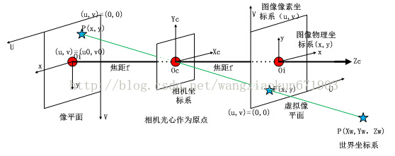
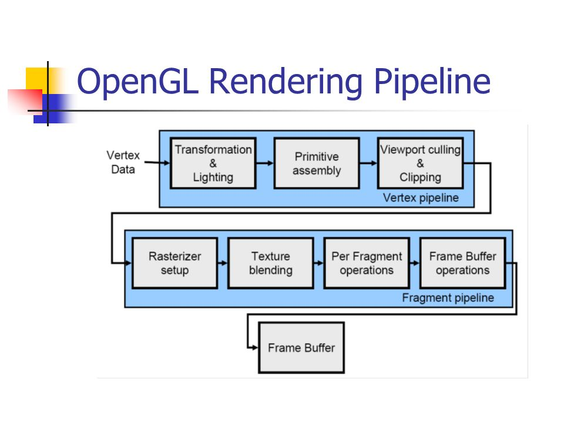
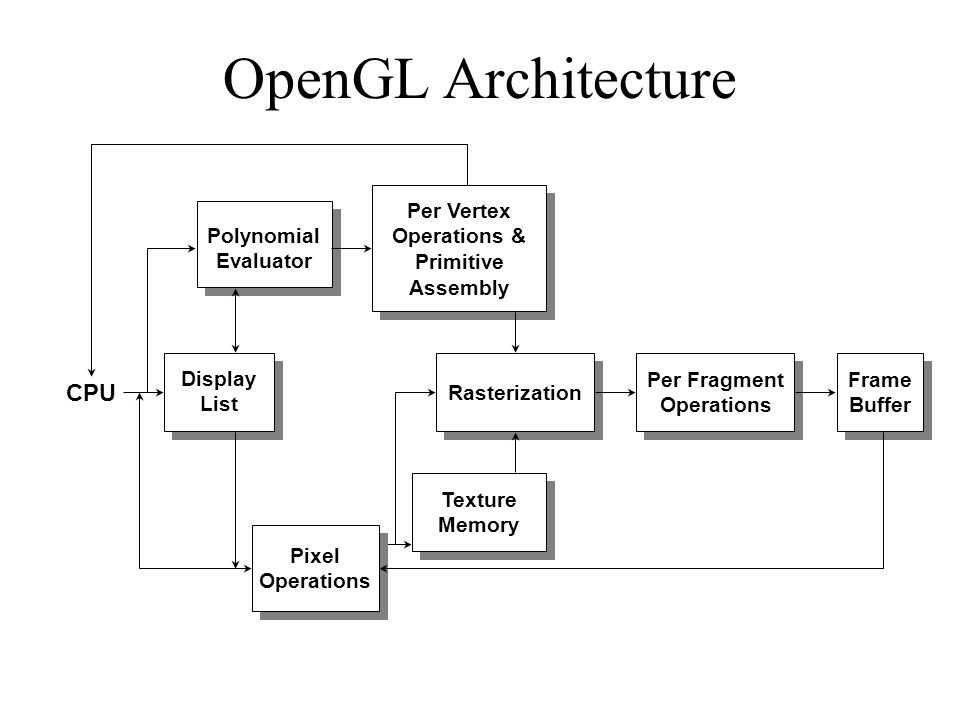
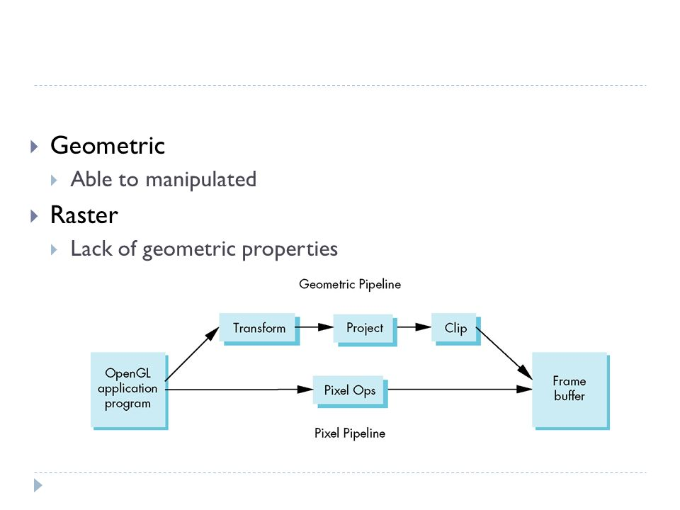

# [CG]rendering pipeline

> 2018-01-30 · 電腦圖學(CG) · GP 4 · 來源 https://home.gamer.com.tw/artwork.php?sn=3871867

在講rendering pipeline以前，

必須要先統整整個繪圖流水線，

也就是[3D電腦圖形](https://zh.wikipedia.org/wiki/三维计算机图形)如何產生

  

WIKI中描述有以下步驟

Modeling

↓

Materials and textures

↓

Layout and animation

↓

Rendering

  

在[前一篇](https://home.gamer.com.tw/creationDetail.php?sn=3868528)所介紹的modeler其實就是負責，

Modeling

Materials and textures

Layout and animation

也就是說，modeler會建模(modeling)，

和給予材質(Materials and textures)，

還有設定一些位置之類的(Layout and animation)。

  

而renderer則是負責Rendering，

也就是本篇要探討的rendering pipeline，

在[\[CG\]00-介紹](https://home.gamer.com.tw/creationDetail.php?sn=3862090)時還有提到的是shader，

這個東西其實是包含在rendering pipeline，

在[逍遙文](https://cg2010studio.com/2011/06/29/shader/)中提到

Shader主要指的是可編程管線的算法片段

這部分我並不是很熟，就先跳過吧

  

\--進入正題

  

[rendering pipeline](https://en.wikipedia.org/wiki/Graphics_pipeline)

  

也就是常說的繪圖管線，

一般搜尋也會搜尋到這種，

([\[CG\]00-介紹](https://home.gamer.com.tw/creationDetail.php?sn=3862090)中的圖片也就是繪圖管線)

在WIKI上的劃分是這樣的

Application

↓

Geometry

\->Definitions

\->The World Coordinate System

\->Camera Transformation

\->Projection

\->Lighting

\->Clipping

\->Window-Viewport transformation

↓

Rasterization

  

這邊不一一贅述

這邊先講Geometry，

翻譯是幾何(?有翻跟沒翻一樣)

咳咳

簡單來說，這個步驟會將modler給的資訊用上，

比如說，將vertex(modeler建模所給的點)定義出來後，

並將其放在世界坐標系，在轉換成眼睛坐標系(Camera Transformation)，

然後投影在viewport上。

在[\[CG\]Graphics System](https://home.gamer.com.tw/creationDetail.php?sn=3868528)

也有稍微描述過

(該篇clipping 的位置跟這篇不同，只是先算後算的問題，不影響)

  

最後再將光柵化到frame buffer，

送回主記憶體，在由CPU負責顯示出來。

  

這邊最大的問題想必是那些坐標系，

坐標系簡單來說就是讓我們能夠將vertex定義在一個位置上

簡單來說，以我們常用的笛卡爾坐標系，

(0, 0, 0)是原點，<1, 0, 0>是X軸，<0, 1, 0>是Y軸，<0, 0, 1>是Z軸

那麼我們就可以定義物體在這個「世界」中。

  

那為甚麼我們要在轉換成眼睛坐標系呢?

所謂眼睛坐標系其實將眼睛(攝影機)做為原點去看物體，

因為我們總是需要一個觀察點去看世界

  

  

最後在把轉換完的物體座標投影在一個區域內(例如一個立方體)，

該區域是由view volumn變換而成，

這個以後再談，總之就是，把投影的東西定義在一個區域內，

進行lighting，也就是產生光影變換，

再進行clipping，亦即超出該區域的不畫，

物理概念上就是，超出眼睛(攝影機)可視範圍的東西不畫，

最後要將結果放在一個二維座標的視窗中(Window-Viewport transformation)

  

最後要將這些向量轉換成像素(pixel)填入Frame buffer，

也就是光柵化(Rasterization)

  

光柵化會將三維空間的圖元填到二維空間

也就是frame buffer

填到二維空間時也需要進行內插

因為將三維空間傳換成二維，顏色需要重新內插得到

  

這樣，就完成了render pipeline

這邊參考了:[這篇](http://www.opengpu.org/forum.php?mod=viewthread&tid=326)

裡面比較詳細的敘述每一步再做甚麼

[相机针孔模型](http://blog.csdn.net/wangxiaokun671903/article/details/37966891)對於坐標系轉換有詳細敘述

  

  

\--OpenGL pipeline

  

其實也是大同小異，

這邊要注意一點的事，

這中間的運算大量地使用到了矩陣，

雖然OpenGL都已經包好再函式中，

但仍建議去翻翻高中課本和線性代數。

  

以上，有錯歡迎指正，我也還在學習OUO

  

\--補充:OpenGL Architecture

  

我們這邊所講的其實只是OpenGL架構的一部分，

也就是上圖中的上半部，

是vertex-base primitive，以vertex為基底作出圖元([primitive](https://www.khronos.org/opengl/wiki/Primitive))

([這篇](https://nanya9541.tian.yam.com/posts/7218317)有較詳細的解釋)，

簡單來說，就是以點、線、面，組成所有圖形，

而點、線、面是以vertex來定義。

這也符合我們所說的。

  

那麼下半部的pipeline呢?

是pixel-based image，

也就是我們常見的圖片，由pixel所組成，

他們沒有辦法跟vertex-base的一樣可以進行幾何變換，

其中之一用處就是可以讀圖，

使其變成貼圖(texture)，

可以在物體「黏」上貼圖，

  

所以也可以簡單劃分為兩條pipeline

  

  

但一般來說，我們偏向探討geometric pipeline，

因為我們的物體常會需要幾何變換，使其「運動」。

$('article.c-text img').load(function () { // 表格內圖片大於表格寬時，設為 100% if ($(this).parents('table').length != 0) { if ($(this).width() >= $(this).parents('td').width()) { $(this).width('100%'); } else { $(this).width($(this).width() + 'px'); } } });
