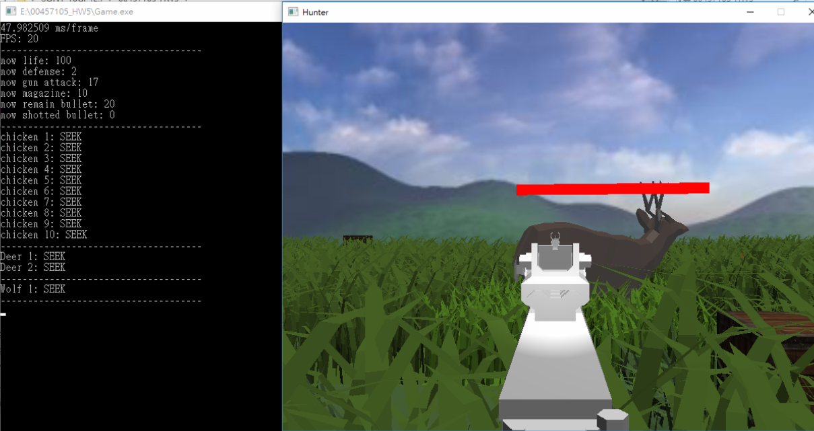

# [遊戲]opengl開發遊戲-Hunter

> 2018-07-09 · 電腦圖學(CG) · GP 2 · 來源 https://home.gamer.com.tw/artwork.php?sn=4051806

不會談太多技術層面的東西

等整個概念比較清晰熟練的時候在另外PO

  

先附個圖

  

大概說明一下這個遊戲的內容

FPS遊戲，玩家操作獵人進行狩獵

玩家總共有三種狀態，按1, 2, 3可以切換

分別是刀、槍、空手，

槍有分自動與單發，

左鍵攻擊，詳細還請看檔案中的README

  

獵物分為三種

雞、鹿、狼，分別有各自的AI

基本上遠遠的拿槍打是沒有問題的

太近的話就可能被追

  

一開始需要使用者輸入一些參數，

例如獵物要幾隻，

預設是各兩隻，由於沒作甚麼優化，

建議先用預設試試看幀數，

  

  

這邊附個實際的影片

油管連結

[https://www.youtube.com/watch?v=vDb9ds\_zKnc](https://www.youtube.com/watch?v=vDb9ds_zKnc)

[https://www.youtube.com/watch?v=DWVJ9Sd\_nlY](https://www.youtube.com/watch?v=DWVJ9Sd_nlY)

  

  

下載連結

MEGA連結

[https://mega.nz/#F!9ZYjxaTZ!PpQIw0TcvRAAA6qE3kFjOw](https://mega.nz/#F!9ZYjxaTZ!PpQIw0TcvRAAA6qE3kFjOw)

  

  

如果打開不了請附個訊息，我再想辦法處理

大概也不太會更新惹=U=

所以就盡量修正吧

  

\-------------------------------------------------------------------------------------

這邊稍微說明一下用的技術

基本上是opengl3.x來進行開發

包括物理引擎、人工智慧引擎、碰撞等等都是我們自己寫的

裡面的圖片、模型是取自網路，

其他有用的函式庫大概只有assimp和一些基本STL的東西

\-------------------------------------------------------------------------------------

一些些小心得

  

在全部的東西幾乎都要自己設計的情況下，

基本上算是寫出一個簡單的遊戲引擎，

真正體會到市面上其他遊戲引擎的必要和強大，

自己算個半死的數學，其他遊戲引擎已經整個處理好了

如果未來有要開發遊戲，看來還是得去學一學unity之類的

但是目前還是對畫奶子跟腿比較有興趣(◔౪◔)

  

總之就是紀錄一下

以上!

  

  

  

  

  

$('article.c-text img').load(function () { // 表格內圖片大於表格寬時，設為 100% if ($(this).parents('table').length != 0) { if ($(this).width() >= $(this).parents('td').width()) { $(this).width('100%'); } else { $(this).width($(this).width() + 'px'); } } });
