# [AR]實作-openCV&openGL

> 2018-08-14 · 擴增實境(AR) · GP 9 · 來源 https://home.gamer.com.tw/artwork.php?sn=4093935

趁還記得細節來做個整理

首先，成果影片如下

大致上就是可以自由設定燈(方塊)的位置，

並且查看模型被光照下的樣貌

D.Va讚讚<3

咳咳

  

首先，太深層的理論另外發，

總之，簡單的邏輯分成兩個部分。

  

一、讀取目前畫面/影片，並且辨識場景

二、在場景中畫出物件(如:D.Va)

  

因此我在這邊利用openCV來完成第一件事，

並利用openGL來完成第二件事，

484很簡單(ㆆᴗㆆ)

  

首先，為了辨識、建構場景，

我們必須取得相機的外部、內部參數，

幸好，openCV已經幫妳寫好了，

你只需要拍一些讓他辨識的相片就好，

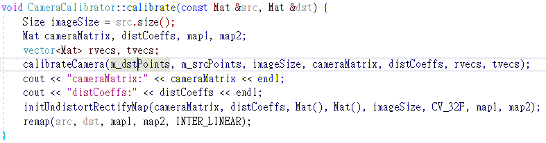

  

那麼第一部份，就是讀取即時影像或是影片，

意思就是也可以預先錄好影片再放到程式跑，

這邊我利用[DroidCam Wireless Webcam](https://play.google.com/store/apps/details?id=com.dev47apps.droidcam&hl=zh_TW)

利用手機鏡頭充當視訊鏡頭

並利用openCV的VideoCapture來讀取

類似以下

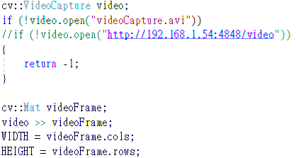\\

註解掉的是手機透過網路傳送影像的網址(IP跟Port)，

若是利用預先錄好的影片的話就是上面那行。

  

接下來再將影像buffer一張一張的讀出來

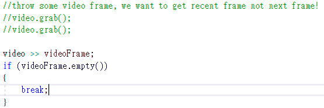

這邊我有遇到一個小問題，

也就是延遲相當嚴重，因此我將丟棄部份影像buffer的內容，

已達到看似連續且即時的內容，

也就是註解掉的部分，

但如果是預先錄好的影片，就相對沒問題，

畢竟不需要及時。

  

接下來，就是影片中出現的的方形，也就是marker

這些marker主要是用來定位物件的位置(意思就是D.va出現的位置)

  

為了辨識場景進而建構場景，

我們需要利用線下計算好的內部、外部參數來建構相機矩陣跟係數向量

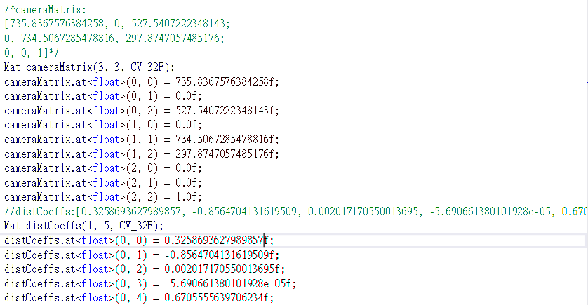

  

並且利用openCV提供的aruco來辨識marker

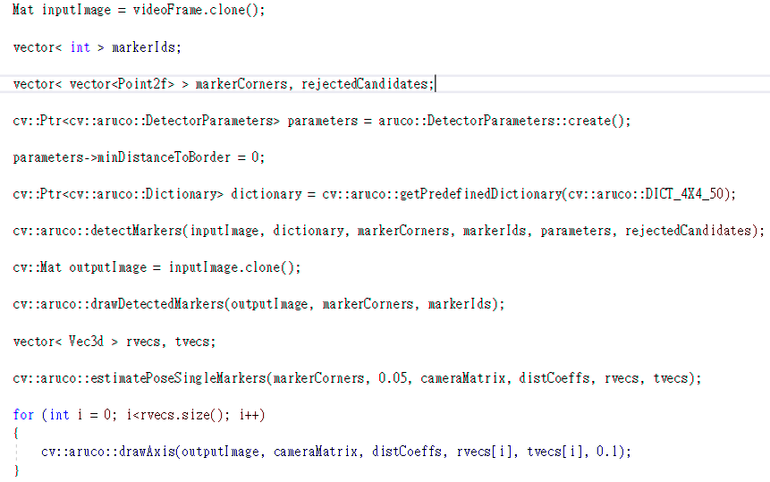

這邊我發現estimatePoseSingleMarkers()這個函數運算慢且不理想，

因此自己另外寫了一個替代的

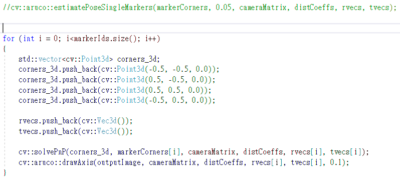

將四個角落分別定義，

將marker定義在坐標系原點，長寬為1.0

最後拿去計算得到旋轉(rvec)、位移向量(tvec)，

這兩個向量將決定marker在3D空間中的位置。

  

到這邊為止，第一部份大致上結束了，

也就是辨識場景的部份結束了。

  

  

接下來第二部份，畫出物件

這邊利用openGL3.3來渲染物件

  

在渲染物件以前，必須建立好model-view、projection matrix

由於我們已經得到旋轉、平移向量，

因此我們利用他們建構出model-view matrix

  

1.先將旋轉平移向量矩陣化

這邊要注意一點，在渲染語言(GLSL)中矩陣是column-major，

而我們平常運算矩陣都是使用row-major，

因此我們要將其轉置(transpose)

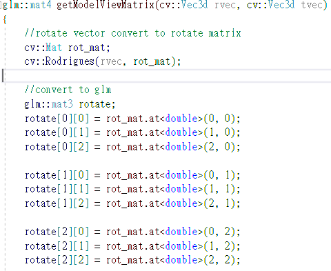

2.並且從openCV坐標系轉移至openGL坐標系，

因為我們計算和測得的數值都是在openCV坐標系中做的，

但我們的渲染是在openGL坐標系做的，

而很遺憾的，他們的坐標系並不相同，因此需要轉換

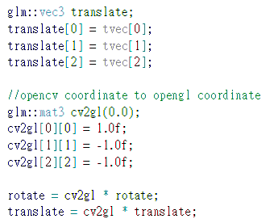

3.最後，合併起來做出model-view matrix

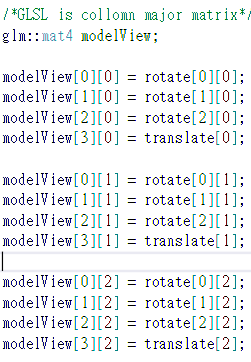

  

最後是projection matrix，

利用之前算好的相機矩陣(內部參數)來建構

注意這邊的projection matrix是將3D投影至NDC

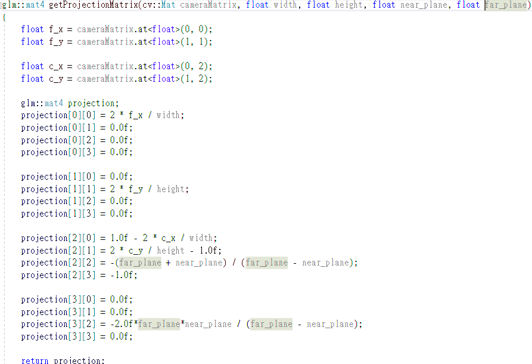

  

最後的最後，將兩個矩陣傳至shader，

在照普通的渲染就可以了。

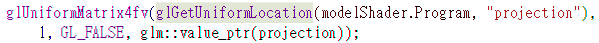

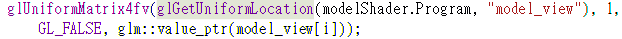

  

在shader的部份，

由於我們的model、view matrix 已經合併在一起變成model-view matrix，

因此所有操作必須在eye space下運算

vertex shader:

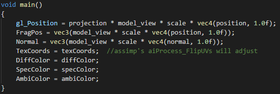

fragment shader:

(一個平行光跟最多三個點光源)

點光源的位置也是由marker來決定

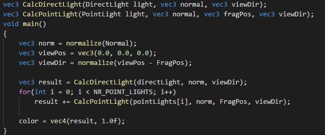

  

  

最後一些小補充，

3D模型是利用assimp來輔助讀取

3D模型都是網路上的資源OUO。

  

對於將影片渲染到畫面上，

我這邊是將影像做成貼圖(texture)，並直接渲染整個視窗

記得要清掉depth buffer

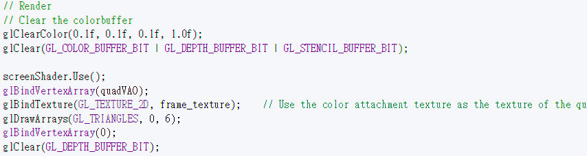

  

每個marker都有自己的編號，

已這邊為例，

當遇到第42號marker渲染出D.va

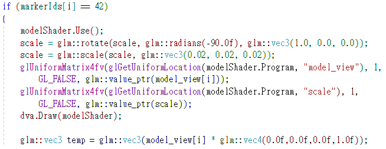

  

  

最後，這邊附一個[播放清單](https://www.youtube.com/watch?v=XRfXtcBXlo8&list=PL_Rl0H2U4OrmWqUL0GT14_mfWs9XH3H0p)有其他DEMO

有問題或是需要完整code歡迎私訊我，

以上!

  

容我感謝以下網站

\--------------------------------------------------

 阿洲的程式教學

 http://monkeycoding.com/

 Opencv ARUCO

 https://blog.csdn.net/ZJU\_fish1996/article/details/72312514

 http://wycwang.blogspot.com/2013/05/marker-base-augmented-reality-part-1.html

 http://www.it610.com/article/3703229.htm

 http://brightguo.com/aruco-marker-detect/



 相機校正 &相機矩陣

 http://silverwind1982.pixnet.net/blog/post/144982784-%E9%9B%BB%E8%85%A6%E8%A6%96%E8%A6%BA%E7%9F%A9%E9%99%A3-%28matrices-in-computer-vision%29

 http://monkeycoding.com/?p=781



 其他

 http://ksimek.github.io/perspective\_camera\_toy.html

 http://blog.sina.com.cn/s/blog\_5fb3f125010100hp.html

 https://docs.opencv.org/3.1.0/d9/d6a/group\_\_aruco.html#gafdd609e5c251dc7b8197323657a874c3

 特別感謝

 張老師提供想法 和機器視覺基礎

 翁老師的 電腦 圖學基礎

 實驗室學長提供意見

 網路上大量資料

 我 (竟然做出來惹 QAQ)

  

$('article.c-text img').load(function () { // 表格內圖片大於表格寬時，設為 100% if ($(this).parents('table').length != 0) { if ($(this).width() >= $(this).parents('td').width()) { $(this).width('100%'); } else { $(this).width($(this).width() + 'px'); } } });
