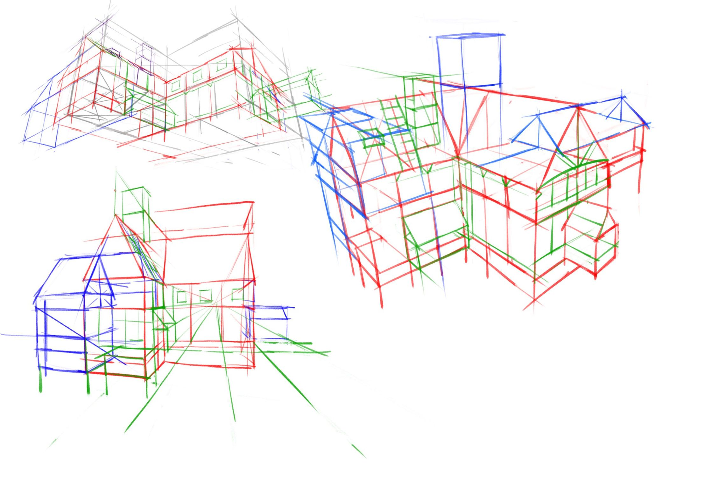
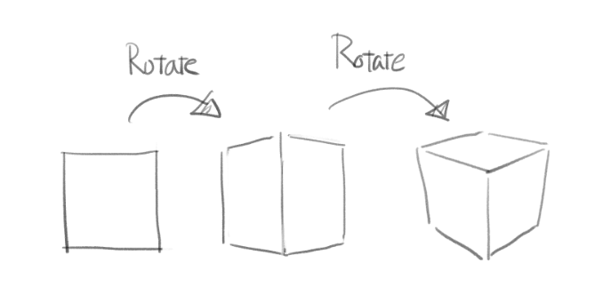
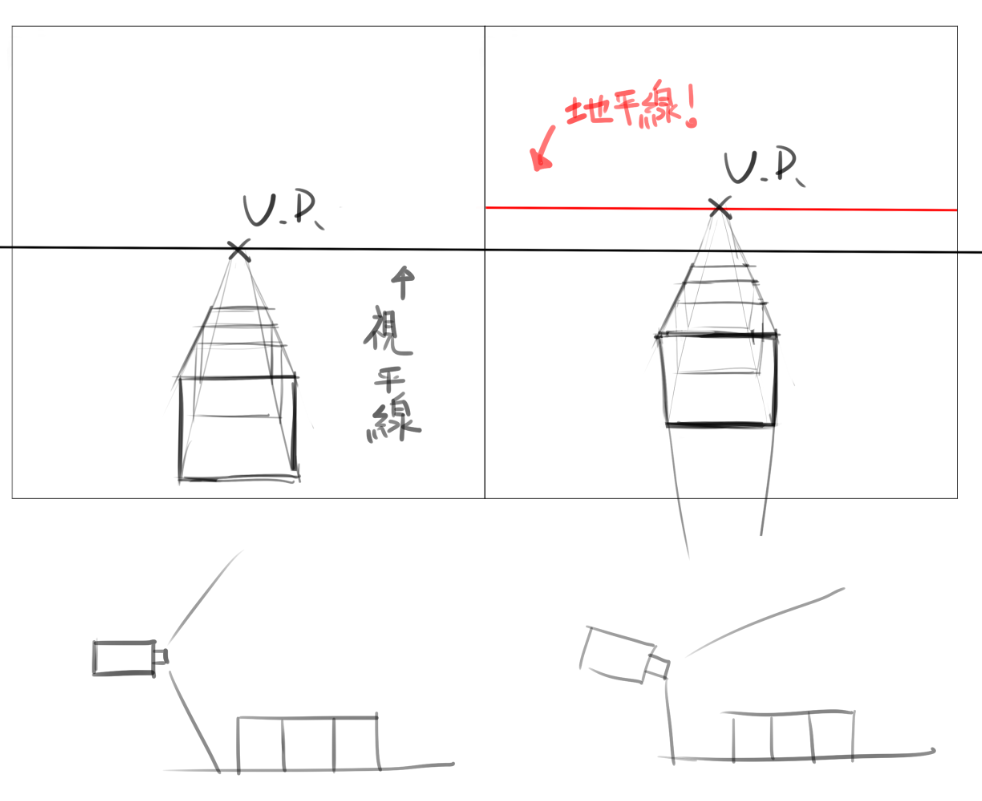
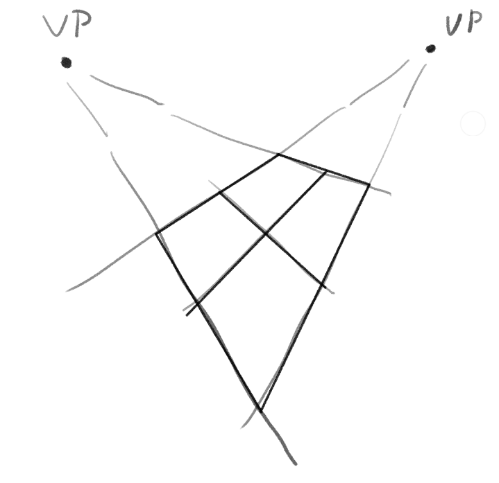
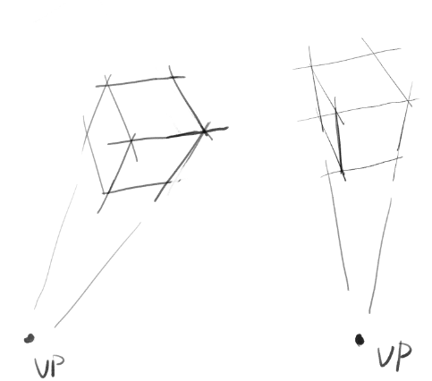
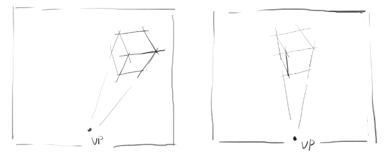
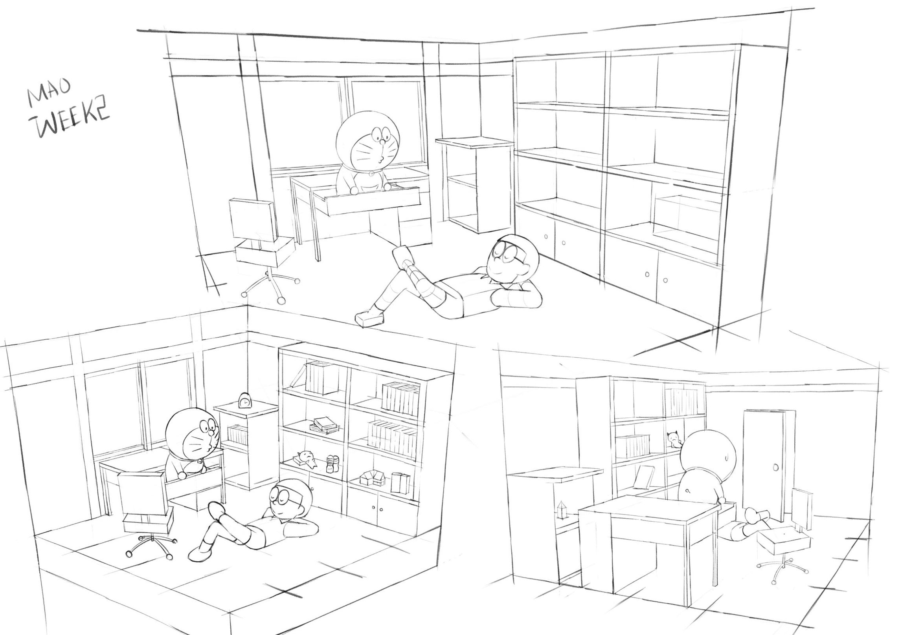
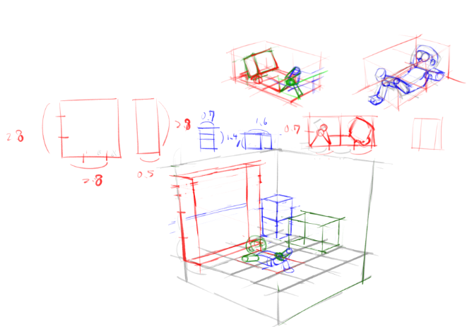

# [筆記]K大透視課一期-01-空間意識

> 2018-08-18 · 筆記 · GP 9 · 來源 https://home.gamer.com.tw/artwork.php?sn=4099219

發現這系列文章竟然零星有人在看，我重新搬運到[medium](https://medium.com/maochinn/筆記-k大透視課一期-01-空間意識-bad6564e32a0)，

有一些調整，版面上應該也比較好看

\--

  

在說明透視、比例等等之前先說明畫圖的一個重要觀念

  

空間意識

  

無論是什麼風格的畫，

基本上是處於3D空間的畫，

而要在2D畫紙上重現3D空間必然要有所謂空間意識，

或者說立體概念。(補1)

  

這邊說的空間意識是相當明確的，

比如說看見一棟房子能夠辨識出它的正視、側視甚至是上視圖，

講更明確一些，

你要能夠定位屋頂、牆壁、地板等等的位置。

無論是用什麼方式。

  

以我的作業為例

要先計算好比例，角度等等，

在心中或是畫出來他在空間中的位置，

當然，三視圖也是一種方式。

  

那麼為什麼空間意識這麼重要呢?

因為若沒有意識在畫(也就是放空在畫)，

常常是用2D的方式在思考。

無論是在素描還是上色渲染，

若不帶有空間意識，

那就會出現看起來「怪怪的」的結構問題。

  

那麼到實際的問題，

空間意識要如何練習?

反過來說，如何畫空間意識才是好的?

這邊整理出兩項:

  

透視、比例。

這兩者都要精確到一定合理程度。

  

  

一、透視

透視在我以前自己整理出一些[小結論](https://home.gamer.com.tw/creationDetail.php?sn=3646468)，

(上完課也有稍微做過修改)

  

課堂上的概念其實是類似的，

我對於透視的理解是

「透視」(perspective)是以**相對**的角度來觀看事物

  

而我對於K大教透視的理解是

透視是待測物與測量物的相對關係。

(意思就是物體與相機的關係)

  

這樣子的相對關係具體影響了:

  

相對角度->幾點透視(旋轉角度)

相對距離->透視強度(收縮強度)、旋轉角度(左右橫移會影響相對角度)

相機規格->畫面視野大小、偏移(這項純粹是測量物的關係)

  

關於相對角度、相對距離造成的影響可以觀察下方言大的

[十六個方塊的整理](https://tryartnote.blogspot.com/2016/05/16.html)

  

  

這邊用簡單的說法就是

完全平視(正視)->單點透視

經過一次旋轉->兩點透視

經過兩次旋轉->三點透視

...

(那經過三次、四次..旋轉呢?)(註1)

這邊再說明一件事，

在之前的[心得](https://home.gamer.com.tw/creationDetail.php?sn=3689797)也討論過類似的問題，

那個時候討論的是單點與兩點透視的混淆，

K大上課則是提到兩點與三點透視的混淆，

但其實問題是一樣的，

而盲點在於以為「看到三個面就是三點透視」

其實這是不一定的，

就像是我畫的

看見兩個面不表示一定是兩點透視。

  

接下來談論一些我一開始畫透視遇到的問題，

第一個，透視強度太弱(左)/太強(右)

  

一般來說比較容易出現這種情況

以結果來說，就是透視強度太強，

以原因來說，就是消失點太近，物體離相機太近。

所以畫出來的方形變形太嚴重。

  

所以建議是，先不管消失點，先畫標準距離下的方塊，

(標準距離?看起來透視強度合理就可以了)

有需要消失點，畫完再找就好了。

  

第二個

這兩個方塊都是正確的，

並且在空間中的旋轉角度是相同的，

(上面的平面是差不多的)

但收縮方向(消失點不同)，

那位甚麼左邊的看起來怪怪der?

以結果來說，就是消失點太靠左。

以原因來說，就是方塊位於眼角餘光甚至是超出視野。

加上整個視野後會發現左邊是在畫面邊緣，而右邊是在視野中間，

也可以感受到左圖的方塊在相機右側，而右圖方塊在前方。

這其實也是我以前整理過的相對角度的問題

[連結](https://home.gamer.com.tw/creationDetail.php?sn=3646609)

那時是說明雖然方塊的角度相同但在相機看來卻是有差異，

以上圖為例，左圖水平旋轉接近45度，而右圖接近22.5度。

但若只看上層的方形，其實是差不多的，

意思是說，若是想要畫水平旋轉22.5度的方塊，

且在相機看起來也是22.5度，

應該要把消失點放在中間。

(當然左邊的情況在畫到邊邊時無可避免，那是正常情況)

  

做個透視的小結論，

透視是相機與物體之間的相對關係，

物體/相機旋轉會影響相對角度，造成方塊有各種型態(16個方塊)

而物體/相機的平移會影響相對角度和相對距離，

也會造成各種型態，以及透視強度不同。

  

還有一點是透視強度要一致，在相同距離下。

  

總之，透視看起來的樣子是相對的關係

可以幫助理解物體在空間中的樣子。

  

  

這邊再做個說明，

一般來說，透視強度強的會說是「短距離廣角」

在[這篇](https://home.gamer.com.tw/creationDetail.php?sn=3646609)有稍微解釋過，

影響透視強度是「短距離」而不是「廣角」

視角並不影響透視強度，

那為甚麼要連在一起講，

因為在視角相當大的時候所有物體看起來都很小，

因此要觀察物體就必須離的非常近，

造成透視強度很強。

  

  

\-----休息的分隔線-----

二、比例

簡單的比例其實就是大家常說的X頭身的概念，

只是X頭身幾乎只適用於站直直的狀態，

缺乏了一般性，

因此這邊用方塊來做為參考物，

再以我的作業為例

在畫整個房間以前，是先計算過比例的，

(房間配置畫反就不要計較惹(๑•́ ₃ •̀๑))

以上圖為例，將地板分為16塊，以其中一塊作為比例尺

如此一來就可以算出其他物件比例

(如何算?目測或是用量的，合理就行)

得到比例以後，我會先畫45度先配置一次再調整比例。

  

比例對於理解空間關係相當重要，

在K大的系統中，

要有基本單位(一格地板)、

基本知識(類似常識，通常桌子大概在人的腰高，當然也可以用量的)

  

建立空間關係後，

可以畫出三視圖來釐清比例關係，

進而在整個空間中找座標(物體大關係，細節不重要)，

等確立所有空間關係之後，

就可以轉角度(就像我的作業顯示的那樣)，

藉由練習轉角度的練習，反饋空間意識。

  

那如何平分方塊或是畫出一樣大的方塊在旁邊?

請參考[這篇](https://forum.gamer.com.tw/C.php?bsn=60143&snA=23477)，或是去聽聽K大公開課

  

這邊比例就比較沒有這麼多問題，

但比例要盡量抓準，

當比例能夠抓準，對於細微物體在空間中的概念也會更好

  

\-----偷懶的分隔線-----

總結

在K大的系統中，空間意識屬於在結構素描的細項。

而結構素描就是3D轉2D的最底層，

而上色、渲染等等技法都是在以此為基底的，

因此空間意識是相當重要的基礎，

也是吃力不討好的基本功，

K大說過:「在空間中讓體積成立」

這個才是重點，無論你是使用方塊、球甚至是其他形狀(補2)，

只要你能讓你想像中的體積定位在設定好的地方。

以正方體為比例基礎，將要畫的「體積」堆積出來。

  

最後

在練習空間意識時，大概有兩個部分

拆結構->用簡單立體幾何來分析結構

轉角度->我會先畫45度了解結構再換角度畫

  

  

\------

註1:

由拉證明過所有(3D空間任意)旋轉都可以用兩個平面旋轉做出

([Proper Euler Angles](https://en.wikipedia.org/wiki/Euler_angles))

意思是說，任何旋轉都可以用兩次旋轉做出等價的旋轉，

因此原則上都是三點透視，

事實上，單點、兩點透視也只是三點透視的特例罷了。

  

補1:

一般在素描就是3D轉2D，

會利用九宮格去定位、抓型等等...

這種就是用2D去思考，

當然，這種練習也是很重要，

但是全靠觀察容易誤差，因此需要靠透視(空間意識)輔助。

補2:

之前有看過文章說不要使用關節球，

因為看起來不明確(其實我之前也是這樣認為)，

但其實問題應該是要有3D思考，

若是2D思考那就算用方塊也會難以找空間關係。

\-----

  

這篇主要是由第一、二堂課所整理得

再加上一些自己的整理，

沒想到會寫這麼多，

但是空間意識算是蠻重要的概念，

因為其實透視的規則並不複雜，

但是整體概念跟實做方式以及對畫圖整體性的幫助，

其實是藉由上課和做作業才會有所體悟。

  

以上!

  

  

$('article.c-text img').load(function () { // 表格內圖片大於表格寬時，設為 100% if ($(this).parents('table').length != 0) { if ($(this).width() >= $(this).parents('td').width()) { $(this).width('100%'); } else { $(this).width($(this).width() + 'px'); } } });
