# [筆記]K大透視課一期-02-畫面與空間

> 2018-09-13 · 筆記 · GP 17 · 來源 https://home.gamer.com.tw/artwork.php?sn=4128242

發現這系列文章竟然零星有人在看，我重新搬運到[medium](https://medium.com/maochinn/筆記-k大透視課一期-02-畫面與空間-37239d4c4327)，

有一些調整，版面上應該也比較好看

\--

  

但在說明畫面之前，

以K大的系統加上自己的系統來說，

先定義幾個名詞

平面線、視平線、地平線、水平線、中間線

以我自己的理解來說，

  

平面線，

就是一個平面對應到遠處的線，

其概念類似於我以前整裡的[這篇](https://home.gamer.com.tw/creationDetail.php?sn=3651320)

以兩點透視的方塊來說，就是兩個消失點連在一起的直線，

要注意的是，直線不代表水平直線，

例如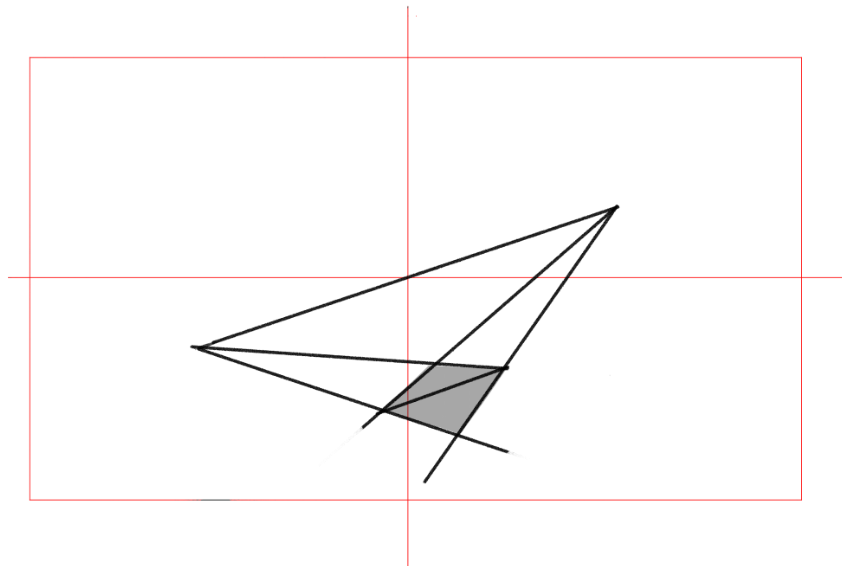

每一個平面都有對應的平面線，

這些平面線都是獨立，彼此原則上沒有關係的。

  

視平線，

以圖來解釋會比較清楚

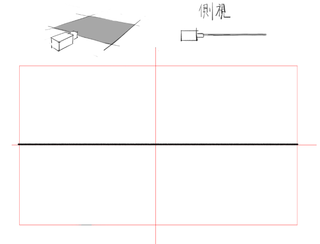

以左上角那張比較容易想像，

攝影機看出去有一個平面(我叫他視平面)，

該平面當然也有平面線，

其平面線就是視平線，

在整個畫面上，就如上圖，只看的見線而不見面。

這邊要注意的是，**視平線總是在畫面中央**。

  

地平線，

地平線常與視平線常常搞混，

這邊再用圖來解釋

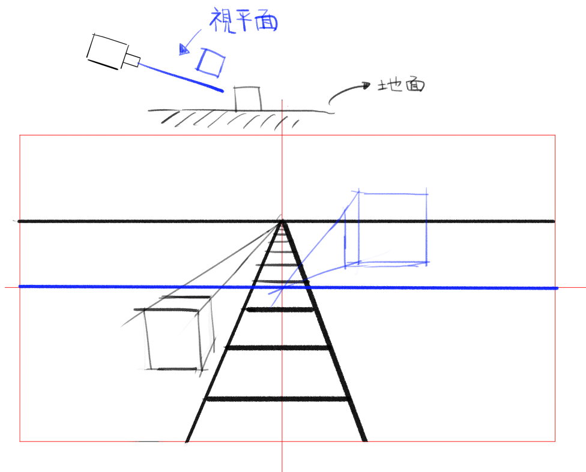

以同樣概念來說，

地面的平面對應到的平面線就是地平線，

也就是說，地面跟攝影機的相對關係是要自己設定的，

換句話說，地平線跟視平線是依據自己設定的畫，

當然，如果攝影機跟地面平行，

那麼兩條線就會重合

  

水平線

毫無反應，就是水平的線

  

中間線

畫面中央的垂直線

  

以上，

總的來說，視平線跟地平線都是平面線，

原則是不同的平面彼此沒關係，

因為不同平面不一定彼此平行，

那為甚麼平常都要對地平線上的消失點呢?

因為大多情況物體的平面都與地面平行，或是以此做為參考，

注意一點的是，這邊說與地面「平行」不是物體在地面上，

所以可以注意到黑色的方塊在垂直線是有收縮的，

而藍色的方塊則無。

  

以上名詞定義

  

從上一篇應該可以得知一張圖的畫面上會有各種角度的透視，

也就是說，可能同時存在單點、兩點，三點透視。

如下圖所示

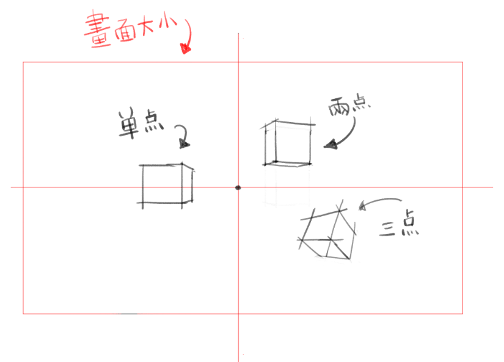

這邊說的畫面是攝影機看出去的畫面，

它有固定視野範圍和焦距(在同一時間)，

至於為甚麼說攝影機而不說眼睛請見(註1)。

  

這邊請想像自己手機拍照的畫面，

畫面中一定有所謂的中間十字線，

以及畫面範圍總是畫作方形(註2)，

且我們看見的畫面經過一定程度的投影(註3)，

這些特性要與空間一起討論。

  

為甚麼要討論畫面與空間呢?

因為畫面(或者說是圖片、圖像)狹義來說都是存在於2D平面上的，

而空間就我們平時理解的是3D空間，

由於繪圖就是將3D的東西化成2D的，

在3D轉2D的過程，其中必定會失去一些資訊，

當然有時也要扭曲一些資訊。

以透視投影來說，會出現近大遠小(近高遠低)的扭曲，

而近的東西會相當程度的遮住遠的東西，

這也是我們日常的感受，

除了近大遠小，還有一些類似的原則，

例如:近實遠虛、近濃遠淡、等等...，這些不一定與透視有關，日後再談。

  

接下來，再用旋轉來說明會比較清楚

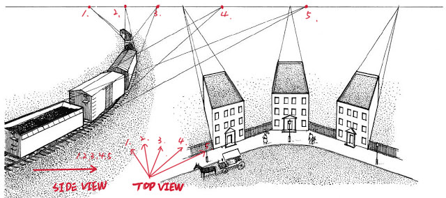

以上圖來看，所有消失點都在同一條水平線上，

這是因為他們所在的平面彼此平行，

(注意，這邊要分成左右圖，不要當成一張圖)

在同一平面上，因此他們的平面線剛好相同，

所以這邊可以做一個小結論，

**平行平面，無論如何在該平面旋轉，消失點都在同一平面線。**

  

小總結，

任何方塊(或者推廣至任意幾何體)彼此都是獨立的，

但若是恰巧屬於同個平面的，那若且唯若他們的平面線是相同的，

相對來說，地平線也就只是其中一種平面，

只是很多東西都站在上面，因此他們的平面線相同。

  

至於視平線總是在畫面中央，

這邊也可以推廣成中間線也是視平線，只不過是垂直的。

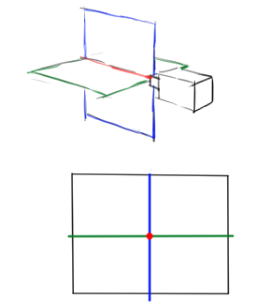

那麼這些平面、線是跟隨著攝影機的(註4)

這些平面交線(也就是紅線、點)，就是整個透視投影的中心，

也就是最沒有誤差的線，

已此線穿過的點會是最接近原始狀態的點，

反過來說，垂直距離這個線越遠，那麼他就會越有誤差。

  

以畫面上來說，距離紅點越遠原則上誤差越大。

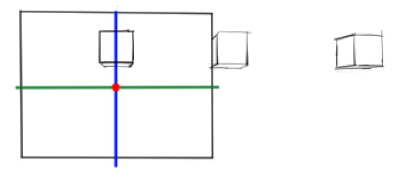

方塊離畫面越遠，越來越不像一個方塊就是因為如此

若由工程圖學的角度來看效果類似斜投影

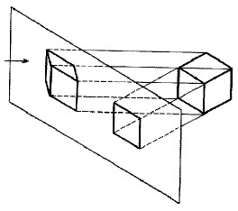

當然，工程圖學做的是平行投影，

但是這邊可以體會一下這個感覺

  

\------休息------

  

前半部說明從空間來說空間跟畫面的相互關係，

後半部從畫面的角度來說，

以下圖為例

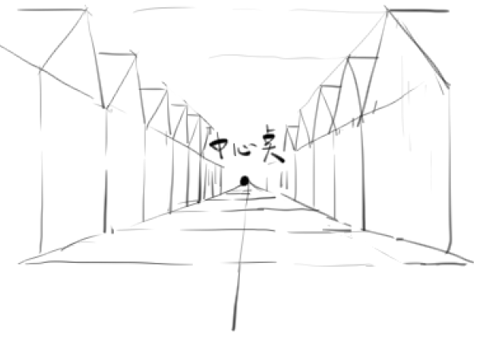

畫面上有一排全部符合單點透視的房子，

這邊至少有三個問題

1.單調，單點透視過於均衡，畫面中元素過少(包含沒有遮擋，也沒有破型)。

2.不該延伸至無限遠處(房子不會這樣延伸10萬8千公里，不合理)。

3.構圖上強烈暗示中心點的東西，無法看到別的。

  

這邊只要加上遮擋就能夠解決一部分問題

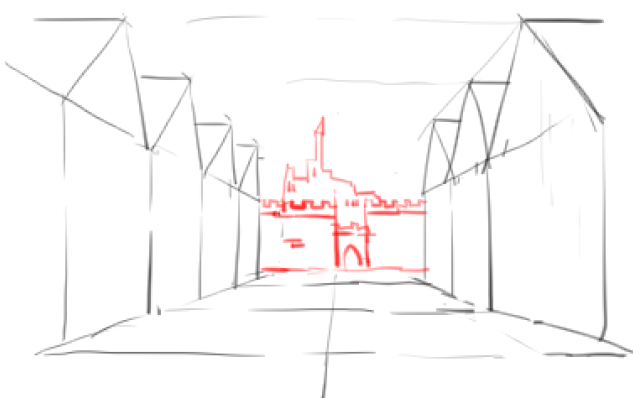

然後可以利用偽單點透視的方式來使畫面不那麼均勻，

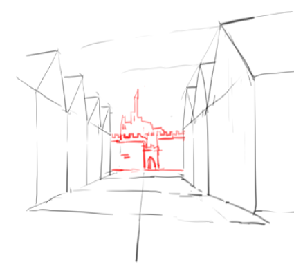

其實也只將相對角度稍微水平旋轉，

但左右兩側就相對沒有那麼對稱，

  

然後是強調距離感和破型的功夫

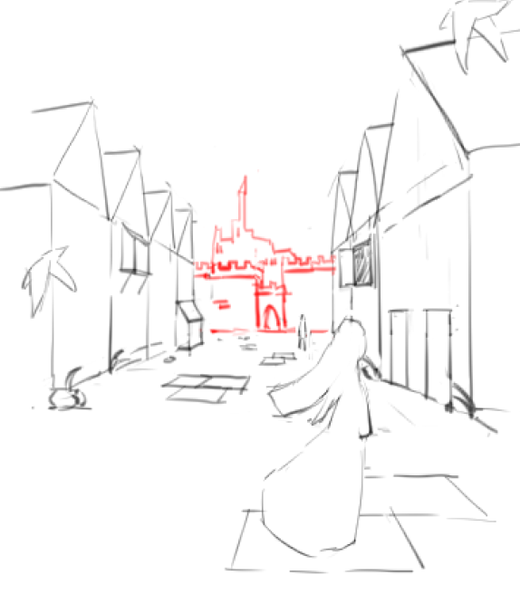

可以發現畫面中出現近大遠小，

甚至可以大致區分為前、中、遠景(註5)，

原則上為了做出距離感，

會利用等距、相似物體製造景深，

有時候會刻意安排明顯的近大遠小，

也就是說比起透視造成的遠近，

在空間上刻意讓距離攝影機遠的物體也設定的比較小，

讓人在畫面上更加凸顯景深。

  

具體怎麼處理我這邊也做的不是很好，

有興趣可以去上上課(強制工商

  

這邊想說明一個我的看法，

在本文後半部的時候我是看畫面需要甚麼而加上什麼，

並不是當初在立體空間中設定，

這點我理解為主動的畫圖，

所謂主動就是用元素來「服務」畫面，

然後再讓他在空間中成立。

反過來說，

被動的畫圖是先設定物體、攝影機在空間中的位置，

然後依據透視將他畫出來，

所有在畫面上的物體是推理出來的，

並不是你「主動」決定的。

  

這也就是為甚麼畫圖通常會比照片美麗，

因為畫面中所有東西都是經過刻意、主動地去安排的(註6)。

  

  

附兩張作業

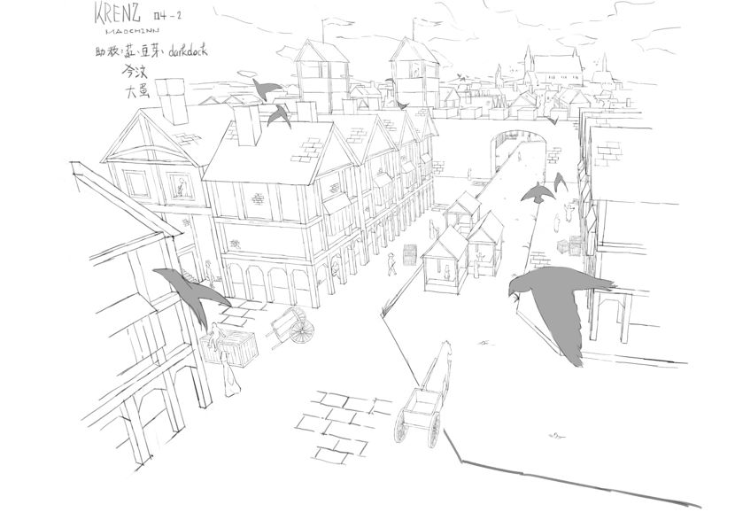  

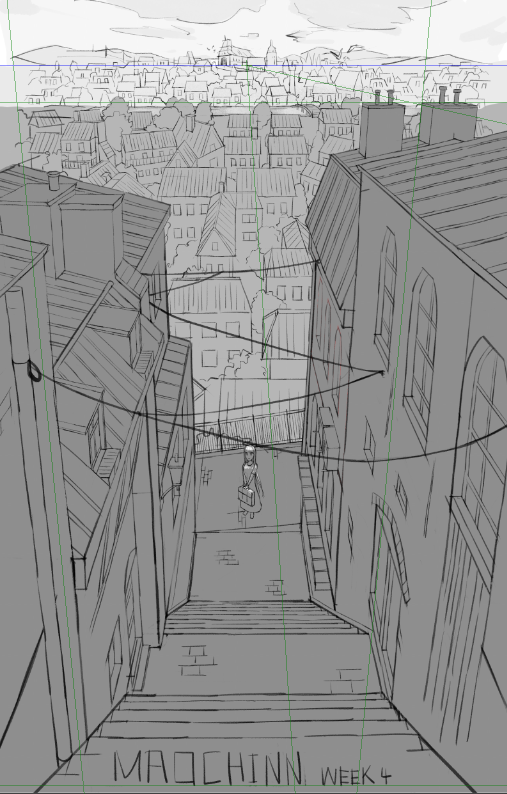  

  

結論，

空間跟畫面是息息相關的，

但畫圖往往要從畫面思考，

也要讓所有物體在空間中成立，

因此空間意識也是相當重要的，

否則比例、角度不準也會造成畫面看起來怪怪的。

  

另外，K大在說明臨摹這件事時強調，

臨摹透視要帶著空間意識，

也要要求型準，

型準有極大的價值，

這個包括了輪廓、抓型，並累積圖像庫。

  

在「型」上我目前還是蠻弱的，

尤其是型準的問題，

所有以後有談到相關的知識可能就無法這麼清楚。

  

這篇大概就這樣吧，

以上!

\------

註1:

眼睛是一對的，且他們位置不同，

所以我們感受到的畫面是經過兩種影像所疊加，

這增加了理解的困難，

因此這邊舉例為攝影機，

如此一來，也可以透過相關攝影機的設定來說明。

  

註2:

攝影機感光元件為通常為方形，

因此就算鏡頭是圓的，

最後出來的畫面也是方形的。

至於為什麼是長方形(就像電腦螢幕一樣)，

我個人的猜想是因為眼睛是左右各一排列，

橫向視野大於縱向視野，

為符合人眼睛的習慣，所以大部分都設計成水平較寬的畫面。

  

註3:

以電腦圖學/機器視覺來說，

要將3D的光轉換成2D的畫面，

必進行不同程度的投影，

就像是地理課所教的各種投影法也是，

因此，也有同樣的缺點，

離畫面中心越遠，其誤差越大。

  

註4:

視平面不只包含水平跟垂直的，他可以是其中任意旋轉的平面，

而它們匯相交於一條線，也就是數個平面的解為無限多解。

以空間座標系的概念來看，

這些平面跟攝影機同屬一個在地坐標系(local space)，

因此無論如何移動攝影機，它們在畫面上都是一樣的。

  

註5:

近、中、遠景原則上可以分開討論，

因為視覺上不會放在一起看，

從透視的觀點來說遠景可以當作平行投影來看，

甚至是剪影來處理。

  

註6:

現實的照片沒有經過過濾，資訊量往往過大，

但畫通常也會注重一些類似近實遠虛的原則，

這樣也可以凸顯畫家想要表達的東西。

$('article.c-text img').load(function () { // 表格內圖片大於表格寬時，設為 100% if ($(this).parents('table').length != 0) { if ($(this).width() >= $(this).parents('td').width()) { $(this).width('100%'); } else { $(this).width($(this).width() + 'px'); } } });
