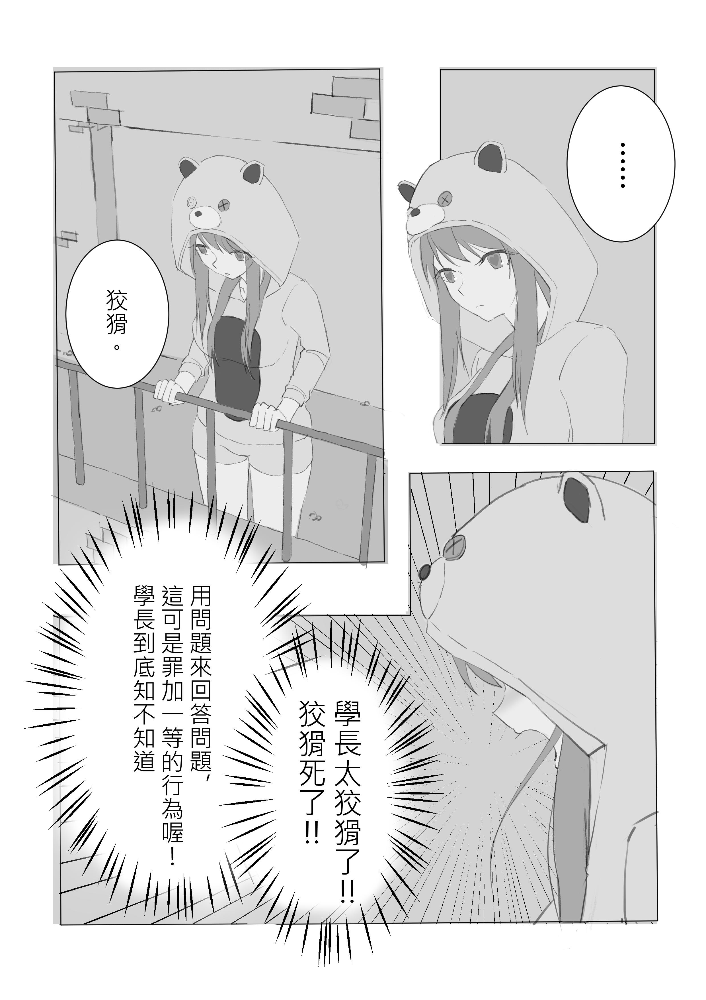
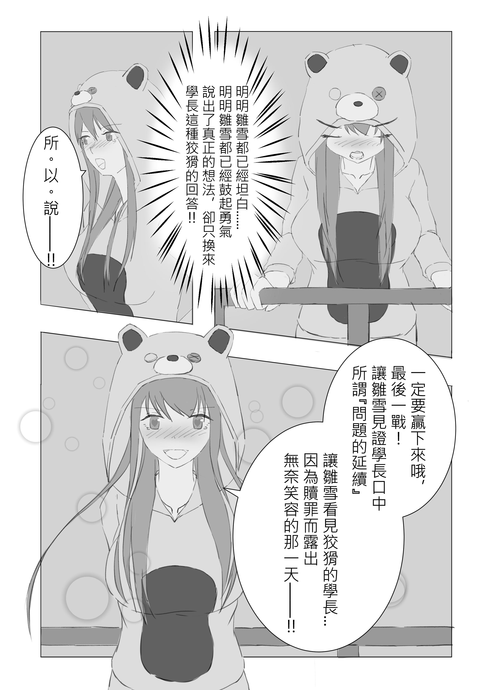

# [同人]《在座有病》小短漫

> 2018-11-29 · 繪圖 · GP 3 · 來源 https://home.gamer.com.tw/artwork.php?sn=4210231

\-----防雷線-----

  

  

  

  

  

  

  

  

  

劇情取自第九集第一章的一小段劇情，

雛雪一直我比較有愛的角色，

很久以前也稍微塗鴨過，

那張現在google雛雪的圖片還是第一名www，

本來想說參加甜咖啡大的同人圖繪選畫一個小插畫，

但是不知不覺就加了一些幾個鏡頭，

就變成類似漫畫的感覺惹OUO，

沒畫過漫畫也不懂分鏡什麼的就做了個大死(ﾟ∀。)

  

  

雛雪<3

  

說起來《在座有病》也追了一段時間了，

從第四集出的時候一口氣把前面的集數也一起買惹，

雖然裡面的女角每個都很吸引人，

但我想最吸引人的或許還是主角柳天雲吧，

那種獨行俠的感受，

突然就想信手捻來的來個吟詩作對，

讓我很有共鳴(\*ﾟ∀ﾟ\*)，

這麼有格調的事，算是中二嗎?

  

咳咳，

還是回到我們的雛雪好惹，

一直都對於有小惡魔屬性的角色蠻有愛的，

再加上雛雪書中是個厲害的插畫家，

真是夢寐以求的老婆啊(,,・ω・,,)

  

每天都熬夜畫各種角度的雛雪

#感到滿足

  

有時間在單獨畫個插畫吧，

漫畫這部分也是有時間再研究看看吧，

以上!

$('article.c-text img').load(function () { // 表格內圖片大於表格寬時，設為 100% if ($(this).parents('table').length != 0) { if ($(this).width() >= $(this).parents('td').width()) { $(this).width('100%'); } else { $(this).width($(this).width() + 'px'); } } });
