# [塗鴉&練習]合集(1)

> 2019-03-02 · 繪圖 · GP 9 · 來源 https://home.gamer.com.tw/artwork.php?sn=4311581

拖很久沒更，因為覺得畫的東西都不太完整，

那就只能以量取勝了\_(┐「ε:)\_

  

  

放的東西主要從18年末到19年初

塗鴉:

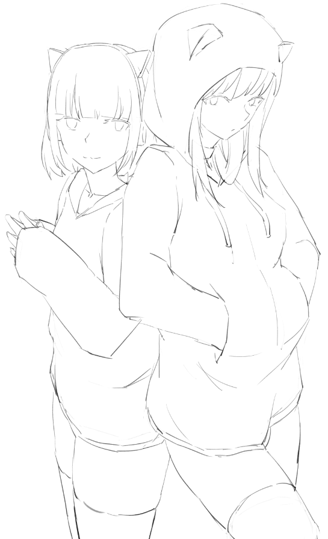

KMNZ帥的我一臉

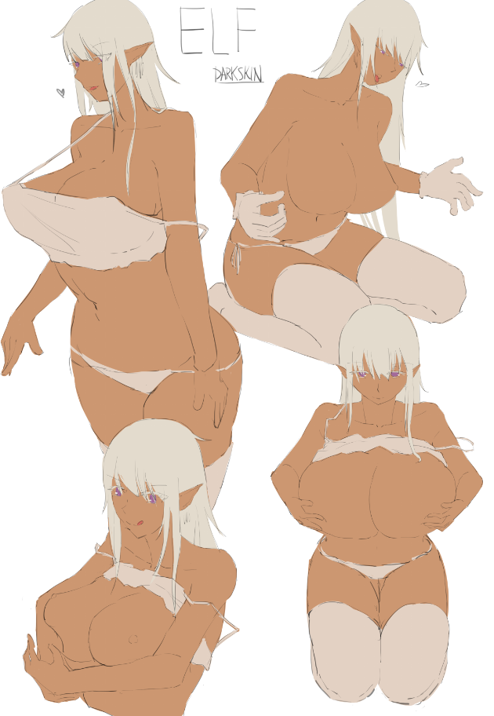

不知道嗑了什麼畫出來的大ㄋㄟㄋㄟ

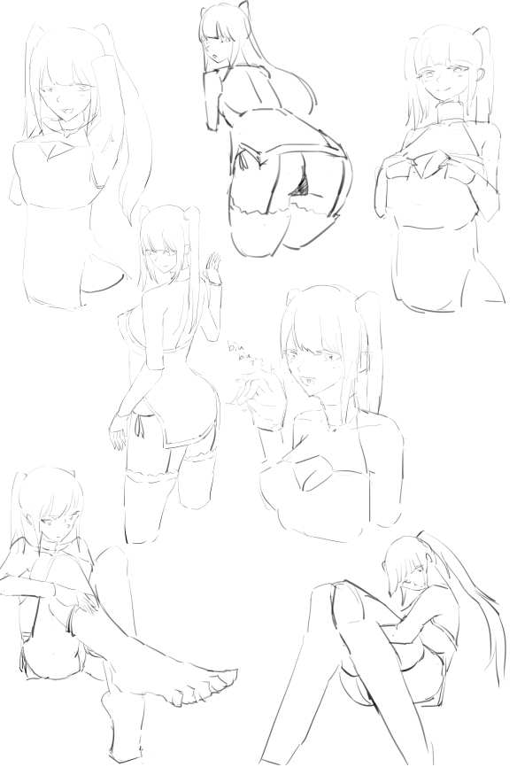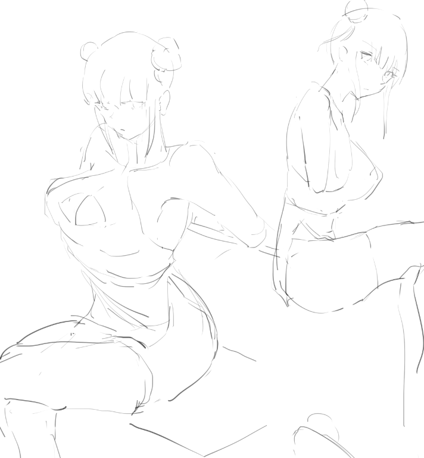

狂三旗袍阿斯(๑´ㅂ\`๑)

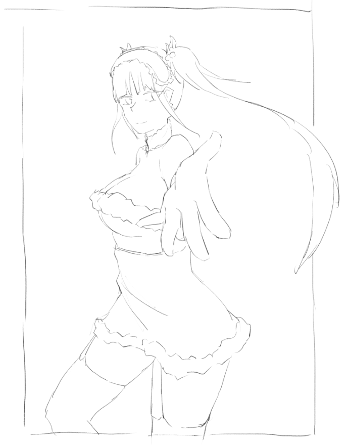

本來想在聖誕節畫的，可4我不會上色இдஇ

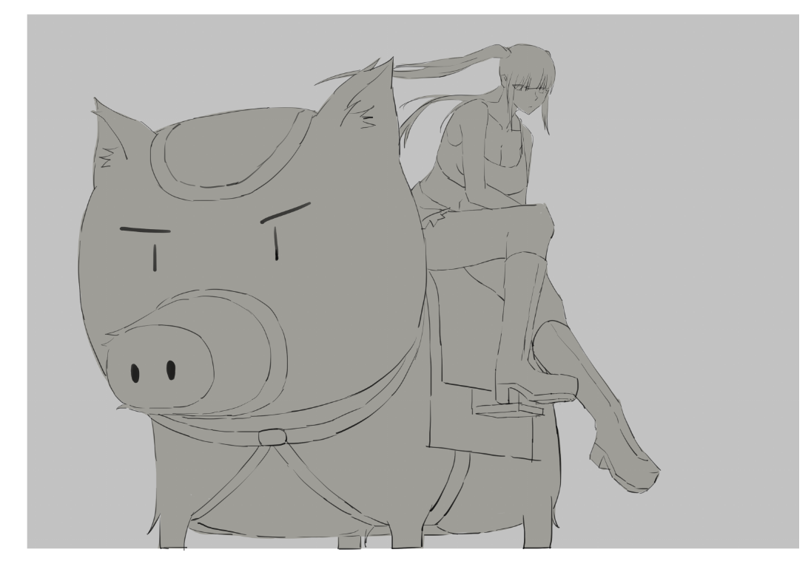

狂三騎豬豬，本來也打算在豬年的時候畫，

可4我還是不會上色\_இдஇ\_

  

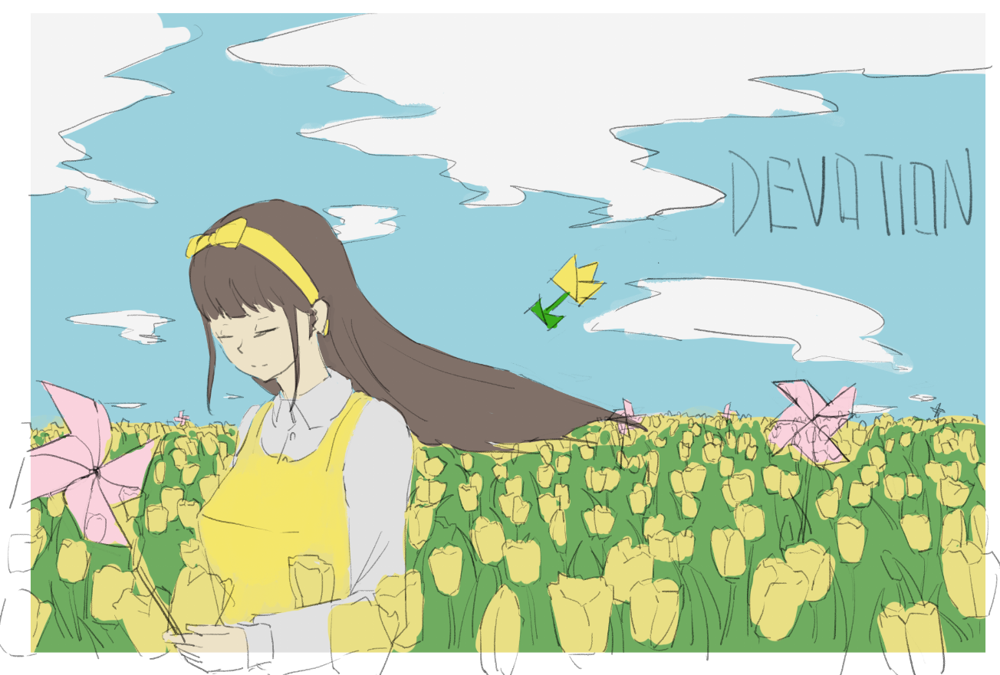

美心55555

這張不知道能不能完成，就先算在塗鴉了

  

  

練習:

主要還是做一些透視練習

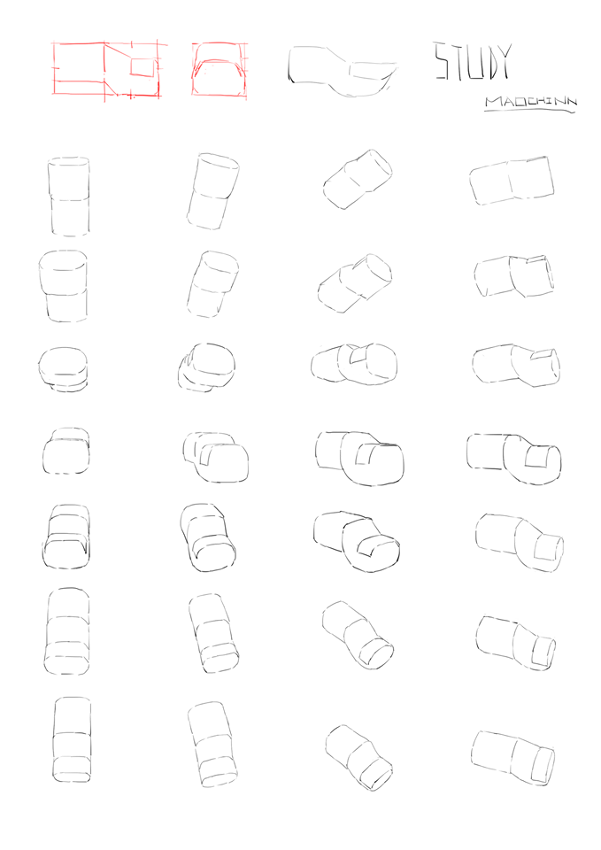

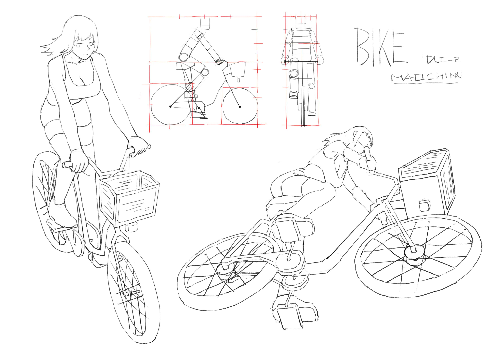

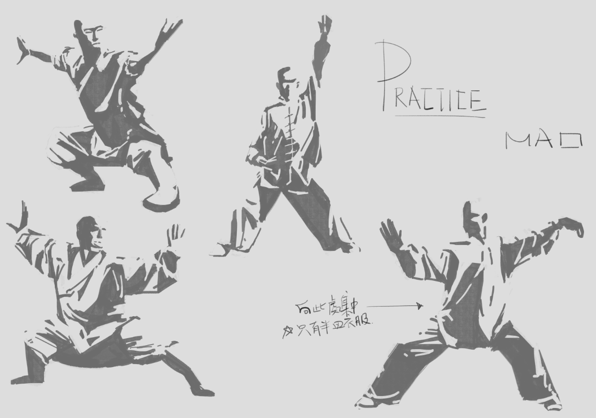第一次做這種明暗交接線的練習

應該是抓正負型，在去上色課之前想先試試看

  

其他:

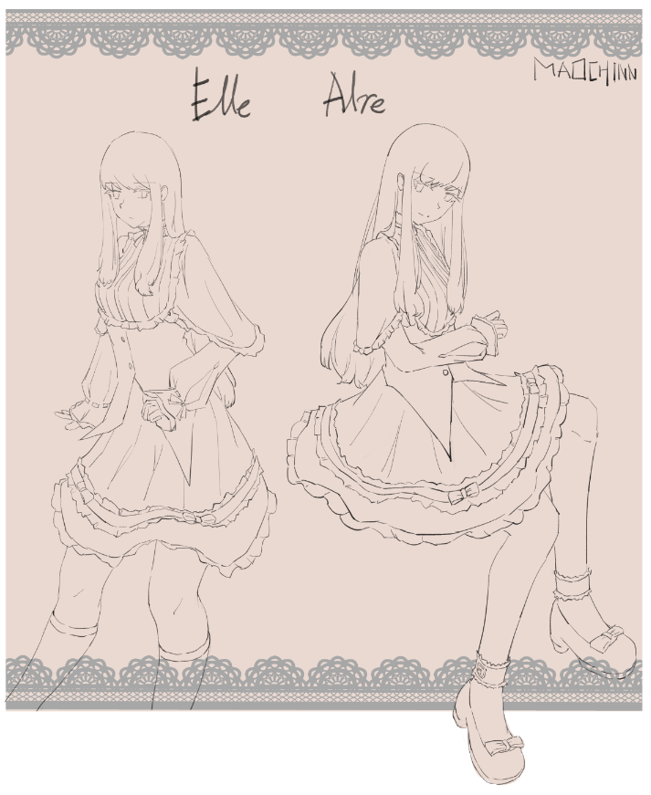

這張是我第一次玩交換會抽到的角色沒想到對方是個大佬我好怕&\*/.

(真的是緊張到不會說話)

希望沒有糟蹋了對方的孩子，

附一下對方的[粉專](https://www.facebook.com/sionnnuwu)。

偷偷的說我的角色被畫的我自己都不認識惹，

有這麼美的嗎????

  

  

咳咳

可以發現大部分的圖還是沒有顏色的，

希望在上完課能夠把這部分的技能點補足，

這次沒有創作，都是一些練習和塗鴉，

(´;ω;\`)(´;ω;\`)

  

  

總之，下次再見ㄅ

  

[專頁](https://www.facebook.com/maochinnn/)

$('article.c-text img').load(function () { // 表格內圖片大於表格寬時，設為 100% if ($(this).parents('table').length != 0) { if ($(this).width() >= $(this).parents('td').width()) { $(this).width('100%'); } else { $(this).width($(this).width() + 'px'); } } });
