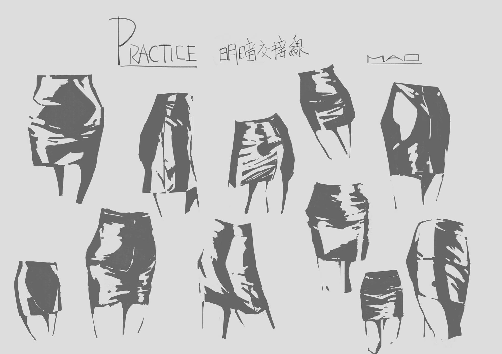
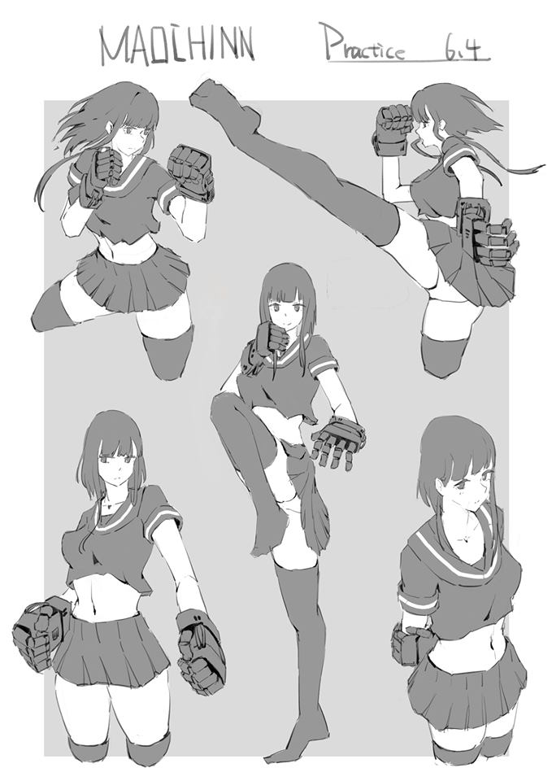

# [筆記]K大色彩課四期-00

> 2019-06-07 · 筆記 · GP 6 · 來源 https://home.gamer.com.tw/artwork.php?sn=4419835

[已搬運至此](https://medium.com/maochinn/筆記-k大色彩課四期-00-b26cba317955?source=---------0-----------------------)

  

總算是上完課了，

去年也大概是這個時候上完透視課，

差別只是今年基礎作業有如期做完，然後我也要畢業了...

  

這次一樣先寫一篇序來提醒自己之後要記得做完筆記，

也稍微分享一下整個課程的心得和課前準備，

  

在課前準備，我大概有反省一下自己的上色跟一些概念，

大概發現明暗交界線抓得非常含糊，

但是也不太知道要怎麼練，

看到別人練石膏像，雖然感覺有這麼一回事，

但看不太懂該怎麼練以及練的目的，

所以我就先練練看正負型的形狀練習，

例如我在之前文章有擺過的

  

這幾張主要也只嘗試看看利用「點」、「面」來思考，

因為之前的畫法幾乎都是以「線」來思考，

比方說畫線搞來分出所有的物件，

也因此只能使用「線」的方式來處理所有細節，

畫面缺少「點」和「面」，

  

所以雖然現在看回來之前的練習有蠻多瑕疵的，

但的確讓我在上一開始課的時候比較容易上手。

  

另外，「抓型」一直是我相對較弱的基礎，

所以這次課程的作業也盡量多做一些抓型的訓練，

也慢慢感受到臨摹抓型的感覺，

雖然現在也還不是完全理解。

  

最後，比較大的觀念轉變大概是找參考圖這件事，

從最一開始覺得應該不需要參考圖，

到後來慢慢理解到要找參考圖，

但並不知道找怎麼樣的參考圖，其實就是看不懂別人的畫，

上完課才慢慢有找參考圖的方向，

這應該也是比較大的轉變。

  

詳細之後等整理得比較清楚再談吧，

這邊附上一張最近的練習。

這個練習是有先找了姿勢參考才畫的，

並多使用閉塞作為「點」、「面」來使用

當然點子是參考K大的一系列拳娘，

但是不太會畫機械拳套就是了。

$('article.c-text img').load(function () { // 表格內圖片大於表格寬時，設為 100% if ($(this).parents('table').length != 0) { if ($(this).width() >= $(this).parents('td').width()) { $(this).width('100%'); } else { $(this).width($(this).width() + 'px'); } } });
