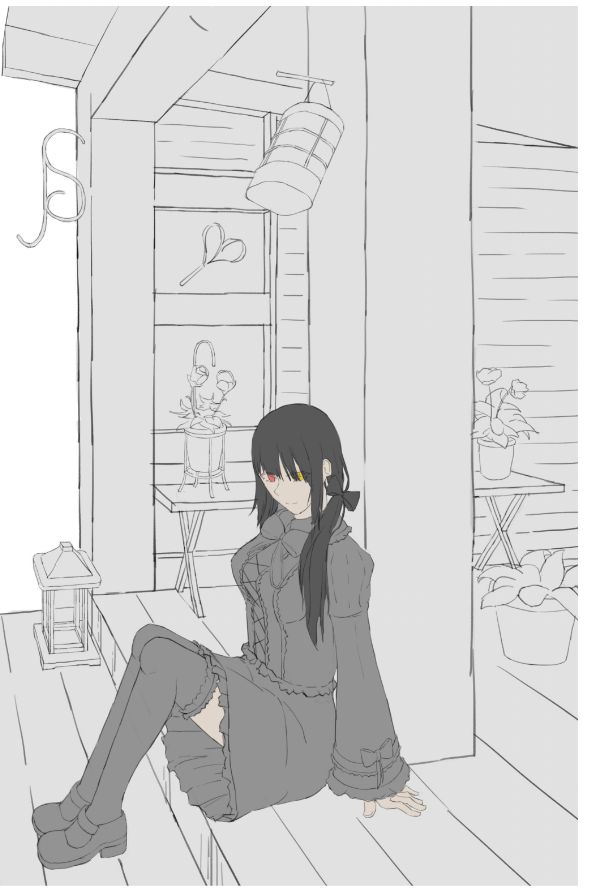
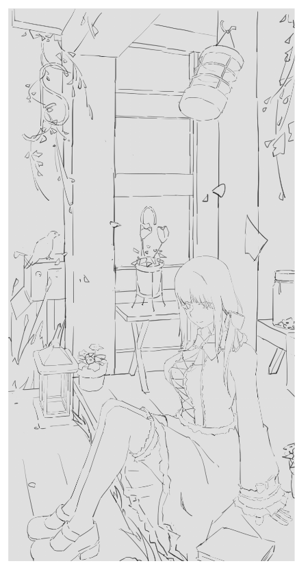
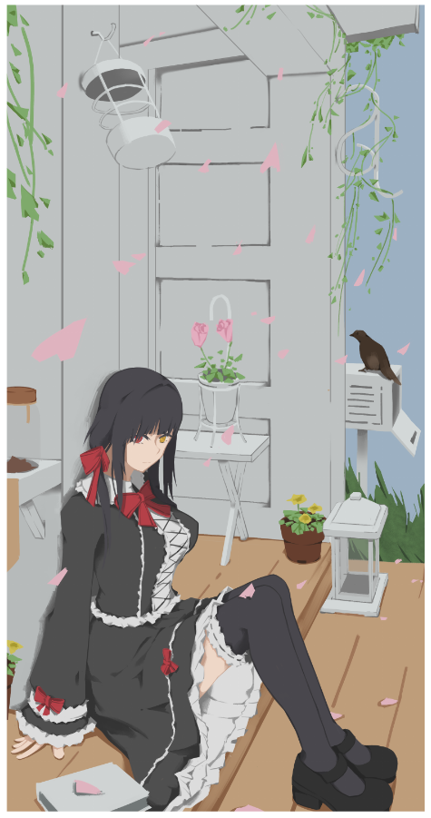
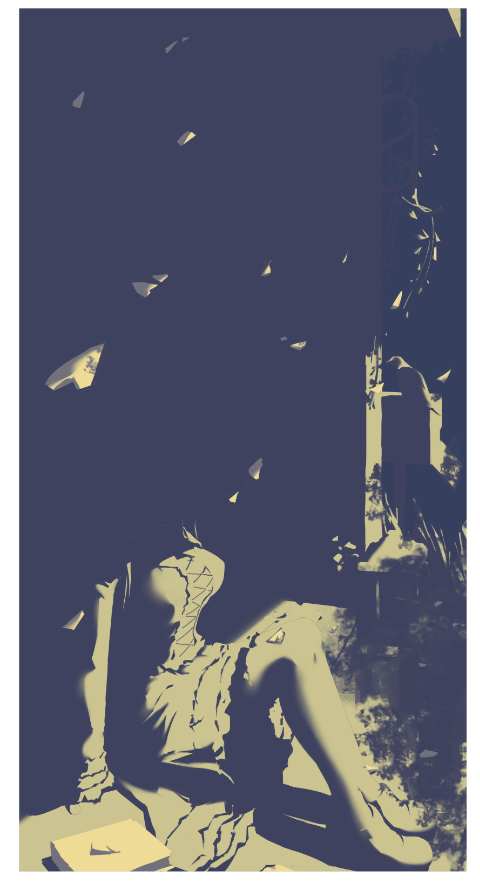
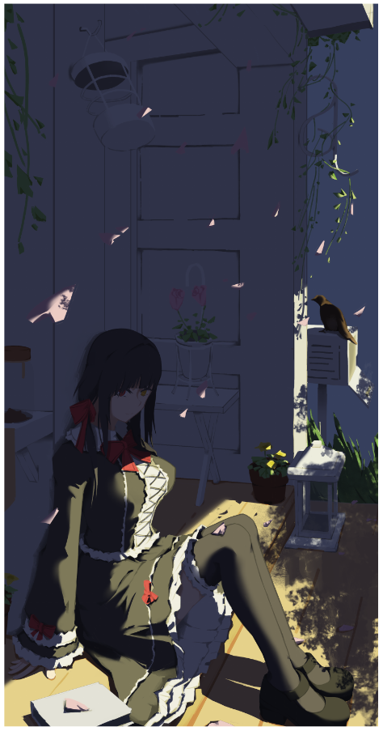
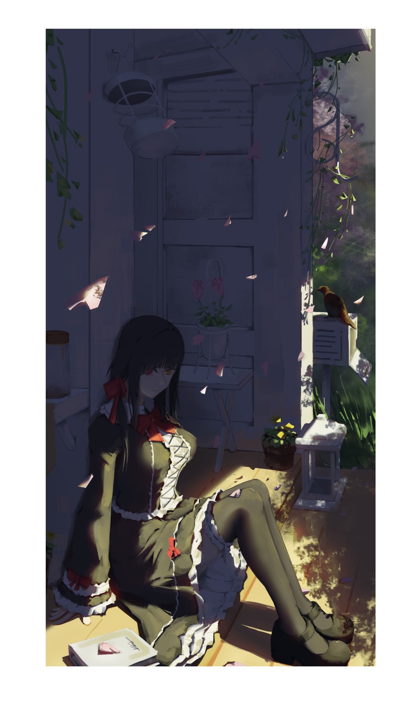

# [同人]狂三 日常服

> 2019-06-27 · 繪圖 · GP 7 · 來源 https://home.gamer.com.tw/artwork.php?sn=4440920

隨著大學畢業(應該)

也挑戰目前完成度最高的圖，

也算是4年來畫圖的一個總結吧，

這篇會有比較完整的過程，

文長注意!

  

首先，一開始整個場景配置是透視課的最後一次作業

有機會再談談當初的透視吧，

總之，就是找參考圖去畫，

這邊可以發現人有點方方的，

但這邊是刻意為之，在練習透視的時候會比較有體積感

  

這邊就是重把著個場景稍微重畫過，

因為之前的透視已經算抓的準了，

這邊比較多是在顧慮構圖的問題，

比方說由於透視消失點出現在畫面左邊，

很容易把視線集中到畫面邊緣，

所以加了一大堆葉子來想辦法把視線引導回來，

這部分沒有研究，所以可能做的不是很好。

  

接下來就鋪底色跟閉塞區，

包含整理一些形狀跟配色，

也把她水平翻轉一下，感覺比較好。

這邊原則上也是感覺感覺der，

主要想辦法把整個場景的對比壓得很小，

在狂三身上有比較高的對比，

讓視線比較能集中，

後面那隻鳥算是做一個平衡。

  

接下來就切明暗交接線，

這邊用了比較保守的切法，

因為臉不太會切，而且也想保留多一些暗部，

其實上一步就算是差不多完成惹，

因為畫面上還算豐富，

其實不會需要太多明暗來增加細節。

  

然後疊上去，沒什麼技巧，

只是有上面那步會比較清楚明暗配置，

但這邊可以發現畫面的固有色都幾乎都被吃掉惹，

這邊的控制還不是很好，

整個曝光是偏少的，

所以細節大部分展現在亮部，但亮部的光又把固有色吃掉。

  

最後有有試著把固有色推回來，

但感覺不太對，

所以就只有加透光、漫反射之類的小調子回來，

這邊其實做蠻快的，

就蝦G8亂塗，增加一些假細節就行，

最後還有稍微把眼睛最一些提神，讓視線可以跟狂三四目相交?

  

  

好了，大概就這樣，

大概是第一次真的把帶景的人物畫好，

花了超乎預期的時間，大約一個星期，

也發現一些問題要解決，

等把預計要出的圖都整理完再回去補吧，

包含那些要出的筆記和心得，

暑假再說吧~

  

以上!

  

  

$('article.c-text img').load(function () { // 表格內圖片大於表格寬時，設為 100% if ($(this).parents('table').length != 0) { if ($(this).width() >= $(this).parents('td').width()) { $(this).width('100%'); } else { $(this).width($(this).width() + 'px'); } } });
