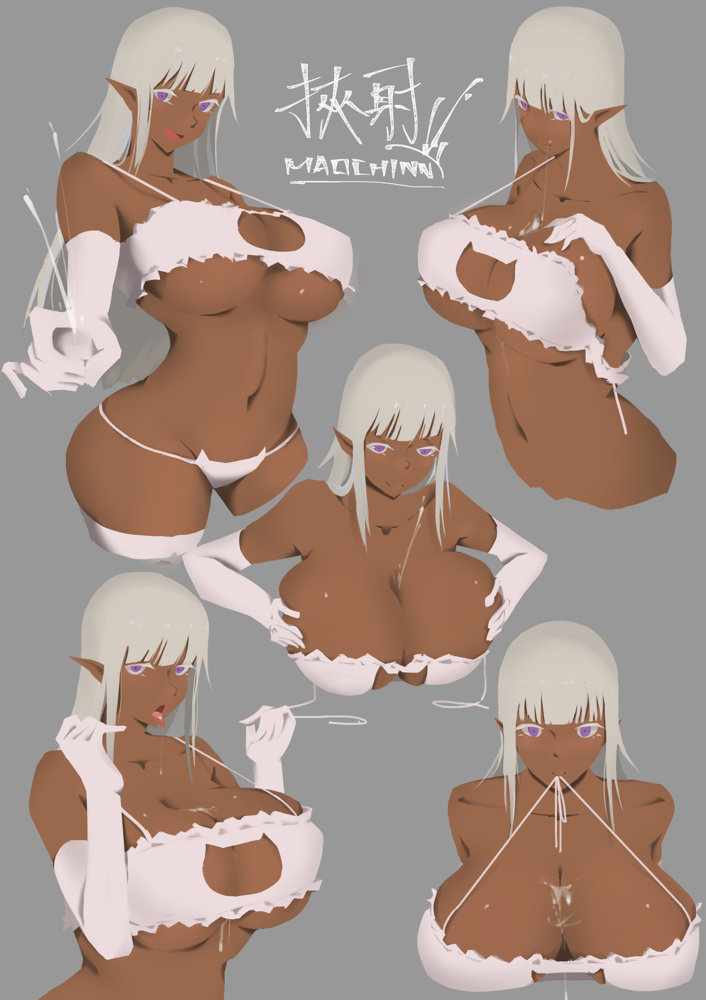
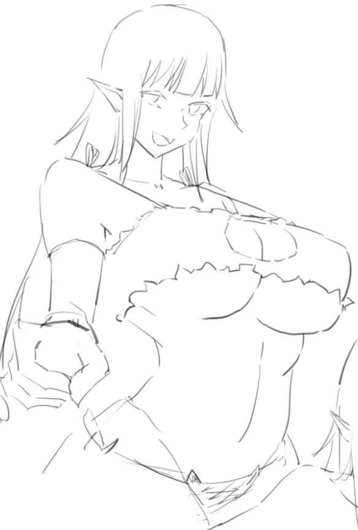
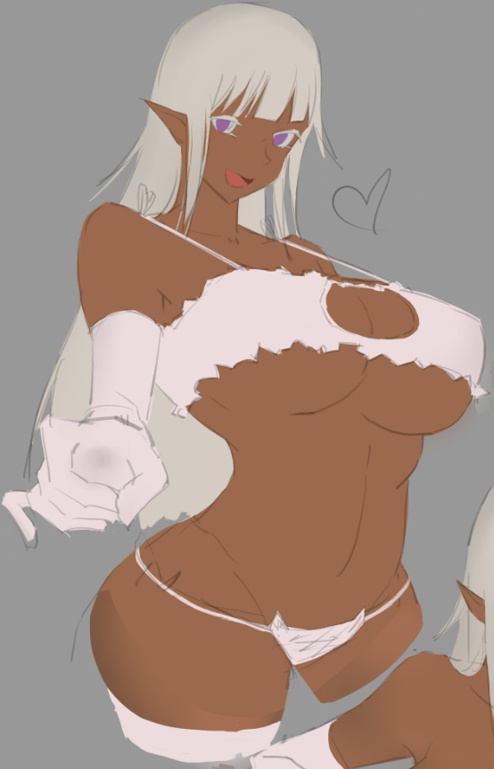
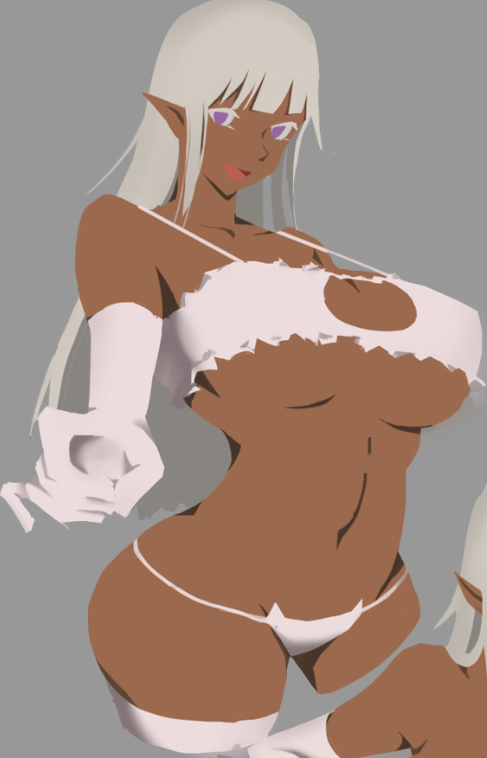
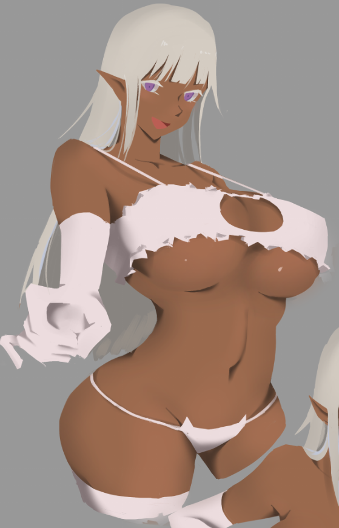

# [塗鴉]黑肉挾射

> 2019-07-11 · 繪圖 · GP 6 · 來源 https://home.gamer.com.tw/artwork.php?sn=4456652

R18注意?!

其實重點都沒露出來，

但還是警告一下

  

這幾張塗鴉主要是盡量簡化，

看能不能在可以用(?)的情況下加速畫圖速度

  

主要只用底色把輪廓做出來，

加閉塞、陰影、漸層亂噴，接下來補一些小筆，

主要原則就是只加必要的筆，

線搞也是盡量不加。

  

來看圖ㄅ

  

  

  

比較無聊的學術研究時間(嚴肅)

介紹一下流程順便紀錄

拿其中一隻來舉例吧

一開始還是有畫大致的線搞

但清楚就好，不用非常漂亮

這邊原則上就填底色，

但我這邊主要是要把輪廓確定，

因為後來沒有線稿，所以輪廓要清楚漂亮，

順便調配色，黑肉配白色，讚

  

這一步就比較主觀一些，

我沒有考慮太多的真實光影，

就是加上閉塞區跟陰影，

然後主觀的在加上一些黑色區域，把一些形狀逼出來，

並且我刻意地把閉塞區做小，

只要能夠暗示各個結構就夠了。

  

比方說胸下方的陰影，如果沒有畫會造成看不出胸的形狀，

這邊盡量畫少一方面也是想做出類似剪紙的風格

  

這邊因為我在畫的時候沒有存，

所有的黑色區域都是硬邊，像身體那樣，

這步還不用做漸層或是軟邊。

  

總之，這步做完其實就差不多惹(嗯?

這步就把硬邊依據對身體的理解做一些級邊的處理，

級邊以後在K大色彩筆記再說吧

反正就是把邊弄得軟一點，

然後拿噴槍亂噴，

只要做出一些結構的暗示和增加信息量(一些小的色彩變化)

  

最後再加一些小筆，

例如頭髮加一些髮絲，和胸的反光，

我有刻意用比較小的筆來畫。

  

剩下就是依照自己的喜好加東C

  

  

咳咳

其實之前的塗鴉有放過草圖惹

畫這個的源頭是某一天腦子裡都是這ㄍ巨乳黑肉妖精，

只好先把她畫起來，

這次就順便練練筆，

兩張大概花4天左右，

所以一隻巨乳黑肉大概一天以內可以搞定，

在控制自己的完成度的情況下，

看能不能更有效率的畫圖

最近在拿來實戰看看吧

  

$('article.c-text img').load(function () { // 表格內圖片大於表格寬時，設為 100% if ($(this).parents('table').length != 0) { if ($(this).width() >= $(this).parents('td').width()) { $(this).width('100%'); } else { $(this).width($(this).width() + 'px'); } } });
