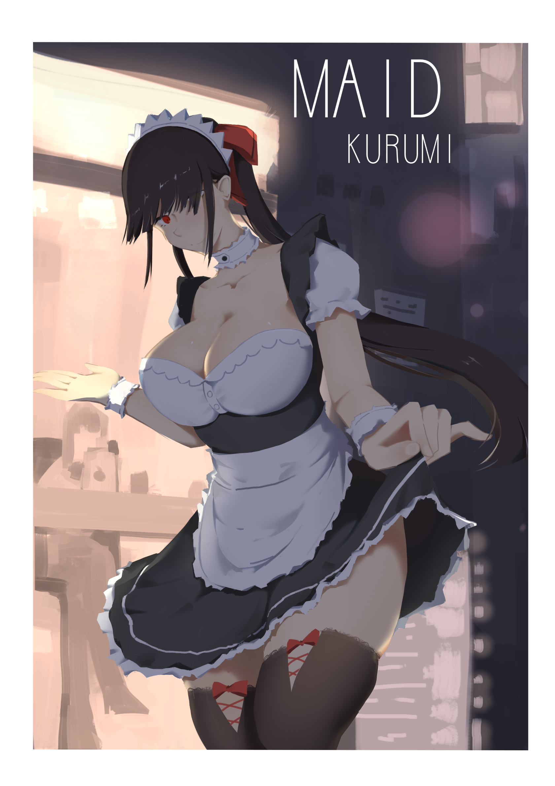
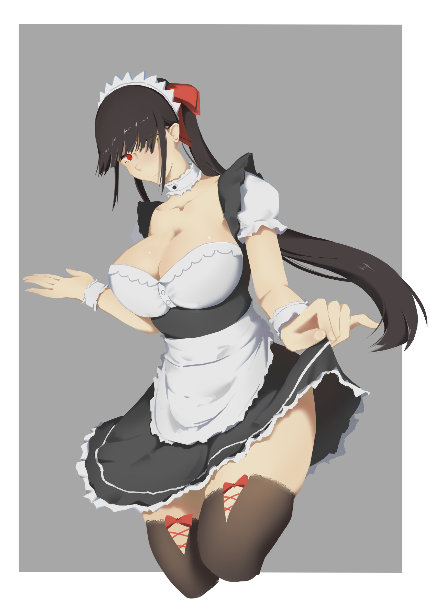

# [同人]狂三 女僕

> 2019-07-13 · 繪圖 · GP 11 · 來源 https://home.gamer.com.tw/artwork.php?sn=4459344

「晚上的特別服務。」

  

畫完覺得腿看起來最舒服，

但後來還是壓背景上去，

就比較沒有什麼凸顯出來惹。

  

看圖ㄅ

  

  

去背景

  

  

這張大概就花了一天，

把以前的舊圖(黑歷史)重畫過，

步驟就跟[上一篇](https://home.gamer.com.tw/creationDetail.php?sn=4456652)一樣。

  

其實一開始沒想要加背景、明暗交接線，

可是感覺整個太空，而且構圖怪怪的，

還有要強調的歐派被腿搶走，

所以還是壓了一層背景上去，

至少看起來穩定一些，

明暗交界線就是亂切的，背景大概只花十分鐘。

  

還有不要問我歐派為甚麼不太科學，

我還沒從巨乳中解脫，就這樣吧(\*ﾟ∀ﾟ\*)

$('article.c-text img').load(function () { // 表格內圖片大於表格寬時，設為 100% if ($(this).parents('table').length != 0) { if ($(this).width() >= $(this).parents('td').width()) { $(this).width('100%'); } else { $(this).width($(this).width() + 'px'); } } });
