# [筆記]K大色彩課四期-01-正負型

> 2019-08-10 · 筆記 · GP 18 · 來源 https://home.gamer.com.tw/artwork.php?sn=4490548

\--2021/10/30 更新

系列文章重新編排整理至[medium](https://medium.com/maochinn/筆記-k大色彩課四期-01-輪廓-72de1c62a9e4)

  

  

總算有時間來整理啦，

先聲明一下，我作的筆記很多自己的理解，

也會把K大上課的內容打散自己編排，

一來自己重新吸收過，

二來也保護K大的課程內容。

  

  

一、正負型(positive / negative shape)

第一個筆記先來談談正負型吧，

關於正負型的定義，

助教[這噗](https://www.plurk.com/p/lomthc)講得很好，

正型就是有意義東西的部分，

但其實我認為核心概念，或者說這個東西的應用，

應該是先把問題變得簡單。

甚麼意思呢?

如果你拿正負型去google(用英文去找，中文的都被K大作業佔據了)

你會發現都是這種

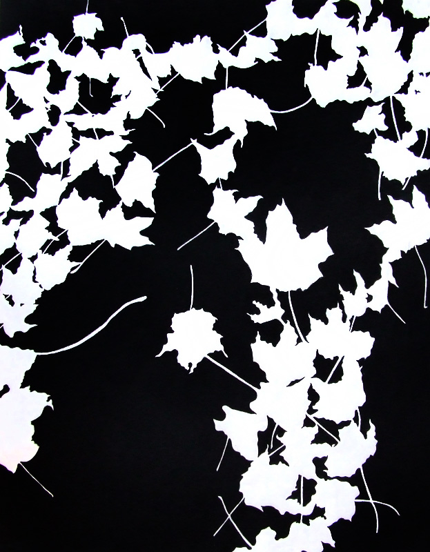

這種黑白二分的圖，

那這有什麼用呢，

你可以只用輪廓就有辦法辨識出來要表達出來的東西，

只利用這邊的色塊，以"面"的方式來畫圖。

為甚麼要強調這個東西，

因為如果沒有刻意的注意輪廓，

畫面常常會變得太碎或是無法表達出想要表達的東西。

  

這邊拿我蠻久以前的圖舉個例子

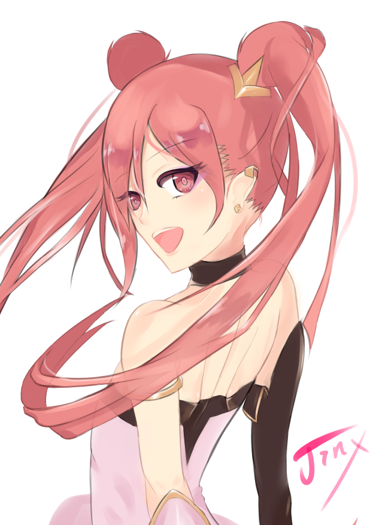

這邊請先忽略一些上色還是結構問題，

乍看之下輪廓還行，

但是直接調成黑白，

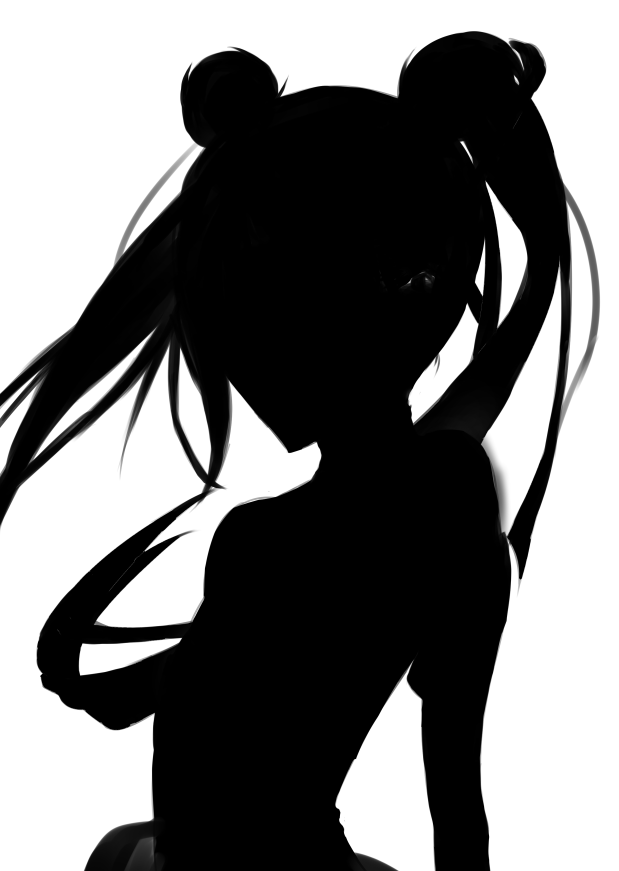

會發現輪廓蠻亂的，尤其是頭髮的地方，

也可以發現意比例上的問題，

這在原始狀況下，因為有很多細節而掩蓋住的問題都會出現，

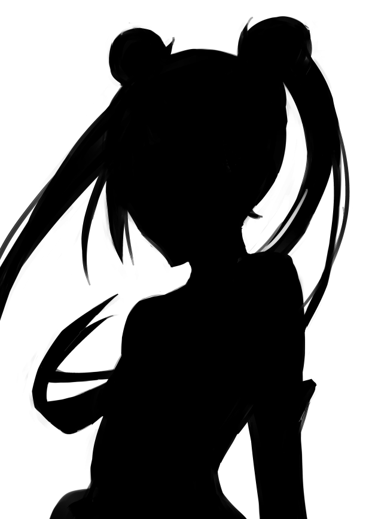

我在不改動太多的前提下，

直接去調整輪廓，把一些太碎的東西拿掉，

把整個輪廓變得比較整一些。

光是這樣其實就會好一些。

這邊要強調的是，在畫線稿或是填底色之類的階段，

應該要去注意輪廓，

要"主動"的控制輪廓，

原始圖就是我把想要畫的衣服(內容)畫上去，

然後"被動"的產生輪廓，

這其實也呼應到[透視課](https://home.gamer.com.tw/creationDetail.php?sn=4128242)講到的主被動畫圖。

  

而在把畫面二分成黑白後，

也可以發現一些可能沒注意到的問題，

例如結構和比例，

二分就是把畫面作最粗暴的簡化，

但也可以讓你只注意在輪廓而不會被細節所干擾。

  

其實上面的例子都是正負型二分，

分成有意義的部分跟抽象的部分，

例如把想要表達的物件(正型)用一個顏色，背景(負型)用另個顏色來二分，

用輪廓來把畫面切開。

  

  

二、負型

接下來要純講負型，也就是畫面中都用負型來表達，

大概有兩種方式，

1.以明暗交接線來把畫面切開

2.以閉塞來把畫面切開

其實就是利用光影來分割，但是分割出來後黑白都是負型。

  

舉個作業的例子

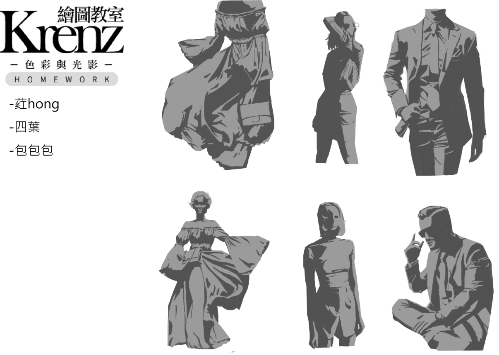

這些圖都是有照片的情況下去臨摹的，

其實這邊是分了三層，

背景(白)、物件(灰)、暗部(黑)，

也就是先把畫面分成白(負型)、灰黑(正型)，這樣就有輪廓，

但這邊注重在灰黑的部分，

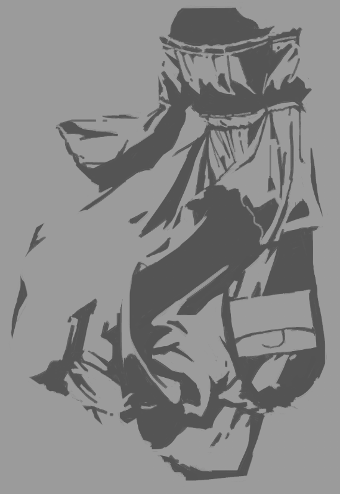

如果單看灰、黑，他們兩者都不具意義，

也就是如果也就是兩者都是負型，

但是合在一起就看得出要表達的東西，

包含物體的輪廓以及光影，

  

但這邊最難的就是內部的每個很碎的形狀(黑色的部分)該如何整理，

也就是整理、過濾形狀的功夫，

我自己的原則就是，

用最少的"形狀"來表現、暗示就好，

然後相近的部分直接整理在一起，

拿一個助教退件的來說明，

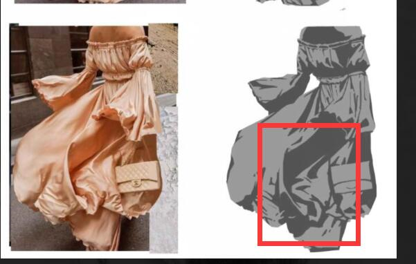

紅色框框內助教說太碎了，

但其實如果去看原圖，那邊的皺褶其實更加豐富，

但是這邊還是要"主動"的把自己認為暗的地方盡量畫成一大塊黑的，

而這邊要怎麼整理沒有標準答案，

換句話說，這邊就是畫家的品味，

通常來講，應該是要整理成"整而豐富"。

  

三、整而豐富

那甚麼是整而豐富呢?

整就是一大塊形狀，輪廓很簡單，

豐富就是比較碎的形狀，有比較多的起伏。

整作過頭就會無聊，

豐富作過頭就會邊碎，

所以要自己的品味來整理，每個人都不一樣。

  

但這邊可以注意一點是通常會讓一邊負型比較整、另一邊比較豐富。

  

這個概念如果用圖學來思考\[1\]也可以。

而整跟豐富講簡單一點就是你用筆的大小，

如果筆刷很大，那自然畫出來的就會整，

如果筆刷很小，那自然畫出來的會比較細小，比較碎。

  

那這邊在談談怎麼作豐富，

因為整應該還蠻好理解，

但是作豐富就有很多手段，

例如"點"、"線"、"面"，

這邊舉個例子，

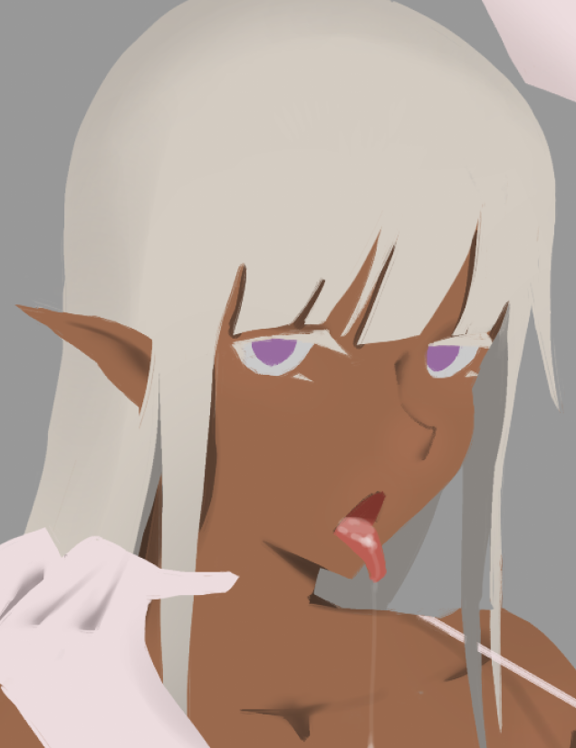

這邊可以發現我所有東西都是塊面，

只適用底色當作正型把東西分割開來，

但是輪廓相當的整，所以這邊我就用稍微小的筆作豐富，

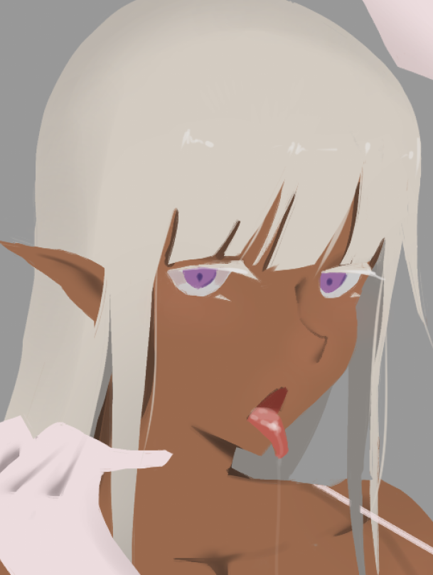

首先是點，

我用"點"的用筆來畫出高光和瞳孔。

然後是"線"，

就是那些髮絲，其實這個手法很久以前就知道，

只是以前不知道是這個原理，

所以如果畫的太過頭就會發現太碎，

也就是以前一開始畫髮絲會覺得效果很好，

所以一直狂加，最後反而會很醜，也是太"豐富"了。

最後是"面"，

其實那些陰影、閉塞就是了，

幾乎是平塗的方式去把結構表現出來，

所以如果畫的閉塞夠準，

其實不需要話很多漸層調子就可以表達出結構。

  

我這邊刻意畫的非常簡單，

幾乎沒有作任何塑造就是為了實驗，當然也是我塑造很爛...

  

四、完型理論、渠道

所謂完型理論就是這張圖

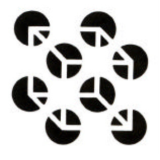

不需要把完整的輪廓都畫完，

部分區域不用畫也可以"暗示"出你想表達的內容。

  

這也就是透視課K大說不用把線畫的很長，

只需要整個趨勢有作出來，那腦子會自己補完。

拿我的透視課線稿放大來舉例，

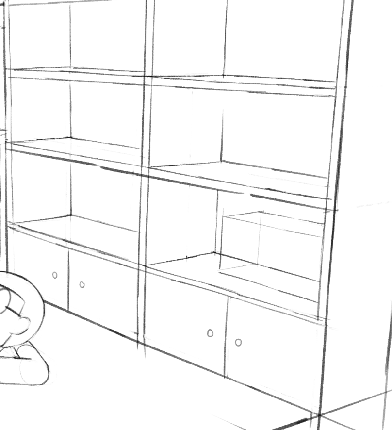

可以看到很多線我試畫成兩段的，

只是那時候我不敢中間留太多白。

  

那這東西有甚麼用?

除了偷懶另個目的就是作出渠道，

讓你的畫面比較"透氣"，

在兩個物件之間可以作的相對曖昧一些，

舉個例子，

請注意手掌的部分(不是奶子)

我並沒有把線稿畫完，把整個手掌跟後面區隔出來，

但是有足夠的暗示讓觀眾去補完。

  

至於渠道，我自己示沒有真的試過，

因為牽涉到設計視線的流動。

但是理論上，因為如果用封閉曲線來表達，

除了會強烈暗示那是兩個分開的物件，

也會阻擋視線的流動，

就會有不透氣的感覺。

  

最後，來總結一下，

正負型我認為主要目的就是將問題簡化，

我們只需要先關注在把型狀作的整而豐富，

利用這些型狀來表達、暗示出物件，

那這些型狀要怎麼整理、安排，

這就是每個畫家的品味。

  

這邊額外提一下，

在取負型的時候應該會遇到一個問題，

就是臨界值\[2\]要取到哪

  

那接下來呢，

就下一章再說吧，

這邊放個作業可以預告感受一下，

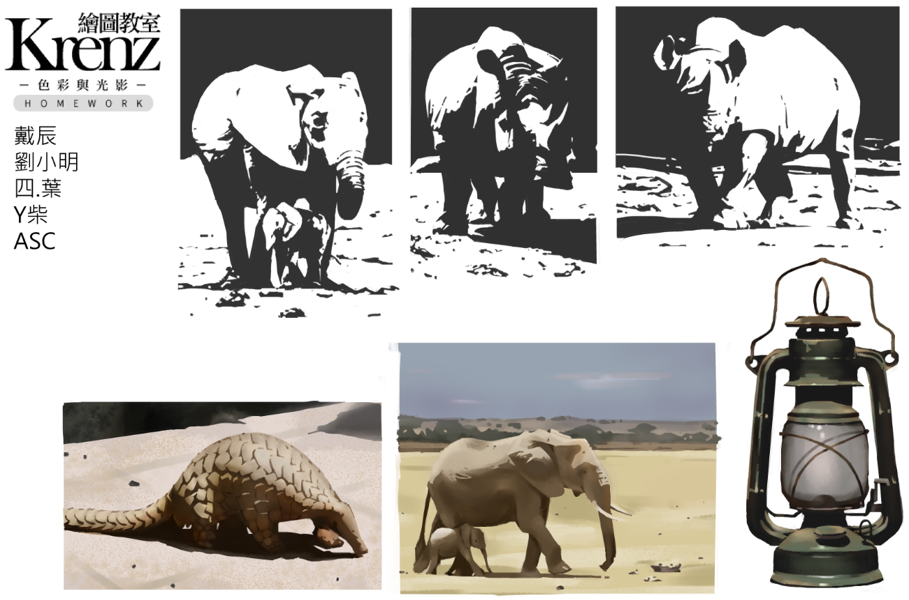

  

  

  

\[1\]

其實就是頻域的概念，

也就是[傅立葉變換](https://zh.wikipedia.org/wiki/傅里叶变换)，

如果你的形狀都很整，那你的圖就都是低頻，

相反，形狀都很豐富，那你的圖就會很高頻，

兩者都會讓整張圖過於"平均"，會讓觀眾不知道重點在哪裡。

但理想的情況應該是讓你的圖在重點處高頻，其餘低頻，

用這種對比來吸引觀眾的視線去看重點處。

用K大的話來說就是要有地方讓視覺集中、著陸。

  

\[2\]

二值化的域值，

可以參考[CSP操作](https://home.gamer.com.tw/creationDetail.php?sn=4483738)有提到

  

  

  

  

$('article.c-text img').load(function () { // 表格內圖片大於表格寬時，設為 100% if ($(this).parents('table').length != 0) { if ($(this).width() >= $(this).parents('td').width()) { $(this).width('100%'); } else { $(this).width($(this).width() + 'px'); } } });
