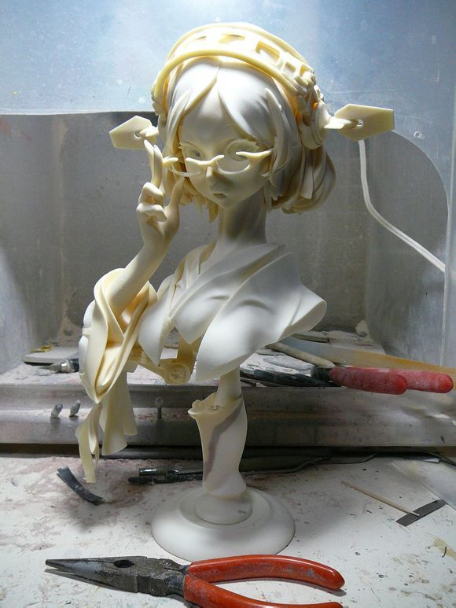
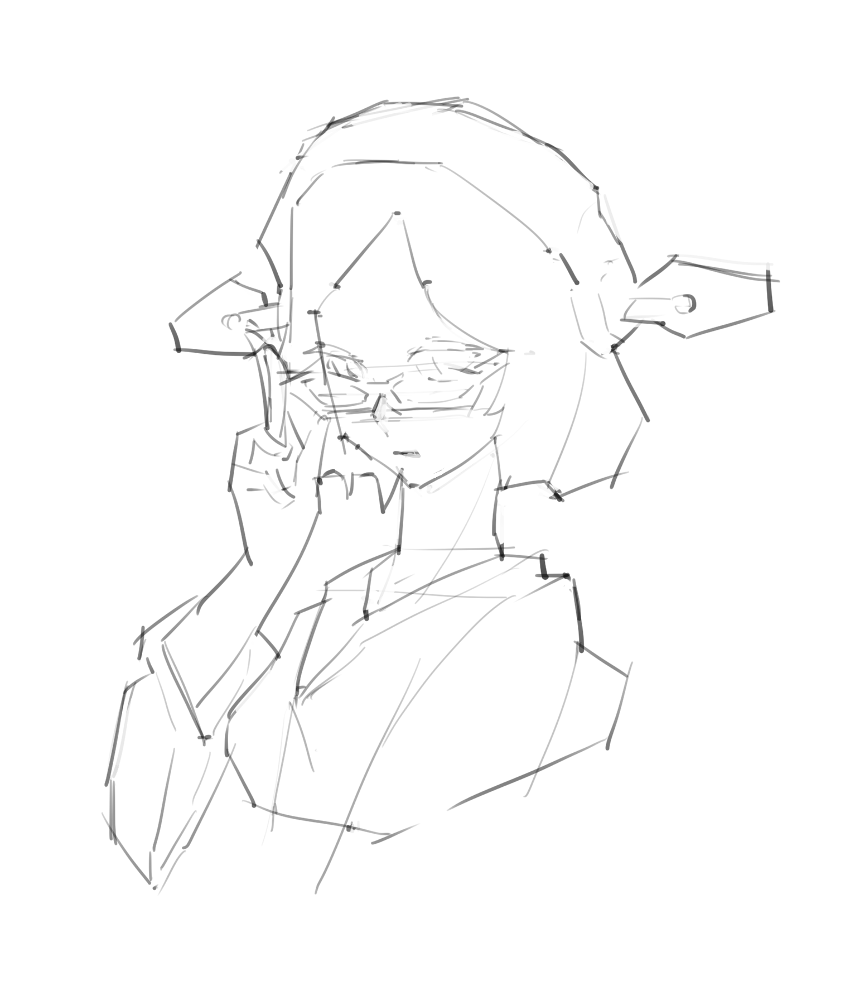
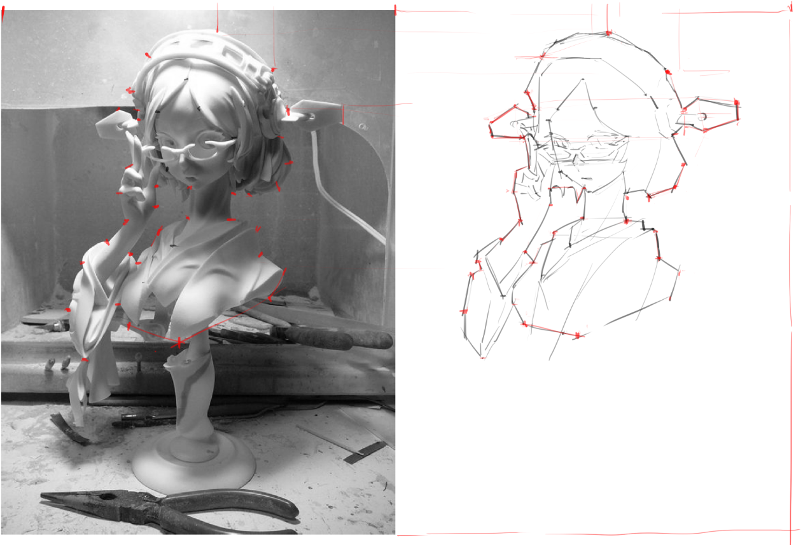
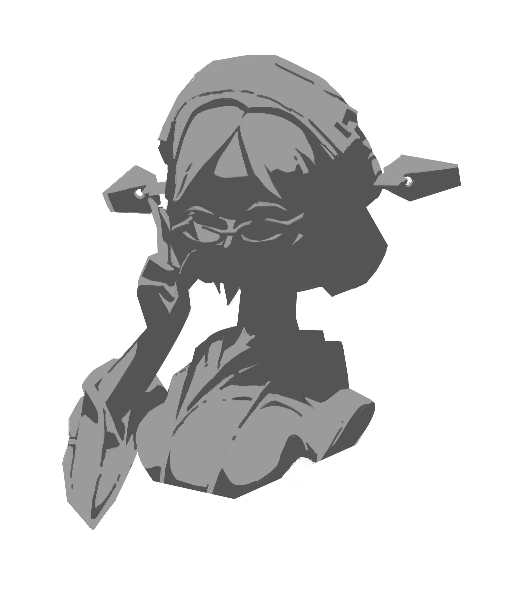
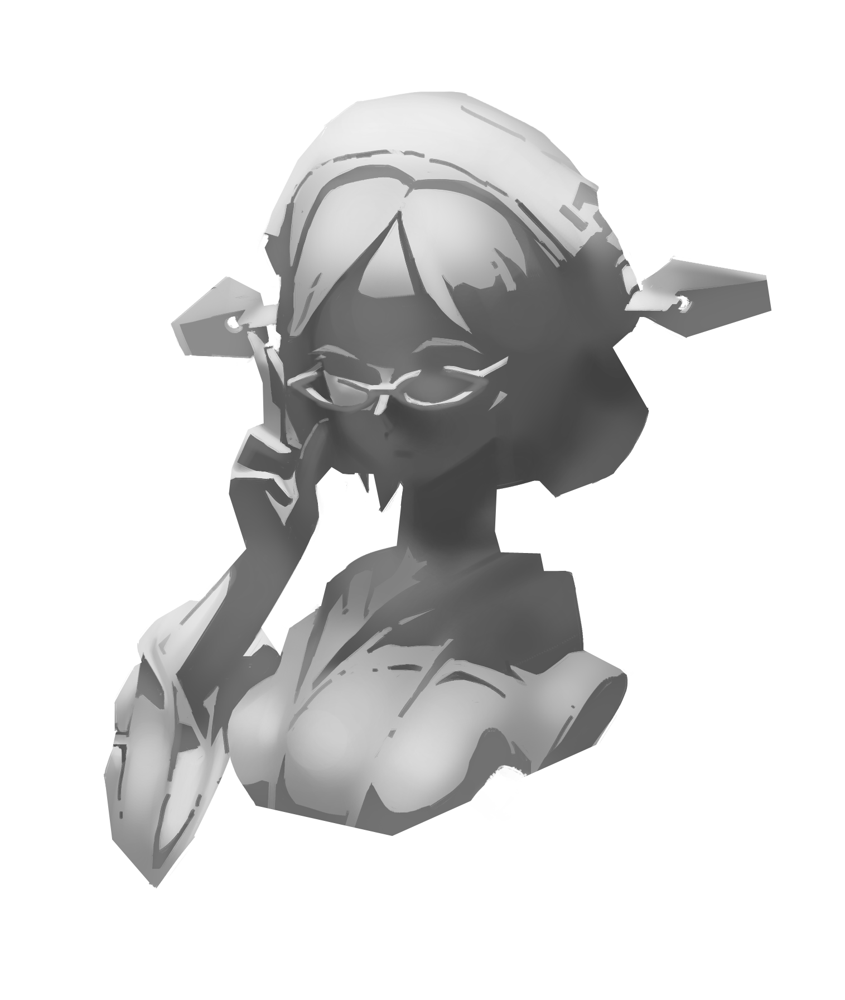
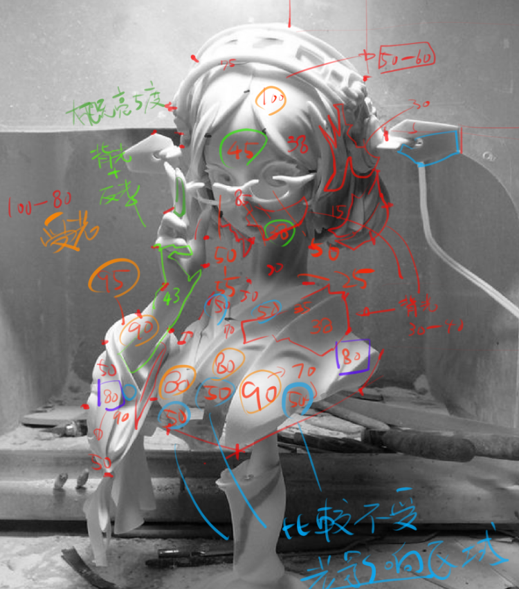
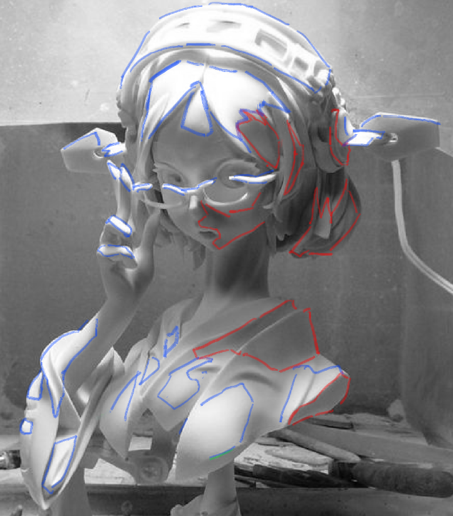
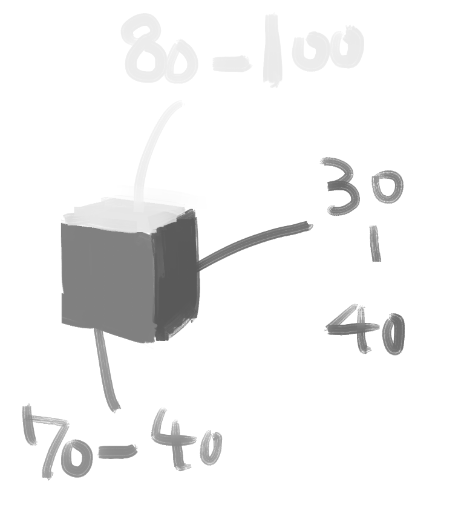
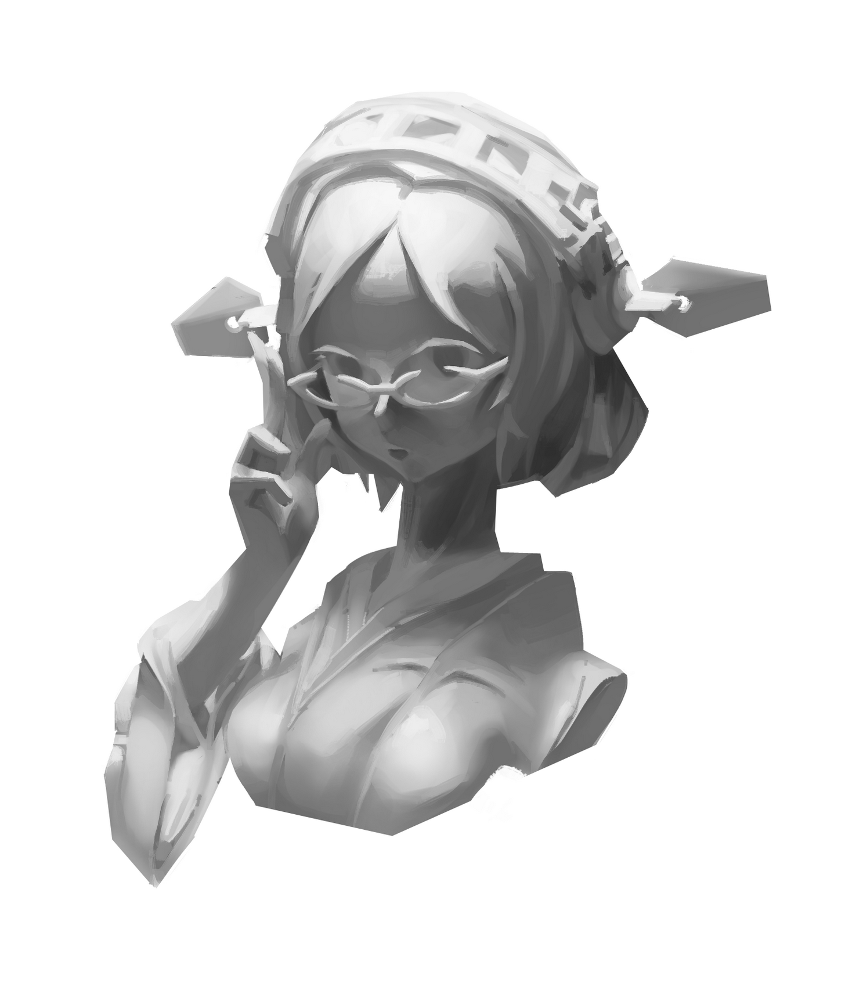
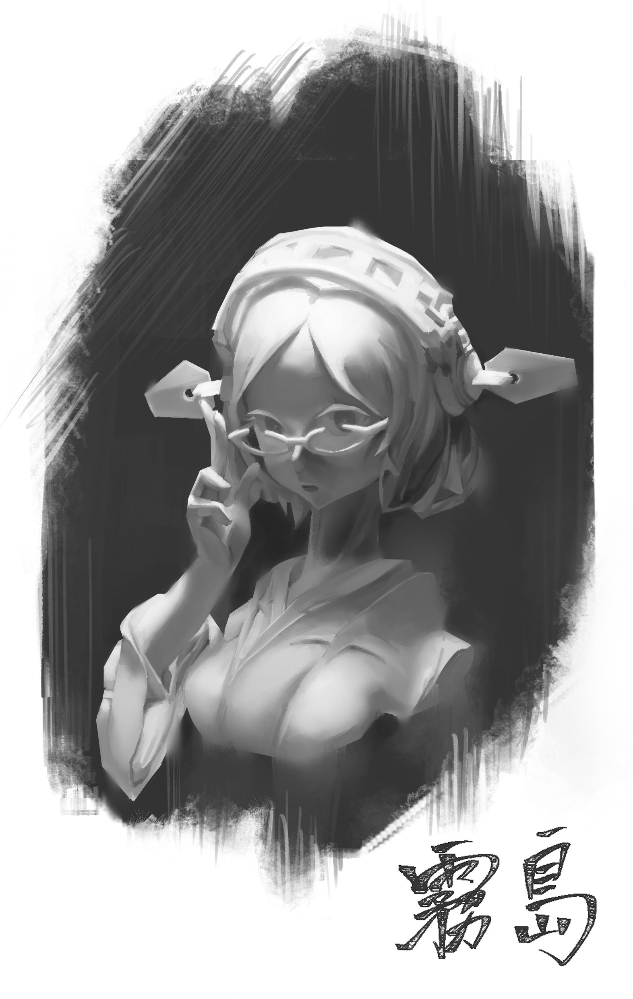

# [筆記]塑造練習

> 2019-08-17 · 筆記 · GP 14 · 來源 https://home.gamer.com.tw/artwork.php?sn=4498322

剛複習完塑造的課，

這邊先記錄一下過程。

  

  

  

首先是這次臨摹的原圖

感覺台灣價值滿滿!?

其實這個就是練石膏像，

只是美少女比較香ლ(・´ｪ\`・ლ)

  

先放個過程的圖

  

接下來我就照我的步驟來說明

  

1.抓型

這個步驟沒甚麼特別的，卻是很麻煩又花時間的，

但這個步驟一定要抓得盡量準，

因為這邊不準，後面的東西就很難畫了，

還有盡量要用直線去砍，因為曲線比較難抓的準，

這個步驟算是自己不太擅長的，

多虧助教們的訓練現在抓得比較快了。

  

我抓型的過程就像下圖，

我會去找一些"錨點"，只要點畫的對，那就連起來就好了，

過程是由外至內，也就是我先畫為紅色的在去切內部的線，

因為外框是對的，內部也會比較好抓。

那怎麼樣把"錨點"畫的準呢?

其實這就有各家流派了，就看個人比較習慣哪種。

  

2.負型

這個詳細就去看我的[筆記](https://home.gamer.com.tw/creationDetail.php?sn=4490548)吧

總之就是把負型作得好看就好且有足夠暗示。

  

3.大調子

把明暗兩部分的調子用噴槍(軟筆)稍微回推，

用噴槍目的是要讓整個區塊有一些微妙的調子變化。

  

在做這步以前我有稍微對原圖作一些研究，

大概會長這樣

(在美少女身上寫數字，想想就刺激)

咳咳

稍微整理一下

舉個例子，

我發現在紅色區塊的明度約在30~40

而藍色區塊的明度約在80~100

而紅色區塊剛好是處於有點背光的位置，

而藍色則是剛好受光的位置。

  

於是我大概感覺整體是這樣，

也就是

右側(背光)大概是30-40，

上側(受光)是80~100，

正側(環境光)是70~40，但大多在50左右，

影子、閉塞可能會到20左右。

  

值得注意是我有留一些明度的空間，

例如，原圖在頭頂的地方完全過曝，

明度都接近100，但我這邊刻意先不用到那麼亮，

不然現在畫到100就沒辦法在更亮了，

暗部也是，我不會畫到15左右那麼暗。

  

4.大塊面

因為上面都用噴槍，畫面會很糊，

所以這邊就用比較硬的筆去把大塊面切出來，

也稍微把一些結構作出來。

  

5.過渡

前面步驟都在明暗兩個部分各自推調子，

這一步就可以把兩邊交界的地方過渡在一起，

這邊就要作級邊的處理，

把每個明暗作出不同的邊緣處理。

  

6.卡閉塞(卡暗)

我把一些應該更暗的地方，

例如閉塞和陰影我這步就會把他們押到足夠暗的明度。

結果來看就是卡出暗的色塊，增加一些重量感。

  

7.明度調整

其實跟上一步一樣，

就是把亮的地方推回足夠亮的明度。

  

8.小調子

接下來就慢慢處理細節，

包含一些小塊面或是微妙明暗變化。

做到什麼程度就看個人吧。

  

9.渠道

在可辨識範圍下，把一些邊緣的地方"虛"掉，

跟背景作個結合，讓整個圖比較透氣，

其實這邊我不是很熟，

就當作是裝逼吧。

  

  

隔了一段時間沒在畫塑造，

發現還蠻好玩的，

以後有時間在練習吧。

  

以上!

  

$('article.c-text img').load(function () { // 表格內圖片大於表格寬時，設為 100% if ($(this).parents('table').length != 0) { if ($(this).width() >= $(this).parents('td').width()) { $(this).width('100%'); } else { $(this).width($(this).width() + 'px'); } } });
