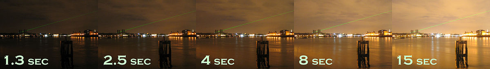
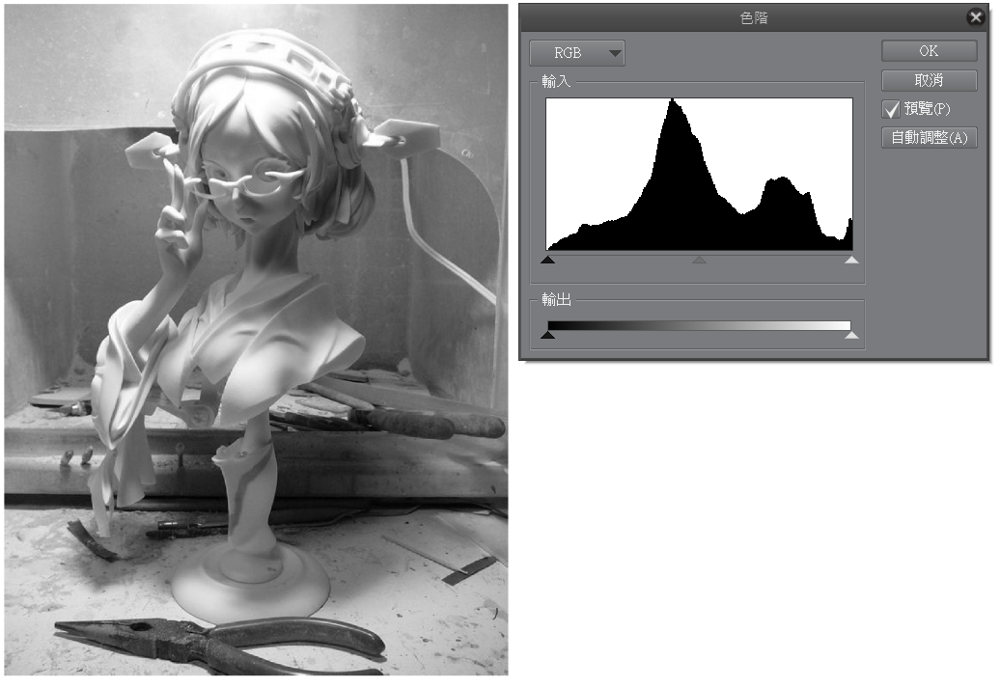
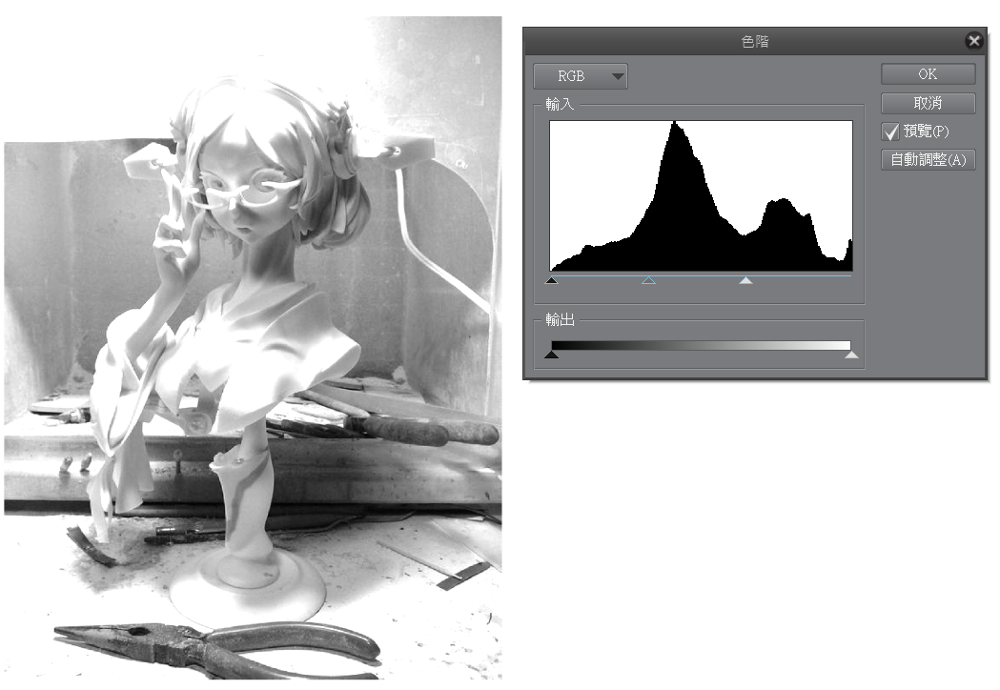
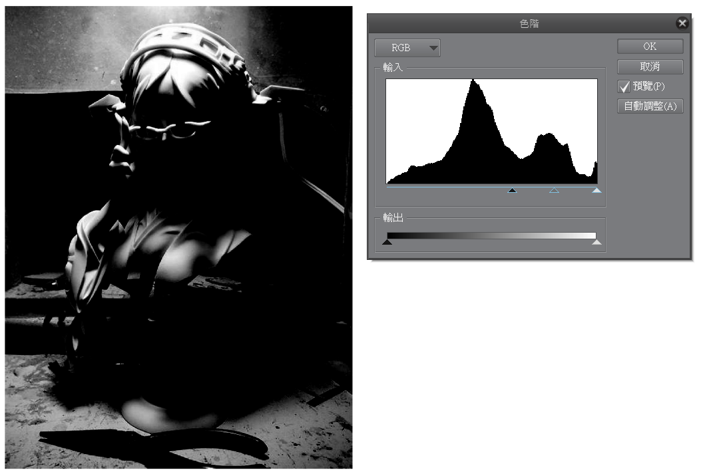
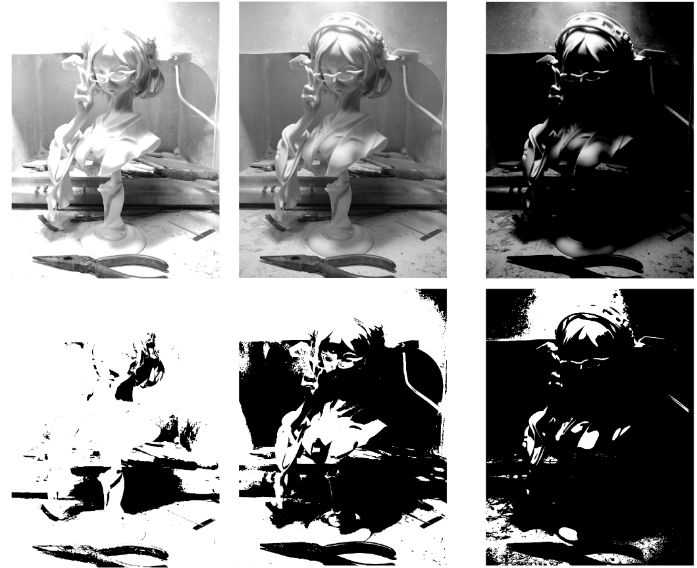
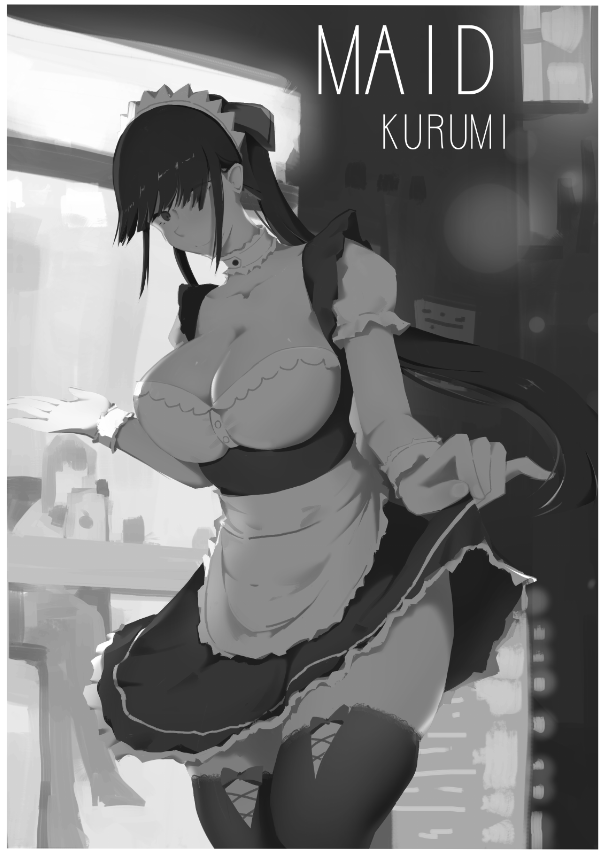
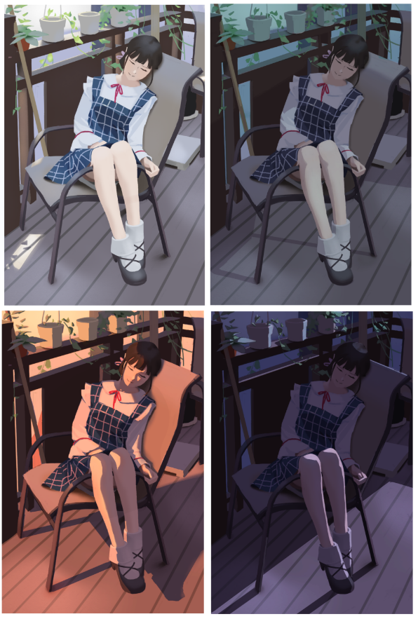

# [筆記]K大色彩課四期-02-曝光值

> 2019-08-24 · 筆記 · GP 7 · 來源 https://home.gamer.com.tw/artwork.php?sn=4506206

\--2021/10/30 更新

系列文章重新編排整理至[medium](https://medium.com/maochinn/筆記-k大色彩課四期-02-對比-197f32cfa62a)

  

先提一點

我這篇集中談的亮暗是指素描關係中的明度，

講白話一點就是灰階的時候的明度值。

所以下面大多數就以灰階圖來說明。

  

  

上一篇講到[正負型](https://home.gamer.com.tw/creationDetail.php?sn=4490548)，

其實是一種比較注重構圖、設計畫面的步驟，

可以透過整理明暗交界線來設計整張圖的大關係。

  

但也有遇到一個問題，

在二值化的時候要如何選擇閾值，

在影像處理上有一些選擇的方法\[1\]，

但在攝影上可以透過所謂曝光值來理解。

  

  

一、曝光值

先來講講什麼叫做曝光值吧，

在[維基](https://zh.wikipedia.org/wiki/曝光)有對這個圖有以下描述

利用快門來控制曝光的示範。

  

可以發現快門開啟時間越久，整個畫面就越亮，

因為光進到快門就越多，

但也可以發現，在燈光的部分，其實都是差不多亮的，

因為在1.3秒的時候，燈的明度就已經接近純白了。

所以就算快門進來多少，他最多就是純白，變化不大。

  

也可以用我們平常的經驗來舉例，

我們從很亮的環境進到很暗的房間，

一開始看都是黑黑的，因為眼睛現在曝光時間太短(最左的圖)，

但是眼睛會慢慢把曝光時間拉長，那就可以看到黑色部分的細節，

但相反，我們走到很亮的地方，

因為曝光眼睛現在時間太長，所以看到都是白的(最右的圖)，

但只要慢慢把曝光時間縮短，就可以看見白色部分的細節。

// 補充一下，眼睛的曝光其實比較像是光圈大小，但這邊先這樣解釋比較好理解

  

那麼以畫圖來說，

曝光值沒有絕對的"對錯"，而是適不是合你想表達的情境。

  

  

如果是在臨摹的話，

那在決定二值化的閾值的時候，

我們可以先決定要用甚麼曝光值，

可以看到右方的直方圖，

發現大部分的調子落在中灰調，這樣其實就很好了，

那如果曝光過度?

我把稍微亮的地方全部都讓他們接近純白。

反過來，曝光不足。

這三種曝光都是成立的，只是圖片的設計不太一樣，

但可以發現，明暗交界線的位置是類似的，

這是因為明暗交界線通常來自於直射光，

被照到的地方有顯著的亮，

但是中灰調的地方就很受曝光直影響，

  

如果以三張圖二值化的域值都取一樣(取中間值)的話，

可以發現負型的感覺不一樣，

而我相信大多數人應該會比較傾向畫中間那組，

因為他的明暗分割比較好看，

  

那這跟二值化的閾值是拿來幹嘛的呢?

你拿中間那張原圖去調閾值，

閾值越低，就越接近左邊(曝光過度)，

反之閾值越低，越接近右邊(曝光不足)，

目的是看怎麼樣的分割方式符合自己想要的構圖設計。

  

然後就是將明部跟暗部的調子推回，

深入作信息量。

這個部份我在[塑造練習](https://home.gamer.com.tw/creationDetail.php?sn=4498322)有作一個紀錄，

也可以發現我在作負型時的閾值有稍微調整，

但是非常接近中間那組的表現，

因為我臨摹的就是原圖曝光值的調子。

  

  

二、黑白面積分配

其實從上面來看，

我們可以發現，曝光過度常常隨之而來的是亮(白色)的面積很多，

相反，曝光不足時暗(黑色)的面積很多，

在構圖上，其實要主觀的控制黑白的面積比例，

這無關對錯，也是主觀設計上的決定。

  

如果像是上圖那種或是石膏像，

很多畫面上會呈現50:50的黑白面積比例，

(這邊的面積就是指畫布上的面積)

但這種比例會有點過於平均。

所以有時候會主觀的話成曝光過度或是曝光不足。

  

這邊K大分成兩種體系，

1\. 畫暗不畫亮(80-50)

2\. 畫亮不畫暗(50-20)

  

  

以畫暗不畫亮來說，

我把亮部明度壓在80左右，暗部明度壓在50左右，

這個時候亮部是很亮的接近曝光過度，

而暗部因為適用中灰調來表示，

有較強的顯色能力。

所以整體來講，亮部接近純白，看不太到細節，

而暗部在中灰色調，有很多微妙變化可以看。

  

舉例來說，

我把原本[這張圖](https://home.gamer.com.tw/creationDetail.php?sn=4459344)畫成黑白，

你可以發現在亮部(手掌)非常亮，

不太用去刻畫細節，

但在大部份的暗部，屬於中灰調(先不考慮固有色)，

也比較多的變化，也會更吸引視線，而且面積更多。

所以所謂的畫暗不畫亮，就是在暗部的部分多畫信息量，

而在亮部就可以不就不用刻劃，

因為亮部接近白色，也看不太出細節。

  

以此類推

畫亮不畫暗就是亮部在大約50度，而暗部在大約20度，

由於明度20很暗顯色能力相當差，所以也不太用刻劃，

而現在亮部則是中灰調，顯色能力較好，

信息量也就展現在這部分。

  

總的來說，

就是中灰調是表現信息量最有效的地方，

也是面積應該要比較多的地方，

意思是，假如用畫暗不畫亮，

那你的暗部面積應該整體上要多於亮部，

否則你的信息量都展現在比較少的(亮部)面積，

你的畫面可能信息量就會不夠。

  

這邊在提另一個常見問題，

畫面過焦，

我的理解就是80-20，

也就是你的亮部在80很白，暗部在20很黑，

中間色調很少，整個畫面對比很強，很像烤焦的麵包，

而且可能造成看不出固有色。

  

舉例來說，

我很久以前的作品，

那個時候玩圖層效果玩的過頭，

只是覺得要做很多對比，

但是其實會發現整個畫面過焦。

在舉一個近期的作品，

以牆壁來說，

明度有到90，但是暗部卻到20，

這樣造成觀眾不太確定牆壁是什麼顏色，

在亮部因為光色太強，無論牆壁是什麼顏色都被光色蓋過，

在暗部又因為壓得太暗，無論什麼顏色都被環境壓過去。

也就是固有色會消失。

但是為甚麼這張圖還可以看呢，

我想大概是因為衣服在亮部剛好是中灰調，有比較多細節。

當然也有可能是狂三太美(\*ﾟ∀ﾟ\*)

  

咳咳

  

  

總結一下，

無論怎麼樣分配黑白面積的比例，

目的是要作出好看的分割，最好是要作出足以辨識物件的分割，

無論是用明暗交界線或是閉塞，

然後要注意中灰調的面積不能太少，

至少要能辨認出固有色，

也才能給出足夠的信息量觀眾看。

  

這篇好像沒有甚麼相關作業可以放，

就放這4個小姐姐吧。

在幾乎不做那種塑造的情況下，

利用明暗交界線和色塊來設計構圖，

且要兼顧固有色的展現。

  

下一篇來講信息量吧!

  

  

\[1\]閾值

在影像處理通常就叫threshold，

而覺得他的方式舉例來講大致分兩種，

一個是人工決定，一個是自適應(也就是跟圖相關)

前者例如:Naïve Threshold Algorithm

後者例如:Brightness Preserving Algorithm

$('article.c-text img').load(function () { // 表格內圖片大於表格寬時，設為 100% if ($(this).parents('table').length != 0) { if ($(this).width() >= $(this).parents('td').width()) { $(this).width('100%'); } else { $(this).width($(this).width() + 'px'); } } });
