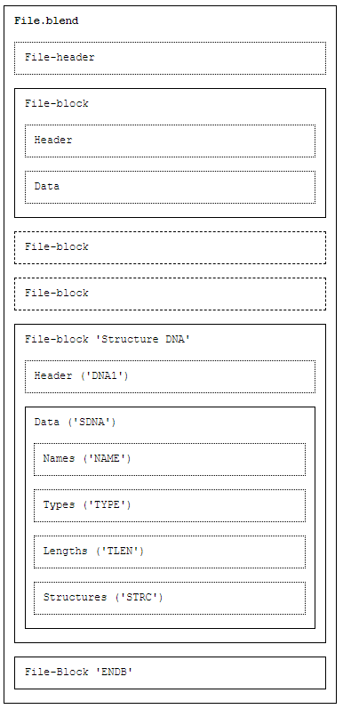
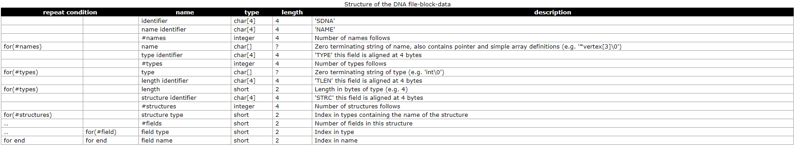
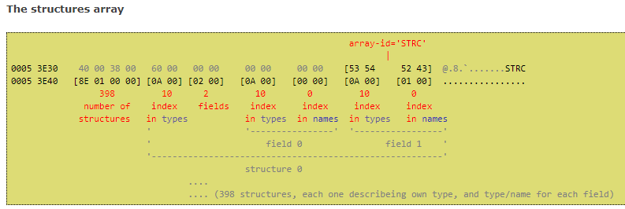
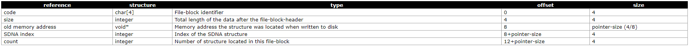
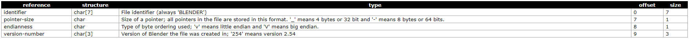

# [Blender].blend format

> 2019-10-26 · Blender · GP 3 · 來源 https://home.gamer.com.tw/artwork.php?sn=4572519

本文已搬運、更新到[medium](https://medium.com/maochinn/blender-blend-format-74a8515473c0)

  

因為研究需求要來看看blender的底層怎麼跑的

還在track blender的C code。

  

因為要先瞭解內部的資料結構，

所以要先來搞懂parser的部分，

也就近一步要來了解.blend的檔案格式。

  

強烈建議要看這個[The mystery of the blend](https://github.com/fschutt/mystery-of-the-blend-backup)

他有大概解釋2.48版之後整個檔案的格式。

  

這邊先打個預防針，以下蠻多都是自己的解釋，

有一件歡迎交流糾正(霸脫

  

首先，先講講blender的大致結構吧，

也就是分為python跟C/C++兩部分，

C/C++(大多為C)，原則上就是整個blender的主體，

因為圖學的東西非常重視速度，所以也就大量採用C來運算。

但blender在C上又加了個python來當作介面，

把一些彈性的部分封裝起來，也方便大家在一定的架構之下網上寫一些插件(addon)。

  

所以原則上普通的使用者其實可以連python是什麼都不知道也沒關係。

但近一步想要在blender上開發一些功能的就可以利用他們規範好的方式來開發。

但若想要在更進一步使用blender那就勢必得碰到更底層的C了。

  

但是一打開他開源的專案會根本不知道要看什麼，

因為裡面包含大量的struct，也因為是C，所以也沒什麼class，

所以這篇就關注在讀檔的parser來解釋。

  

\--

  

首先要知道，

整個blender採取一種DNA/RNA的系統\[1\]

每個DNA都存在於每個.blend，這些DNA會定義一些struct，

比方說，如果有一個mesh的struct

他裡面會有多少變數，

而每個變數它的名稱是什麼它的型態是什麼，

這些資料結構會在每個檔案的DNA中儲存，

而RNA是在2.5版之後的增加的，

它的用處就是作為DNA跟python api之間的橋樑(messenger)，這個詳細我也不是很懂。

  

我們來具體看看.blend，

但這邊要注意的是，由於.blend是binary的，

因為為了讀寫的方便以及速度，blender會直接把memory的東西dump到檔案，

所以直接打開.blend只會看到一堆亂碼。

  

所以從上面提到的[The mystery of the blend](https://github.com/fschutt/mystery-of-the-blend-backup)來看

這邊可以發現，實際在.blend中是以data-block的方式儲存的，

每一個block都有一個header和data，

而DNA也是儲存在一個block之中，

也就是下面的'structure DNA'，

他的header名稱固定為DNA1，

而data則主要存有四個陣列(Names, Types, Length, Structures)

而實際上這個data中有以下的東西，

可以注意到分別對應是左手邊有寫for的那四個陣列，

Names: names，表示這個DNA所有用到的變數名稱，e.g. "Vertex\[3\]/0"

Types:   types，表示所有用到的型態名稱，e.g."float/0"

Length: types\_size，表示所有用到的型態的大小，這個陣列跟types是一一對應的，所以長度一樣

Structures: structs，表示所有用到的struct的資訊

  

舉例來說，今天如果在有一個struct長這樣:

typedef struct Mao\_struct{

> int x;
> 
> float y;
> 
> Mao\_struct\* ptr;

}Mao\_struct;

  

names裡面就會包含"x/0", "y/0", "\*ptr/0"

types裡面就會包含"int/0", "float/0", "Mao\_struct/0"

types\_size裡面則對應上面四個型態的大小

structs則是長這樣

依據上面的格式來看，

應該會有一組前兩個byte指向types中的 "Mao\_struct/0"，表示這個struct叫做Mao\_struct

然後後面兩個byte則是3，表示這個struct有3個變數(fields)，

然後接著三個fields就是前兩個byte指向types的某個type，後兩個指向names的某個name

  

那接下來回頭看看這個DNA parser到C裡面是怎麼存的，

在DNA\_sdna\_types.h可以找到DNA的資料結構(節錄部分)

  

typedef struct SDNA {

...

  

>   /\*\* Total number of struct members. \*/
> 
>   int names\_len, names\_len\_alloc;
> 
>   /\*\* Struct member names. \*/
> 
>   const char \*\*names;
> 
>   /\*\* Result of #DNA\_elem\_array\_size (aligned with #names). \*/
> 
>   short \*names\_array\_len;
> 
>   
> 
>   /\*\* Size of a pointer in bytes. \*/
> 
>   int pointer\_size;
> 
>   
> 
>   /\*\* Type names. \*/
> 
>   const char \*\*types;
> 
>   /\*\* Number of basic types + struct types. \*/
> 
>   int types\_len;
> 
>   
> 
>   /\*\* Type lengths. \*/
> 
>   short \*types\_size;
> 
>   
> 
>   /\*\*
> 
>    \* sp = structs\[a\] is the address of a struct definition
> 
>    \* sp\[0\] is struct type number, sp\[1\] amount of members
> 
>    \*
> 
>    \* (sp\[2\], sp\[3\]), (sp\[4\], sp\[5\]), .. are the member
> 
>    \* type and name numbers respectively.
> 
>    \*/
> 
>   short \*\*structs;
> 
>   /\*\* Number of struct types. \*/
> 
>   int structs\_len;

  

...

} SDNA;

  

這邊可以發現他是怎麼存的。

  

\--

  

那麼接下來我們回來看看每個block，

主要有兩個部分，一個是Header跟Data，

他們是連續的擺放，也就是Header之後就接著Data

根據格式來看，

code: 表示這個block裡面是存甚麼東西，例如前面提到的DNA的header裡面的code就是"DNA1"。

size: 整個Data的大小

old memory address: 這個要解釋一下，因為前面有提到，memory的資訊是直接dump到disk，所以檔案這邊會記錄原始的memory位址

SDNA index: 因為每個data都會是一個struct，他會在DNA裡面定義(就像上面寫的那樣)，所以這邊的index就會指到structs裡面某個struct

count: 只Data中有幾個struct

  

那我們一樣在DNA\_sdna\_types.h可以找到

typedef struct BHead {

>   int code, len;
> 
>   const void \*old;
> 
>   int SDNAnr, nr;

} BHead;

  

這邊就對應到上面寫的那5個

到這裡也可以發現，這些東西因為都是用struct存，他們的變數都是緊密排列的，

所以可以直接把資料整塊丟到一個指標上。

也是因為這樣整塊讀寫，所以速度很快。

  

那這邊的code就很重要了，他是辨別這個block存的東西是什麼，

舉例來說前面提到的DNA，他的block的code就是'DNA1'，

這邊可能會有點疑問，就是他是用int來存，

這邊可以看看blender裡面是怎麼做的

  

enum{

> DATA = BLEND\_MAKE\_ID('D', 'A', 'T', 'A'),
> 
> GLOB = BLEND\_MAKE\_ID('G', 'L', 'O', 'B'),
> 
> DNA1 = BLEND\_MAKE\_ID('D', 'N', 'A', '1'),

...

};

而這邊的BLEND\_MAKE\_ID是

#define BLEND\_MAKE\_ID(a, b, c, d) ((int)(d) << 24 | (int)(c) << 16 | (b) << 8 | (a))

也就是他把四個字元存在一個int裡面，

舉例來說，這個"DNA1"在編碼後是826363460

轉乘十六進位是31414E44

也就對應ASCII的4個字元'1' 'A' 'N' 'D'

  

這邊只要知道code是存這個用來辨識的東西就好。

  

那這邊也可以發現有其他的code，例如DATA跟GLOB等，

這些都是指一些基本系統上必須的block

還有其他額外定義的一些struct，在blender可以找到

  

typedef enum ID\_Type {

>   ID\_SCE = MAKE\_ID2('S', 'C'), /\* Scene \*/
> 
>   ID\_LI = MAKE\_ID2('L', 'I'),  /\* Library \*/
> 
>   ID\_OB = MAKE\_ID2('O', 'B'),  /\* Object \*/
> 
>   ID\_ME = MAKE\_ID2('M', 'E'),  /\* Mesh \*/

...

}

  

#  define MAKE\_ID2(c, d) ((d) << 8 | (c))

這種編碼方式跟上面是一致的，但是指有兩碼，

但都存在bhead->code中

  

舉例來說

裡面有個場景(Scene)的struct被DNA定義，然後也有在其他block被指定，

那麼那個block的code就是"SC"，也就是16975

  

那位甚麼要用這種編碼方式呢?

因為其實這個code的字串他在memory中其實就是長那樣

當然，這邊還有位元組順序的問題\[2\]

所以在整個檔案的File Header也有定義

第三項就是定義他的順序。

  

這邊這個格式還蠻好理解的，

舉個例子:

你直接打開.blend，就算大多數是亂碼，

開頭也有類似這樣的字串:

BLENDER\_v254，

表示這整個檔案的pointer是4, 32bit的，

然後是little endian的(就像我們上面的例子)，最後是2.54版本的。

  

\--

  

這邊大概解釋了.blend的檔案格式，

也有一些C code的對應，算是一個起頭，

其他進一步的就等我比較確定在記錄吧。

以上!

  

\--

reference

\[1\][DNA/RNA](https://www.blendernation.com/2008/12/01/blender-dna-rna-and-backward-compatibility/)

\[2\][big-endian, little-endian](https://zh.wikipedia.org/wiki/字节序)

這原則上是根據memory或是機器的差異

$('article.c-text img').load(function () { // 表格內圖片大於表格寬時，設為 100% if ($(this).parents('table').length != 0) { if ($(this).width() >= $(this).parents('td').width()) { $(this).width('100%'); } else { $(this).width($(this).width() + 'px'); } } });
