# [塗鴉&練習]合集(2)

> 2019-12-28 · 繪圖 · GP 2 · 來源 https://home.gamer.com.tw/artwork.php?sn=4635463

下半年都沒甚麼在畫圖

研究生真的好忙阿....

  

  

這邊就統整一下下半年的塗鴉跟練習吧

  

  

塗鴉:

這個應該會畫完

應該吧

  

找了四個參考圖去畫禮服狂三

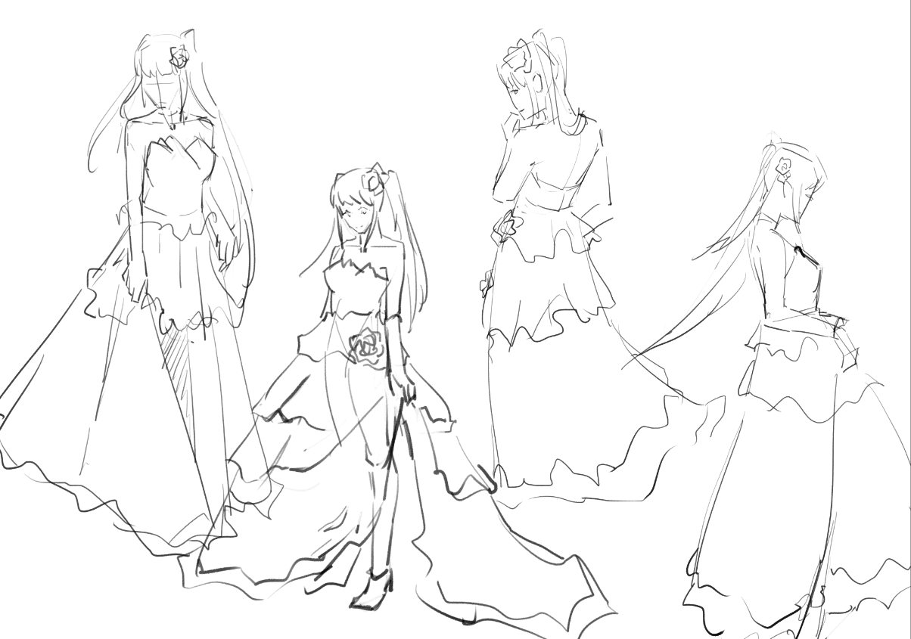

這邊還沒決定畫哪張，

1~4幫我投個票吧(我也不知道甚麼時候截止

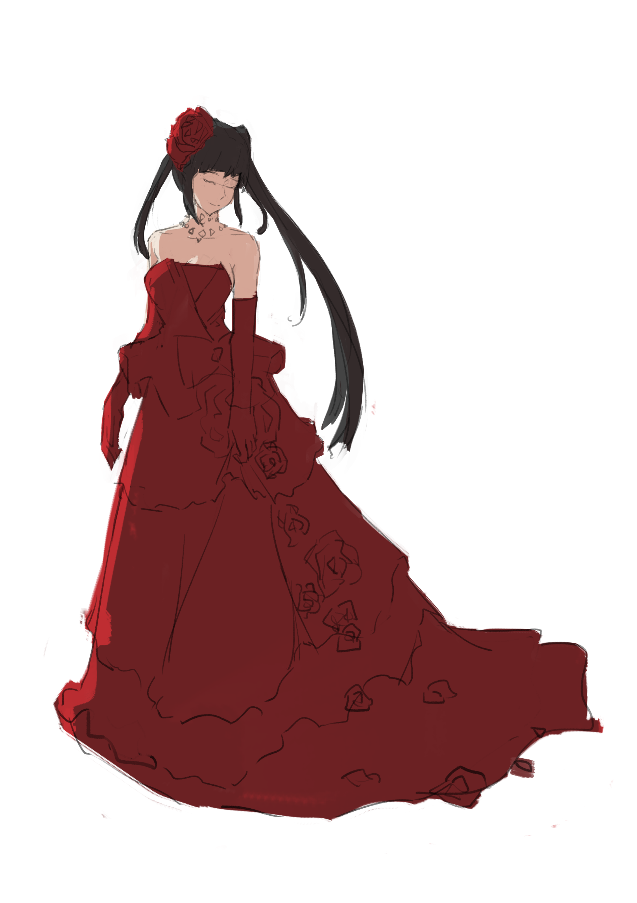

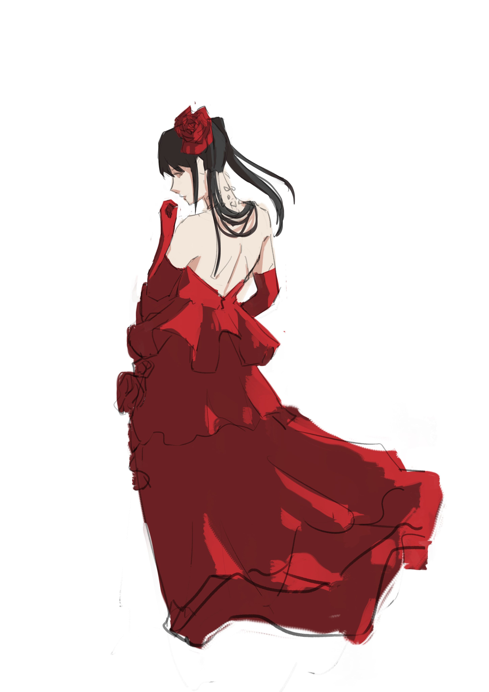

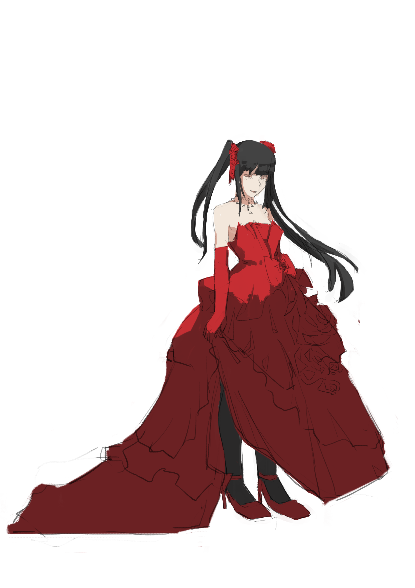

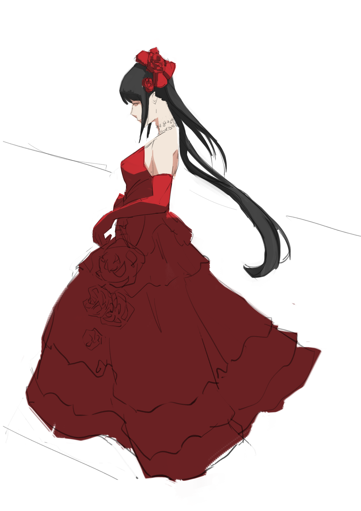

(我全都要!

  

練習:

塑造

這是接在[塑造練習](https://home.gamer.com.tw/creationDetail.php?sn=4498322)之後的那篇

想要減少參數儘量像原本霧島那張圖

但上完負型就不知道怎麼辦惹，

看U沒U大大要來紅筆一下

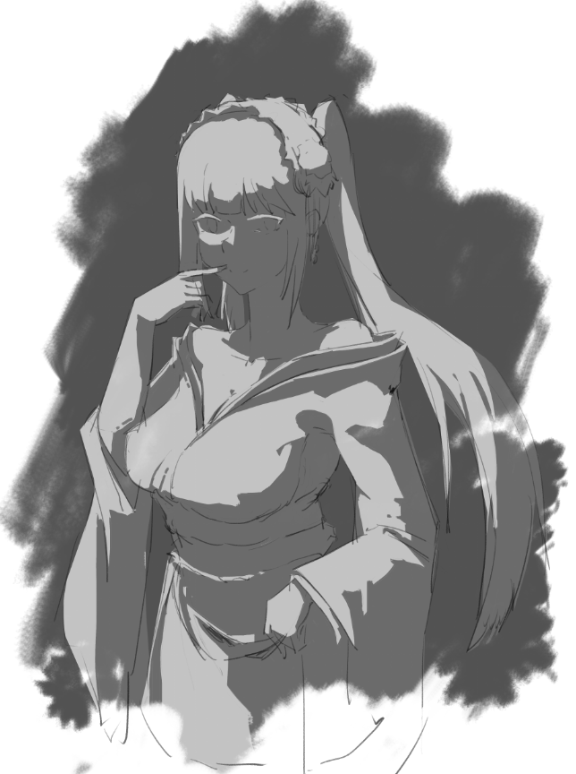

  

這是回頭做塑造，

但是真的是太忙就做到這樣了

塑造真的好難啊

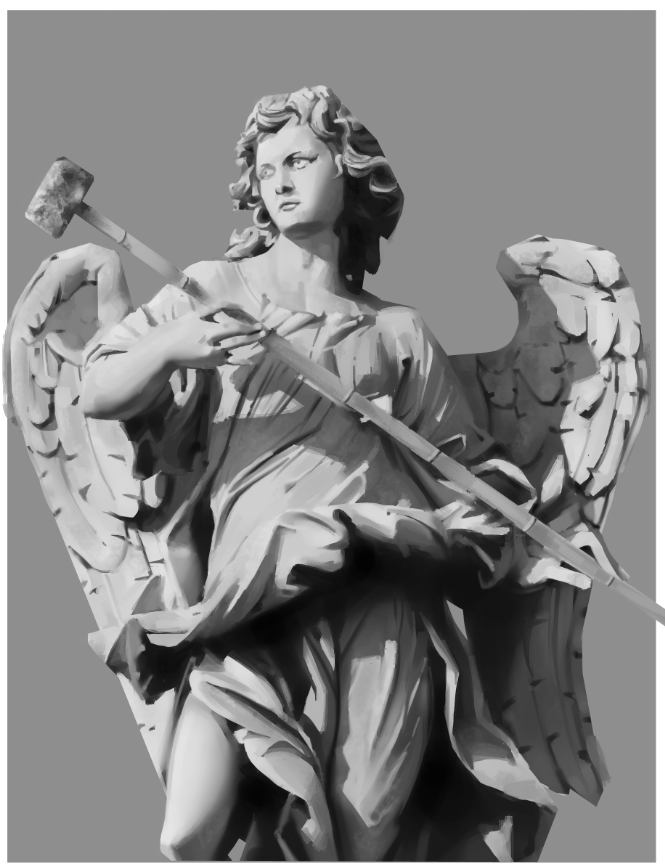

  

速寫

後來就比較常練習速寫

(就是在捷運上拿個本子hen羞恥的亂看

  

然後這是針對蹲姿的速寫(這是拿照片畫的

雖然有重新描線過就是了

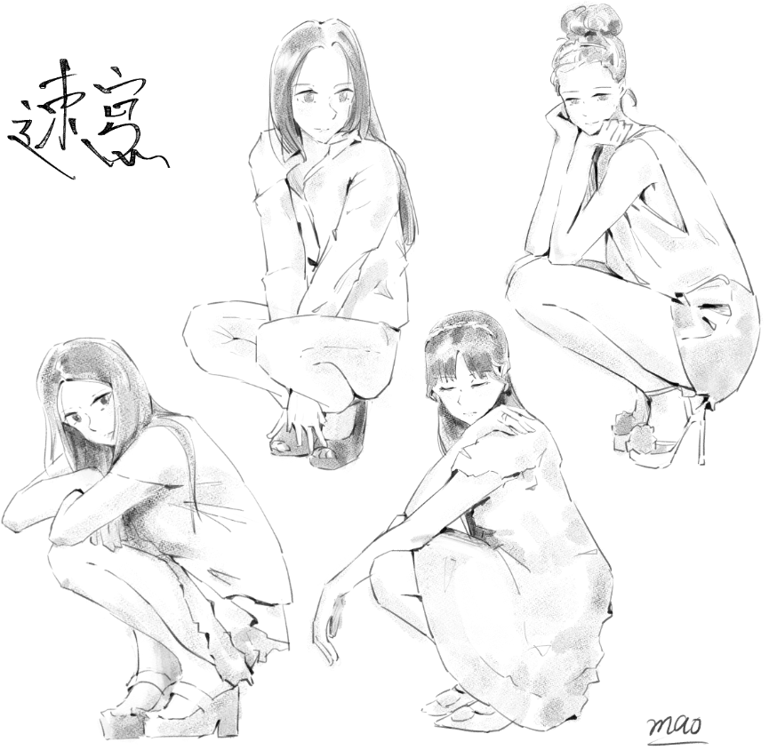

  

這張就是直接憑印象盲畫

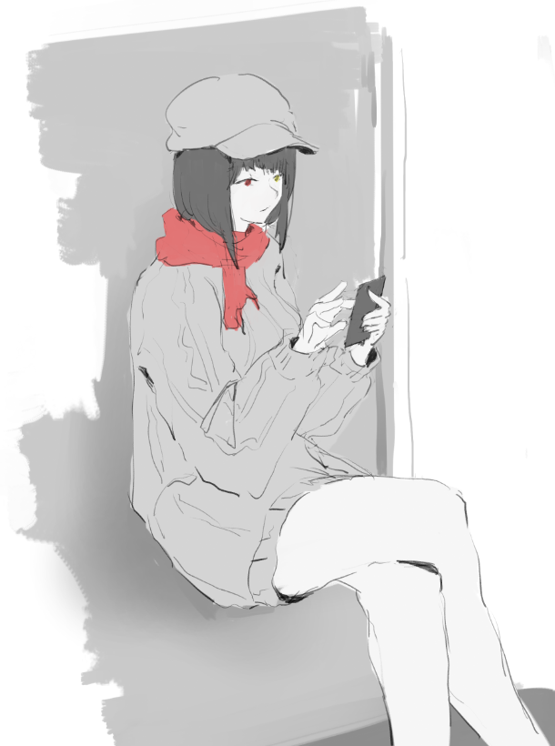

  

然後是最近在研究那種大姊姊臉要怎麼畫

尤其是嘴唇的表現，

等有整理出個脈絡可能會在單獨一篇吧

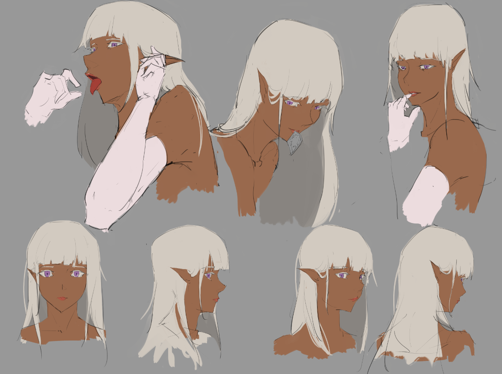

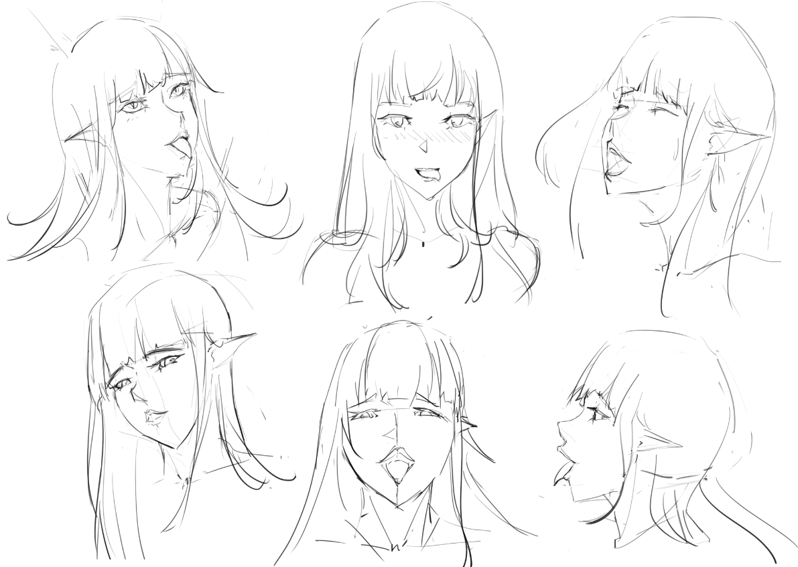

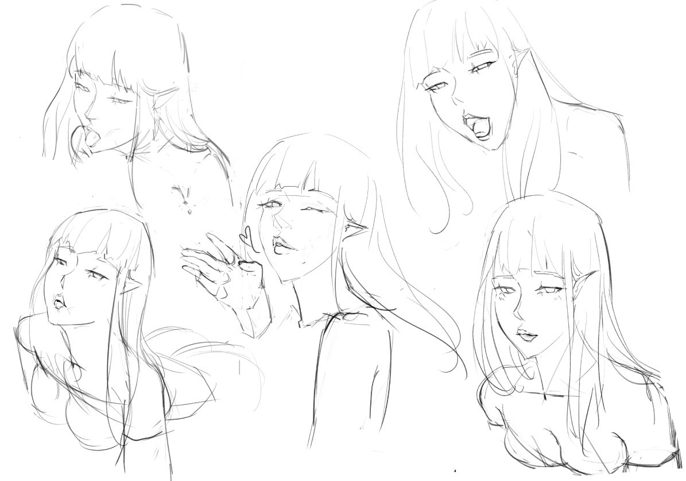

這邊有大量參考[Gtunver](https://www.pixiv.net/member.php?id=1793569)和[飛燕](https://www.pixiv.net/member.php?id=1135942)

當然如果夠敏銳也會發現我是臨摹一些"影片"的截圖

  

  

今年要結束了，

希望明年能比較有時間畫圖，

本來計畫是要上K大的構成課的，

看來是不太可能惹(遠望

  

感謝大家支持!

雖然我不太常更新

以上!

$('article.c-text img').load(function () { // 表格內圖片大於表格寬時，設為 100% if ($(this).parents('table').length != 0) { if ($(this).width() >= $(this).parents('td').width()) { $(this).width('100%'); } else { $(this).width($(this).width() + 'px'); } } });
