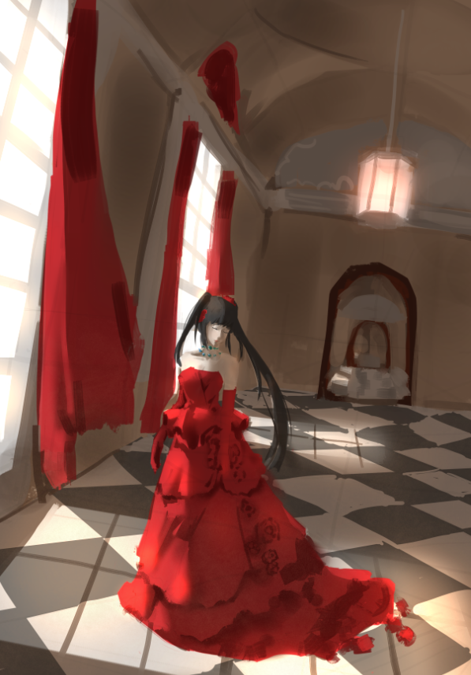
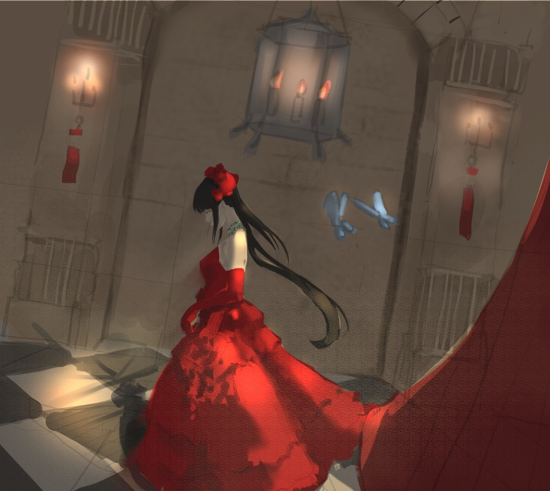
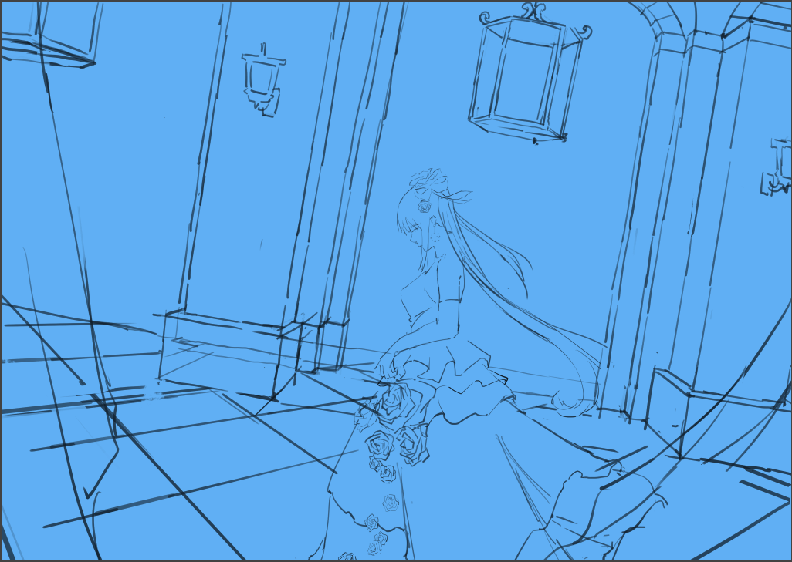
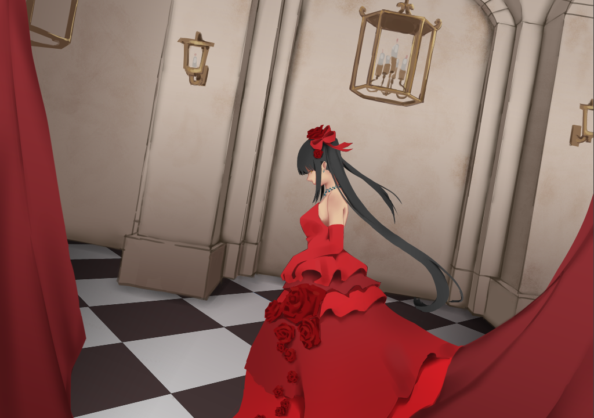
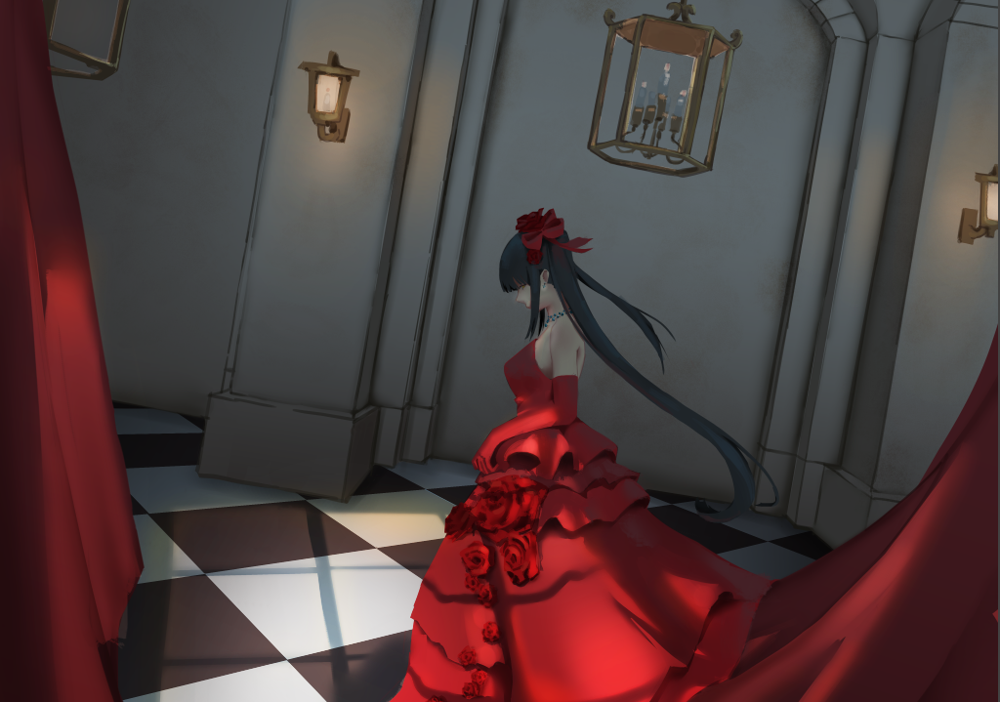
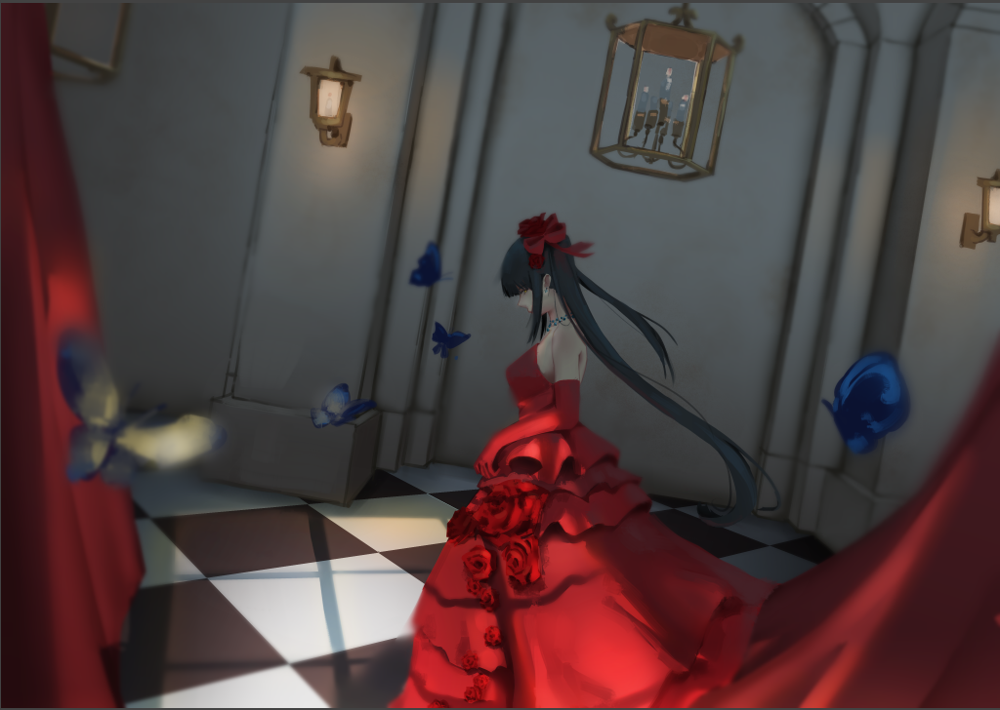

# [同人]狂三 禮服

> 2020-01-19 · 繪圖 · GP 7 · 來源 https://home.gamer.com.tw/artwork.php?sn=4658486

期末硬擠出時間畫圖，

配合這次社團的主題畫了禮服的狂三，

為了彌補很久沒更新，來分享個流程好了。(也就那樣就是了

  

首先在[前一篇](https://home.gamer.com.tw/creationDetail.php?sn=4635463)我有先畫了四個票選，

雖然沒有很多票，但是還是選了其中兩個出來畫草稿。

1號

4號

然後我私心就選後面那個啦

  

線稿

底色+閉塞

光影

後處理

  

為了趕上死線，

這張其實花的時間並沒有很長，

所以可能一些細節或是光影畫的不太好，

但最後應該還OK，以後看能不能優化這個流程。

  

以後有空再做做看這種畫圖投票吧

  

新年快樂，以上!

$('article.c-text img').load(function () { // 表格內圖片大於表格寬時，設為 100% if ($(this).parents('table').length != 0) { if ($(this).width() >= $(this).parents('td').width()) { $(this).width('100%'); } else { $(this).width($(this).width() + 'px'); } } });
