# 【耍廚】狂三掛軸收藏二

> 2020-01-28 · 收藏 · GP 2 · 來源 https://home.gamer.com.tw/artwork.php?sn=4666527

圖多注意!

  

過年終於有時間整理一下，

發現又有蠻多新掛軸，

那就再發一篇吧(ゝ∀･)。

  

那就照樣按社團來分類吧，

森蘿御界:

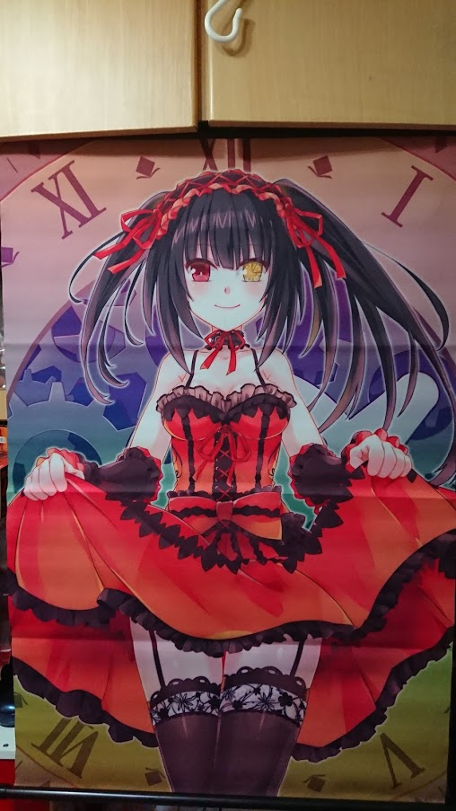

依漫文化創意工作室:

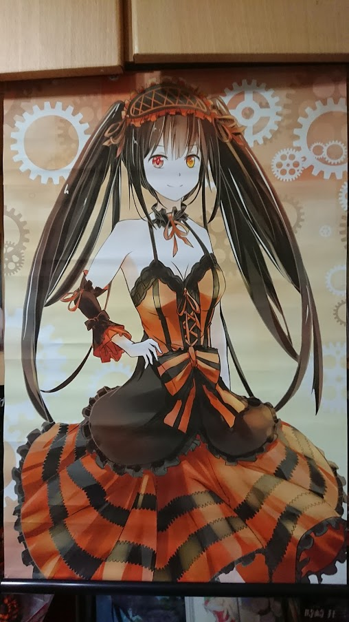

  

  

其他社團:

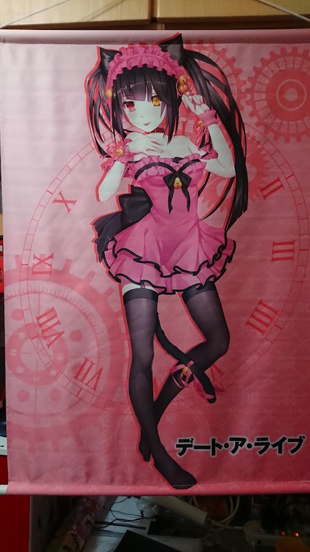

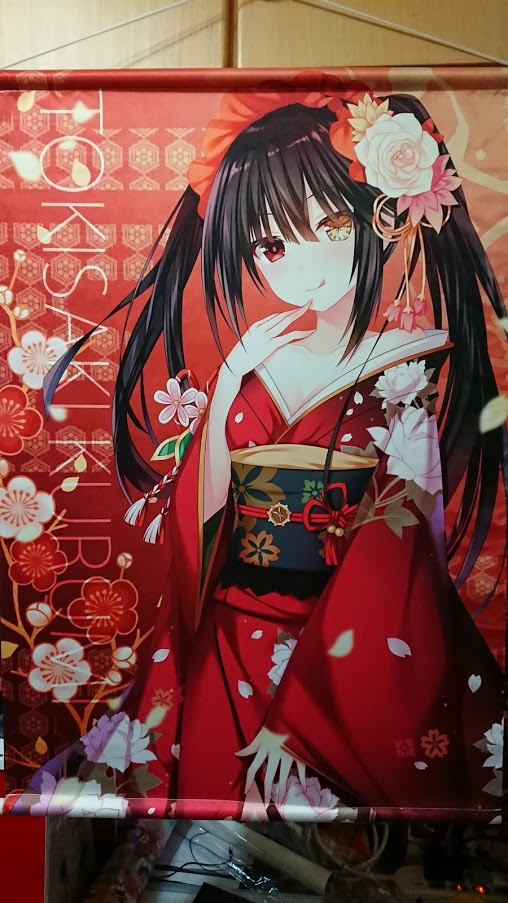

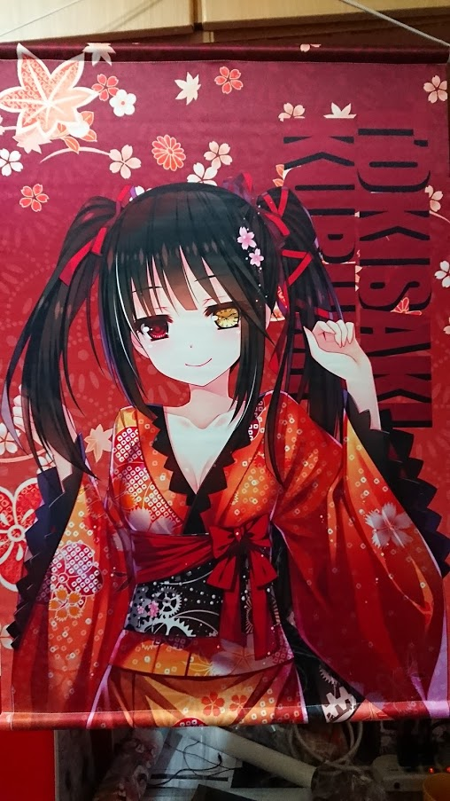

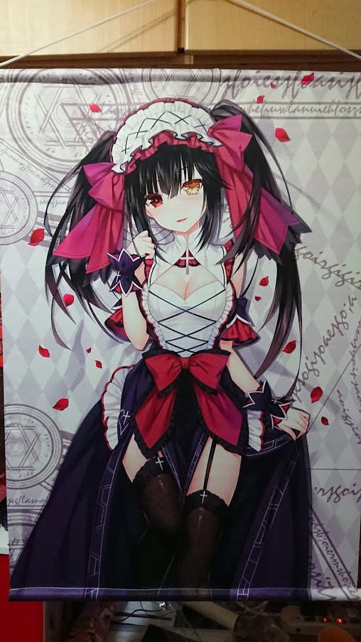

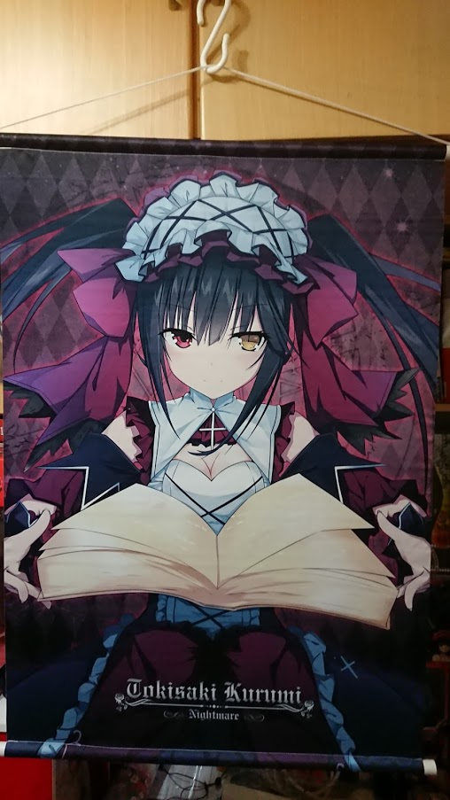

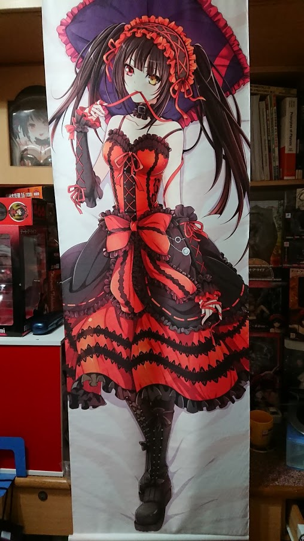

  

官方:

日本:

(劇場版)

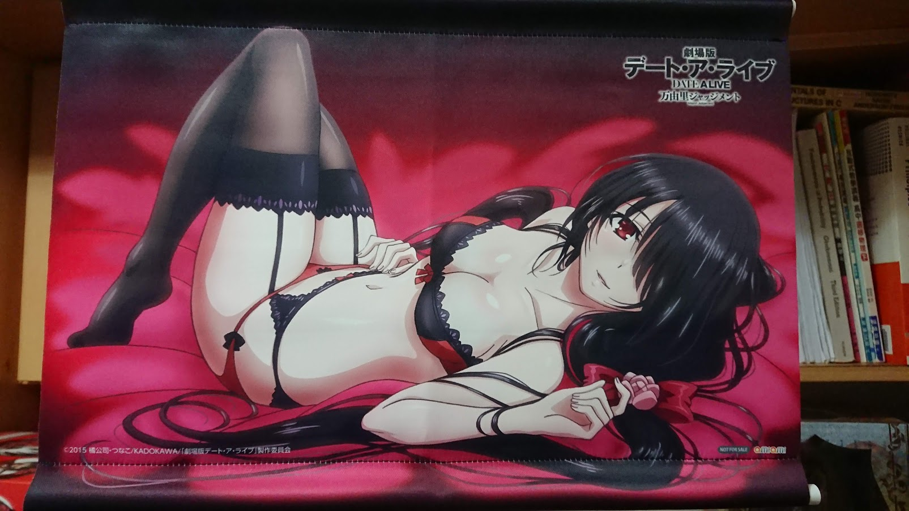

PVC特典:

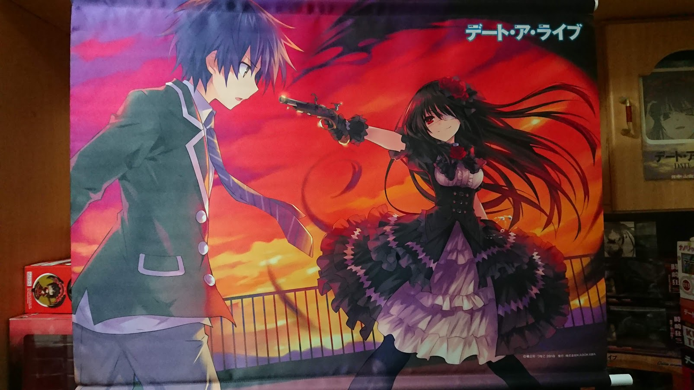

歐派滑鼠墊掛軸:

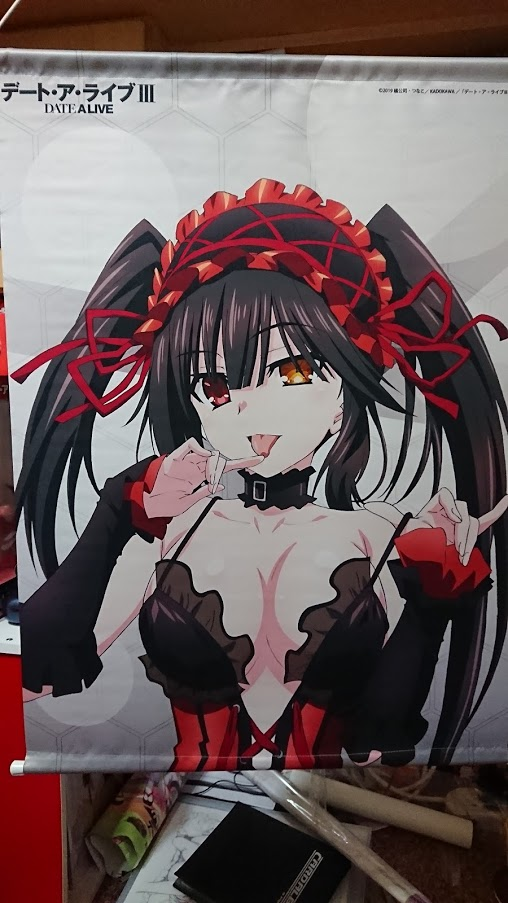

日本角川:

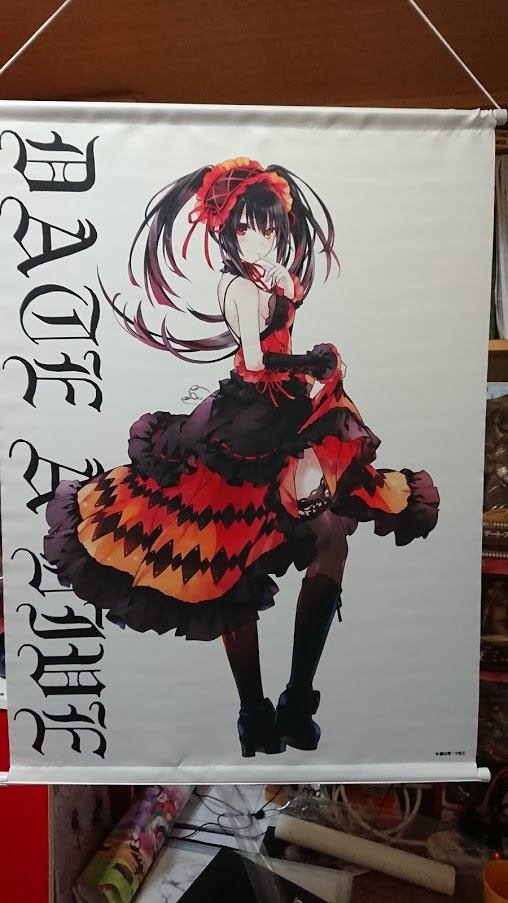

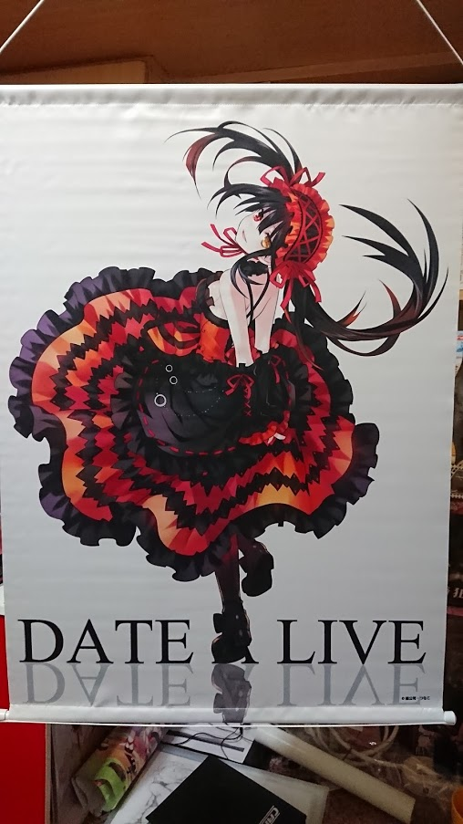

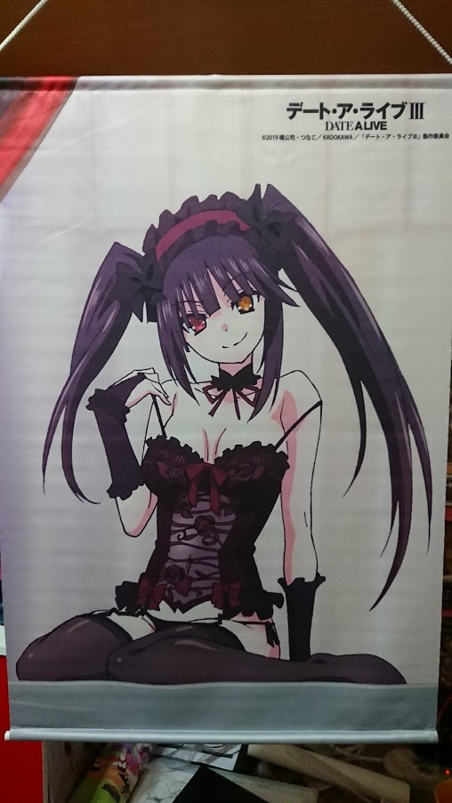

台灣角川:

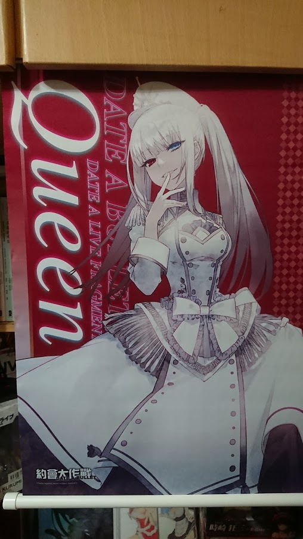

富士庫:

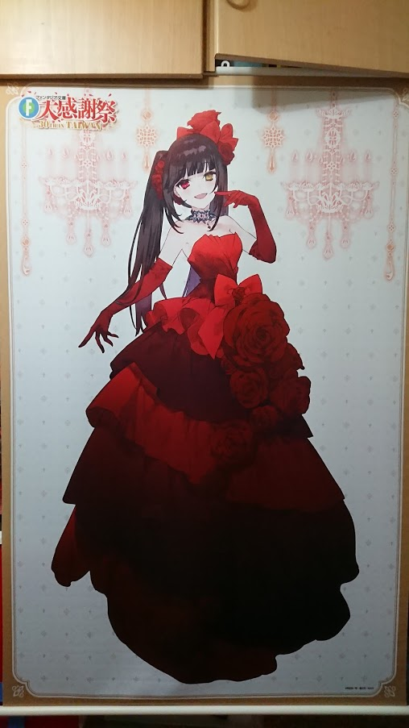

  

Cosplayer:

Hitomi:

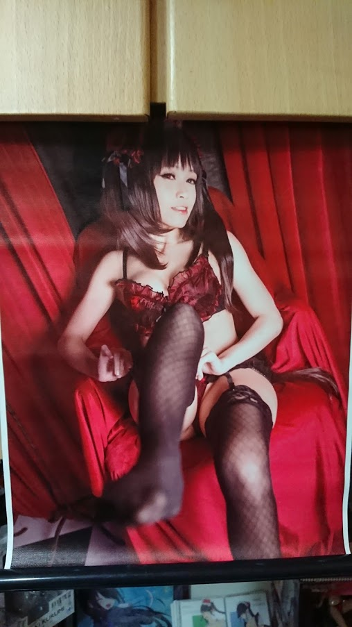

雨波:

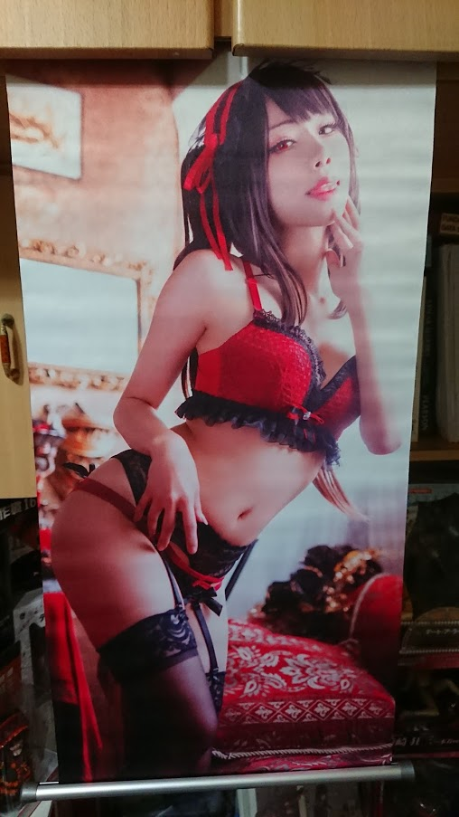

  

  

沒想到不到兩年又多這麼多老婆(́◉◞౪◟◉‵)，

這陣子也在整理其他狂三周邊，

最近再陸續開箱出來吧。

  

阿對，還有背景中的一大堆PVC，

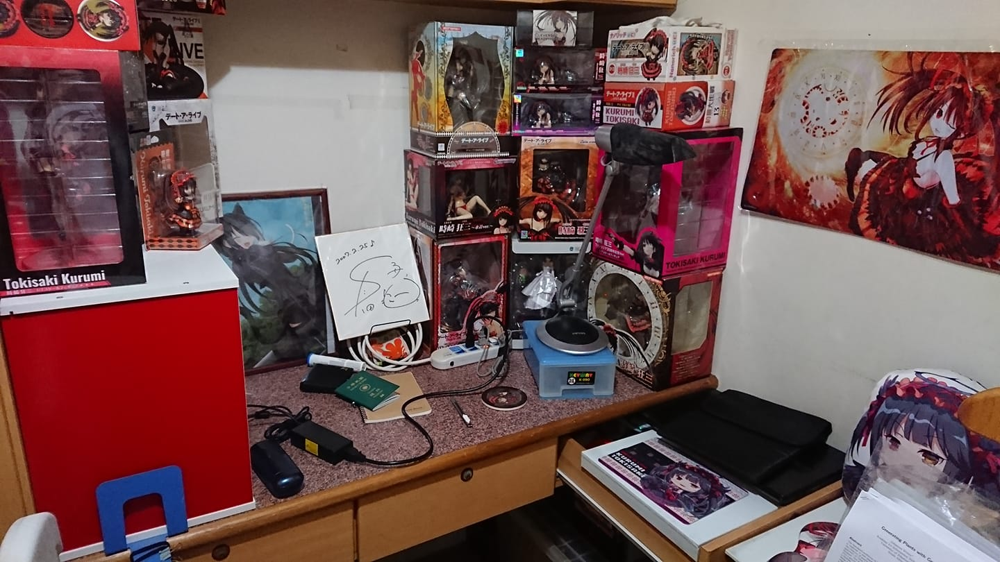

對，這就是我的作畫環境，

怎麼這麼香(,,・ω・,,)

  

以上!

$('article.c-text img').load(function () { // 表格內圖片大於表格寬時，設為 100% if ($(this).parents('table').length != 0) { if ($(this).width() >= $(this).parents('td').width()) { $(this).width('100%'); } else { $(this).width($(this).width() + 'px'); } } });
