# [筆記]K大色彩課四期-03-信息量

> 2020-02-10 · 筆記 · GP 7 · 來源 https://home.gamer.com.tw/artwork.php?sn=4680001

拖了很久的筆記，

廢話不多，直接開始吧

  

前面提到了正負型以及曝光值，

原則上就是把大致的輪廓明確的畫出來，

那如果只有輪廓，甚至是只加上固有色畫面通常整個的完成度是不夠的，

我覺得這邊用例子來講會比較清楚，

  

在K大的體系中，

分為真細節以及假細節。

  

\-真細節

所謂的真細節就是塑造(小調子(這麼講不準確就是了\[註1\]))，

這包含了亮面、暗面、反光、邊緣控制和各種神妙的短調子變化等等...

也就是我們在畫石膏像的時候需要注意的地方，

以作業來看，

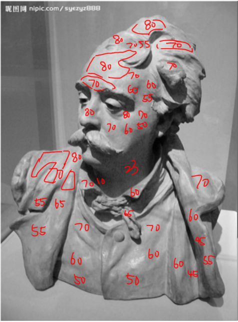

我們要在他的身上畫上數字(?

我們要先分析一下所有小塊面的明度，也就是小調子，

可以透過這種方式可以稍微歸納出一些規則，

例如，這個作業的受光面幾乎是在70~80，

而固有色中間掉的部分就落在60~50，

而在暗面則落在30，閉塞則可以到10，

透過這種方式，可以發現這大概是80-50體系，

而閉塞則可以到非常暗，也就是為甚麼說閉塞是最暗的。

  

這邊給個當時的流程給大家參考

正負型(硬筆)

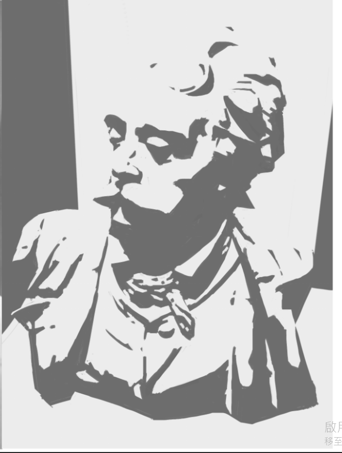

  

大調子(大關係)、塊面整理

原則上就是用噴槍來作大關係跟稍微硬的筆來整理塊面

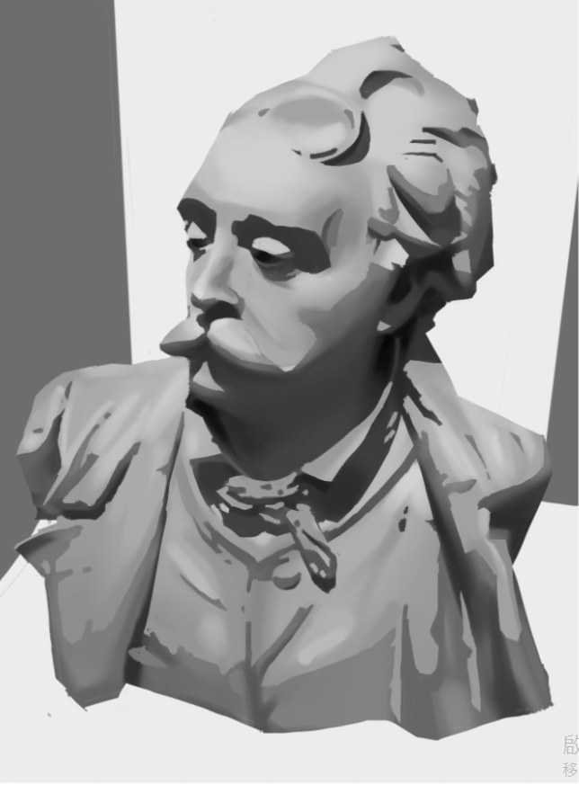

  

小調子(把亮暗面的過渡、一些小塊面的調子)

主要是一些級邊的控制

級邊控制也叫做邊緣控制，

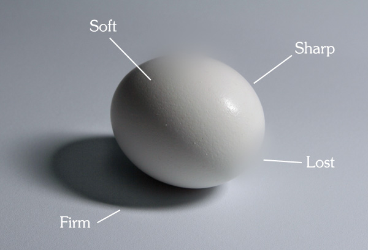

就是要能夠很有意識的畫出各種邊緣

1級邊:Shape 銳利

2級邊:Firm 結實

3級邊:Soft 柔邊

4級邊:Lost 隱沒

  

這個東西為甚麼重要，

舉例來說，投影的地方是在2~2.5級邊，

  

  

另外，轉折面則是3級邊左右，

如果把兩種都混在一起，

那可能就會糊成一塊，也就是為甚麼會有人說噴槍是鼻涕筆，

例如都直接用噴槍作過渡，常常會畫成4級邊，

那所有東西都會糊在一塊就像是鼻涕。

  

這邊其實原則上我當時做真細節就做到這，

也就是說前面的步驟就是所謂的塑造，

那當然只做到這邊會直接被助教退回啦，

最後一步就是假細節

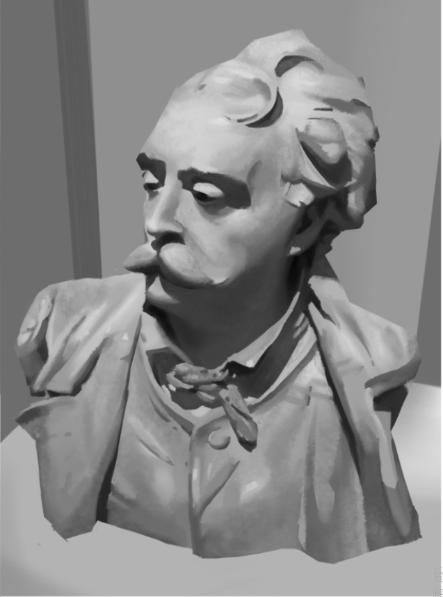

也就是加上一些紋理(乾筆)

那什麼是假細節呢?

  

\-假細節

在自己的定義中，假細節包含了調子、紋理、冷暖甚至是筆刷的大小，

例如說紋理之類的具有隨機性的細節，

也就代表我們可以隨便亂噴，

但既然是紋理，我們就需要比較乾的筆，

如果用太濕(例如噴槍)那就會是完全光滑的，也就沒有細節

  

那這邊一樣舉例來說，

我拿[禮服狂三](https://home.gamer.com.tw/creationDetail.php?sn=4658486)的過程來說，

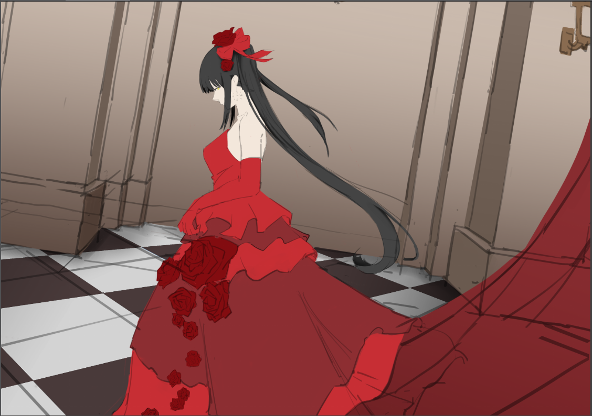

這個只有線稿跟底色，

這個階段可以很明顯的發現整體完成度很低，

雖然我把整個輪廓都畫得很清晰，也整理過，

但是這個底色感覺東西太少，

這個東西就稱為信息量，

  

舉例來說，最明顯的就是做塑造

也就是像照片一樣，把立體的結構、光影畫出來，

也就像是我的[這篇](https://home.gamer.com.tw/creationDetail.php?sn=4498322)所描述的，

所以這個也就是硬底子，需要大量的練習。

  

除了塑造，還有光影，

也就是前面兩篇提到的明暗交接線或是閉塞，

換句話說是[正負型](https://home.gamer.com.tw/creationDetail.php?sn=4490548)，而這也牽涉到了[曝光值](https://home.gamer.com.tw/creationDetail.php?sn=4506206)的問題，

那就來看看剛剛那張圖加了閉塞吧，

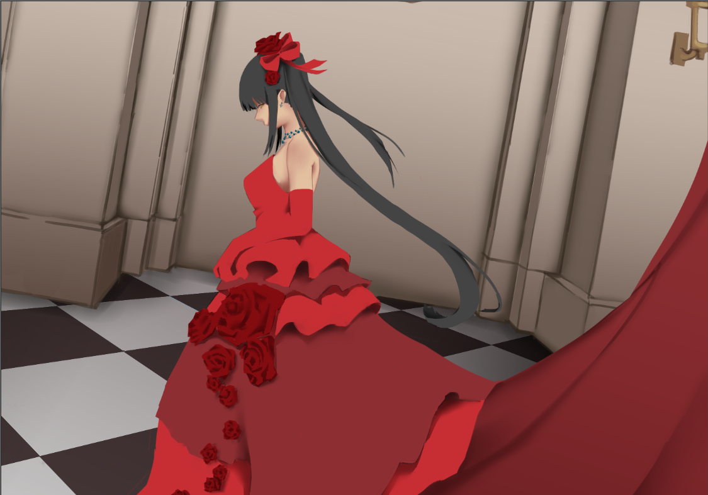

我順便把線稿關掉，但加上了閉塞，

整體上可以看到信息量提升了。

  

但是仍然不夠，

於是我在亂噴了一些漸層和紋理，

這個也就叫做假細節，

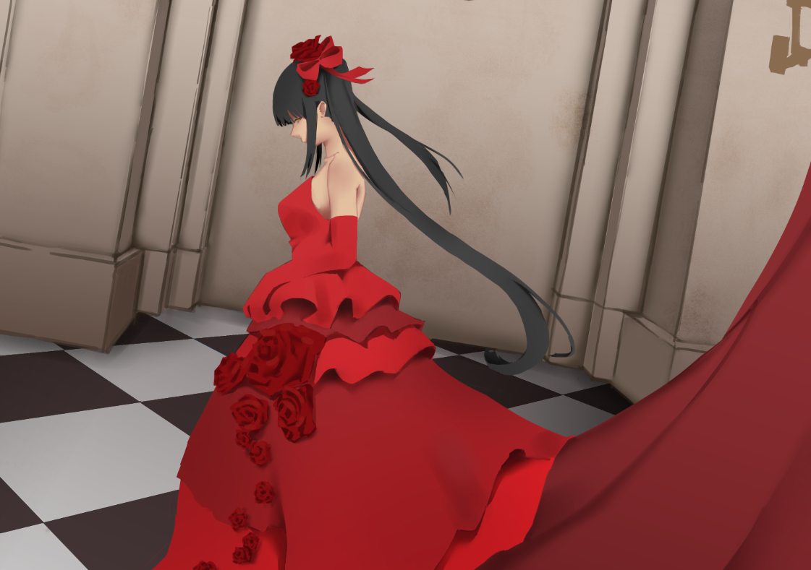

可以發現我原則上只有做調子的假細節，

但要注意我大概只有做約5度的明度變化，

因為如果明度變化太大，那就會變成很明顯，

那就可能造成光影的混亂，

因為太暗就會變成暗面，那這樣就必須照著結構來，

而太亮當然也要照著原則來，那就不能亂噴了。

  

反之，如果只是材質或是一些皺褶這種具有一定隨機性的，

那就亂噴就對了。

  

那另外的明暗交接線呢，

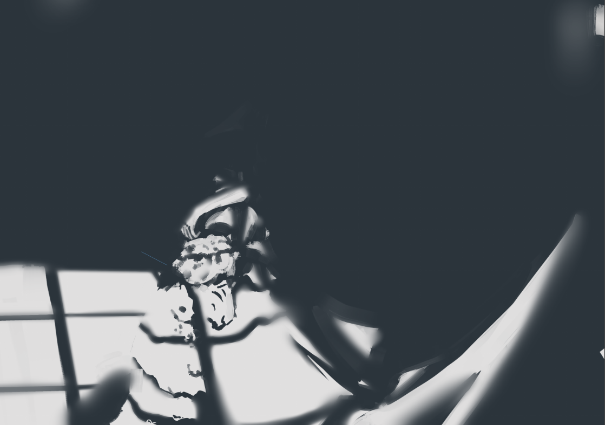

這邊也就是設計明暗交接線，

也就是設計正負型，

除了正負型，也可以發現我用了不同的筆刷大小來畫，

可以想像如果我都用很大的比去畫，

那看起來就不會那麼細緻，但本質上我並沒有真的畫出細節

所以這也就是假細節的之一。

把它加上去後會變成這樣，

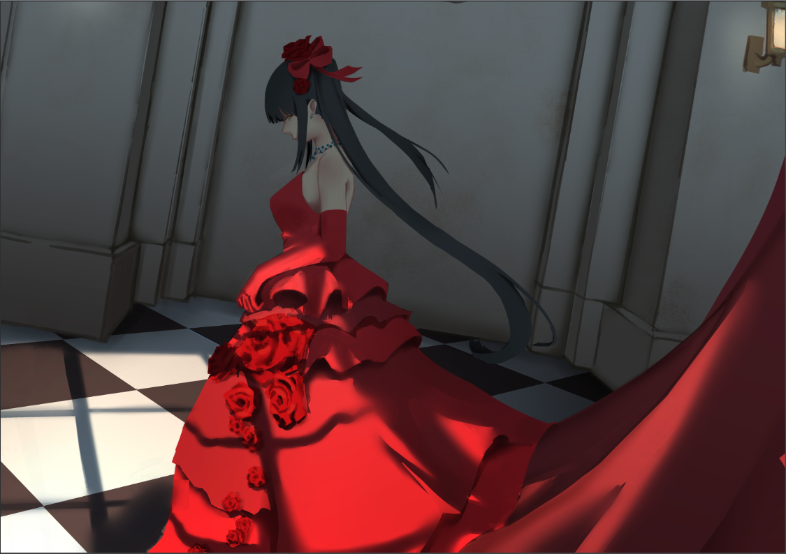

這時候還是有點空，那就再加一些假細節，

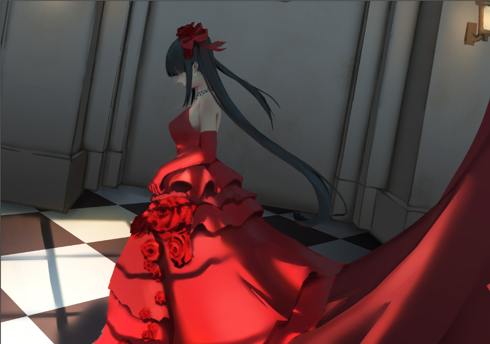

這包含一些光暈、天光之類的漫反射，

也就是一些微妙的調子變化，

而這些變化就也可以比較放鬆的畫，

因為只是為了增加信息量，

所以這也是假細節。

  

但這邊也可以發現仍然有用到級邊的控制，有虛實變化。

  

那最後我們在調整一下，

再用小筆刷加上髮絲之類的假細節，

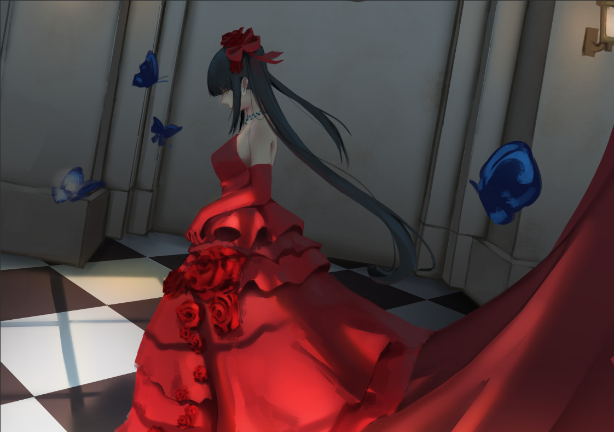

整張我幾乎沒有做什麼高難度的塑造，

當然也是因為我不會，

但是透過一大堆假細節和清楚輪廓就能畫出類似的結果，

但這就有些問題，

假細節的顏色要用甚麼?

筆刷要用多大?

  

這些也就是要自己去臨摹研究啦。

  

  

總的來說，信息量的來源有很多，

但最直觀的我們都會拿照片來參考，

因此我們會儘量地去做塑造，也就是真細節，

但是我們可以透過一些紋理之類的方式來充當細節，

也就是為甚麼有很多人會利用排線，

因為排線也是一種紋理，

也可以暗示結構或是速度線，

而只要信息量充足，我們也就可以不用去做很多困難的塑造，

當然，這邊就是見仁見智。

  

最後，我們可以兩個都用，讓細節量爆棚嗎?

這個通常會造成畫面很雜，可以想像上面的石膏現在加上排線，

也是會變成在正負型所提到的，

我們要整而豐富，但這樣就會太豐富而不整。

  

  

\-

真的拖了很久才補，

趁現在有點時間就趕快來複習一個，

匆匆忙忙整理的，有可能有點亂，

但我就先把這些東西放上來吧。

  

以上!

  

\---

註1

小調子，我的理解應該是微妙的明度變化，

說它小是因為明度變化小

  

$('article.c-text img').load(function () { // 表格內圖片大於表格寬時，設為 100% if ($(this).parents('table').length != 0) { if ($(this).width() >= $(this).parents('td').width()) { $(this).width('100%'); } else { $(this).width($(this).width() + 'px'); } } });
