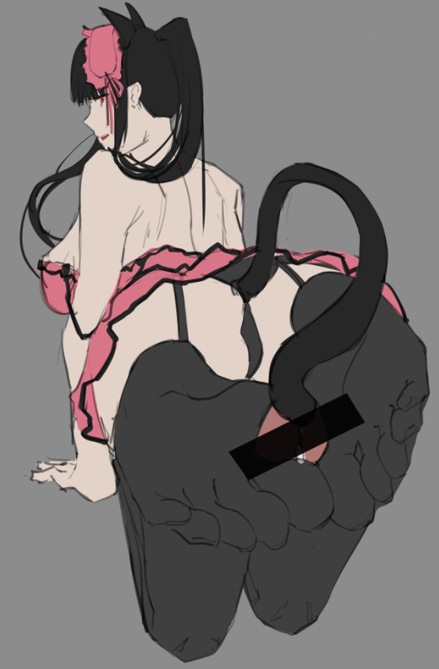
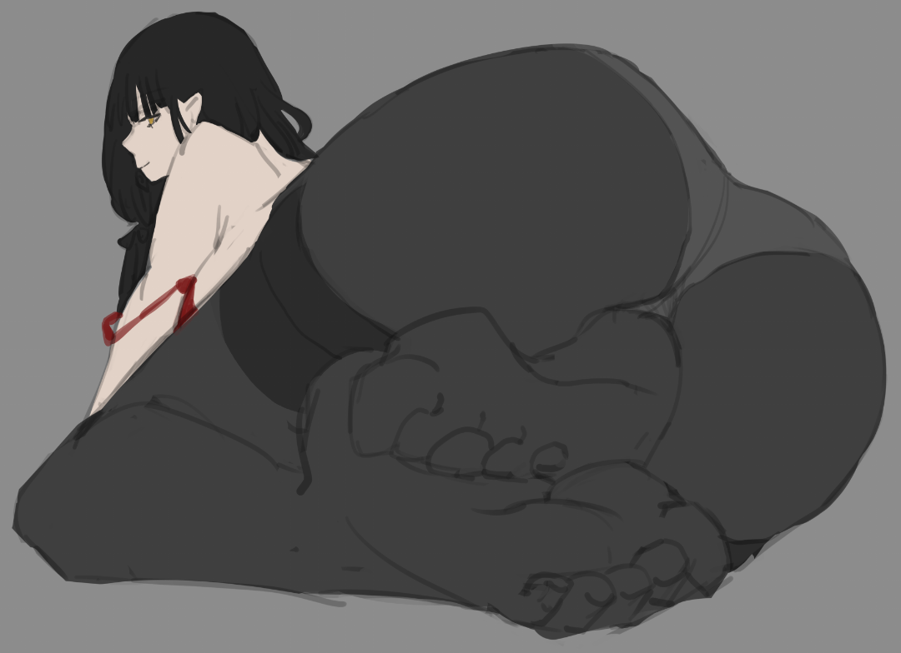
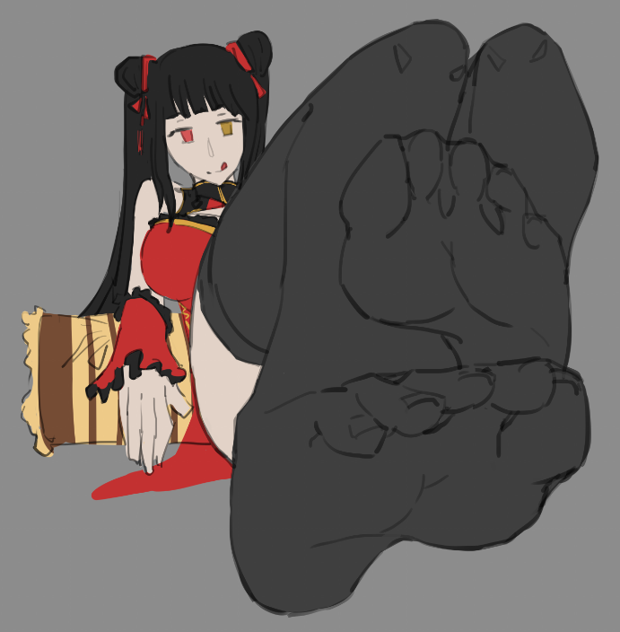
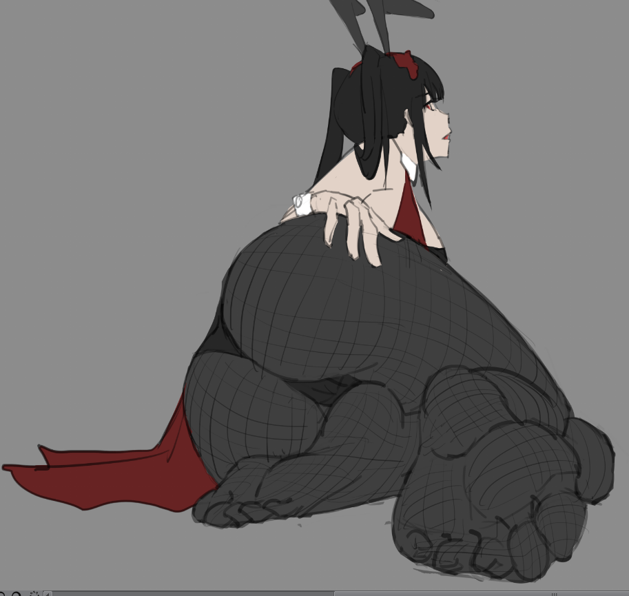
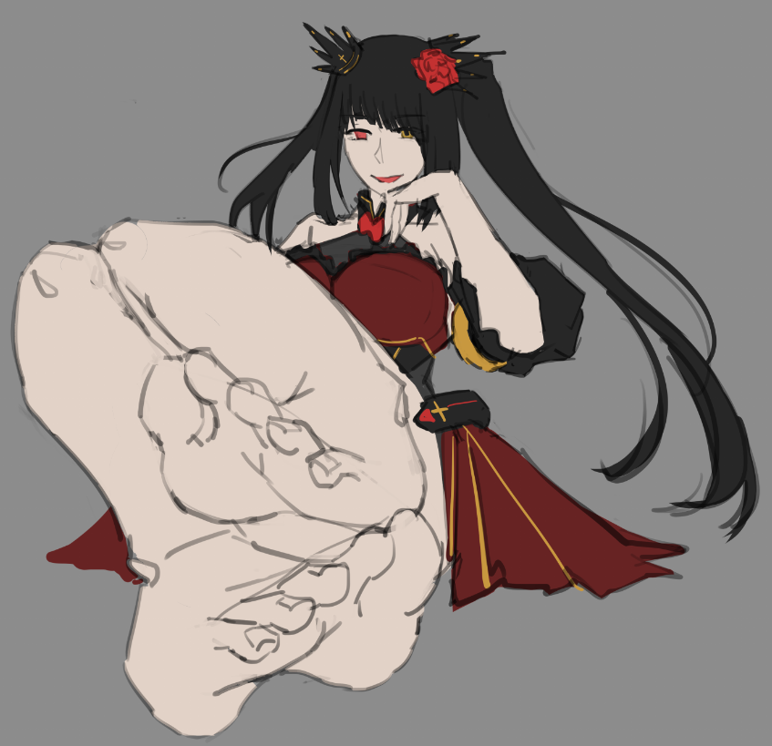
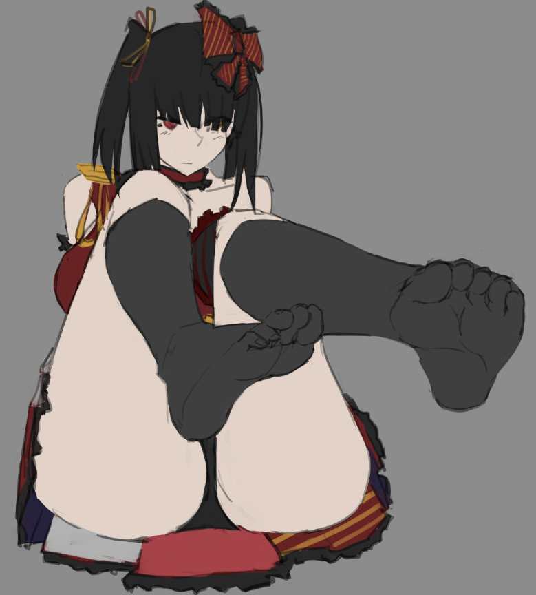
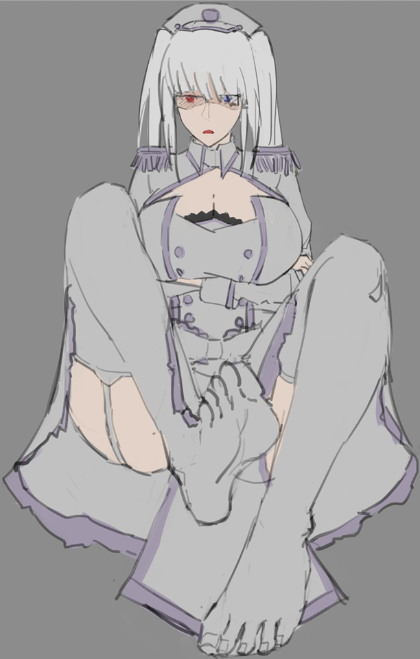
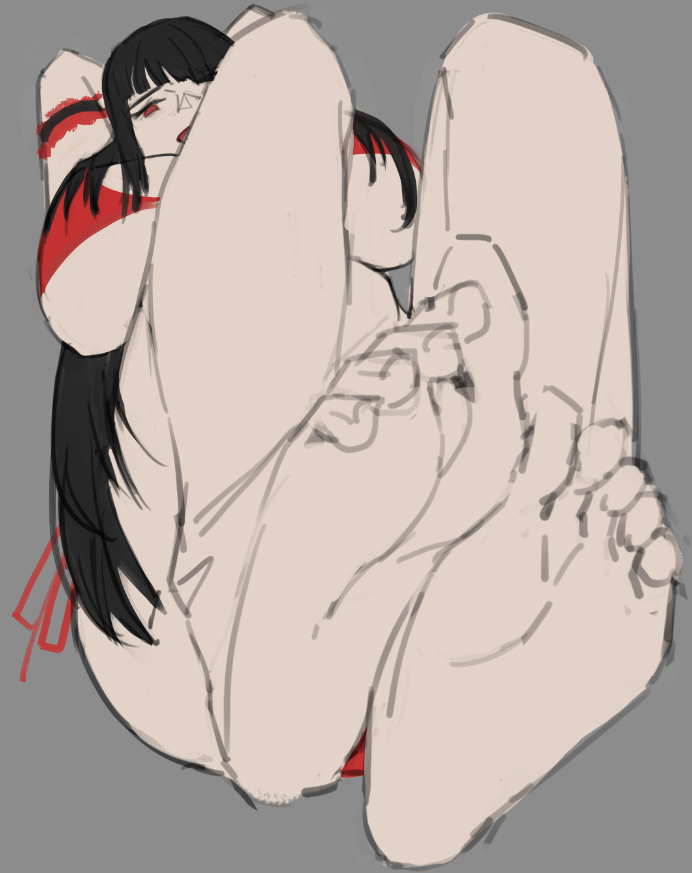
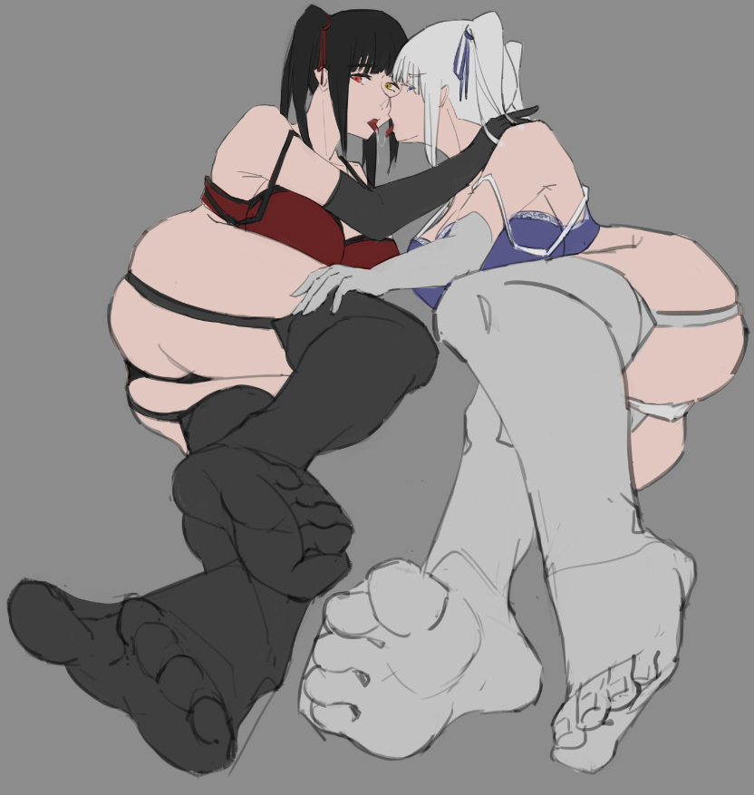

# [練習]狂三 足

> 2020-02-13 · 繪圖 · GP 2 · 來源 https://home.gamer.com.tw/artwork.php?sn=4684192

最近在練習腳腳，

就拿狂三來畫啦!

  

但因為是練習所以原則上完成度都不高，

大致就上個底色跟我自己看得懂的線稿吧，

  

不囉嗦，來聞吧(?

  

那是球球啦

  

  

  

  

  

  

  

  

  

這邊附註一下，大部分都是半臨摹半腦補，

有拿其他繪師的圖跟coser參考，

至於圖源嘛，這就是我的收藏啦~

  

至於會不會完稿，

就看看有沒有時間吧

  

以上!

  

[FB](https://www.facebook.com/maochinnn/)

[PIXIV](https://www.pixiv.net/users/6856401)

  

  
$('article.c-text img').load(function () { // 表格內圖片大於表格寬時，設為 100% if ($(this).parents('table').length != 0) { if ($(this).width() >= $(this).parents('td').width()) { $(this).width('100%'); } else { $(this).width($(this).width() + 'px'); } } });
