# 【耍廚】狂三 明信片/卡套/卡片

> 2020-02-16 · 收藏 · GP 1 · 來源 https://home.gamer.com.tw/artwork.php?sn=4687365

終於把東西都整理得差不多了，

  

首先是A6以下的明信片收藏，

這邊我花了一些時間才找到收藏冊，

因為大部分資料夾都是A4左右的，

  

這邊我用的是 [KOKUYO NOViTA α資料夾](https://www.youtube.com/watch?v=VJjS7Zkwt9k)

它有分幾個尺寸，這邊就是用明信片夾。

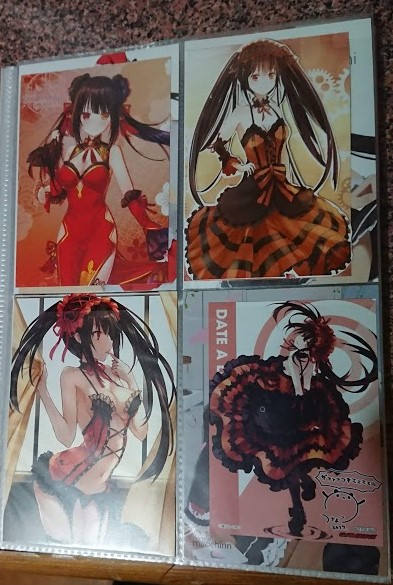

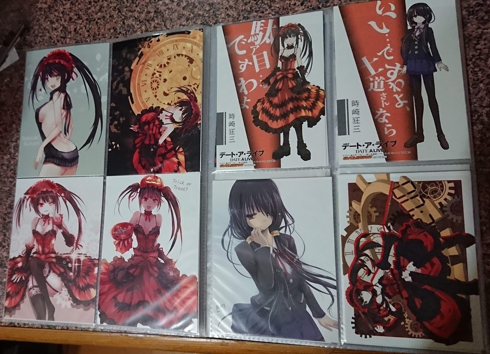

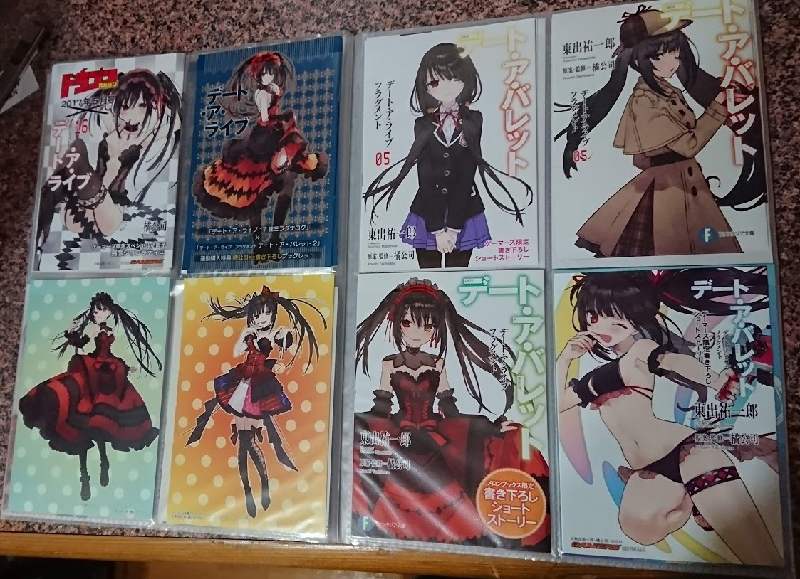

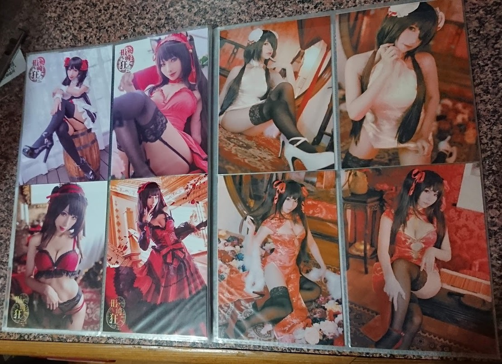

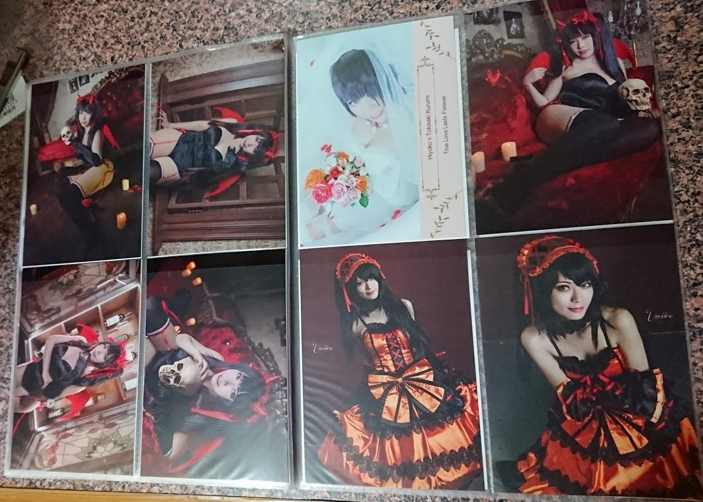

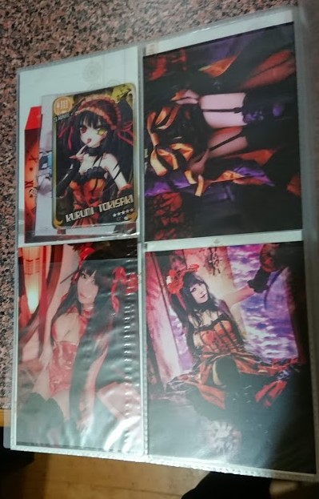

這邊主要展示的是同人、寫真明信片、官方一些特典的短篇。

  

接下來是卡套/卡片

  

這邊是用標準的卡片收藏冊，

隨便去卡店應該都買的到

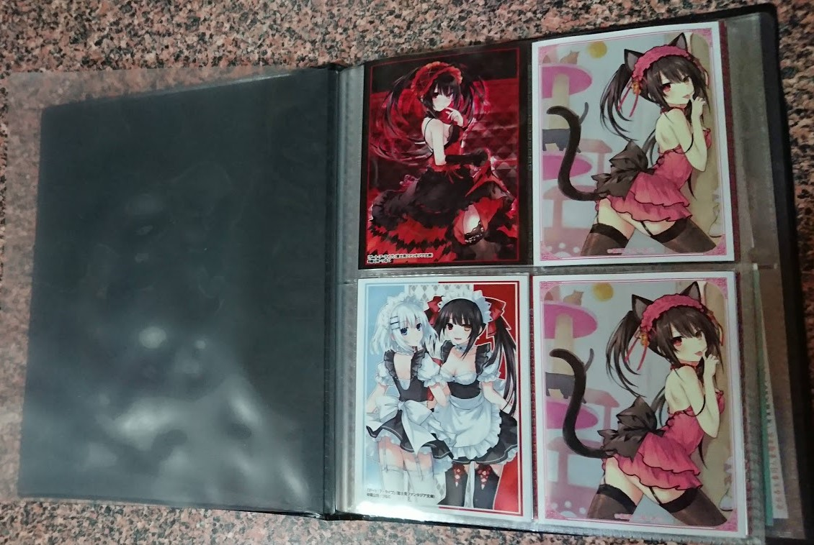

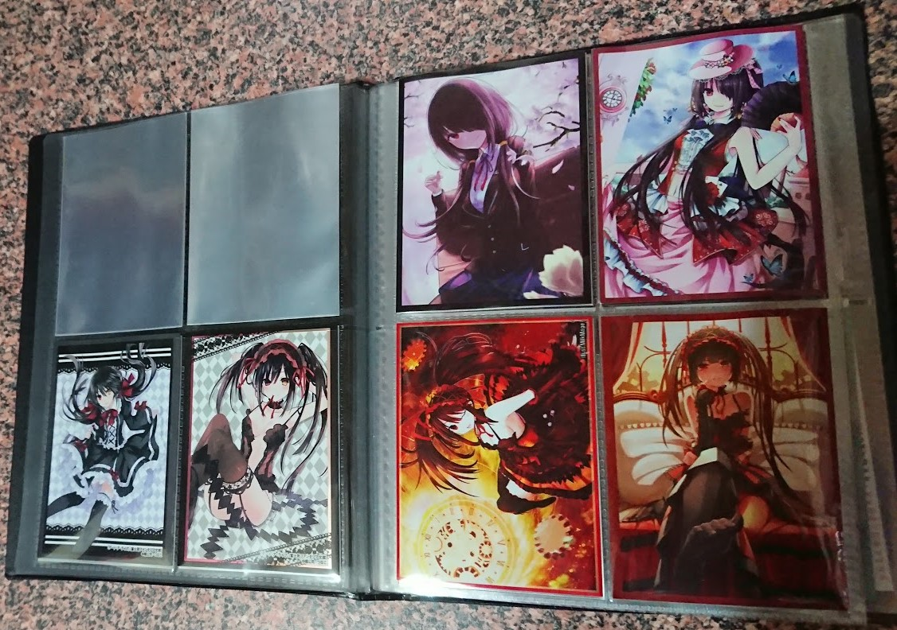

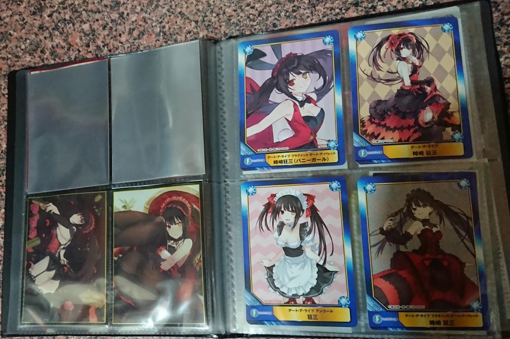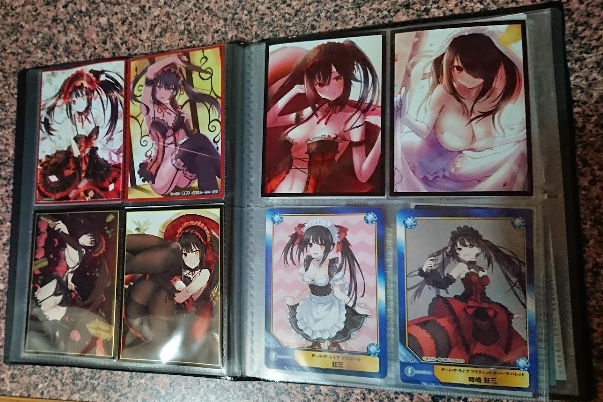

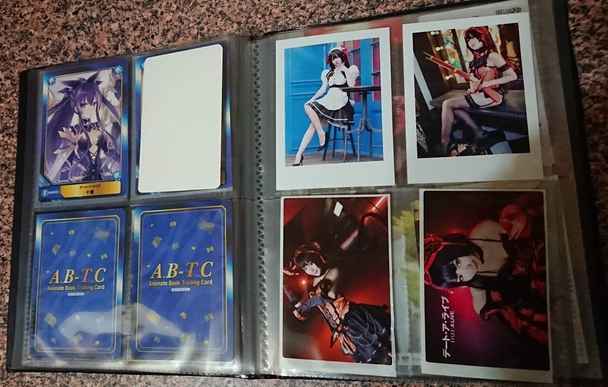

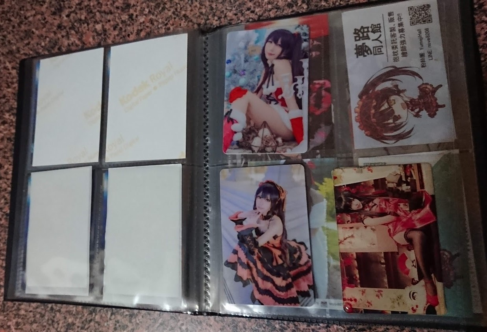

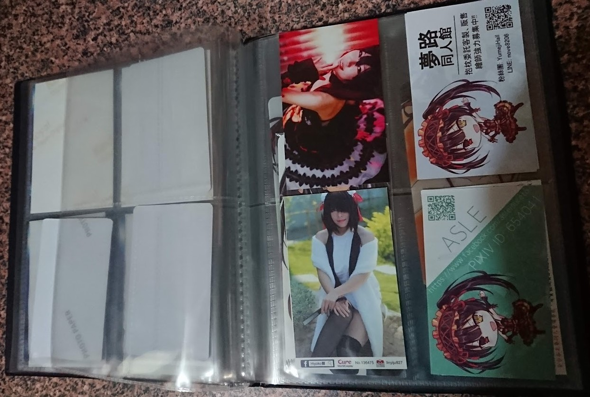

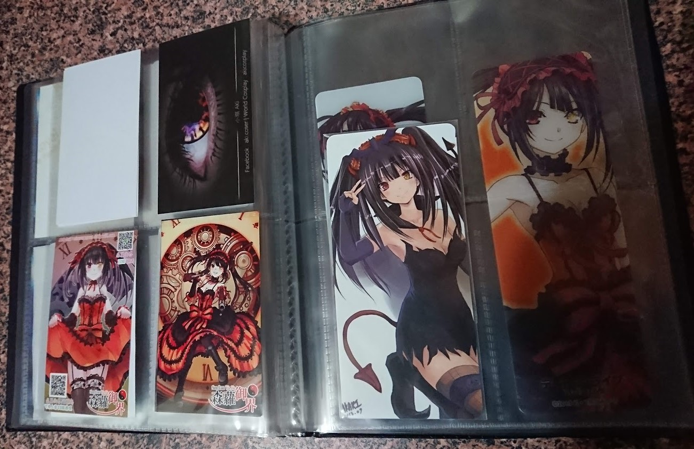

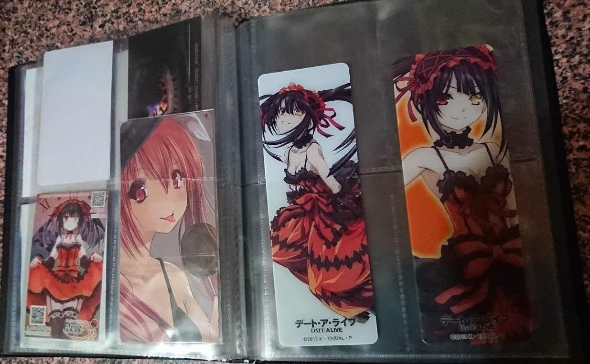

大GUY就是這些，

  

接下來還有比較大一些周邊、資料夾、吊飾、胸章等等

應該會再分兩篇來發吧，

畢竟花了不少精力去收藏，就多發幾篇ㄅ

  

以上!

$('article.c-text img').load(function () { // 表格內圖片大於表格寬時，設為 100% if ($(this).parents('table').length != 0) { if ($(this).width() >= $(this).parents('td').width()) { $(this).width('100%'); } else { $(this).width($(this).width() + 'px'); } } });
