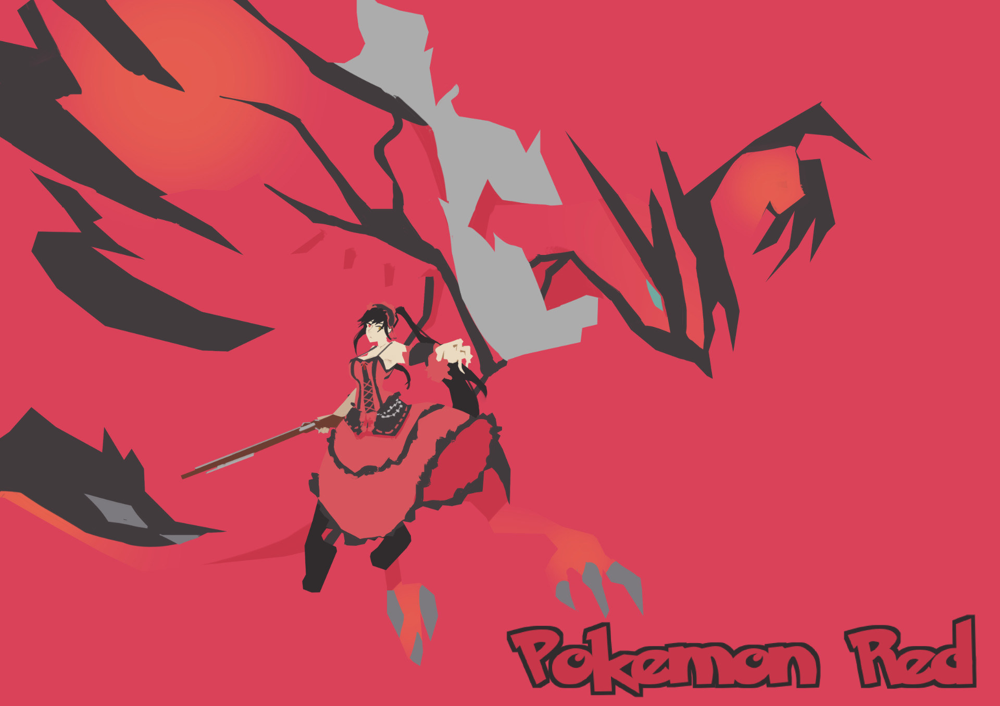
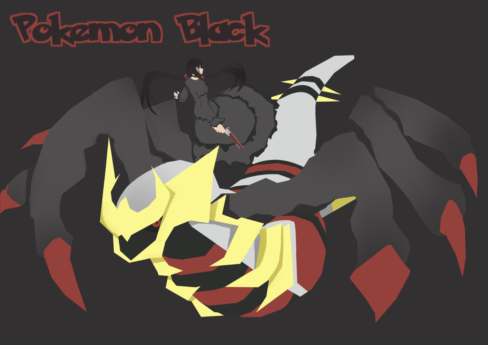
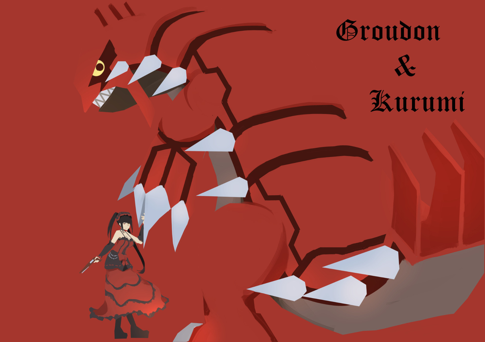

# [同人]精靈寶可夢 赤/黑

> 2020-03-01 · 繪圖 · GP 2 · 來源 https://home.gamer.com.tw/artwork.php?sn=4702774

精靈寶可夢的精靈當然就是狂三啦

  

  

  

  

以前看到別人  

把角色跟神奇寶貝(還是習慣這樣叫)畫在一起就有這個想法了，

剛好前一陣子有在流行那種讓人設計道館訓練家的活動，

但有鑑於之前跟風玩結果樓數太少根本玩不了的情況，

就直接搬我婆出來了，

但說到狂三，果然就是要紅紅黑黑的才夠中二，

所以就稍微去找了一下，

就決定從神獸下手了。

  

其實還有幾個候選名單，

像是達克萊伊還是索羅亞之類的，

像是我還有試著畫固拉多，但是我覺得沒甚麼感覺就是了，

主要是找紅黑的。

  

但其實只要跟服裝搭配其實就可以了，

所以只要狂三穿過適合的配色其實也可以。

以下開放提名(\`・ω・´)

  

阿對，大圖在[P站](https://www.pixiv.net/artworks/79821276)，

更新或是一些過程在[粉專](https://www.facebook.com/maochinnn/)

(貌似我每次都忘記宣傳就是了

$('article.c-text img').load(function () { // 表格內圖片大於表格寬時，設為 100% if ($(this).parents('table').length != 0) { if ($(this).width() >= $(this).parents('td').width()) { $(this).width('100%'); } else { $(this).width($(this).width() + 'px'); } } });
