# [塗鴉&練習]合集(3)

> 2020-05-25 · 繪圖 · GP 5 · 來源 https://home.gamer.com.tw/artwork.php?sn=4793957

快變一季更新一次了，

因為時間都很緊又很零碎，所以沒甚麼完整作品，  

總之這是春季有做的塗鴉跟練習，

  

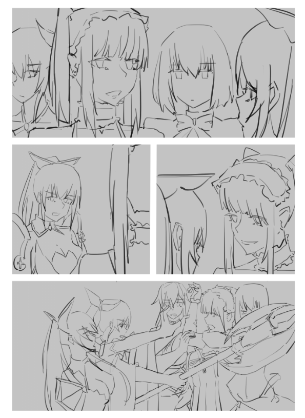

本來想跟風美隊那時候的MEME，但是完全不想上色，所以就這樣了

  

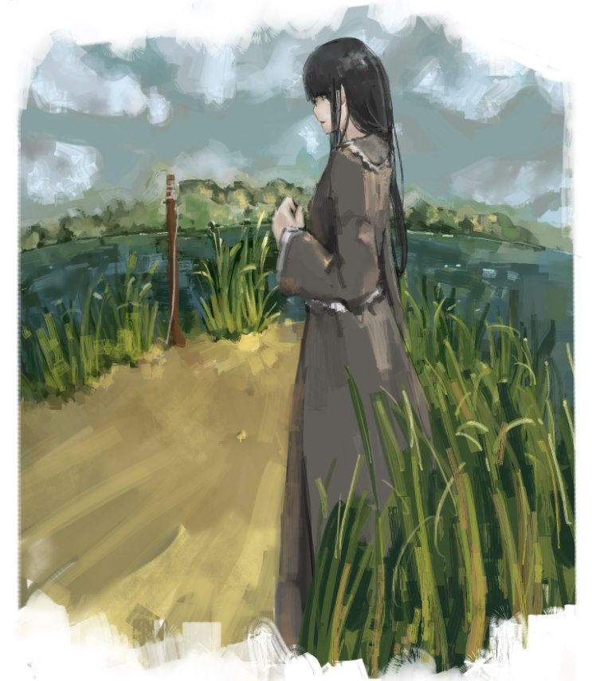

在研究植物，但其實只糊了一個小時吧

  

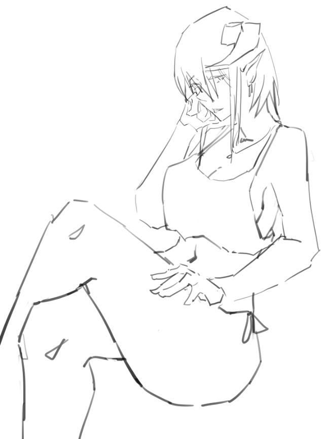

在想除了黑妖精姐姐，這種鬼族大姐姐也不錯

  

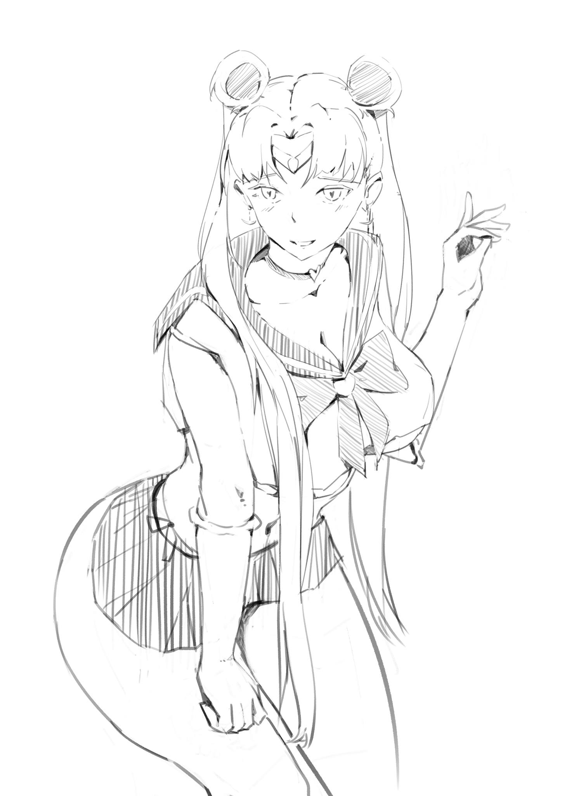

跟到尾風，但是我的繪圖板五年了都不會自己上色，所以就這樣ㄅ

  

接下來是一些跟社團玩繪圖接龍的圖，

大概都是半小時到一小時的圖

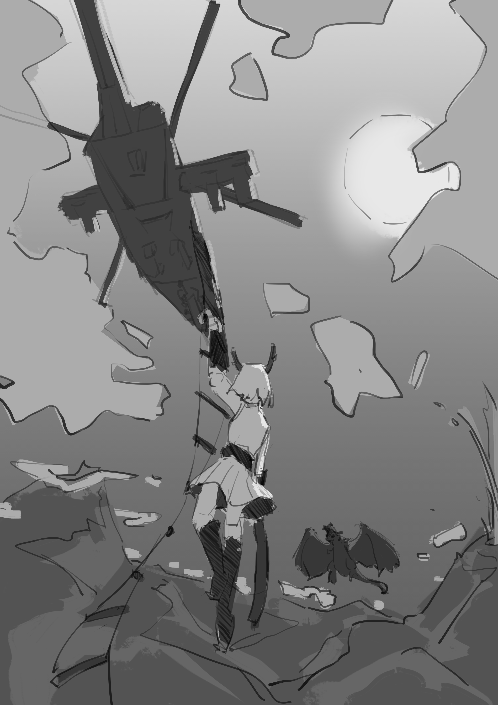

貌似是一個龍族少女跟阿帕契，到底為甚麼會有這種組合?

  

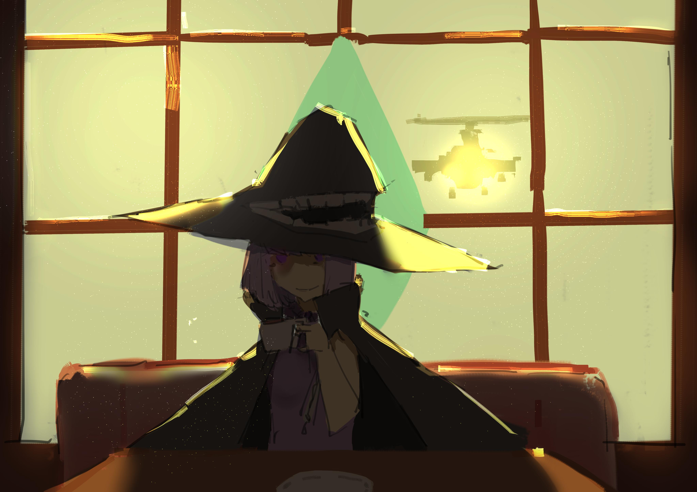

一個BOSS，想試試看這種逆光的感覺

  

除了電繪，其實這半年來我利用通勤零碎的時間做了蠻多速寫，

主要是練大型，後來就變成練一些線稿細節，就像前面看到的月野兔就有用到速寫的能力。

這邊就抓幾張近期的速寫吧

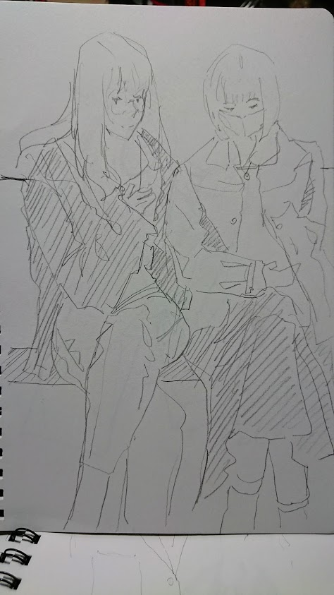

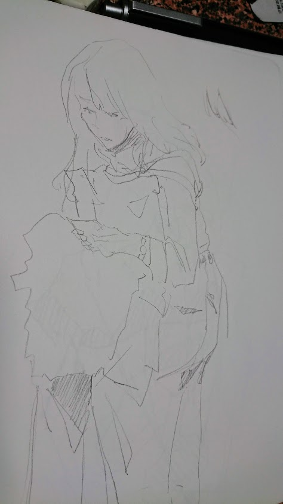

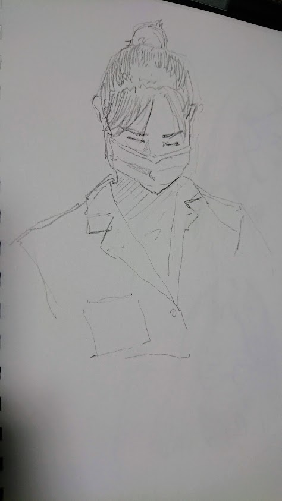

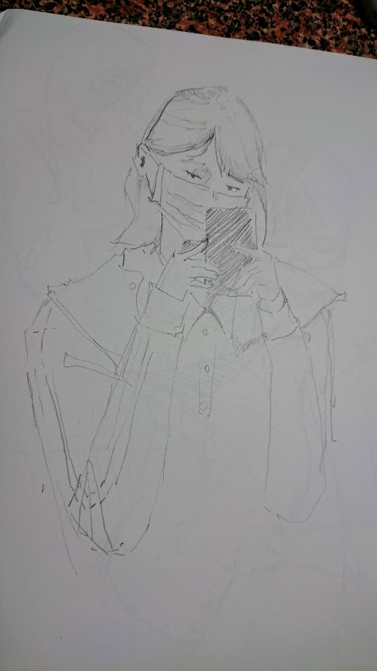

這些速寫其實還蠻多的，已經畫了四本吧，但是不太確定有沒有人要看，

所以我之前的沒PO，本來想說找其中幾張重新電繪過，但是真的沒時間就算惹

  

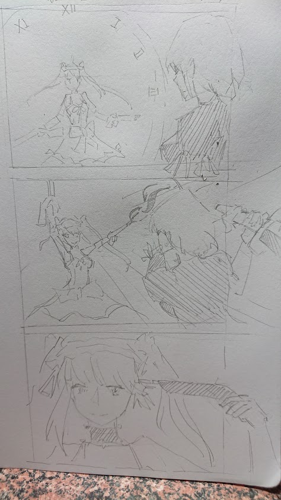

迷之分鏡

  

感覺一直講自己沒時間蠻沒用的，扯那些沒用的更沒用就是了。

但是我還是有再好好研究圖der，

也就是在研究一些畫圖資料，並不一定要動筆，這種知識的積累其實也是蠻重要的。

怎麼覺得講的顛三倒四的，有空再整理吧

  

以上!

$('article.c-text img').load(function () { // 表格內圖片大於表格寬時，設為 100% if ($(this).parents('table').length != 0) { if ($(this).width() >= $(this).parents('td').width()) { $(this).width('100%'); } else { $(this).width($(this).width() + 'px'); } } });
