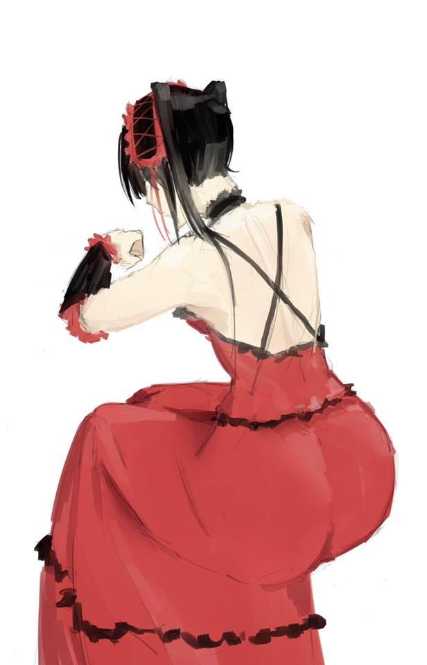
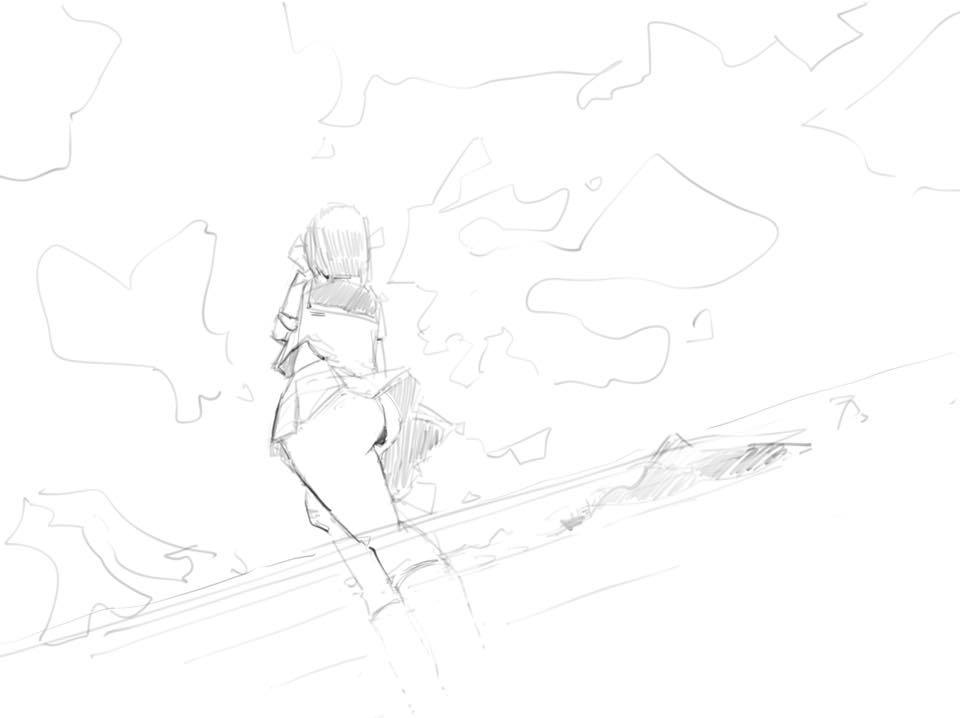
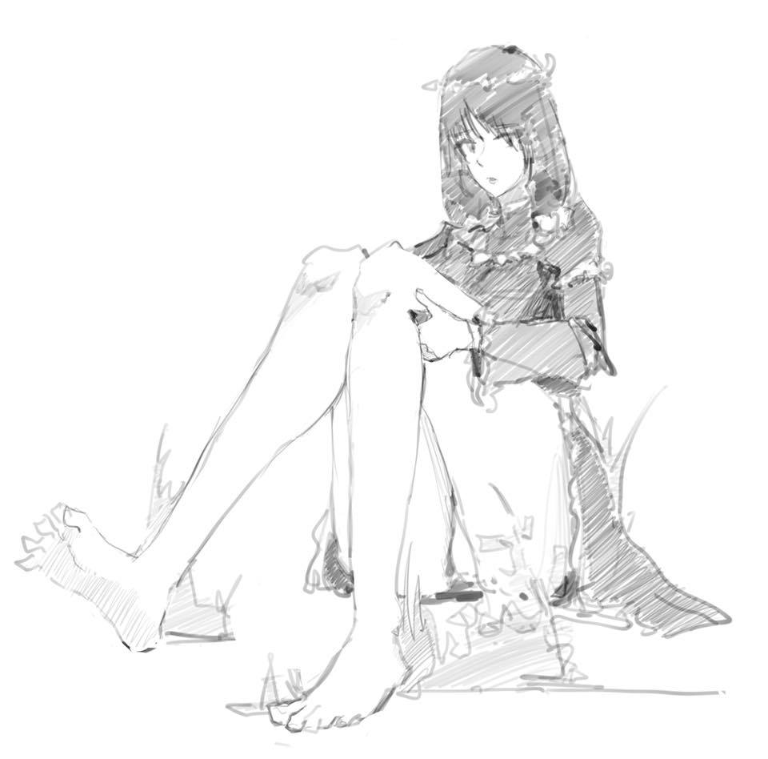
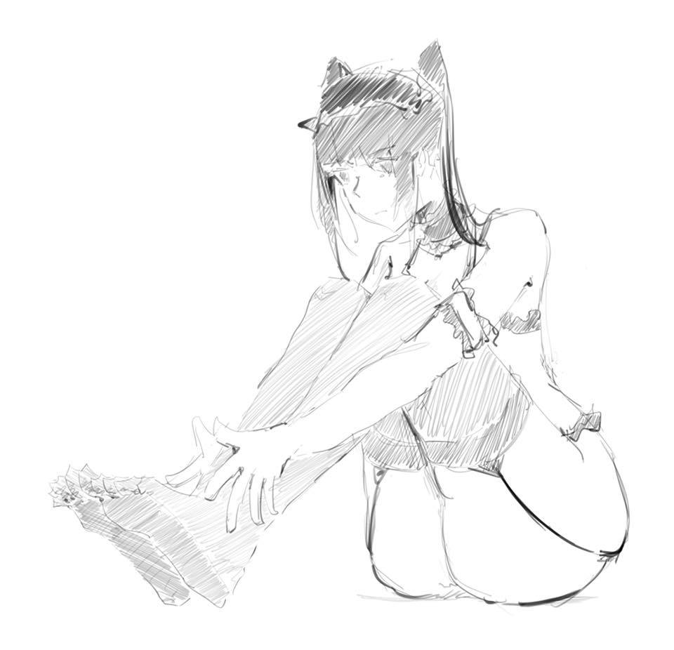
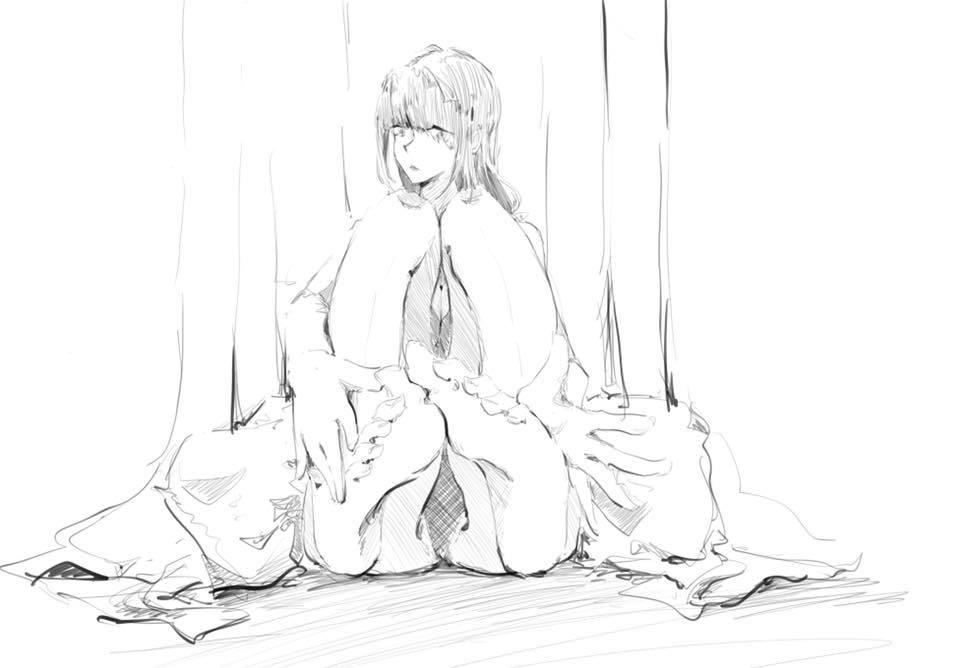
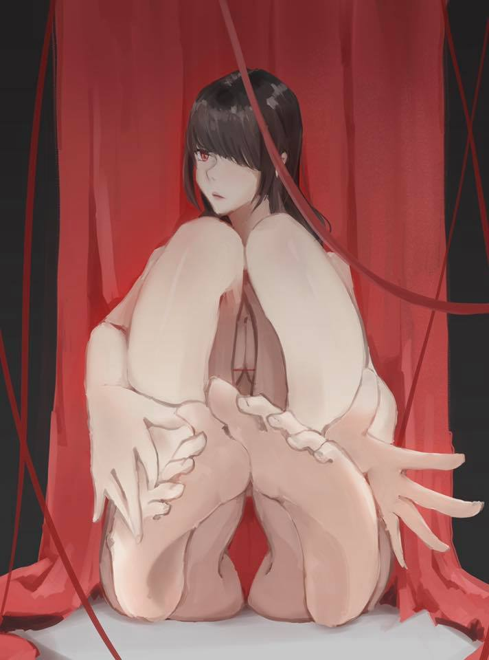
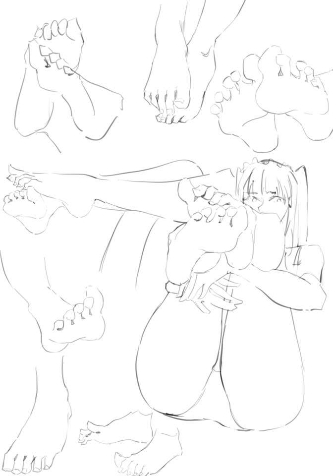
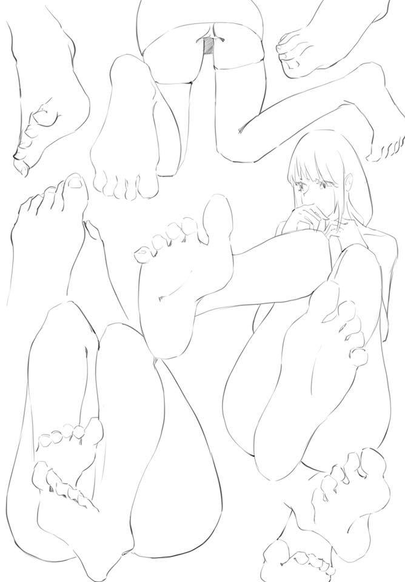
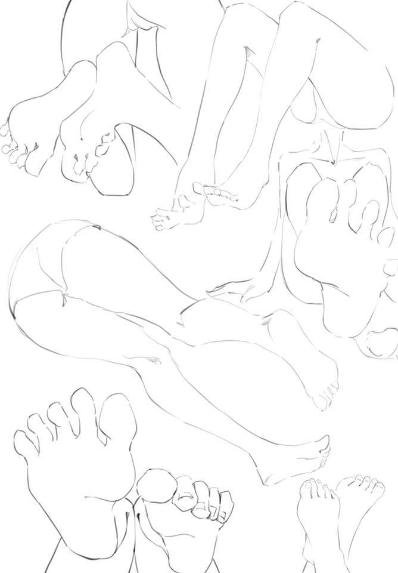
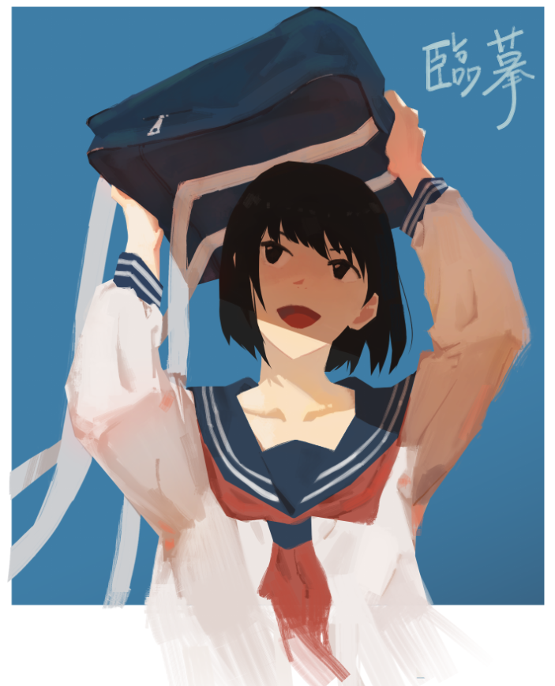

# [塗鴉&練習]合集(4)

> 2020-10-17 · 繪圖 · GP 8 · 來源 https://home.gamer.com.tw/artwork.php?sn=4950886

將近半年不見啦，新的學期雖然論文寫不出來，

但是總算是多一些時間畫圖，

另外這期間也入手了Ipad pro，所以這段時間的練習主要都使用ipad完成，

但也因為這樣大部分的練習都是以線條為主的。

  

那話不多說，就開始吧。

這張是第一張試試水溫，就當作塗鴉吧。

乾，有夠淡，我的草稿甚至是線稿常常會這樣，也算是塗鴉吧

這一團花花綠綠的是什麼我也搞不清楚，可能在復健吧。

這個有把他上色是因為我在做實驗，因為蠻喜歡這種畫風。

有看到類似感覺的歡迎推薦(\*ﾟ∀ﾟ\*)

主要是腳的練習跟臨摹，那些照片是機密。

這張回到電腦作業，因為我發現要臨摹還是用電腦方便，

[原圖在這裡](https://www.pixiv.net/artworks/83283108?fbclid=IwAR3lU8QS8DA4jZ_8lsswCwTZoKLk0WeRk8i9MHcXkGLeJjmASSqLOr_4TI8)

這個作者的風個我就蠻喜歡的，有種印象派的感覺，

就是細看滿粗糙的，但是整體的感覺很棒，有筆觸的細節感。

死神剛出來的衝動，大概不會完稿，

但是他最近說可以對她的身體為所欲為，之後有機會再開車。

  

\---

總之，這段時間應該看的出來主要的練習集中在腳上

然後上色找了一些喜歡的參考，主要是想針對一種畫風去學習，

但臨摹到後來覺得不是很成功，所以就轉換個心情去試試看漫畫了。

  

這次的應該算是789月的夏季回顧吧，照今年的感覺，下次再見就是秋季結束了。

另外，這其實是第二次發，上次翻車惹OUO

以上!

$('article.c-text img').load(function () { // 表格內圖片大於表格寬時，設為 100% if ($(this).parents('table').length != 0) { if ($(this).width() >= $(this).parents('td').width()) { $(this).width('100%'); } else { $(this).width($(this).width() + 'px'); } } });
