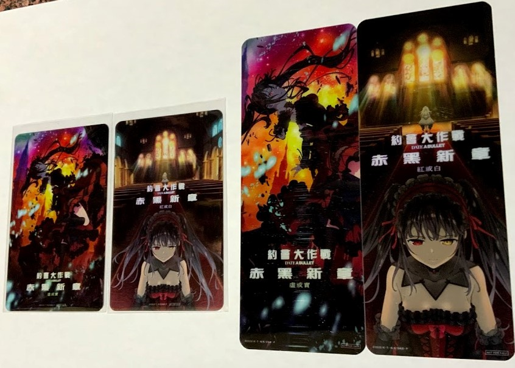
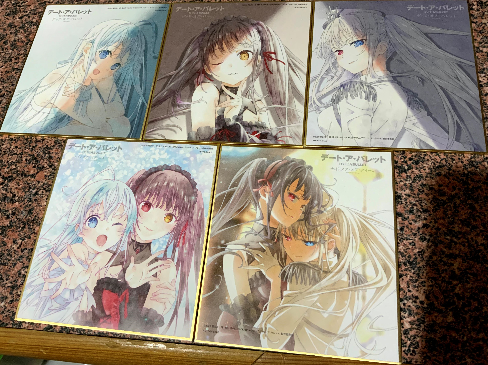
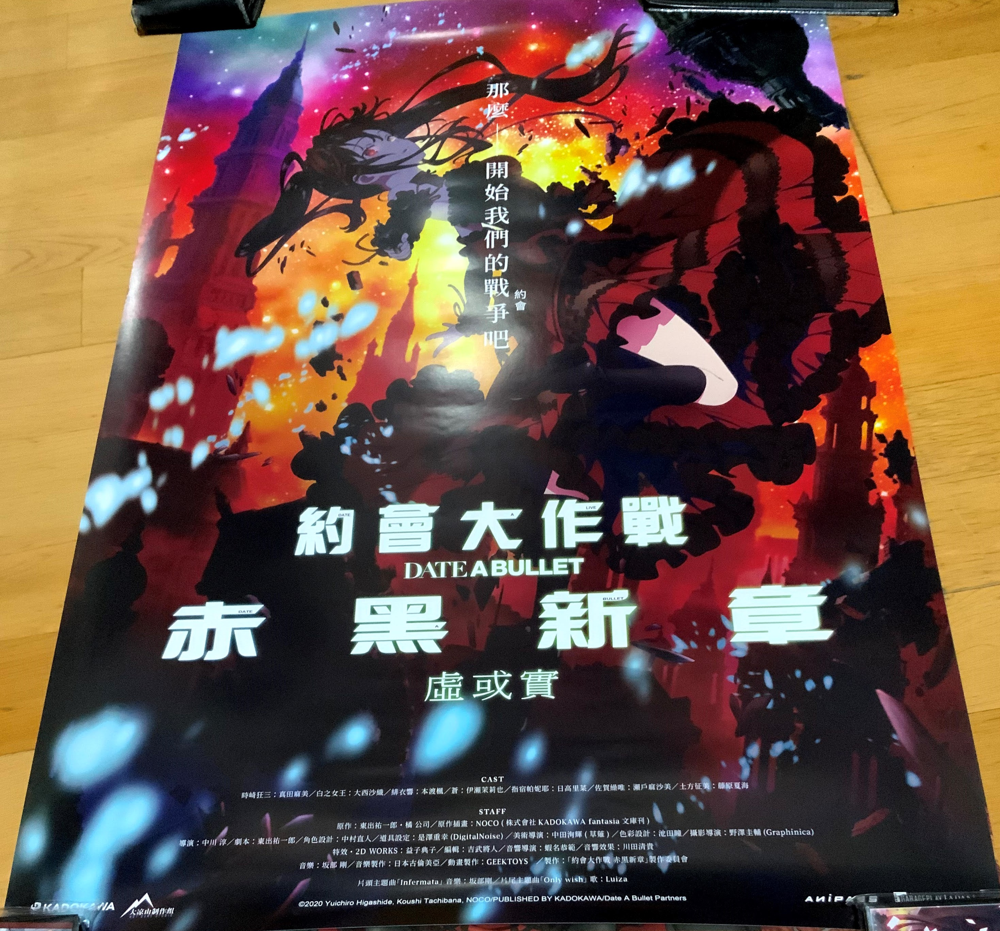
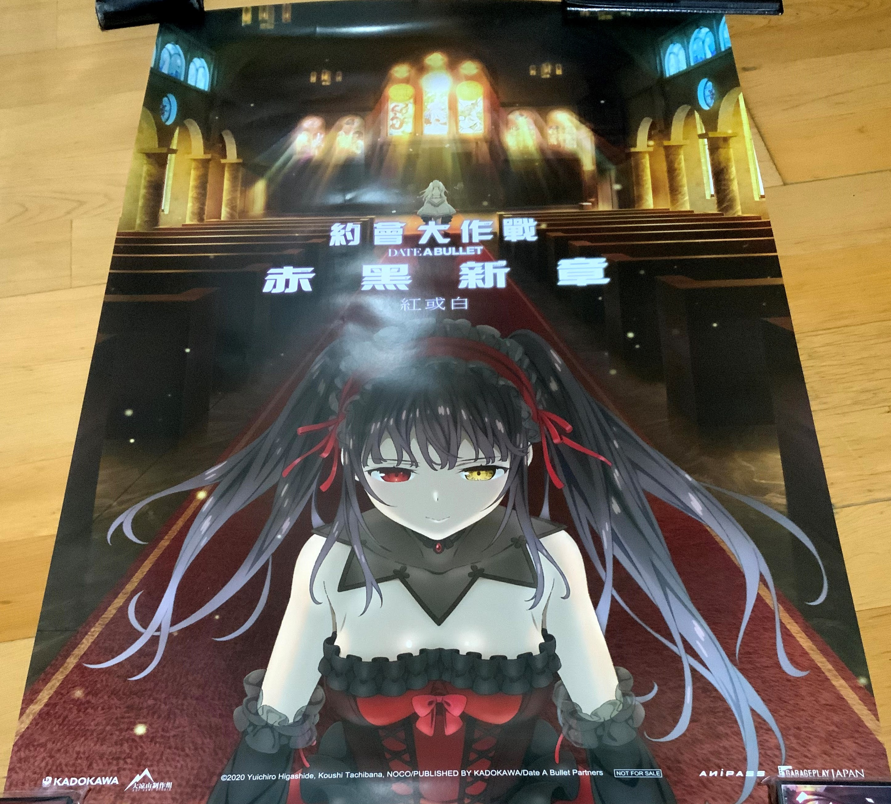
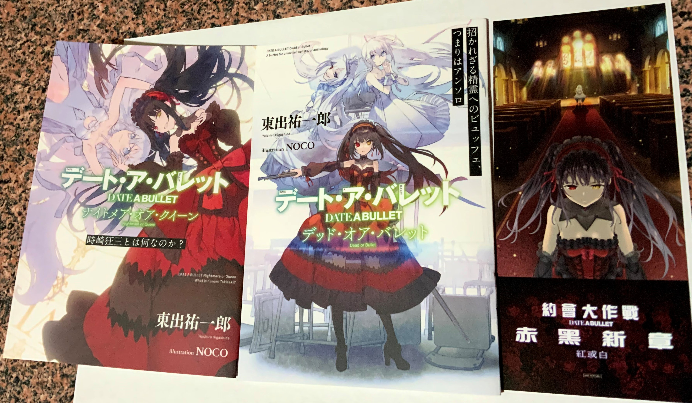
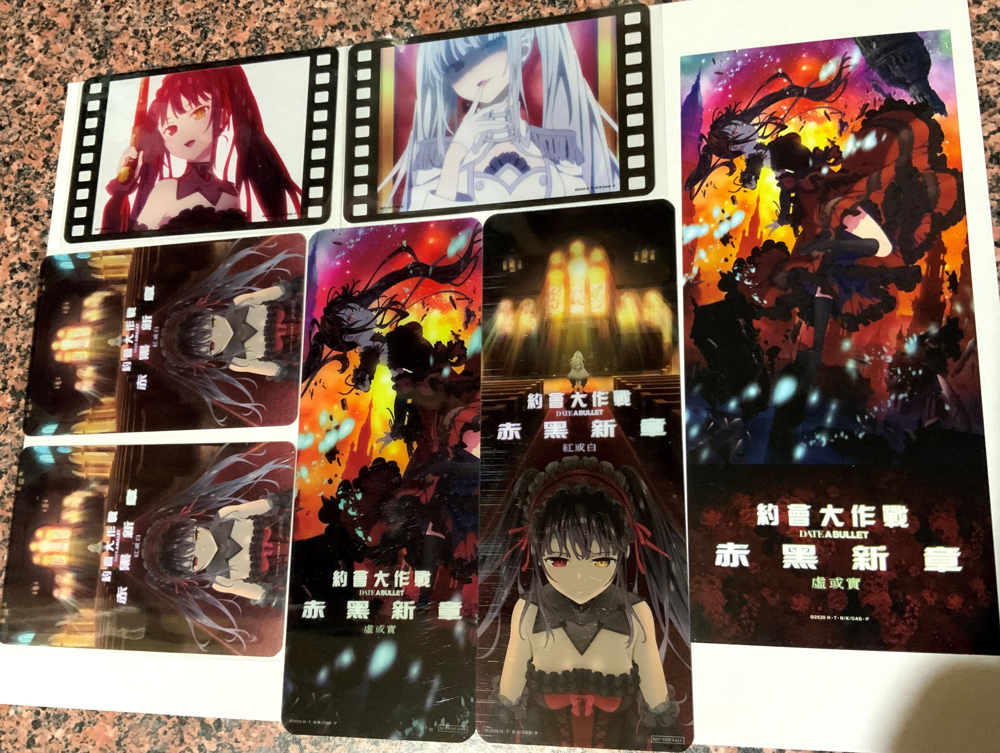

# 【耍廚】約會大作戰 赤黑新章 周邊 心得

> 2020-12-06 · 收藏 · GP 3 · 來源 https://home.gamer.com.tw/artwork.php?sn=5003674

\--2020/12/13更新

跑去二刷買了一個人吃了雙人套餐，短時間應該不想吃爆米花了，

套卡終於齊了，但是又多一張色紙。

PO個套卡跟書籤，不然有點太空了

  

\--原文

前天赤黑新章下篇終於上映啦，

雖然劇情魔改得不好描述，可能整片的精華就已經在預告片播完了。

但只要有狂三就OK，且看且珍惜吧。

心得就擺在後面，雖然大概沒甚麼雷，因為我壓根就不記得演了什麼，可能要二刷三刷吧。

  

那我就先來放一些周邊吧。

首先是色紙，是日本電影上映的特典，台灣好像可以買套餐隨機抽下面兩塊。

  

然後是台灣的大海報

其實還有小海報，但是我就不PO了。

  

然後左邊兩個小冊子也是日本上映特典，右邊的是台灣套票的書籤

  

最後是台灣套餐附的小卡跟一樣是套票的書籤

這邊可以發現我有拿到重覆的(另一款是上集封面的樣式)，

如果有跟我同一場的應該有看到我在跟每個人要不要跟我換，所以在這邊徵求有沒有人要跟我換啊இдஇ，北捷各大捷運站站內都行，歡迎寄信給我或是私訊粉絲團。

  

發這一篇其實主要是想問有沒有人要換，

我這邊還有幾塊重複的色紙，如果有需要也可以拿套卡來換(可能要加點錢，畢竟價格差蠻多的)，或是直接跟我買色紙，我可以用我買的原價賣。

  

\--

咳咳，總之正事處理完了，防雷應該也夠了，那就來講講心得吧。

當初看到要出電影版當然是蠻開心的，但也蠻擔心，

因為外傳(赤黑新章)小說敘事上本來就有點亂，而且角色幾乎都沒有足夠的鋪陳就出現，甚至直接退場，這點跟電影蠻像的就是，一位不具名的朋友陪我去看是全程矇逼啦，值得一提的是他的OP真是一言難盡，但是還蠻洗腦的ww。

另外，因為有看到預告片有出現Queen(白狂三)，所以想說出上下集還蠻合理的，

因為小說是到後面才出現Queen，但是後來看到精美的時間長度，我直接裂開 ( ´ﾟДﾟ\`)，

馬後炮來說，上集24分鐘，下集30分鐘，

怎麼想時間都不夠，所以我就開始害怕，但是轉念一想，這本來就是粉(狂)絲(三)向作品，

而且好像是大涼山(約戰手遊)出資的，所以就且看且珍惜吧。

  

說個結論，整個看點就是狂三，劇情連我看小說都雲裏霧哩，

我都不太確定電影裡的一些設定會不會放到小說裏，但是如果只是想看狂三還是可以去支持的，雖然打戲也是不忍直視。

  

以上!

  

\--

[粉專](https://www.facebook.com/maochinnn/)

  

$('article.c-text img').load(function () { // 表格內圖片大於表格寬時，設為 100% if ($(this).parents('table').length != 0) { if ($(this).width() >= $(this).parents('td').width()) { $(this).width('100%'); } else { $(this).width($(this).width() + 'px'); } } });
