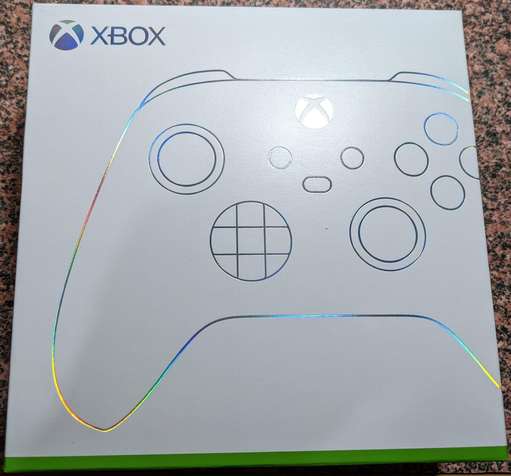
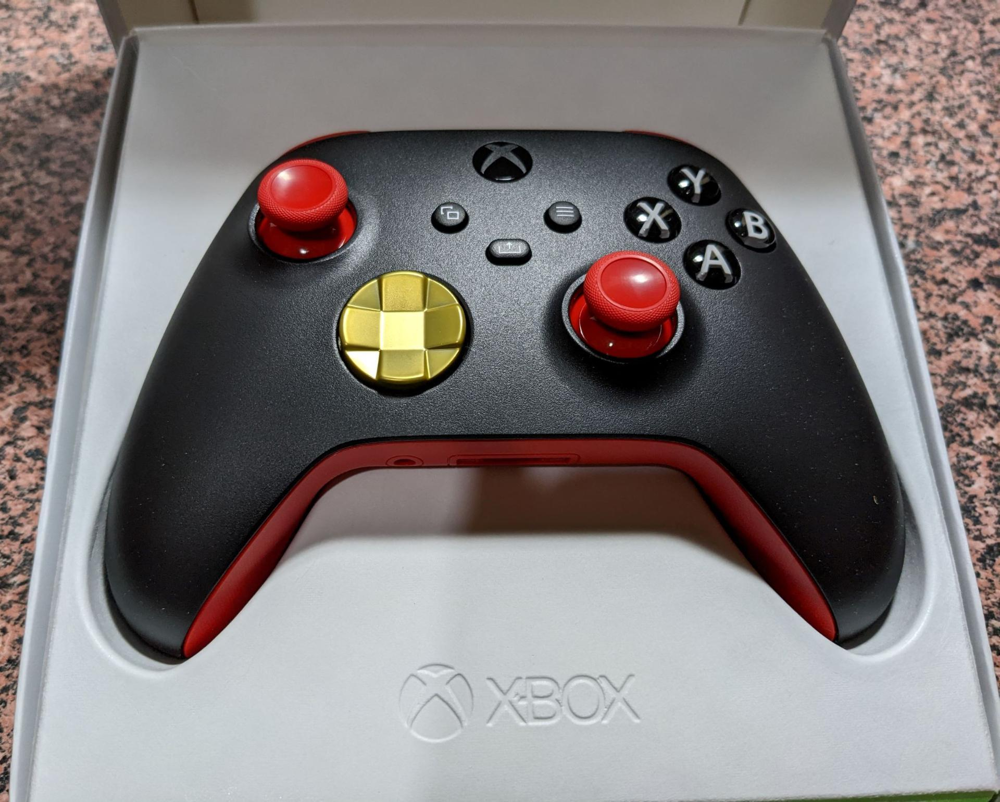
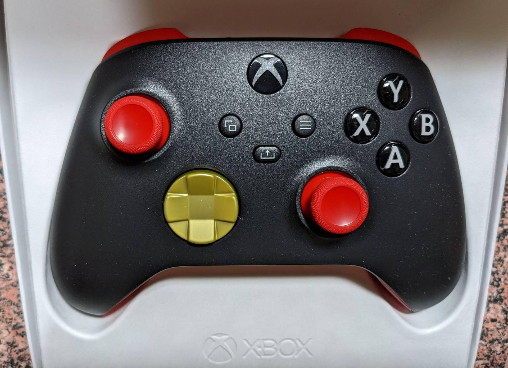
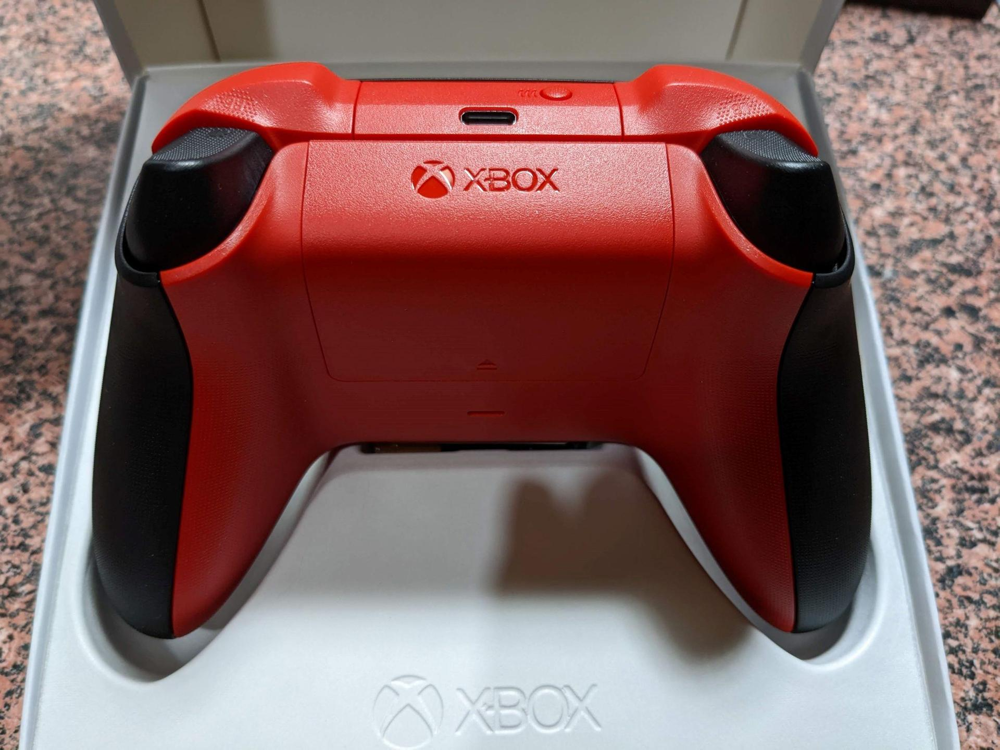
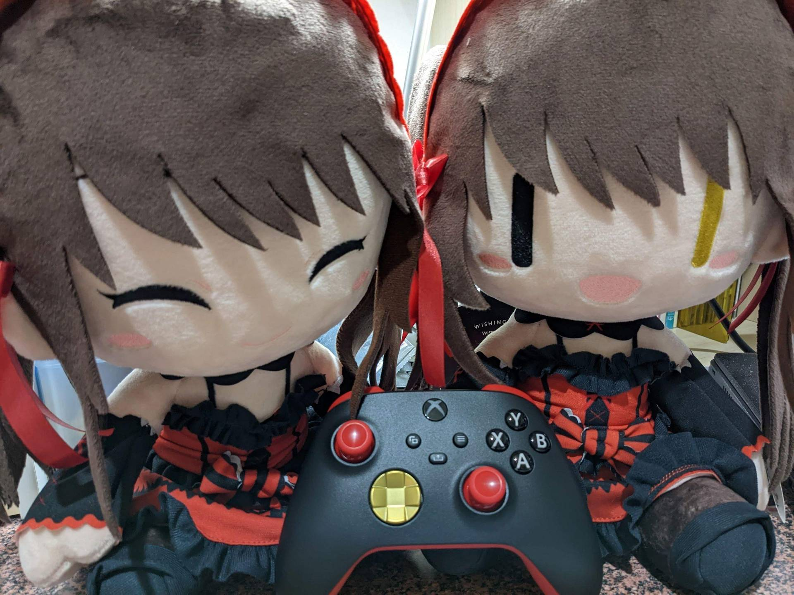

# 【耍廚】 Xbox Design Lab 控制器 狂三配色

> 2022-09-06 · 收藏 · GP 6 · 來源 https://home.gamer.com.tw/artwork.php?sn=5552173

就直接開箱吧

  

首先看一下正面，恩~? 怎麼有謎樣白粉

金色好像沒有想像中亮，應該只是塗一層上去

  

那再來看一下背面

看起來有沒有雙馬尾的感覺~

  

最後來個合照

  

\--

咳咳，那就來點廢話

[設計參考](https://xboxdesignlab.xbox.com/zh-tw/xbox-design-lab?recipeId=HNFN5BCM)

  

因為沒有無線控制器，剛好注意到Xbox Design Lab，所以玩了一下

既然要設計就是要配狂三配色，

第一個就是要讓方向鍵跟搖桿一個金色一個紅色來表現異色瞳，

比較可惜的是兩個搖桿顏色是同步設定的，而因為搖桿已經是紅色的所以就只能用黑色作為基底色，

就把它當作是頭髮的黑色吧，那麼上方就採用紅色來表示頭飾，

而背面就剛好當作是雙馬尾 (可惜不能一長一短?)，

  

整個設計唯一只有方向鍵改成金色要加錢，但這可是靈魂阿 (可惜不能花錢改成時鐘)

大概94這樣，以上

  

\--

廢話第二段

藉這個機會近況更新一下，雖然還沒畢業，但應該能在九月底前搞定，希望

念這個碩士真的比我想像中更耗費精力，本來打算變念邊畫圖的，

但很明顯最近一年幾乎都沒有時間做其他事，因為我實在是不想念到碩四，

  

剩下要抱怨的等我真的畢業再說吧，希望到時候能再回來畫圖

感謝還有在追蹤我的人，感謝。

$('article.c-text img').load(function () { // 表格內圖片大於表格寬時，設為 100% if ($(this).parents('table').length != 0) { if ($(this).width() >= $(this).parents('td').width()) { $(this).width('100%'); } else { $(this).width($(this).width() + 'px'); } } });
