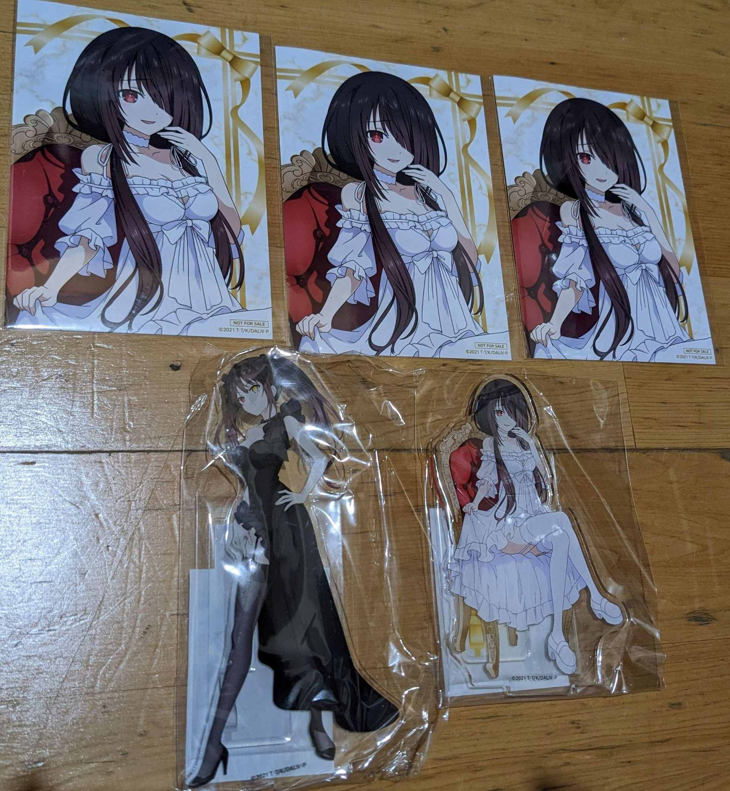
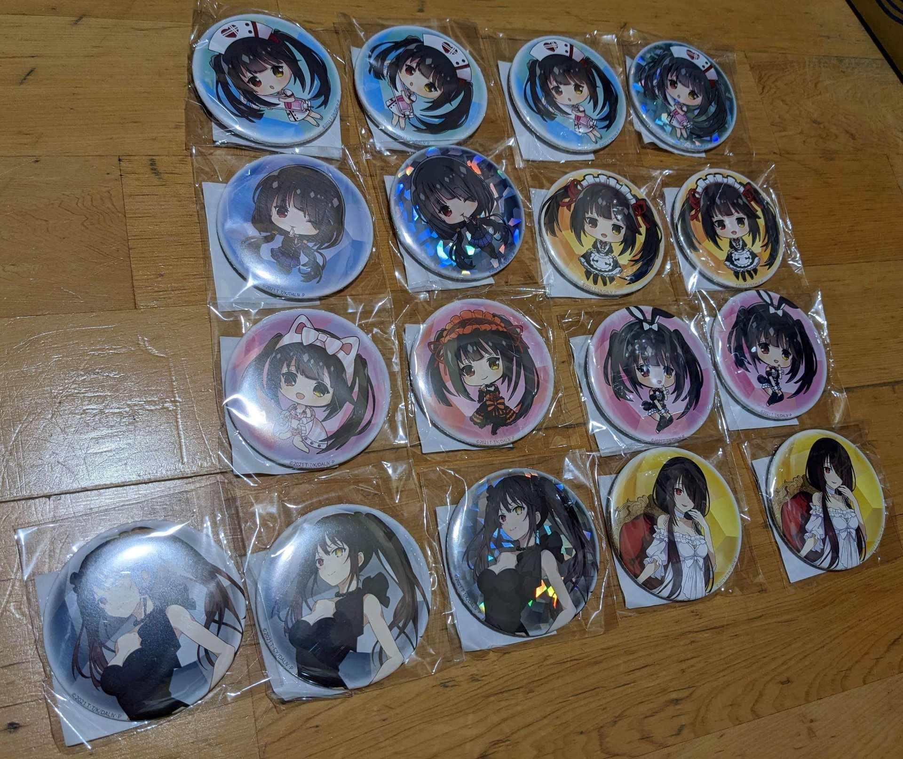
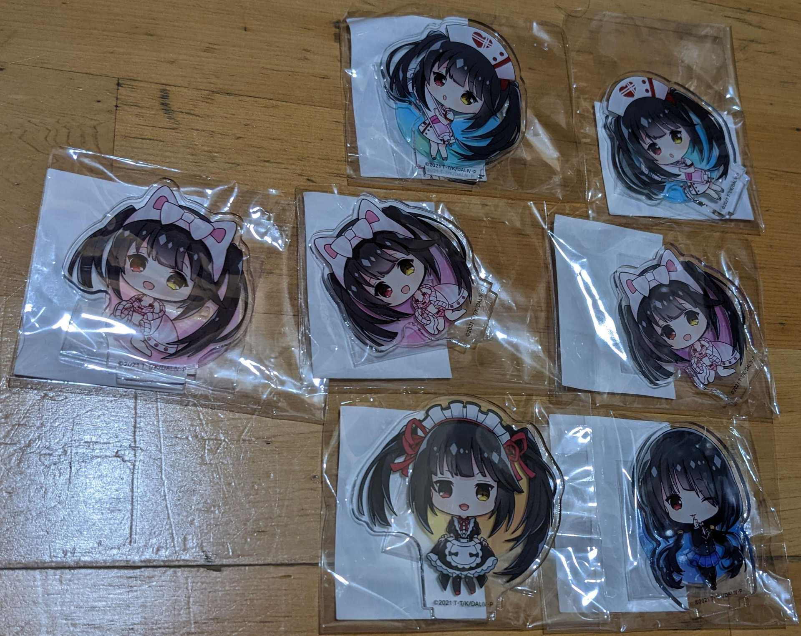
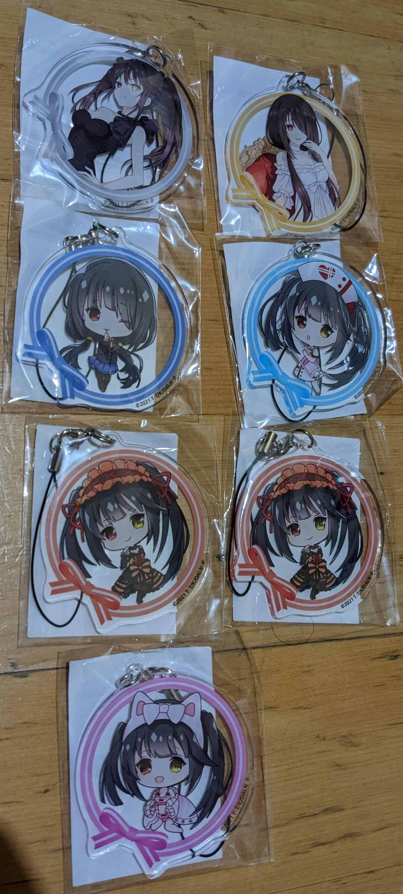
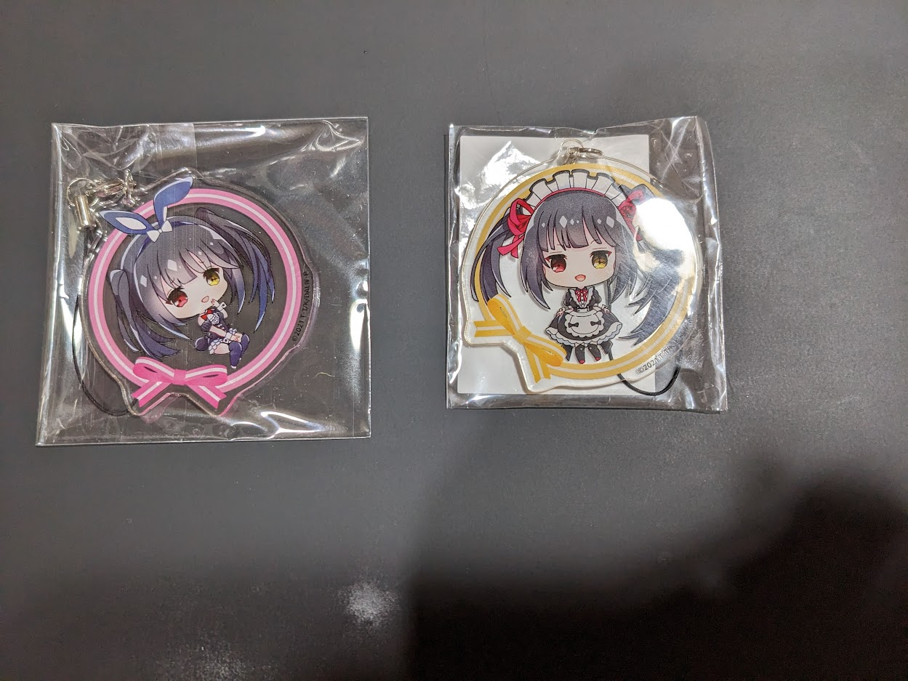
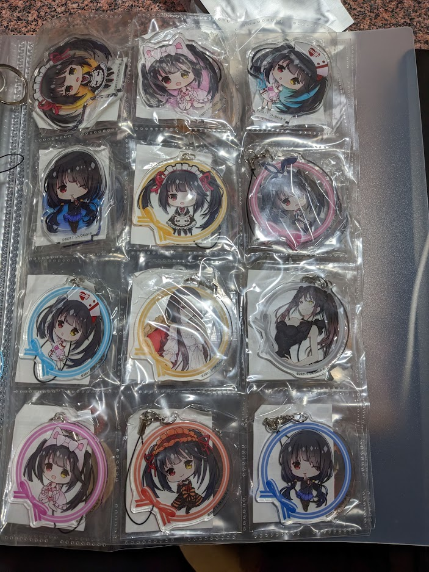

# 【耍廚】わたくしと誕生日デートを始めましょう.

> 2022-09-29 · 收藏 · GP 7 · 來源 https://home.gamer.com.tw/artwork.php?sn=5568947

雖然時間已經過了，但是還是附一下網址

[https://kujibikido.com/lp/date-a-live4th/](https://kujibikido.com/lp/date-a-live4th/)

  

簡單來說就是一番賞，獎品有等身掛軸、立牌、吊飾和胸章，

圖片大致就是那幾張，主要還是衝著黑絲白絲狂三來的，

另外，十連抽會隨機送一個亮的胸章，

在6/10 狂三生日這天十連抽還會再多送一張明信片。

  

但是有鑑於我對自己的運氣沒什麼信心，最後決定來個三十抽，

最終結果就如下圖所示

黑絲白絲各一個立牌還不錯，但是送的明信片都是同一張倒是有點尷尬，

胸章倒是有一整套，

但是其他部分都有缺

  

所以發這篇的目的就是看有沒有同好可以跟我交換ヽ(́◕◞౪◟◕‵)ﾉ

雖然這個好像沒什麼人再抽就是了\_(:3 」∠ )\_

如果想交換、收購或是賣我都歡迎私訊我。

  

\--1120409更新

買到缺的兩個吊飾，所以現在有一整套的吊飾了

  

去除掉重複的部分目前長這樣

  

\--

這次東西蠻多的，剛好是一個系列就單獨發一篇文，順便做一下近況更新

  

終於拿到碩士畢業證書，雖然幾個星期內應該都還會留在實驗室補東西，

但是至少有向前一步，接下來就要等當兵，順便找工作，

更重要的是應該可以慢慢恢復畫圖了或是寫文章了，雖然應該需要復健一段時間。

  

準備畫爆狂三啦 (ﾉ>ω<)ﾉ

$('article.c-text img').load(function () { // 表格內圖片大於表格寬時，設為 100% if ($(this).parents('table').length != 0) { if ($(this).width() >= $(this).parents('td').width()) { $(this).width('100%'); } else { $(this).width($(this).width() + 'px'); } } });
