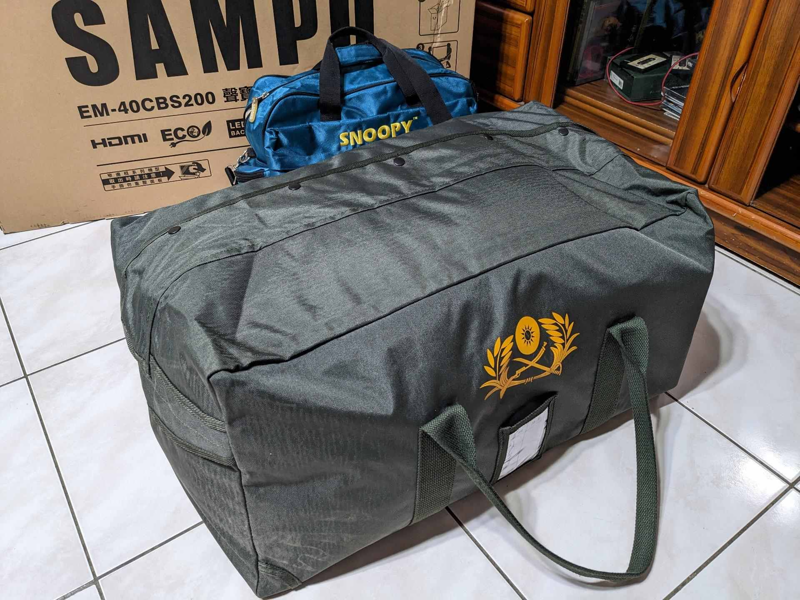
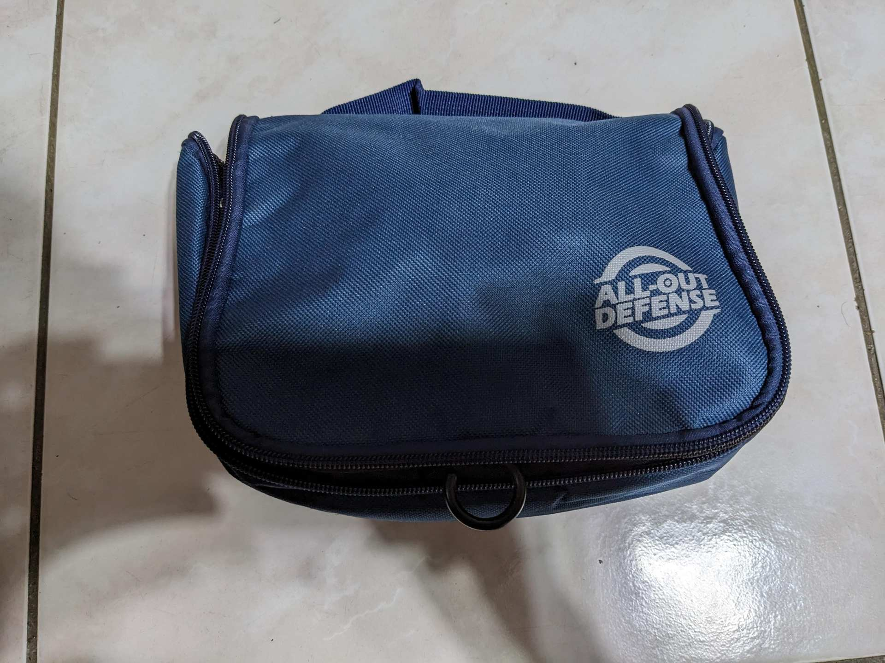
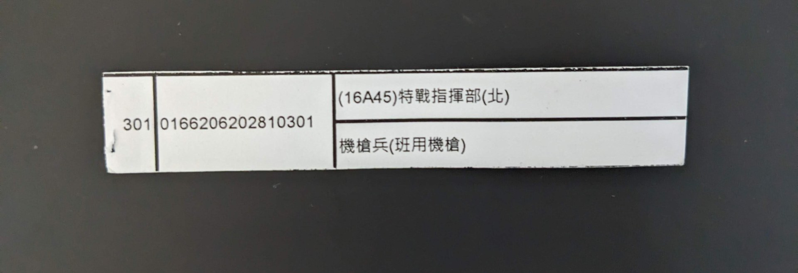
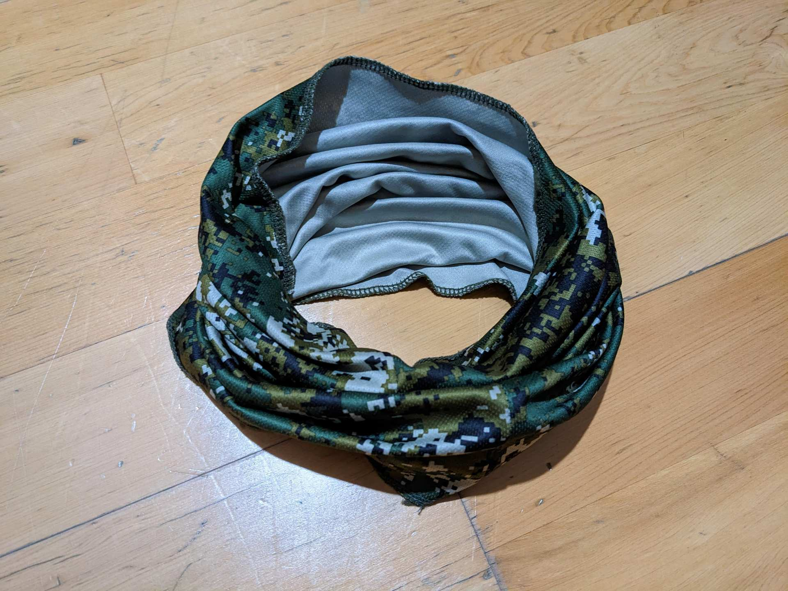
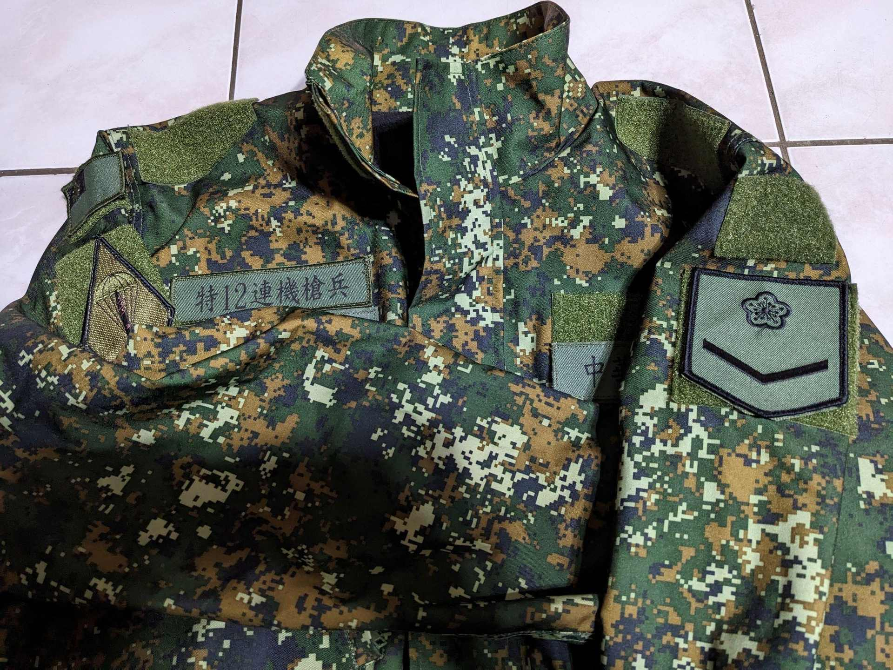
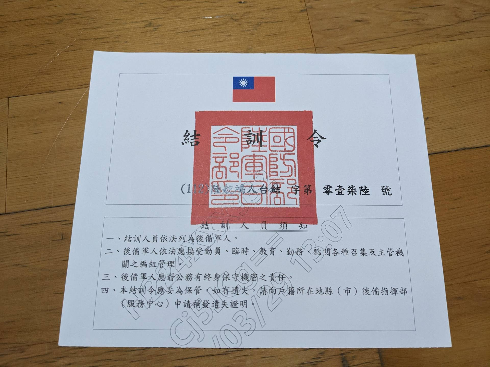
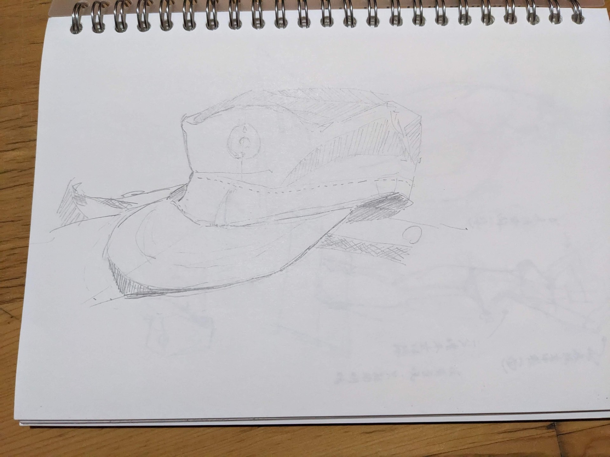

# [退了]166T訓練役/206旅/特戰指揮部

> 2023-05-02 · 未分類 · GP 9 · 來源 https://home.gamer.com.tw/artwork.php?sn=5709421

終於退伍了✧\*｡٩(ˊᗜˋ\*)و✧\*｡

趁東西還沒忘掉之前來稍微紀錄一下，隨手拍幾張順便聊聊吧，文長注意

  

下圖是結訓回來的行李，塞滿滿的黃埔包跟斜背包。

  

那麼還是從頭開始講吧，

在十月左右去區公所排提早入伍，等到今年年初都還沒有消息，

後來是靠一些關係才收到徵集令，

也才確定是166梯，在新竹關西206旅

比較幸運的是可以在年前進去，因為軍中是見紅就休，所以放年假的時候也算當兵的時間。

  

由於這梯大多數都是新北市(少數新竹)，因此大部分人都是在北車集合坐火車過去，

進營區之後就會開始一堆行程，領裝備、剪頭髮、整理內務等等，吃飯也暫時用紙盒套隔熱帶，

由於人太多所以大多數都會直接叫座號，像我是116，一班有12個人，所以我被分到第十班，

而每個班也會被分配到不同的勤務，最累的不外乎是打飯班、浴廁班之類的，

第十班則是公差班，簡單來說就是哪裡有缺人就會被叫去幫忙，但大多數的是沒事的。

  

這個新北市政府發的小包包我都把盥洗用品先放進去，洗澡搶浴室的時候抓了就可以去洗，

相信我，快一秒差很多。

  

通常第一個星期都在聽招募，另外新訓第一周通常也是不放假的，直到第二周星期六懇親才會放，

但我們的第一周剛好卡到過年，所以當然就是直接放假\\(^0^)/

  

只是比較幸運(?)的是我剛好在過年快結束的時候確診，大概多休了一周，

恐怖的是入伍到鑑測大概只有一個月，其中第一個星期在招募、後面又休了兩周，

鑑測裡面的65K2的大部分解、射擊、刺槍之類的根本就沒人教，哭阿。

  

另外因為好像有別的單位有發生膛炸，所以鑑測就不做射擊，

然後確診一個月內也不會測體能(跑3000、伏地挺身、仰臥起坐)。

比較有趣的是震撼教育(就是單兵作戰)的時候那個班長根本不會念，拿著小抄也不知道要講甚麼，

所以不管是搜索、戰傷救護之類的一律都是攻擊前進，導致鑑測官看到我們這一波直接傻眼w

  

但無論如何，鑑測結束之後就代表新訓快要結束了，但更重要的是要抽籤準備下部隊，

然後我一個神抽

乾，特戰是三小。

  

下圖是圍脖，因為關西在山上而且還是冬天所以班長有問我們要不要買圍脖，

但是TMD都快結束才發給我們，哭阿。

  

\--

特戰指揮部，簡稱特指部，在桃園龍潭武漢營區，

在當兵前去查了一下，不查還好，查了看到每天都要運動，

早上要跑步，下午要跑步，

週一跑10000，週二武裝跑5000，週三跑5000，

乾，這是什麼跑步地獄，這還不包含各種操課。

  

撥交那天是做中戰軍卡到營區，接著就被分到12連，也就是一營二連，

166梯的總共有15個人，15個菜兵，而連上剛好有163梯訓練役的學長，

看到他們待退真的有夠羨慕。

  

因為新訓的時間太短，所以接下來的幾週就是各種基本教練，練立正、左轉、右轉、後轉、對腳步等等，

尤其是練習叫長官，還有認識各種班長、排副、輔導長、副連長、連長等等，

而運動也真的是名不虛傳，只是如果真的跑不動還是可以跟班長講，

然後他就會說那是你的大腦在騙你

  

但在精實的訓練之餘，特戰的餐廳除了菜真的是油了億點之外還算不錯吃，

寢室基本上是6個人一間，通常會有學長跟班長，住起來比新訓好很多。

  

下圖是軍外套，右手臂有旅徽、低識別國旗，左手臂是二兵

  

因為我們的下部隊的專長訓是班用機槍，所以大概一個月左右就會做類似鑑測的測驗，

而第一次上去射擊也是最後一次，總共15發，但因為機槍是所謂的面打擊，不是點打擊，

所以射擊只有10公尺，基本上姿勢正確都是打的到的。

  

而在結束測驗之後，基本上來特戰的最大目標就達成了，但之後又遇到戰備週、聯翔操演，

要整週全副武裝，上餐廳都要戴鋼盔、背心、帶槍，剛好那週天氣又不知道在熱幾點的，真是有夠痛苦，

後來還跑去當靶勤，除了要報靶還要搬一堆靶材，弄到2200才回到營區，還好隔天可以補休到0700

  

之後因為我們的專長都拿到了，所以就開始各種出勤務，幫廚、槍前哨、噴漆(其實是拿砂紙磨漆)

另外就是各種保槍，所以也會碰到T91、望遠鏡、夜視鏡、手槍、甚至是排用機槍，

在特戰也會稍微教看地圖、手勢之類的東西，

比較可惜的是三姿態、戰傷救護、CQB因為連上人力不足所以都沒有上到課。

  

而最後幾天剛好要遇到要搬兵舍，然後又有大概一半的人提早退了，導致結訓前都還在瘋狂搬東西，

但還好我退了

  

不得不說四個月我瘦了快10公斤，雖然我也有在控制飲食，但是身體也真的有比較好，

特戰真好(?)

退伍之後應該就是要開始認真找工作了，希望一切順利吧。

  

「阿利阿扎以西亞 哪嚕哇 喔嗨呀」鋼盾臂!

  

  

\--

帶到軍中的手機最好不要用主力機，有些人裝MDM手機就開始怪怪的，

也有可能摔來摔去，到時候還要修很麻煩，也記得不要帶中國機，

另外安卓的解除安裝也很麻煩，通常要回原單位(像我就是關西)才能弄，

不然就是要還原回原廠設定才能弄掉。

  

\--

在軍中我也有稍微練練手感，這邊就不詳細PO了，

因為緊接著我就要去上K大的構成課了（＞﹏＜）

$('article.c-text img').load(function () { // 表格內圖片大於表格寬時，設為 100% if ($(this).parents('table').length != 0) { if ($(this).width() >= $(this).parents('td').width()) { $(this).width('100%'); } else { $(this).width($(this).width() + 'px'); } } });
