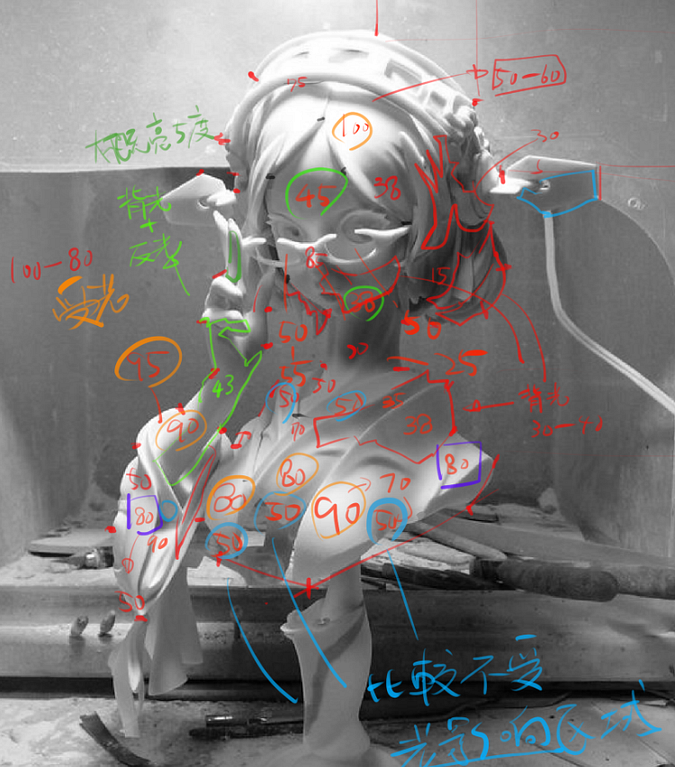
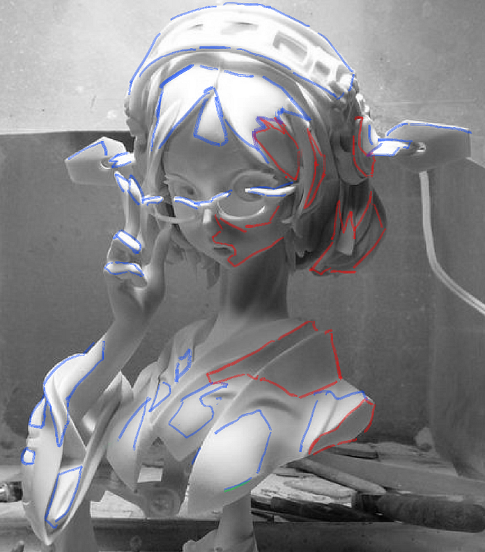
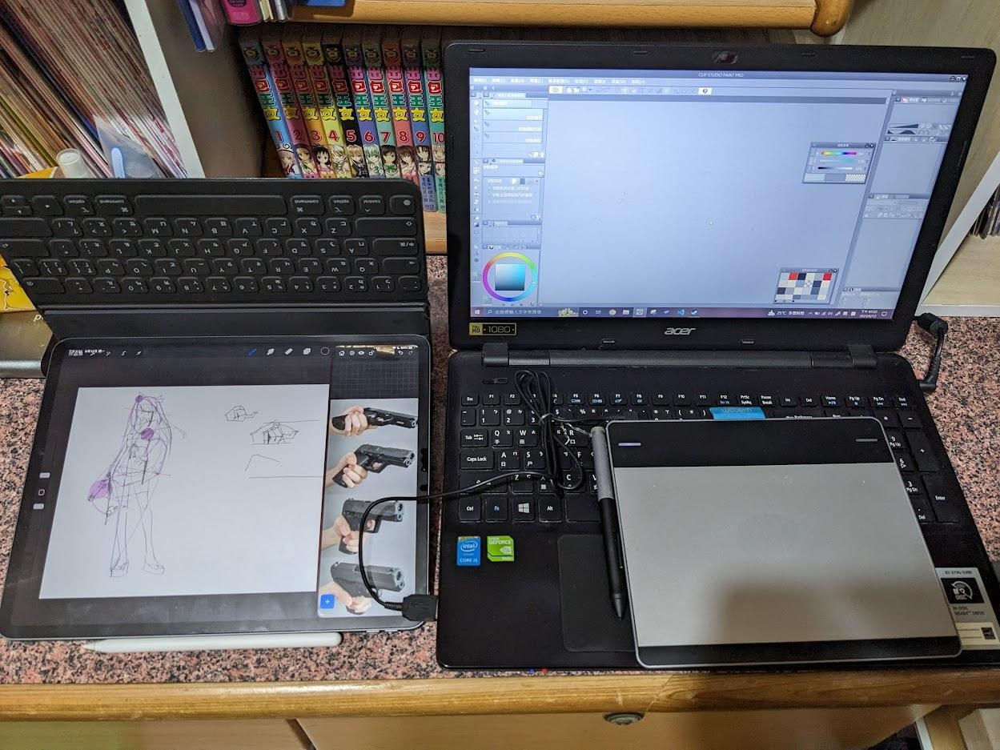

# 【圖與畫】從電腦圖學看數位美術

> 2023-06-12 · 【圖與畫】 · GP 8 · 來源 https://home.gamer.com.tw/artwork.php?sn=5735072

做為一名**電腦圖學(Computer Graphics)**出身且有一點**數位繪圖(Digital Painting)**經驗的人來說，在整個大學和研究所期間都一直有想聊聊這兩者之間的關係，直到最近求學生涯算是告一個段落，再加上近年的AI繪圖愈發火熱，我才下定決心來寫這一系列的文章。

  

作為一名程式員，我們總是有一個貪婪的想法，我們想將「美」化約成數個元素，利用不同的數學模型(model)想方設法地去擬合(Fitting)不同的風格，用客觀的事實去理解主觀的感受，因為理論上要能夠定義「美」，那麼就一定能夠寫程式。

  

> 將「美」用冰冷的規則束縛住，使它不再神秘，使他不再美。
> 
>   

這件事情如此矛盾卻有無數人前仆後繼的追求這個聖杯，我不知道最近火紅的AI Art會不會是終極的解答，倘若是，那我們對這個產生「美」的AI又能了解幾分呢？所以我們不妨將視野拉回過去，看看前人如何追尋，從電腦圖學發展的路徑來探究美術。

  

# 引言

我從電腦圖學中學到**灰階(Grayscale)、樣條曲線(Spline Curve)以及高斯模糊(Blur)**等專有名詞，另一方面在學習電繪的過程也會看到**素描關係、曲直、虛實**等概念，某種程度上，彼此好像有某種關係，例如：電腦可以用絕對的數值去描述一個像素的灰階值，但我們是否能夠定義黑、白、灰各自的範圍？顯然這是做不到的，因為黑白灰是相對的感受。

  

就像是K大在許多課程所描述的，我們雖然不能用絕對的數值去一概而論，可是若在分析繪畫的時候能夠借助**絕對的數值就可以更具體的理解一些相對的概念**

  

依據灰階值去分析大致的區塊

大致的黑白灰分布

  

我在[塑造練習](https://medium.com/maochinn/筆記-塑造練習-ce656f217735)時會用數值來記錄黑白灰的各自的範圍，他們的數值不是重點，重點是你下筆的時候會有意識到你畫的是「黑」的部分，且在數值上不能畫到「灰」或是「白」的數值範圍，因此「電腦的角度來看美術」這件事可以幫助我們**理性的理解人感受到的感性**。

  

  

# 從電腦看美術

美，是一個相對主觀的感受，倘若在一個浮動標準上則難以討論，或者說討論前需要有大量的前提與共識，因此，我們透過電腦將「畫」數位化後成「圖」之後，其重點不是每個像素的數值，而是我們可以用一個**共通的標準**，來有意義討論繪畫。

  

因為過去在討論繪畫的時候，如果基礎的認知有偏差，往往會導致進階的溝通無法繼續，舉例來說，可能你認為的黑是30，而他認為的黑是10，那接下來要討論調子時可能就會牛頭不對馬嘴，換言之，**數位化就是我們討論繪畫的一種共通語言**。

  

然而，在電腦這個平台上衍生出的電繪，或者準確地說是[數位繪畫(Digital Paining)](https://en.wikipedia.org/wiki/Digital_painting)，無論板繪或是螢幕繪，使用手指或是觸控筆，小畫家或是PS，雖然是不同的媒介，但最終仍是將其進行不同程度的數位化，將其顯示的螢幕上或是印刷到紙張上，這都都會利用到電腦圖學，因此我們不妨進一步將視角專注在**電腦圖學是如何表現數位美術**的。

  

# 從電腦圖學看數位美術

或許在一定程度上「如同電腦、機器般的思考繪畫」這麼說似乎有些令人排斥，但是，至少到目前為止，絕大多數現有電腦中的繪圖軟體還是人寫出來的，換言之，**電腦的思考就是無數工程師思考後的結晶，也是無數人實驗並且反覆驗證的結果**，也就是說，這些看似無趣的知識、規則，卻是客觀上最科學的解釋。

  

因此這就是這個系列【圖與畫】的動機，我會儘量講的白話一些，當然，我更希望的是能夠普及一些電腦圖學的知識，也企圖系統化傳統美術的一些概念，讓繪畫的藝術家可以理解很多功能為甚麼可以這樣設計，電腦圖學的工程師可以理解一些抽象的概念。

  

現在以及過去的電繪設備： Ipad Pro 12.9 + procreate 以及 繪圖板 + CSP

  

[剩下部分請移至Medium觀看(免費！)](https://medium.com/maochinn/圖與畫-從電腦圖學看數位美術-ccd7e8ef7536#ba38)

  

\--

如果想支持繼續寫【圖與畫】系列文章歡迎給我GP或是贊助！

  

\--

【圖與畫】系列是我在大學+研究所一直想動筆的系列，目前已經想好的主題約有十篇，因為仍有其他的筆記、文章要寫，同時又要畫圖，當然也要工作，因此暫定是以月更的形式慢慢寫，也就是應該會是長達一年的系列文章。

  

這個系列算是對圖學領域做一個科普，也算是彌補這幾年說好要寫相關文章沒有寫的遺憾，考慮Medium寫文章的排版比較好看，巴哈會以短篇的形式來做(目前是放引言的部分，之後可能考慮變成濃縮版?)，這邊也開始嘗試贊助或斗內，總體來說，算是一個實驗兼整理吧。

  

以上！

$('article.c-text img').load(function () { // 表格內圖片大於表格寬時，設為 100% if ($(this).parents('table').length != 0) { if ($(this).width() >= $(this).parents('td').width()) { $(this).width('100%'); } else { $(this).width($(this).width() + 'px'); } } });
