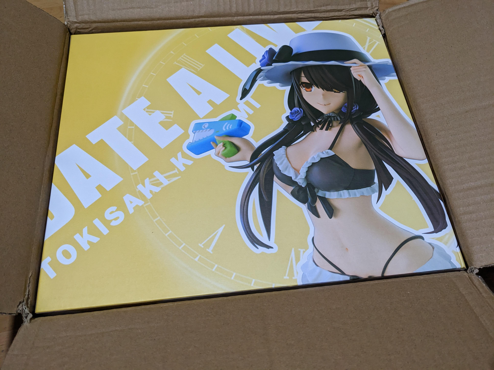
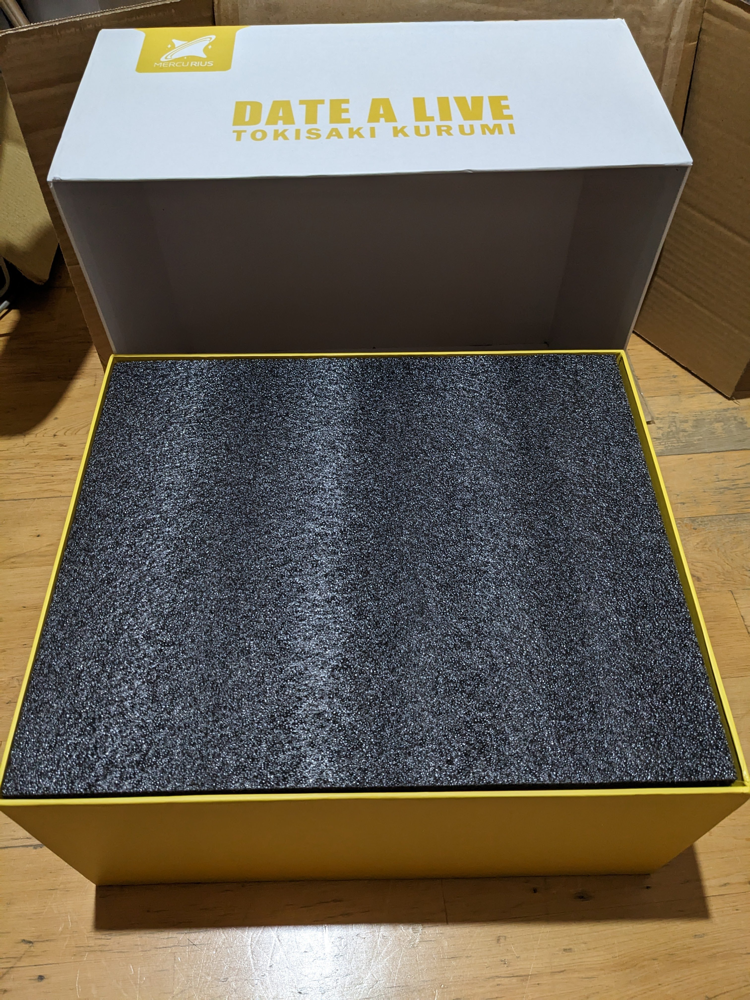
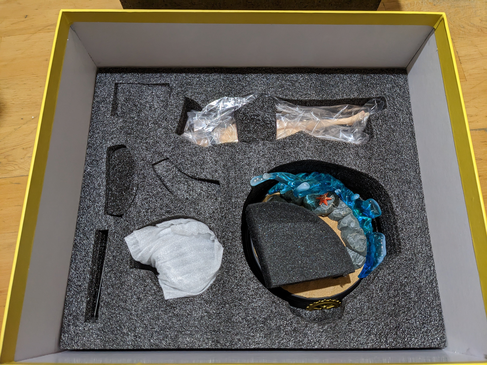
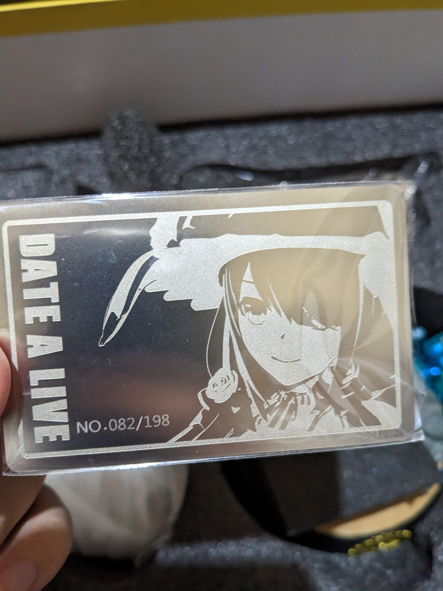
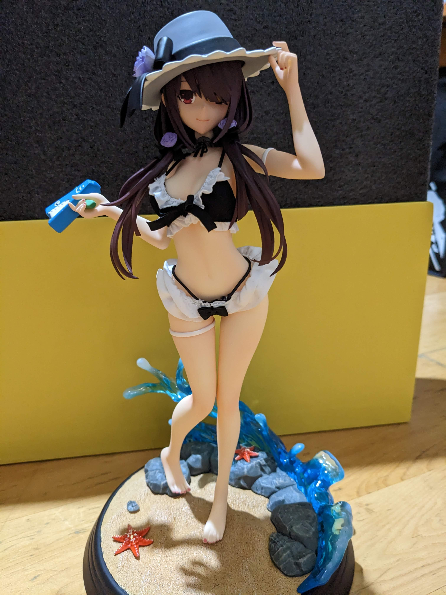
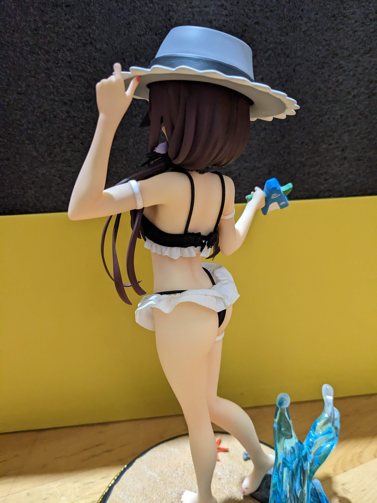
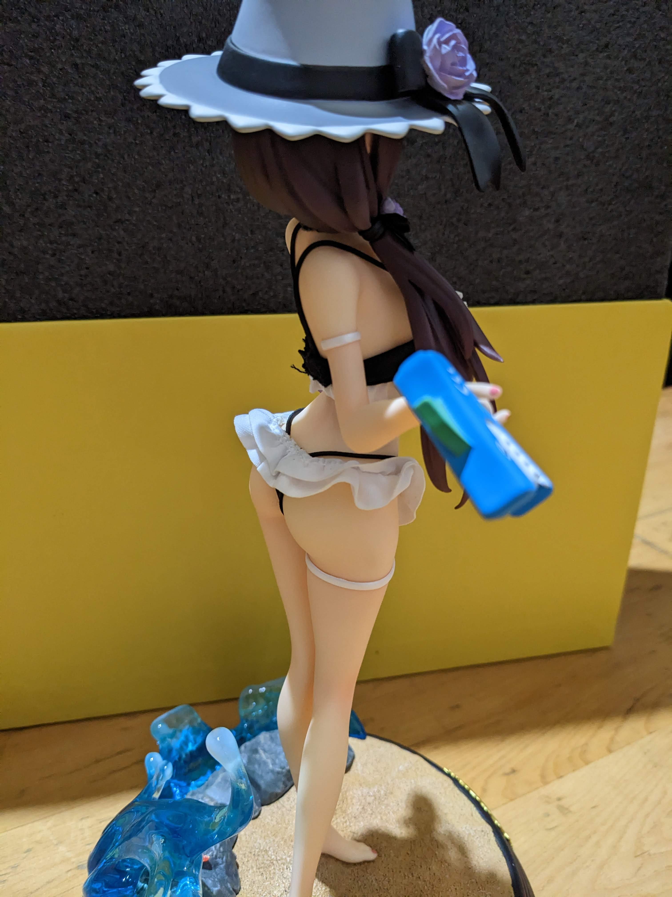
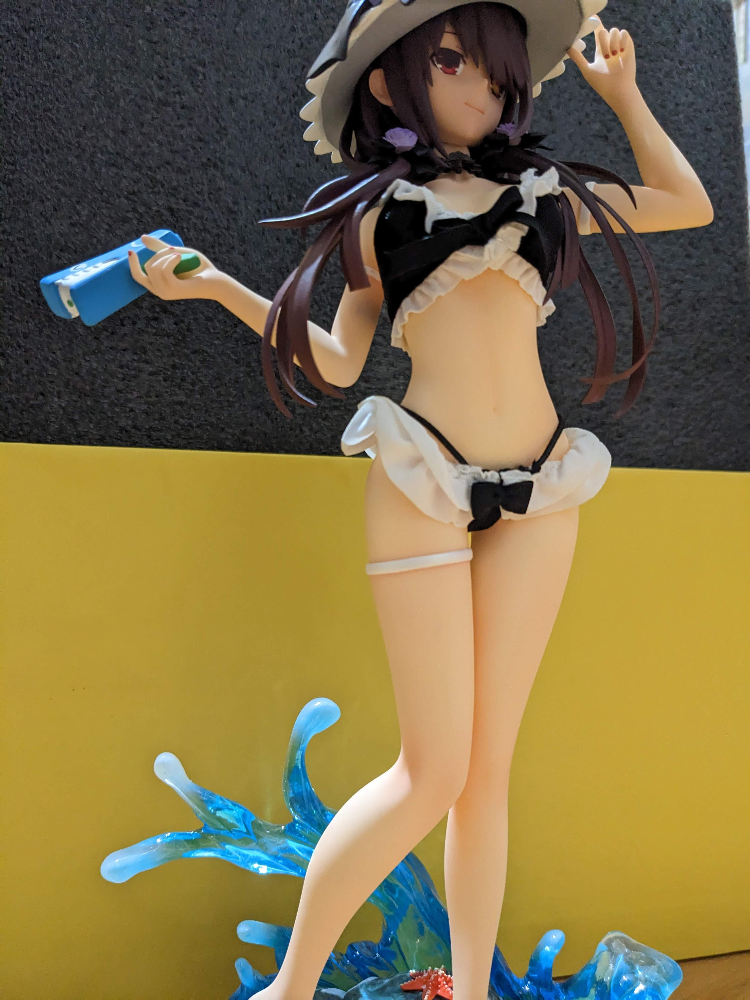
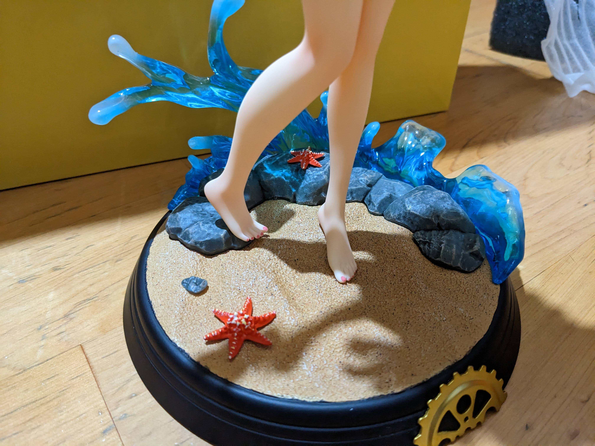
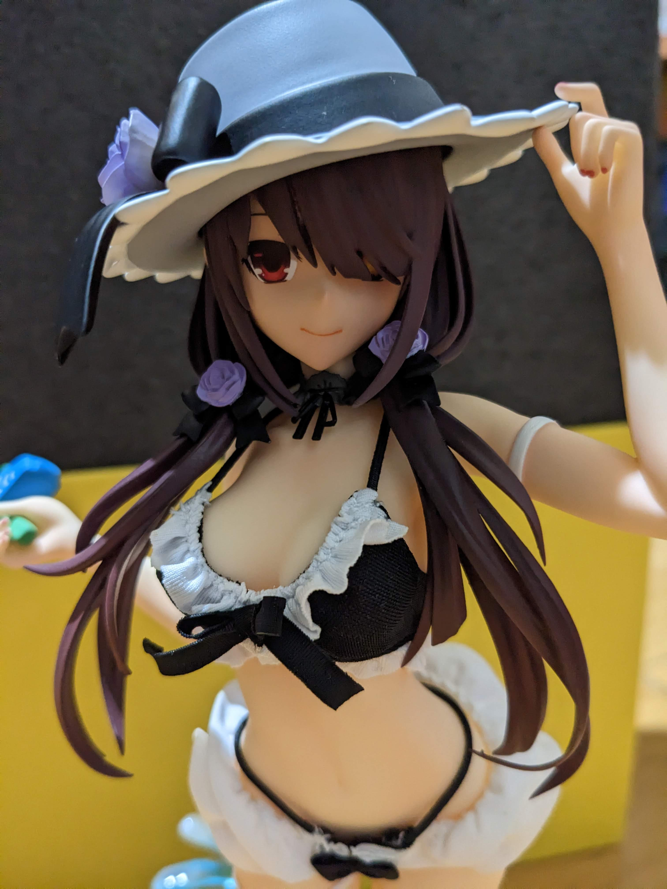

# 【耍廚】Mercury(水星) 時崎狂三 泳裝少女系列 第二彈

> 2023-06-20 · 收藏 · GP 6 · 來源 https://home.gamer.com.tw/artwork.php?sn=5739834

文章要寫，廚也要耍

  

話不多說，來開箱吧

首先，裡面的盒子跟外面的紙箱非常吻合，還好看起來沒有甚麼撞的痕跡

  

裡面跟之前開箱過的萬聖節狂三類似

  

有一張卡，應該是總共生產198隻

  

組裝起來後

布料既然真的是布料!

所以你會發現飄起來有點不受控XD

材質摸起來蠻舒服的(?

至少跟PVC不太一樣的感覺，整體做工比想像中好

  

下面的台座蠻重的，但也蠻精緻的。腳腳讚

  

最後來個特寫

  

\--

總結一下，目前拿到中國製的這2隻狂三品質都蠻不錯的，

而且價格上也比日本PVC便宜，

比較麻煩的是通常限量且消息比較少，所以要特別留意才知道有出，

之後還有兩隻沒來，到時候如果看到沒有人開箱我應該也會稍微簡易開箱一下。

  

以上!

\--

### **延伸閱讀**

[約會大作戰 萬聖節 時崎狂三 GK](https://home.gamer.com.tw/artwork.php?sn=5229101)

  

\--

歡迎點讚，開箱我就不放贊助連結了XD

  

$('article.c-text img').load(function () { // 表格內圖片大於表格寬時，設為 100% if ($(this).parents('table').length != 0) { if ($(this).width() >= $(this).parents('td').width()) { $(this).width('100%'); } else { $(this).width($(this).width() + 'px'); } } });
