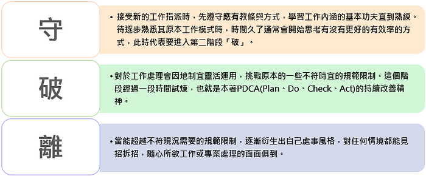

# 【數位美術】Krenz 構成十期-00-序

> 2023-07-09 · 筆記 · GP 5 · 來源 https://home.gamer.com.tw/artwork.php?sn=5752215

雖然都講構成課，但這堂課的全名是動態與構成，事實上，我認為動態才是貫穿整門課的核心，有了動態才有了構成。

  

接下來預計會將構成課的筆記分成四個部分：

1.  動態
2.  構成
3.  線稿
4.  創作

  

順序上不會依照上課的順序，因為一定程度上K大設計課程有顧慮到由淺入深，但我的筆記比較注重知識點的脈絡，另外這也是我自己理解之後的結果。

  

這篇文章做為構成筆記系列的序，我稍微對整個課程做一個引言，就如同K大所說，構成是一門思考課，因為相對於透視、色彩會一定程度的客觀標準，構成有更大一部份是更加主觀的認知。

  

[https://www.lccnet.com.tw/lccnet/article/details/691](https://www.lccnet.com.tw/lccnet/article/details/691)

  

為了引導有效的思考，K大也有引用所謂的**「守、破、離」**的概念，也就是先遵守他的體系學習，接著做一些嘗試去打破規則，最後離開並且建立自己的體系，換言之，就是先拋下自己的成見，先去理解當前的例子，先不要去拘泥於其他的反例，以此建立一個初步的體系來學習，避免落入前面所述，在還沒嘗試理解之前就被困在原地。

  

直白點說就是先**大膽的假設**當前的前提是正確的，以此去學習，當然，既然前提是假設，那就可能**假設錯誤**，所以同時我們需要**小心的驗證**，此時就需要修改規則逐步建立自己的體系，但這邊我認為也不需要做到盡善盡美，而是在合理的範圍內，讓我們的體系是大致正確的即可，也就是我們不需要做到一個大一統的終極通則。

  

進一步說，構成課的知識點因人而異，**不同的人對於相同的圖能做截然不同的解釋**，反過來說，對於一張畫的解釋總會有人不同意。舉例來說：一張人體速寫的動態，有人認為是這樣的曲線，也有人認為是那樣的曲線，有人試圖歸納是依照輪廓或是身體的骨架來表現動態，但在不同的圖中你永遠都找的到反例，但無論使用再複雜的規則總有例外，這個時候，邏輯的大腦就會崩壞，有人會說這不是科學，是**玄學**。

  

事實上，前述的那個人，就是我自己。

  

總結來說，整個課程中有許多的知識點是需要透過自己的歸納、演繹來整理的，因為他人的體系或多或少都會與自己的想法有所矛盾，因此，更重要的是能夠找足夠「合理」的解釋來說服自己。

  

因此，這整個筆記並不一定能夠說服所有人，但至少在一定程度上，我會有一個我認為合理的說法去解釋。實際上，我們思考常常是以原因的角度思考，例如：為甚麼這樣的人體會構成這樣的動態？為甚麼動態設計成這樣？而我上完一系列課的想法是，我們不妨從目的的角度思考，為甚麼我們需要動態？或者換個方式問，如果沒有動態那會對畫造成甚麼影響？這就是下一篇要去說明的。

  

在課前，或者說色彩課之後的三年間我也做了許多或多或少跟構成相關的練習，雖然沒有系統性的學過什麼動態素描或是速寫，但至少也做過一些嘗試以及實驗。

  

[完整版請移至Medium觀看(免費！)](https://medium.com/maochinn/數位美術-krenz-構成十期-序-cd7044e31c31#e9e8)

  

\--

如果覺得有幫助到你或是想支持我歡迎給我GP或是贊助！

  

\--

最後分享一下，我終於上完K大三門課了，這次距離前面兩堂課大概有三年的時間，因為中間念碩士也沒什麼認真畫圖，所以藉著構成課的機會算是久違的認真畫圖的兩個月，讓我知道雖然三年間沒有畫很多完整的作品，但是斷斷續續的練習與研究仍是有價值的，並且嘗試了許多不同於過往舒適圈的方式畫圖。

  

另外，也透過這個思考課的機會，回頭重新釐清許多過去心中的疑問，也看到距離三年前的課程，團隊對於課件以及流程有很大的進步，這讓我遊戲體驗相當良好(？，也可能是助教手下留情，基本上只被改過兩次，大家包含我自己辛苦啦！

  

最後，終於拿到K大筆刷集了(終於沒藉口了)，血賺。

  

  

$('article.c-text img').load(function () { // 表格內圖片大於表格寬時，設為 100% if ($(this).parents('table').length != 0) { if ($(this).width() >= $(this).parents('td').width()) { $(this).width('100%'); } else { $(this).width($(this).width() + 'px'); } } });
