# 【耍廚】Pointer bear 時崎狂三 GK 約會大作戰系列 第二彈

> 2023-09-06 · 收藏 · GP 6 · 來源 https://home.gamer.com.tw/artwork.php?sn=5789200

上班還是要耍廚，這次也是中國的GK，

買的是高配版，所以很大箱  

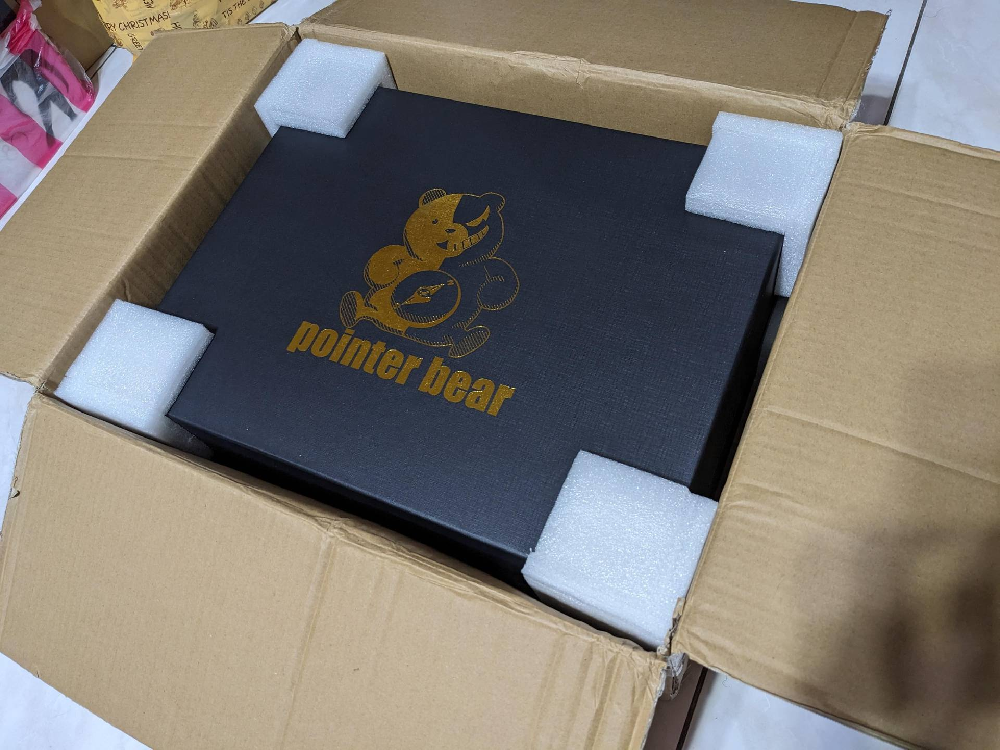

但是說實在我根本沒有注意高配版是什麼

打開裡面之後就是熟悉的分件

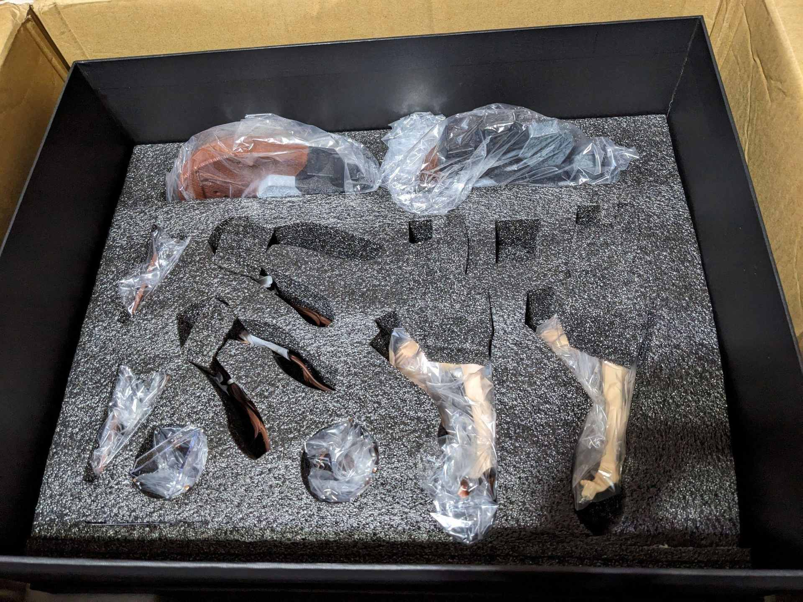

  

首先好奇的是為甚麼有兩的台座

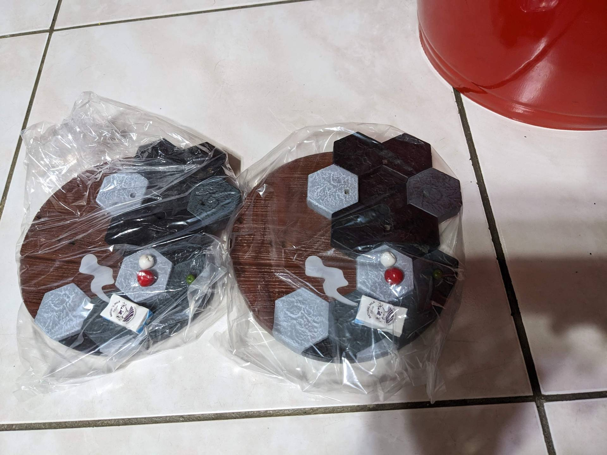

乍看之下完全相同，所以我就把訂單拿來看一下

高配配置：人物+替換裸身+替換頭雕+地台+簡易地台+限定銘牌+彩盒

  

文字原來高配版是多一個裸版的，但實際上就是付兩組狂三給妳的樣子，

但是為了怕被ban還是開箱有穿衣服的好了

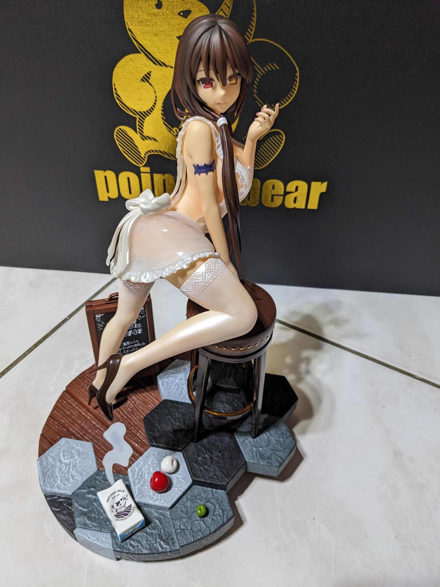

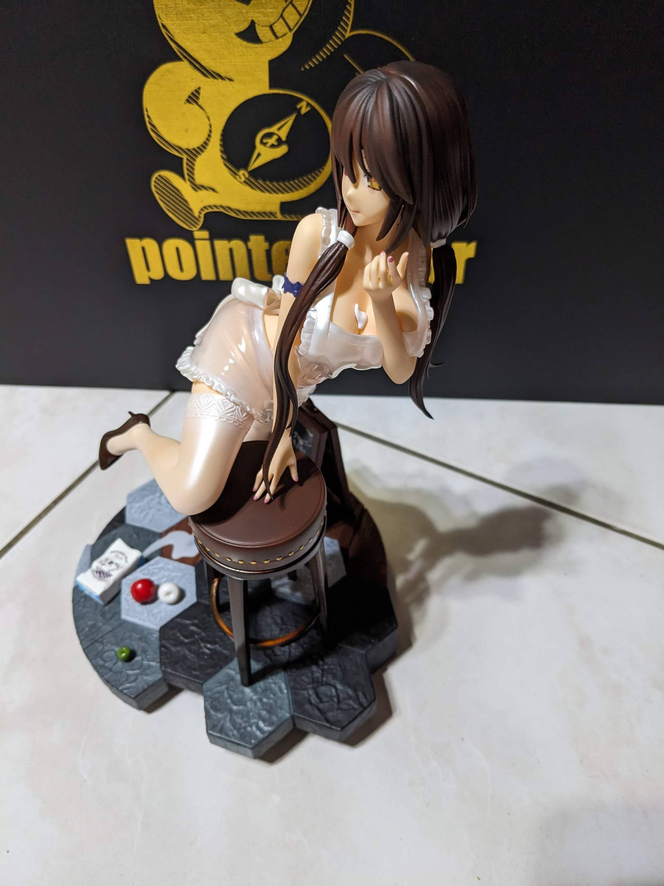  
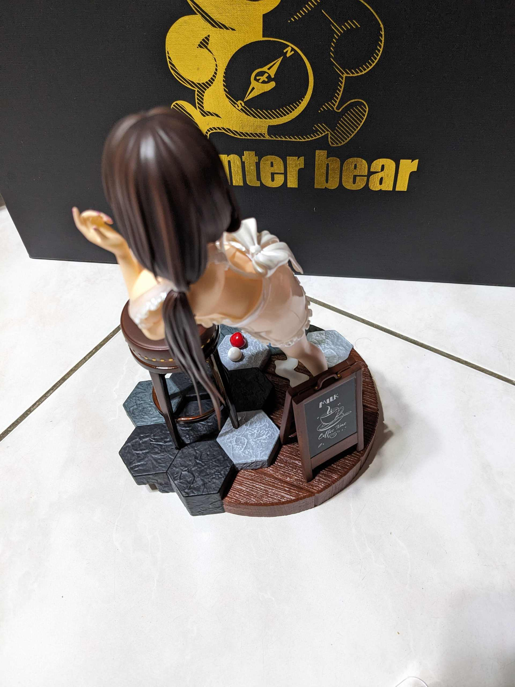  
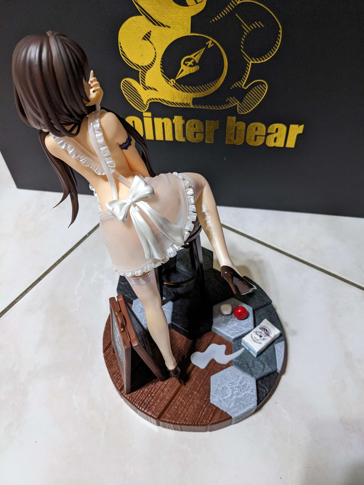

首先，材質上跟網站上的商品照差蠻多的，

當然我的手機照出來有點偏黃，但是衣服的材質看起來有點油(廉價)

合理懷疑裸版才是預設要做的，衣服是後來加上去的，

  

為甚麼這樣說，來看近照

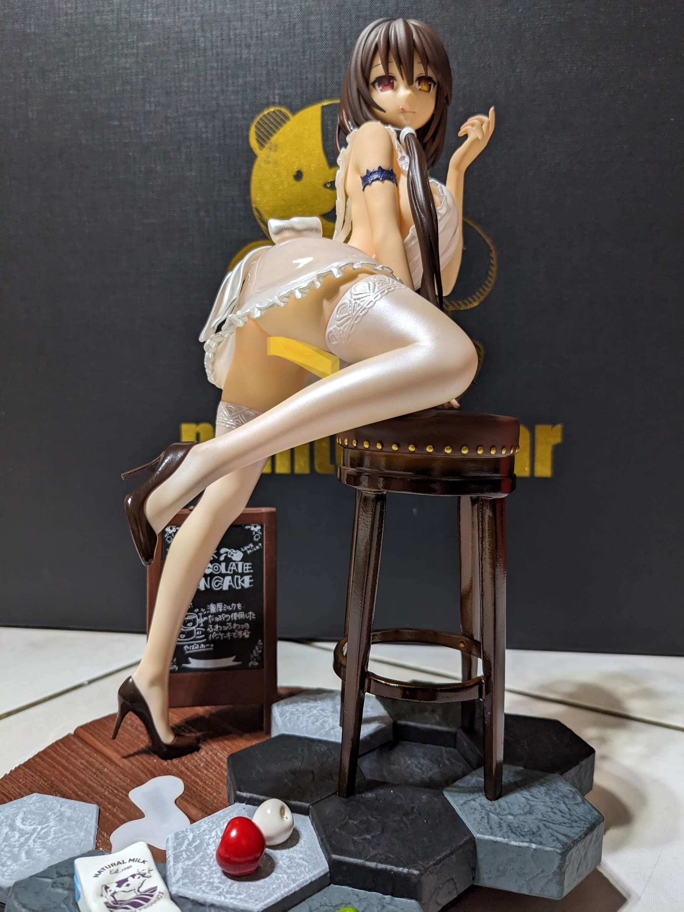  
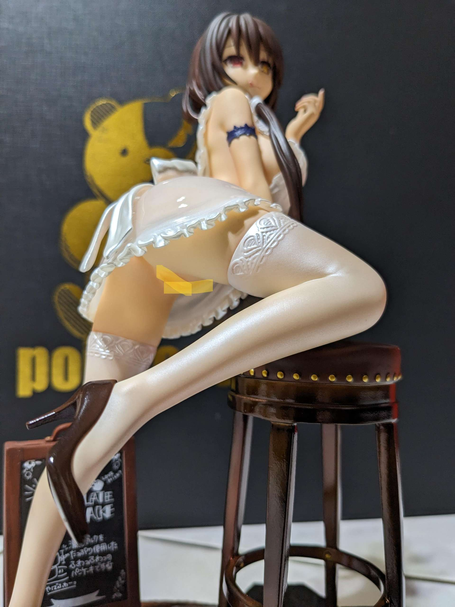  
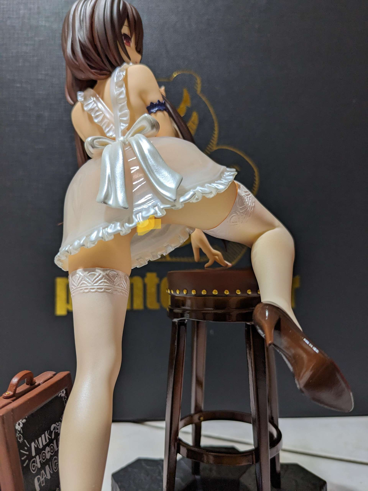  
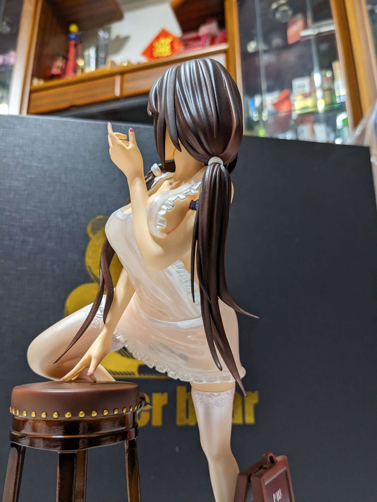  
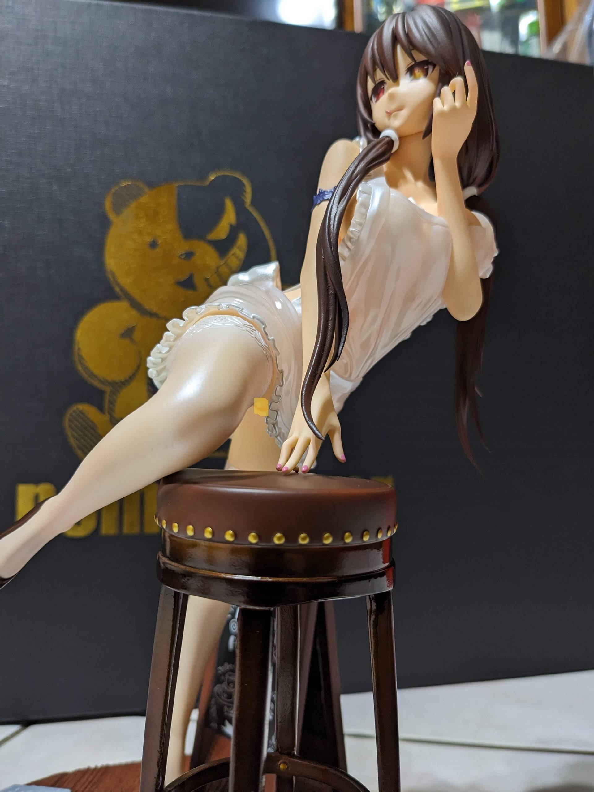

  

首先，衣服跟身體是有空隙的，所以應該是另外加上去的

然後可以發現我有打碼，也就是說「細節」是有的，

所以一看就知道應該是做了裸模在加上衣服

  

所以接下來就是

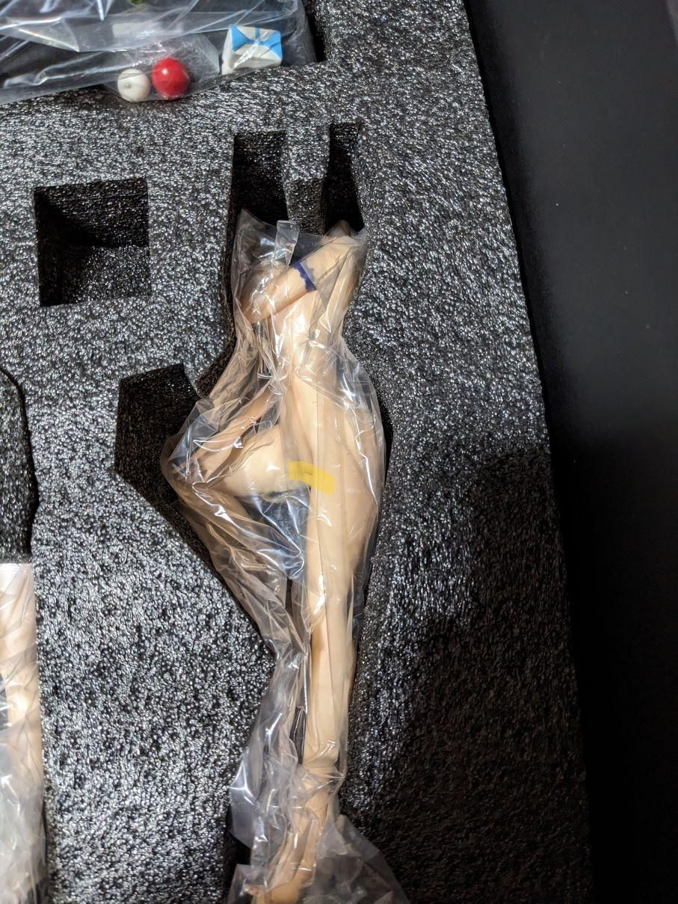

咳咳，這還是留給我慢慢看吧

  

最後來張特寫

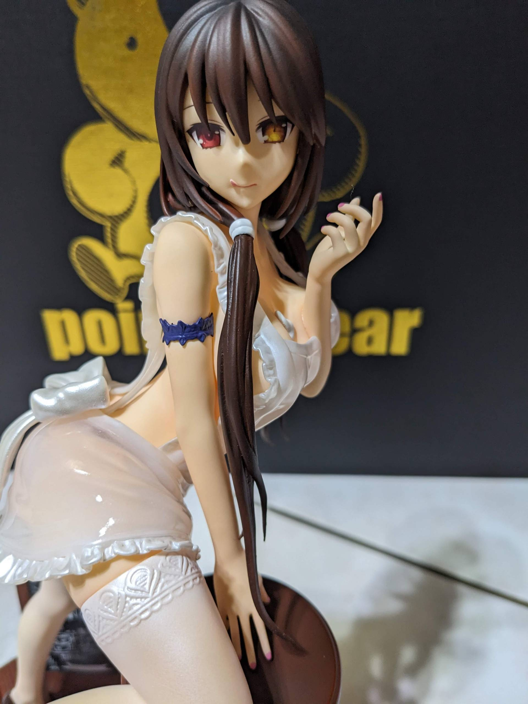

  

最後，網站的圖片我猜測應該是3D建模的圖片

所以才會有跟成品有差，但是最後有兩隻狂三也只能真香阿

  

\--

近況更新一下，

開始工作快兩個月，本來都蠻順利的，

結果中了腸胃炎躺了一個星期，

後來又車禍倒了一個星期，

有點多災多難阿。

  

最近有在想思考畫圖注重的點以及閒暇時間的分配

因為文章部分雖然想寫，但是一來花時間，二來好像沒什麼回響，

可能要把專注力先放在容易曝光的事情上吧，

包含狂三文本身雖然是一路走來，

最近感覺會局限住我，所以在考慮稍微轉換一下。

$('article.c-text img').load(function () { // 表格內圖片大於表格寬時，設為 100% if ($(this).parents('table').length != 0) { if ($(this).width() >= $(this).parents('td').width()) { $(this).width('100%'); } else { $(this).width($(this).width() + 'px'); } } });
